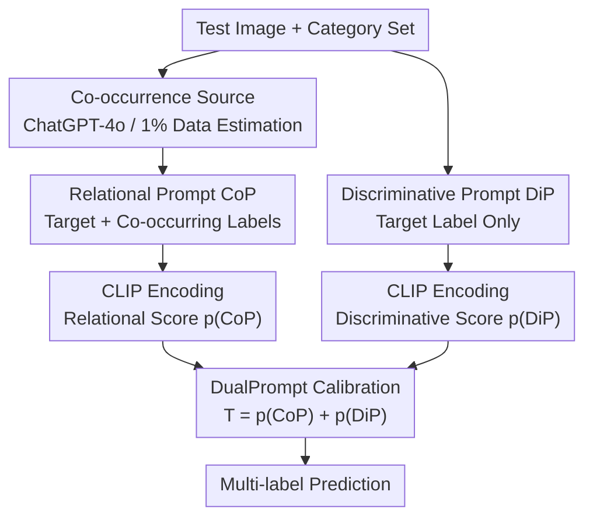

# Unlocking the Power of Co-Occurrence in CLIP: A DualPrompt-Driven Method for Training-Free Zero-Shot Multi-Label Classification

**Conference**: ICLR 2026  
**OpenReview**: [https://openreview.net/forum?id=QGXVZ0OPLy](https://openreview.net/forum?id=QGXVZ0OPLy)  
**Area**: Multimodal VLM  
**Keywords**: CLIP, Zero-shot Multi-label Classification, Label Co-occurrence, Causal Inference, Prompt Engineering

## TL;DR
This paper discovers that rewriting CLIP's discriminative prompts (containing only the target label) into "relational prompts" with co-occurring labels introduces co-occurrence information to improve multi-label recognition, but also causes CLIP to overfit co-occurrences and produce object hallucinations. Consequently, the authors model co-occurrence as a mediator using causal inference and derive a training-free calibration formula—simply adding the prediction scores of the discriminative and relational prompt paths (DualPrompt)—outperforming existing SOTA on MS-COCO and VG-256.

## Background & Motivation

**Background**: CLIP performs strongly in single-label zero-shot classification through image-text contrastive pre-training. The standard practice is to expand each category name into a prompt using templates like "A photo of a {label}" and then compare the cosine similarity between image and text features.

**Limitations of Prior Work**: CLIP's performance drops significantly when transferred to more realistic multi-label scenarios (one image containing multiple objects). There are two reasons: first, the contrastive objective causes the image encoder to focus only on the most salient objects, ignoring others; second, CLIP does not explicitly utilize label co-occurrence relationships during pre-training or inference. The authors plotted the co-occurrence probability matrix predicted by CLIP against the ground truth matrix on MS-COCO, revealing a clear discrepancy—indicating that vanilla CLIP cannot accurately model co-occurrence priors, leading to missed labels and performance degradation.

**Key Challenge**: Multi-label classification has long been proven to rely heavily on label co-occurrence to compress the output space and recover missing labels. However, CLIP's discriminative prompts focus only on a single target label and naturally lack any co-occurrence signals. Existing work like TagCLIP attempts to remedy saliency bias by using local patch features from ViT, but it relies heavily on the ViT architecture and cannot be transferred to backbones like ResNet, resulting in poor generalizability.

**Goal**: Without training or modifying the backbone, this paper aims to answer: does CLIP need label co-occurrence, and how should it be used? It breaks down "how to introduce co-occurrence without being misled by it" into actionable sub-problems.

**Key Insight**: Unlike previous routes of "enhancing image features," the authors approach from the lightweight perspective of **prompt rewriting**: changing "A photo of a {label}" to "A photo of a {label} often contains a {co-label1}, ...", directly feeding co-occurrence into CLIP from the text side. An interesting finding is that this change is a double-edged sword—the benefit is activating relational patterns to recognize non-salient objects, but the drawback is that CLIP overfits co-occurrences, leading to high-probability false reports (object hallucinations) when a co-occurring object is present but the target object is not.

**Core Idea**: Using causal inference, co-occurrence is modeled as a mediator to **retain the positive direct effect of co-occurrence and eliminate its negative mediated effect**. After derivation, this simplifies surprisingly into a single-line calibration formula: "adding the prediction scores of the relational prompt and the discriminative prompt," which is entirely training-free.

## Method

### Overall Architecture

DualPrompt is a purely training-free zero-shot multi-label classification strategy for inference. For each test image, it runs two prompt paths in parallel: a **Discriminative Prompt (DiP)** containing only the target label, emphasizing the discriminative response of the target object itself; and a **Relational Prompt (CoP)** that concatenates the target label with several co-occurring labels to recover objects CLIP easily misses. Each path calculates cosine similarity with image features to obtain scores, which are finally summed as the final prediction for that category. This "addition" is not a heuristic ensemble but a calibration formula rigorously derived from a causal graph where co-occurrence acts as a mediator. The co-occurring label sets are provided by an independent source module (generated by ChatGPT-4o or estimated from a tiny amount of training data).

### Key Designs

**1. Relational Prompt (CoP): Injecting Co-occurrence via Rewriting**

To address the lack of co-occurrence signals in CLIP inference, the authors rewrite the text-side prompt instead of modifying image features. For each label $y_k$, assuming a set of co-occurring labels $C_k=\{label_j\}_{j=1}^{m_k}$, the template is rewritten as "A photo of a {label$_k$} often contains a {label$_1$}, ..., a {label$_{m_k}$}", termed the Relational Prompt $P^c_k$, while the original is the Discriminative Prompt $P^d_k$. This lightweight change effectively feeds co-occurrence into the model: experiments (Figure 2) show that CoP significantly increases AP over DiP for many categories by helping CLIP recognize non-salient objects. However, the authors also note the side effect—hallucinations occur when co-occurring objects activate $P^c_k$ even if the target is absent. CoP is thus a double-edged sword requiring calibration.

**2. Co-occurrence Mediation from a Causal Perspective**

To theoretically explain the pros and cons of CoP, the authors construct a causal graph: the Relational Prompt $P^c$ contains the target label $L^t$ and co-occurring labels $L^c$, which respectively activate discriminative features $F^d$ and relational features $F^c$ to jointly determine the prediction $Y$. Compared to DiP's single path $L^t \to F^d \to Y$, CoP adds the path $(L^t, L^c) \to F^c \to Y$. This path compensates for low saliency (positive effect) but causes hallucinations when $L^t \to F^d \to Y$ is broken while $L^c \to F^c \to Y$ is activated by co-occurring objects (negative effect). The goal is to retain the direct effect and eliminate the biased mediation effect via co-occurrence.

**3. From TDE Subtraction to DualPrompt Addition**

Following the causal framework, the authors use Total Direct Effect (TDE) for debiasing. The initial form was subtraction:

$$T_k(x) = p(y_k=1\mid x, L^t_k, L^c_k) - p(y_k=1\mid x, L^c_k)$$

The first term is the positive effect of target + co-occurrence, and the second is the prediction based solely on co-occurrence (negative effect). Subtracting them aims to "keep the positive and remove the negative." However, subtraction performed poorly because CLIP often overestimates $p(y_k=1\mid x, L^c_k)$, leading to underestimation. The authors derived an equivalent **addition** form (see Appendix A):

$$T_k(x) = p(y_k=1\mid x, P^c_k) + p(y_k=1\mid x, P^d_k)$$

The intuition is that "weakening the indirect effect is equivalent to strengthening the direct effect." The second term is the direct causal effect from the discriminative prompt. This addition strengthens the response of the target object, forming the basis of DualPrompt.

**4. Co-occurrence Sources: General Knowledge vs. Dataset Priors**

CoP requires co-occurring label sets for each target. The authors propose two paths: first, using ChatGPT-4o to generate up to $l$ labels commonly co-occurring with the target—though $l$ must be small (set to 2) to avoid irrelevant labels; second, using a tiny fraction of training data (e.g., 1% of MS-COCO) to estimate co-occurrence probabilities. Experiments show that 1% data estimation outperforms ChatGPT. This data volume is insufficient to fine-tune CLIP, highlighting DualPrompt's data efficiency compared to prompt tuning.

## Key Experimental Results

### Main Results

Evaluated on MS-COCO (80 classes, avg 2.9 labels/img) and VG-256 (256 classes) using mAP and F1, compared against training-based methods (DualCoOp, TaICLIP) and training-free methods (CLIP, TagCLIP).

| Dataset | Method / Backbone | Training Data | mAP | F1 |
|---------|-------------------|---------------|-----|----|
| MS-COCO | CLIP (RN-101) | None | 62.9 | 59.8 |
| MS-COCO | DualPrompt (RN-101) | None | **65.5** | **61.7** |
| MS-COCO | DualPrompt (RN-101) | 1% Co-occ | **67.1** | **63.0** |
| MS-COCO | CLIP (ViT-B/16) | None | 64.9 | 61.5 |
| MS-COCO | DualPrompt (ViT-B/16)| None | **67.7** | **63.6** |
| MS-COCO | DualPrompt (ViT-B/16)| 1% Co-occ | **69.4** | **65.0** |
| MS-COCO | TagCLIP (ViT-B/16) | None | 68.7 | 65.2 |
| MS-COCO | DualPrompt + TagCLIP | 1% Co-occ | **70.0** | **66.1** |
| VG-256 | CLIP (RN-101) | None | 29.2 | 32.2 |
| VG-256 | DualPrompt (RN-101) | None | **33.5** | **36.1** |
| VG-256 | DualPrompt + TagCLIP | 2% Co-occ | **40.7** | **42.7** |

DualPrompt consistently outperforms vanilla CLIP in training-free settings across both ResNet and ViT backbones. Its combination with TagCLIP achieves new SOTA results.

### Ablation Study

Stepwise comparison of DiP → CoP → DualPrompt per-class AP (MS-COCO):

| Configuration | Performance | Description |
|---------------|-------------|-------------|
| DiP | Baseline | Target label only, no co-occurrence |
| CoP | Mixed results | Introduces co-occurrence but increases false positives |
| DualPrompt | Improvement in almost all classes | TDE addition calibration; keeps positive, removes negative |

### Key Findings

- **CoP alone leads to overall decline**: While it helps recover true positives in some classes via co-occurrence, it creates more false positives due to overfitting, resulting in a net negative effect—necessitating calibration.
- **Addition is effective where subtraction fails**: Subtracting the co-occurrence-only term causes underestimation due to CLIP's overestimation of that term; switching to the equivalent "discriminative + relational" sum provides stable gains.
- **Extreme data efficiency**: DualPrompt uses only 1%-2% of data to estimate probabilities, which is far less than what is needed for fine-tuning.
- **More accurate co-occurrence estimation**: On kitchenware categories (bottle/cup/fork/etc.), DualPrompt's estimated co-occurrence is much closer to the ground truth matrix than DiP or CoP.

## Highlights & Insights
- **Elevating "Prompt Rewriting" to Causal Calibration**: Instead of simple prompt ensembles, it models co-occurrence as a mediator. Deriving the "sum of two scores" from TDE provides a rigorous causal explanation for a seemingly simple operation.
- **The Subtraction-to-Addition Transformation**: Standard causal debiasing via subtraction fails here. The authors proved the additive form is equivalent and avoids CLIP's overestimation side effects, resulting in a training-free, plug-and-play solution.
- **Honest Presentation of the Double-Edged Sword**: The paper doesn't hide CoP's flaws but quantifies that benefits come from recovering non-salient objects while drawbacks come from hallucinations.
- **Orthogonality to TagCLIP**: While TagCLIP works on the image side (patch features), this method works on the text side (co-occurrence). Their combination yields further improvements.

## Limitations & Future Work
- **Dependency on Co-occurring Label Quality**: ChatGPT's generated co-occurrences aren't perfect; performance drops if $l$ is too large.
- **Static Co-occurrence**: The method uses dataset-level or general priors rather than image-adaptive co-occurrence, which may fail in rare or unusual scenarios.
- **Fixed Calibration Weights**: The scores are summed with equal weights; adaptive weighting might further improve the trade-off.
- **Benchmark Coverage**: Evaluation is limited to MS-COCO and VG-256. Stability in larger or long-tailed spaces (e.g., OpenImages) remains to be verified.

## Related Work & Insights
- **vs. TagCLIP**: TagCLIP solves "saliency bias" via ViT patch features but is backbone-dependent; DualPrompt uses co-occurrence, is backbone-agnostic, and is complementary.
- **vs. DualCoOp / TaI (Prompt Tuning)**: These require significant training data and cost to tune continuous vectors; DualPrompt is training-free and superior in low-resource regimes.
- **vs. Traditional Multi-label Co-occurrence (CNN-RNN / SST)**: Previous works learned matrices during supervised training; this paper injects co-occurrence via natural language prompts into a frozen CLIP and handles side effects via causal inference.

## Rating
- Novelty: ⭐⭐⭐⭐⭐ Reinterprets prompt rewriting through causal mediation with a training-free additive calibration.
- Experimental Thoroughness: ⭐⭐⭐⭐ Solid results across backbones and visualizations, though more benchmarks would be better.
- Writing Quality: ⭐⭐⭐⭐⭐ Clear logical progression from problem identification to causal solution.
- Value: ⭐⭐⭐⭐⭐ High practical value due to being plug-and-play and backbone-agnostic.

<!-- RELATED:START -->

## Related Papers

- [\[ICLR 2026\] Memory-Free Continual Learning with Null Space Adaptation for Zero-Shot Vision-Language Models](memory-free_continual_learning_with_null_space_adaptation_for_zero-shot_vision-l.md)
- [\[CVPR 2026\] Explaining CLIP Zero-shot Predictions Through Concepts](../../CVPR2026/multimodal_vlm/explaining_clip_zero-shot_predictions_through_concepts.md)
- [\[CVPR 2026\] SOTA: Self-adaptive Optimal Transport for Zero-Shot Classification with Multiple Foundation Models](../../CVPR2026/multimodal_vlm/sota_self-adaptive_optimal_transport_for_zero-shot_classification_with_multiple_.md)
- [\[CVPR 2026\] STiTch: Semantic Transition and Transportation in Collaboration for Training-Free Zero-Shot Composed Image Retrieval](../../CVPR2026/multimodal_vlm/stitch_semantic_transition_and_transportation_in_collaboration_for_training-free.md)
- [\[ICCV 2025\] NegRefine: Refining Negative Label-Based Zero-Shot OOD Detection](../../ICCV2025/multimodal_vlm/negrefine_refining_negative_label-based_zero-shot_ood_detection.md)

<!-- RELATED:END -->
