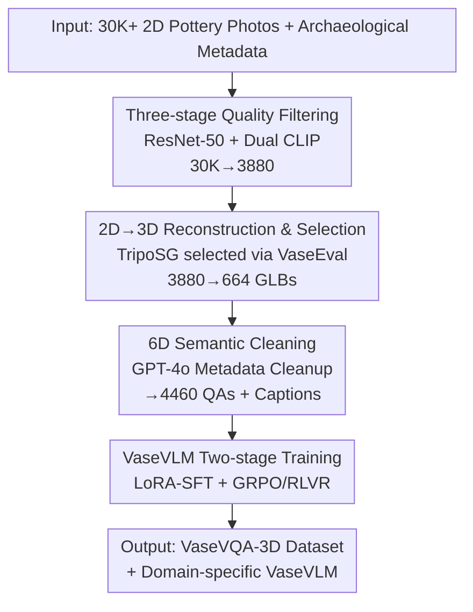

# VaseVQA-3D: Benchmarking 3D VLMs on Ancient Greek Pottery

**Conference**: ICLR 2026  
**OpenReview**: [https://openreview.net/forum?id=LcgzZZ921O](https://openreview.net/forum?id=LcgzZZ921O)  
**Code**: https://github.com/AIGeeksGroup/VaseVQA-3D  
**Area**: Multimodal VLM / 3D Vision / Digital Cultural Heritage  
**Keywords**: 3D VQA, Ancient Greek Pottery, Cultural Heritage, Verifiable Rewards, Domain Adaptation

## TL;DR
This paper constructs VaseVQA-3D, the first 3D visual question answering dataset for ancient Greek pottery (664 3D models + 4460 QAs). By utilizing a synthetic pipeline involving "2D image filtering → single-image 3D reconstruction → six-dimensional archaeological semantic cleaning," the authors trained a domain-specific model, VaseVLM. Its 7B-RL version achieves a 12.8% improvement in R@1 and a 6.6% increase in lexical similarity compared to the strongest baseline.

## Background & Motivation

**Background**: General Vision-Language Models (VLMs, e.g., GPT-4V, Gemini, Qwen2.5-VL, InternVL) perform exceptionally well in general tasks such as image captioning and visual reasoning. In the 3D domain, specialized methods like Cap3D, DiffuRank, and LLaVA-3D have also emerged for 3D description and VQA.

**Limitations of Prior Work**: Existing models struggle when applied to specialized cultural heritage domains like ancient Greek pottery. On one hand, ancient pottery represents typical long-tail data, with almost no high-quality 3D representations in public datasets. On the other hand, due to the lack of targeted training data, off-the-shelf VLMs fail at tasks requiring archaeological expertise (e.g., assessing fabric, technique, shape, dating, decoration, or attribution).

**Key Challenge**: The archaeological value of pottery resides primarily in its spatial features—symmetry, proportions, morphology, and complete geometric structure—which fragmented 2D views cannot fully capture. However, the available high-quality materials are mostly 2D collection photos, often containing fragments, blurred images, or sketches. Thus, a tension exists between the "necessity of 3D understanding" and the "availability of only noisy 2D data."

**Goal**: (1) Systematically transform noisy 2D pottery images into high-fidelity 3D assets with archaeological QAs to fill the gap in 3D cultural heritage benchmarks; (2) Train a domain-specific VLM that truly understands pottery.

**Key Insight**: Since single-image 2D-to-3D reconstruction technologies (e.g., TripoSG, Hunyuan3D) have matured, massive 2D collection photos can be "elevated" into 3D models and rendered into multi-view or rotational videos for VLMs. Simultaneously, pottery annotations naturally decompose into six archaeological dimensions, which can serve as "verifiable answers" for reinforcement learning.

**Core Idea**: Construct 3D pottery VQA data through "strict filtering + single-image 3D reconstruction + 6D archaeological semantic structuring," then fine-tune general VLMs into pottery experts using "LoRA-SFT foundation + GRPO/RLVR 6D verifiable rewards."

## Method

### Overall Architecture

The work presents an end-to-end "2D noisy data → 3D specialized VQA model" pipeline. The input consists of over 30,000 2D photos of ancient Greek pottery and its metadata from VaseVQA. The output includes (a) the VaseVQA-3D dataset (664 GLB models + 4460 structured QAs + cleaned captions) and (b) the domain model VaseVLM.

The pipeline involves four stages: First, 30,000 images are filtered down to 3,880 high-quality images using ResNet-50 and dual CLIP modules. Second, these are reconstructed into 664 3D models using TripoSG (selected after comparing TripoSG and Hunyuan3D on the VaseEval validation set of 24 real GLB files). Third, GPT-4o cleans fragmented metadata into museum-style descriptions organized around six archaeological dimensions (Fabric, Technique, Shape, Dating, Decoration, Attribution). Finally, GLB models are rendered into 360° videos to train VaseVLM via two-stage LoRA-SFT and GRPO-RLVR.

### Key Designs

**1. Three-stage Progressive Quality Filtering: Sifting Noisy 2D Data into Reconstructible Material**

The original VaseVQA dataset contains many pottery fragments, blurred images, or sketches, which would result in low-quality 3D models. The authors designed a three-tier filtering pipeline: 
- **Tier 1**: A ResNet-50 binary classifier (trained on manual labels for "good images") performs initial screening.
- **Tier 2**: CLIP-based fragment detection uses text prompts ("complete pottery" vs. "pottery fragment") to remove fragments by comparing similarity scores.
- **Tier 3**: To handle multiple views of the same object, CLIP calculates the similarity between each view and high-quality description text, retaining only the highest-scoring image as the representative view. 
Only 3,880 high-quality images remained (further reduced to 664 after 3D generation), a retention rate of ~2.2%, ensuring the quality of the foundation.

**2. Single-image 3D Reconstruction + VaseEval Validation Set: Elevating 2D to Credible 3D Assets**

To convert 2D images to 3D, the authors compared TripoSG and Hunyuan3D. Instead of a subjective choice, they collected 24 high-quality real pottery GLB files from Sketchfab to form the **VaseEval** validation set as ground truth. Quantitative comparisons (PSNR, SSIM, LPIPS, Chamfer Distance, Normal Consistency, CLIP-I/T) showed TripoSG provided superior mesh quality and closer proximity to ground truth. Thus, TripoSG was used for large-scale reconstruction.

**3. Six-dimensional Archaeological Semantic Structure + GPT-4o Metadata Cleaning: Ensuring Professionalism in VQA**

Standard VQA questions like "what color is this" lack professional value. The authors organized annotations into six dimensions: Fabric, Technique, Shape, Dating, Decoration, and Attribution. QAs follow the format "What is the [attribute] of the vase?" with answers derived from verified metadata. GPT-4o cleaned fragmented metadata (e.g., `Fabric: ATHENIAN; Technique: BLACK-FIGURE;`) into museum-style descriptions without introducing outside archaeological content, maintaining factual integrity while improving readability.

**4. VaseVLM Two-stage Training: LoRA-SFT Foundation + GRPO/RLVR 6D Verifiable Rewards**

Using Qwen2.5-VL (3B/7B) as the base, VaseVLM first undergoes LoRA Supervised Fine-Tuning (SFT) using 360° videos and captions. Subsequently, Group Relative Policy Optimization (GRPO) is applied. In this context, Reinforcement Learning from Verifiable Rewards (RLVR) means checking model-generated descriptions against standard answers for each of the six dimensions. The reward for each dimension is defined as:

$$r_i = \begin{cases} \mathrm{sim}(g_i, t_i), & \text{if } \mathrm{sim}(g_i, t_i) \geq \tau \\ 0, & \text{otherwise} \end{cases}$$

where $g_i$ and $t_i$ are generated and target contents, and $\tau = 0.7$. Weights are assigned (Fabric $w_f=0.20$, Technique $w_t=0.20$, Decoration $w_{dec}=0.20$, Shape $w_s=0.15$, Dating $w_d=0.15$, Attribution $w_a=0.10$). A penalty $P$ for length, repetition, and irrelevance is included:

$$R = \sum_{i=1}^{6} w_i \cdot r_i - P + B,$$

where $B$ is a sequence-matching similarity reward. This transforms subjective "quality" into objective, weighted signals.

### Loss & Training
Two stages: ① LoRA-based SFT (360° videos + captions) as a foundation; ② GRPO RL with the 6D RLVR reward function. Base models are Qwen2.5-VL-3B/7B. Total training on 8× A100 (80GB) took ~14.5 days (mostly for 3D generation: 13.5 days; SFT: 4h; RL: 20h).

## Key Experimental Results

### Main Results: Dataset Quality Evaluation (Table 3)

| Method | FID↓ | CLIP↑ | R@10↑ | R@5↑ | R@1↑ | Lexical Sim↑ |
|:---:|:---:|:---:|:---:|:---:|:---:|:---:|
| DiffuRank (3D specific) | 0.421 | 0.798 | 16.67% | 8.33% | 2.08% | 0.274 |
| Gemini-2.5-Pro (Closed) | 0.397 | 0.680 | 22.92% | 14.58% | 3.12% | 0.162 |
| GPT-4.1 (Closed) | 0.501 | 0.644 | 25.00% | 10.42% | 3.12% | 0.128 |
| Qwen2.5-VL-7B (Base) | 0.334 | 0.775 | 18.75% | 9.38% | 2.08% | 0.217 |
| VaseVLM-7B-SFT (Ours) | 0.332 | 0.779 | 20.83% | 10.42% | 3.12% | 0.272 |
| **VaseVLM-7B-RL (Ours)** | **0.328** | **0.792** | **21.24%** | **11.12%** | **3.52%** | **0.276** |

VaseVLM-7B-RL shows an R@1 gain of 12.8% over the strongest baseline and a 6.6% gain in lexical similarity.

### Data Filtering & 3D Generation Selection (Table 1 / Table 2)

| Filtering Stage | Input | Output | Retention Rate |
|:---:|:---:|:---:|:---:|
| Initial Collection | 30,000 | 30,000 | 100% |
| ResNet-50 Quality | 30,000 | 13,599 | 45.3% |
| CLIP Fragment | 13,599 | 6,330 | 46.5% |
| CLIP View Selection | 6,330 | 3,880 | 61.3% |
| 3D Generation (TripoSG) | 3,880 | 664 | 17.1% |
| **Total Pipeline** | 30,000 | 664 | **2.2%** |

In VaseEval (compared to 24 ground truth models): TripoSG outperformed Hunyuan3D across SSIM (0.8676), LPIPS (0.1308), and CD (0.1490).

### Human Evaluation (10 experts, 0-5 scale)
VaseVLM-7B-RL ranked first (4.57), followed by VaseVLM-3B-RL (4.37), both outperforming DiffuRank (4.07) and general VLMs, highlighting the value of domain-specific fine-tuning.

### Key Findings
- **RL > SFT**: The 7B-RL model outperforms its SFT counterpart in R@1 and lexical similarity, showing that 6D verifiable rewards provide effective optimization signals.
- **Aggressive filtering is essential**: The 2.2% retention rate ensures that only reconstructible data is used, preventing low-quality garbage models.
- **Absolute metrics remain low**: The highest R@1 is only 3.52%, indicating that ancient pottery is an extremely challenging long-tail professional domain for all VLMs.

## Highlights & Insights
- **"2D Elevation" paradigm**: When real 3D heritage data is scarce, using single-image reconstruction to "upcycle" 2D collections is a practical path for 3D asset generation.
- **VaseEval as a quantitative anchor**: Using a small set of real GLBs as ground truth to select generation methods transforms subjective choices into data-driven decisions.
- **Dual-purpose 6D semantics**: The archaeological structure serves both as the evaluation benchmark and the reward decomposition for RLVR, providing "free" verifiable rewards once defined.

## Limitations & Future Work
- **Small scale**: 664 models and 4460 QAs are limited for training powerful models.
- **Reconstruction artifacts**: Single-image reconstruction cannot recover occluded interiors or backsides, and textures may lose fidelity.
- **Cleaning bias**: GPT-4o rewriting might introduce subtle semantic shifts or stylistic biases.
- **Future Directions**: Scaling via real 3D scans and introducing multi-view reconstruction for better geometric integrity.

## Related Work & Insights
- **vs. Cap3D / DiffuRank / LLaVA-3D**: General 3D models perform poorly (R@1 ≤ 2%) on professional pottery, necessitating domain-specific data.
- **vs. VaseVQA (2D Predecessor)**: This work elevates the 2D source to 3D, transitioning from 2D image analysis to 3D heritage understanding.
- **vs. Closed-source VLMs**: While GPT-4 and Gemini exhibit decent general retrieval (R@10), they fall behind VaseVLM in lexical similarity and professional precision.

## Rating
- Novelty: ⭐⭐⭐⭐ (First 3D Greek Vase VQA dataset + 6D RLVR)
- Experimental Thoroughness: ⭐⭐⭐⭐ (Multi-stage evaluation, though limited by absolute scale)
- Writing Quality: ⭐⭐⭐⭐ (Clear pipeline and formulation)
- Value: ⭐⭐⭐⭐ (Reproducible template for "2D-to-3D" cultural heritage research)

<!-- RELATED:START -->

## Related Papers

- [\[ICLR 2026\] SR-3D: 3D-Aware Region Prompted Vision Language Model](3d_aware_region_prompted_vision_language_model.md)
- [\[ICLR 2026\] EgoHandICL: Egocentric 3D Hand Reconstruction with In-Context Learning](egohandicl_egocentric_3d_hand_reconstruction_with_in-context_learning.md)
- [\[ICLR 2026\] IndicVisionBench: Benchmarking Cultural and Multilingual Understanding in VLMs](indicvisionbench_benchmarking_cultural_and_multilingual_understanding_in_vlms.md)
- [\[ICLR 2026\] GPT4Scene: Understand 3D Scenes from Videos with Vision-Language Models](gpt4scene_understand_3d_scenes_from_videos_with_vision-language_models.md)
- [\[CVPR 2025\] Global-Local Tree Search in VLMs for 3D Indoor Scene Generation](../../CVPR2025/multimodal_vlm/global-local_tree_search_in_vlms_for_3d_indoor_scene_generation.md)

<!-- RELATED:END -->
