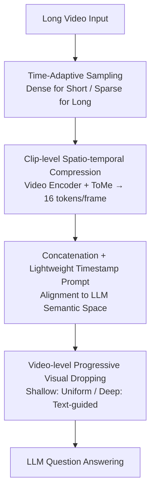

# VideoChat-Flash: Hierarchical Compression for Long-Context Video Modeling

**Conference**: ICLR 2026  
**OpenReview**: [https://openreview.net/forum?id=MUjdNcfNPv](https://openreview.net/forum?id=MUjdNcfNPv)  
**Code**: https://github.com/OpenGVLab/VideoChat-Flash (Available)  
**Area**: Multimodal VLM / Video Understanding  
**Keywords**: Long Video Understanding, Video Token Compression, MLLM, Hierarchical Compression, NIAH Evaluation

## TL;DR
This paper proposes HiCo, a hierarchical video token compression method that reduces long video context from the clip level to the video level by approximately $1/50$ (averaging only 16 tokens per frame). Combined with a multi-stage short-to-long training strategy, the LongVid dataset containing 114K long videos, and a more challenging multi-hop NIAH evaluation, VideoChat-Flash achieves better performance than GPT-4o / Gemini-1.5-Pro on both short and long video benchmarks at the 7B scale, while achieving 99.1% accuracy on the 10,000-frame NIAH test.

## Background & Motivation
**Background**: Multimodal Large Language Models (MLLMs) are mature in understanding minute-level short videos. However, to process hour-long videos like movies, surveillance, or live streams, thousands of frames must be fed into the model. Current mainstream approaches take two paths: one is expanding the LLM context window to consume ultra-long multimodal sequences (e.g., Gemini-1.5-Pro); the other is compressing video tokens into extremely compact representations (e.g., LLaMA-VID, which compresses each frame to 2 tokens) before feeding them to the LLM.

**Limitations of Prior Work**: Expanding the context window leads to exploding computational costs—Gemini-1.5-Pro converts an hour of video into approximately 920,000 tokens, severely dragging down training and inference efficiency and making deployment nearly infeasible. Conversely, aggressive token compression often loses detailed information indiscriminately; as the compression ratio increases, performance drops significantly, to the point where some long-video models perform worse than image-only MLLMs on certain benchmarks.

**Key Challenge**: Long video understanding is essentially a tug-of-war between "efficiency" and "performance." Long video contexts are full of redundancy (static backgrounds/objects in adjacent frames), but existing compression methods treat frames as independent entities and compress them frame-by-frame, failing to exploit temporal redundancy. Consequently, information loss becomes uncontrollable at high compression ratios.

**Goal**: Systematically address long video understanding across four dimensions: model architecture, training data, training strategy, and evaluation benchmarks, achieving both high efficiency and high performance.

**Key Insight**: The authors observe two types of exploitable sparsity: first, "unimodal visual redundancy" within a clip (highly similar adjacent frames), which can be aggregated using a video encoder with spatio-temporal attention rather than frame-by-frame compression; second, "cross-modal sparsity" during LLM processing (shallow layers focus on global context while deep layers focus on locally relevant segments), which allows the LLM to discard tokens irrelevant to the current query.

**Core Idea**: Use "Hierarchical Compression" (HiCo) to compress video context in two stages: the clip level uses a video encoder to eliminate inter-frame temporal redundancy, and the video level progressively discards irrelevant tokens following LLM attention patterns. This achieves minimal performance loss even at an extreme compression ratio of approximately $1/50$.

## Method

### Overall Architecture
VideoChat-Flash addresses how to efficiently feed tens of thousands of frames into an MLLM without performance degradation. The entire inference pipeline is: the raw long video first undergoes **Time-Adaptive Sampling** to extract an appropriate number of frames; these frames are partitioned into equal-length small clips, and each clip is sent to a **Video Encoder** with spatio-temporal attention for **Clip-level Compression** (facilitated by ToMe token merging), resulting in an average of 16 tokens per frame. These are then concatenated chronologically, passed through an MLP connector to align with the LLM semantic space, and appended with a lightweight timestamp prompt. Once inside the LLM, **Video-level Progressive Visual Dropping** is performed—shallow layers uniformly drop a small batch, while deep layers selectively retain tokens based on text relevance. The LLM then generates the final answer. This architecture (HiCo) encompasses the three core stages shown in the figure.

Beyond the architecture, three equally important contributions support the final performance: the large-scale long-video instruction dataset **LongVid**, a **Short-to-Long Multi-stage Training Strategy**, and the more difficult **Multi-Hop NIAH** evaluation benchmark. The framework diagram below depicts the HiCo data flow during inference.

### Key Designs

**1. Time-Adaptive Sampling: Balancing Short and Long Videos**

Uniform frame sampling presents a contradiction: short videos require dense sampling to capture subtle actions, while long videos require sparse sampling to capture event narratives. A fixed frame count cannot satisfy both. This paper designs a strategy where the number of sampled frames $T$ is determined by duration $D$ as $T = \min(T_{max}, \max(D, T_{min}))$, defining sampling density as $\phi(T,D) = T/D$. When $D < T_{min}$ (short video), $\phi = T_{min}/D$ (higher density for shorter videos to preserve detail); when $D > T_{max}$ (long video), $\phi = T_{max}/D$ (lower density for longer videos to cover a wider time span). Ablations show this improves MVBench from 66.5 to 67.0 and MLVU from 62.4 to 64.5, representing a low-cost but effective input-side scheduling.

**2. Clip-level Spatio-temporal Compression: Eliminating Inter-frame Redundancy**

This step targets the pain point where "independent frame-by-frame compression loses details." Common image encoders (e.g., SigLIP) assume inter-frame independence $p(Y_1,\cdots,Y_T)=\prod_t p(Y_t)$, leading to information loss $L_c^{img}=\sum_t H(Y_t^{img})-H(Z)$. In contrast, a video encoder models the joint distribution using spatio-temporal attention, with loss written as:

$$L_c^{vid}=\sum_{t}\big[H(Y_t^{vid})-I(Y_t^{vid};Y_1^{vid},\cdots,Y_{t-1}^{vid})\big]-H(Z),$$

where $I(\cdot)$ is the mutual information (inter-frame redundancy) between frame $t$ and previous frames. For most videos, $I>0$. Assuming $H(Z)$ is approximately equal to the sum of frame entropies, $L_c^{img} > L_c^{vid}$—meaning a video encoder loses less information when compressing to the same target size. Implementation-wise, the video is cut into clips of 4 frames each, using UMT-L for spatio-temporal encoding and ToMe for token merging, compressing each clip to 64 tokens (16 tokens per frame). Additionally, the authors append a simple timestamp prompt "The video lasts for $N$ seconds, and $T$ frames are uniformly sampled from it." at the end of the context, enabling the model to perceive time and achieve good mIoU on Charades-STA temporal localization without expensive per-frame text labels.

**3. Video-level Progressive Visual Dropping: Pruning Tokens via LLM Attention**

Even after clip-level compression, long-range redundancy remains (e.g., surveillance), and answering a specific instruction may not require the entire video. The key observation is: LLMs focus on the entire long video context in shallow layers but converge on specific local segments in deeper layers. Based on this, a two-stage progressive drop is designed: shallow layers perform "uniform drop" to maintain the original spatio-temporal structure while reducing computation; deep layers perform "text-guided select," retaining only the most critical tokens based on the correlation between text tokens and visual tokens. Notably, this strategy is only enabled during inference as enabling it during training slightly degrades performance; it not only saves computation but also slightly improves performance by filtering out irrelevant visual noise.

**4. LongVid Dataset and Short-to-Long Training: Bridging the Long Video Data Gap**

Training long-video models is hindered by the lack of large-scale, high-quality (video, instruction, answer) triplets. This paper constructs LongVid, containing 114,228 long videos (average duration 367.3s) and 3,444,849 QA pairs, covering five tasks: long video description, temporal localization, event relationship identification, scene relationship identification, and event counting. Construction follows three steps: "Source selection (Ego4D / HowTo100M / HD-VILA / MiraData) → Generating timestamped dense event labels based on high-quality short video captions → Constructing multi-type QA using captions, labels, and timestamps." The accompanying training strategy consists of four steps: Stage-1 freezes the visual encoder and LLM, training only the compressor and MLP for alignment; Stage-2 uses 3.5M images and 2.5M short videos for pre-training to establish visual perception; Stage-3 performs joint SFT with mixed short (<60s) and long (60–3600s) videos; Stage-4 increases the video encoder resolution from 224 to 448 for high-resolution post-finetuning. Furthermore, a harder Multi-Hop NIAH benchmark is proposed, where multiple images are chained to form a reasoning path hidden within a "haystack" of video frames; the model must follow the correct chain to find the needle (Q1) and answer the related question (Q2).

### Loss & Training
Training follows the curriculum learning described above: alignment, short-video pre-training, joint short-long SFT, and high-resolution post-finetuning. Within clips, 4 frames are grouped and compressed to 64 tokens. Video-level dropping is active only during inference.

## Key Experimental Results

### Main Results
Using UMT-L as the visual encoder, token merging with MLP as the connector, and Qwen2-7B as the LLM. On six video understanding benchmarks, the 7B VideoChat-Flash achieves across-the-board leads using only 16 tokens per frame, surpassing much larger models like InternVL2-76B and closed-source models like GPT-4o and Gemini-1.5-Pro.

| Model | Scale | Tokens/Frame | MVBench | LongVideoBench | MLVU | VideoMME (Overall) | Charades mIoU |
| :--- | :--- | :--- | :--- | :--- | :--- | :--- | :--- |
| GPT-4o | - | - | 64.6 | 66.7 | 64.6 | 71.9 | - |
| Gemini-1.5-Pro | - | - | 60.5 | 64.0 | - | 75.0 | - |
| LLaVA-Video | 7B | 676 | 58.6 | 58.2 | 70.8 | 63.3 | - |
| Qwen2.5-VL | 7B | 1924 | 69.6 | 56.0 | 70.2 | 65.1 | 43.6 |
| **VideoChat-Flash@448** | 7B | **16** | **74.0** | **64.7** | **74.7** | **65.3** | 48.0 |
| **VideoChat-Flash@448** | 2B | **16** | 70.0 | 58.3 | 65.7 | 57.0 | 45.2 |

On 10,000-frame single-hop NIAH, VideoChat-Flash achieves a 99.1% success rate, whereas LongVA achieves ~92% at 3,000 frames and LLaMA-VID only 55% at 10,000 frames. On the harder Multi-Hop MH-NIAH (1,000 frames, ~266k tokens):

| Model | Tokens/Frame | Cap Score | QA Score |
| :--- | :--- | :--- | :--- |
| Random | - | 25% | 6.25% |
| LLaMA-VID | 2 | 20% | 7% |
| LongVA | 144 | 25% | 18% |
| **VideoChat-Flash** | 16 | **33%** | **27%** |
| Gemini2.5 Flash | 258 | 35% | 31% |
| Gemini2.5 Flash (thinking) | 258 | 60% | 54% |

### Ablation Study
Incremental contribution of each design component:

| Configuration | MVBench | MLVU | VideoMME | Charades mIoU |
| :--- | :--- | :--- | :--- | :--- |
| Baseline (SigLIP, 196 tokens/frame) | 60.2 | 63.7 | 52.8 | - |
| + HiCo (Compressed to 16 tokens/frame) | 61.1 | 60.6 | 53.2 | - |
| + Short Video Pre-training | 66.5 | 62.4 | 53.9 | - |
| + Time-Adaptive Sampling | 67.0 | 64.5 | 55.5 | - |
| + LongVid Data | 66.5 | 68.3 | 55.8 | - |
| + Joint Short-Long SFT | 73.2 | 74.5 | 64.0 | 48.4 |
| + High-res Post-finetuning | 74.0 | 74.7 | 65.3 | 48.0 |
| – Timestamp Prompt | 73.4 | 73.2 | 63.4 | 44.2 |

### Key Findings
- **High Compression is Viable**: Compressing each frame from 196 to 16 tokens (HiCo) saves 47.3× computation as frame counts grow (up to 119× for 10,000 frames) with negligible performance loss; even at 2% compression, the model retains ~95% performance.
- **Video Encoder > Image Encoder**: At 16 tokens/frame and 8M training samples, UMT-L outperforms SigLIP by +2.3/+2.9/+0.3 on MVBench/MLVU/VideoMME respectively, with lower FLOPs (596G vs 2679G) and latency (11.8ms vs 79.7ms).
- **Hierarchical Dropping is Critical**: Combining uniform drops in shallow layers with attention-based selection in deep layers is optimal—attention selection in deep layers (MLVU +0.3, VideoMME +0.5) is better than uniform dropping, whereas the opposite holds for shallow layers.
- **Timestamp Prompts are Cost-effective**: Removing it drops Charades mIoU from 48.0 to 44.2; a simple prompt is enough for temporal localization.
- **Data and Training Drive Gains**: Short-to-long learning and better data mixing (Joint Short-Long SFT) provided the largest single-step improvements.

## Highlights & Insights
- **Replacing Independent Compression with Spatio-temporal Modeling**: The paper provides an information-theoretic intuition ($L_c^{img}>L_c^{vid}$) for why video encoders lose less information, turning a heuristic choice into a justified framework.
- **Compressing in Harmony with LLM Attention**: Observing the shallow-global/deep-local attention pattern and designing the dropping strategy accordingly allows for filtering "visual noise"—saving computation while improving performance as a "free lunch" during inference.
- **Decoupling Retrieval from Reasoning via MH-NIAH**: Inserting misleading chains forces the model to perform multi-hop reasoning, exposing the limitations of models that simply excel at single-hop retrieval.

## Limitations & Future Work
- Discarding tokens only during inference creates a distribution shift between training and testing, and training efficiency remains constrained by full-sequence processing.
- Multi-hop reasoning is still a weakness: the QA Score on MH-NIAH is only 27%, trailing far behind Gemini2.5 Flash with "thinking" (54%).
- The timestamp capability relies on a fixed template; its robustness for dense, multi-event scenarios or extremely long videos is not fully explored.
- The 2% compression limit is empirical; the boundary for tasks requiring pixel-level evidence (e.g., fine-grained counting, dense OCR) lacks detailed analysis.

## Related Work & Insights
- **vs Gemini-1.5-Pro (Context Expansion)**: Gemini consumes 920k tokens for an hour of video, relying on system/hardware scale; VideoChat-Flash uses hierarchical compression for 16 tokens/frame, achieving higher efficiency and better benchmark results at 7B scale, though sacrificing the "lossless" ceiling.
- **vs LLaMA-VID (Extreme Compression)**: LLaMA-VID compresses to 2 tokens/frame via independent processing, leading to significant detail loss (55% on 10k-frame NIAH); VideoChat-Flash uses a video encoder to maintain details at 16 tokens/frame (99.1% NIAH), proving "how to compress" matters more than "how much."
- **vs LongVA (Context Migration)**: LongVA migrates long-text capabilities to video; this work argues for training directly on long video and utilizes LongVA as a baseline.

## Rating
- Novelty: ⭐⭐⭐⭐ Hierarchical two-level compression + progressive drop based on LLM attention patterns is a clear idea with information theory support, though components (ToMe/UMT) are existing.
- Experimental Thoroughness: ⭐⭐⭐⭐⭐ 8 benchmarks, 2B/7B versions, incremental ablations, and multidimensional analysis (compression/encoder/dropping/sampling).
- Writing Quality: ⭐⭐⭐⭐ Clear organization across four dimensions; entropy analysis is a highlight.
- Value: ⭐⭐⭐⭐⭐ Open-source, efficiency-performance balanced; 99.1% NIAH and beating GPT-4o/Gemini makes it highly practical for long-video MLLM applications.

<!-- RELATED:START -->

## Related Papers

- [\[CVPR 2026\] MSJoE: Jointly Evolving MLLM and Sampler for Efficient Long-Form Video Understanding](../../CVPR2026/multimodal_vlm/msjoe_jointly_evolving_mllm_and_sampler_for_efficient_long-form_video_understand.md)
- [\[CVPR 2025\] Video-XL: Extra-Long Vision Language Model for Hour-Scale Video Understanding](../../CVPR2025/multimodal_vlm/video-xl_extra-long_vision_language_model_for_hour-scale_video_understanding.md)
- [\[CVPR 2026\] Scaling the Long Video Understanding of Multimodal Large Language Models via Visual Memory Mechanism](../../CVPR2026/multimodal_vlm/scaling_the_long_video_understanding_of_multimodal_large_language_models_via_vis.md)
- [\[CVPR 2026\] ReMoRa: Multimodal Large Language Model based on Refined Motion Representation for Long-Video Understanding](../../CVPR2026/multimodal_vlm/remora_multimodal_large_language_model_based_on_refined_motion_representation_fo.md)
- [\[ICLR 2026\] When MLLMs Meet Compression Distortion: A Coding Paradigm Tailored to MLLMs](when_mllms_meet_compression_distortion_a_coding_paradigm_tailored_to_mllms.md)

<!-- RELATED:END -->
