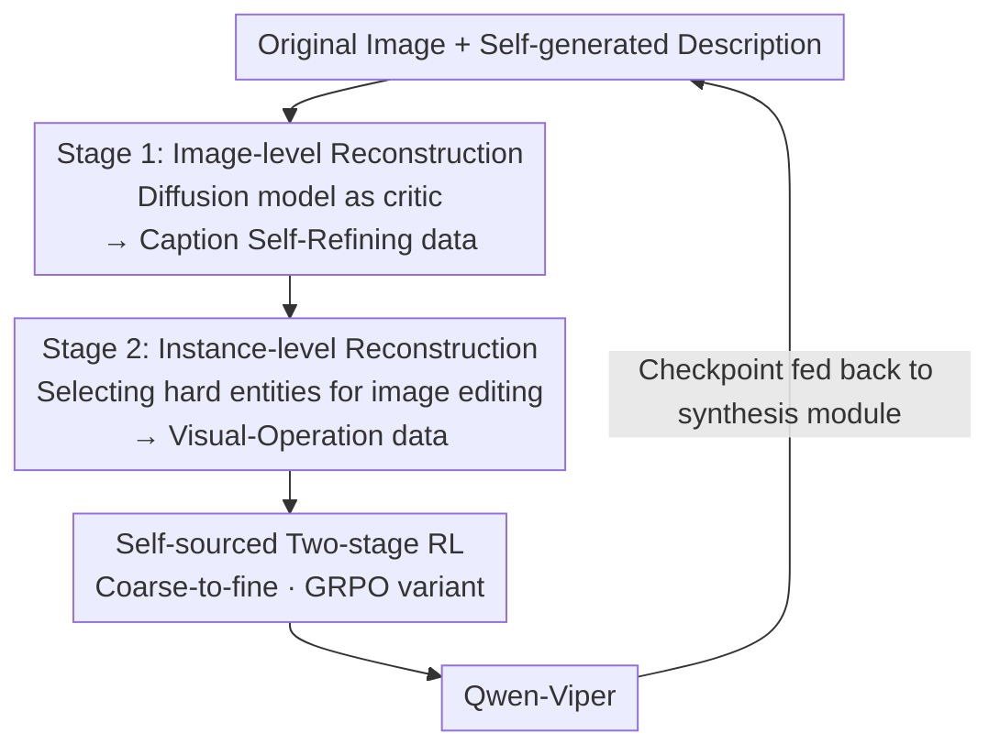

# ViPER: Empowering the Self-Evolution of Visual Perception Abilities in Vision-Language Models

**Conference**: ICLR 2026  
**OpenReview**: [https://openreview.net/forum?id=uxea0QCT0e](https://openreview.net/forum?id=uxea0QCT0e)  
**Code**: https://github.com/Icarus1216/ViPER  
**Area**: Multimodal VLM  
**Keywords**: Visual Perception, Self-evolution, Reinforcement Learning Fine-tuning, Data Synthesis, Closed-loop Training

## TL;DR
ViPER reformulates the enhancement of fine-grained visual perception in VLMs as a coarse-to-fine two-stage task. It utilizes a closed-loop framework where the model "generates its own data and learns from it." By utilizing a diffusion model to reconstruct images from textual descriptions as a critic for the VLM, combined with two-stage reinforcement learning, Qwen2.5-VL evolves stronger perception capabilities without relying on external distillation or cold-start data (achieving up to +6.0% in fine-grained perception).

## Background & Motivation
**Background**: VLMs are composed of a visual encoder and a language backbone, with overall performance depending on their synergy. Recently, inspired by the "slow thinking" of o1 and DeepSeek-R1, the multimodal field has also adopted Chain-of-Thought (CoT) strategies, hoping to leverage strong linguistic reasoning to boost visual task performance.

**Limitations of Prior Work**: For many vision-language tasks, especially those relying on fine-grained perception, linguistic reasoning alone is insufficient—performance is bottleneckled by "not seeing clearly" rather than "not thinking clearly." However, existing improvement paths have flaws: ① Supervised Fine-Tuning (SFT) scales by distilling data from stronger models, which involves high synthesis costs and sacrifices generalization—a non-sustainable trade-off; ② Reinforcement learning follows a "thinking-with-image" route via multi-turn visual tool calls, introducing significant latency and often focusing on "operating tools" rather than "truly understanding images," failing to fundamentally enhance pixel-level perception.

**Key Challenge**: Post-training either the vision or language side in isolation yields marginal gains. Visual understanding and linguistic reasoning are interdependent and need to co-evolve. Existing methods either decouple the two or "feed" perception abilities via external supervision rather than allowing them to "grow" internally.

**Goal**: Enable a VLM to drive its own perception evolution without relying on external model distillation, multi-turn tools, or high-quality cold-start data, ensuring this evolution reaches fundamental perception without harming general capabilities.

**Key Insight**: The authors observe that generation and understanding are reciprocal and mutually reinforcing. If a model "reconstructs" an image from its own textual understanding via a generative model, the difference between the reconstruction and the original image serves as visual evidence of missing or incorrect parts in the model's understanding. This acts as a "mirror" for the VLM, allowing it to see the visual consequences of its descriptions and thus perform self-criticism and self-correction.

**Core Idea**: Organize perception learning into a two-stage task of "seeing broadly, then seeing accurately." Use a diffusion model as a critic to build a closed loop of "self-data generation → self-reinforcement," where internally synthesized data directly fuels the improvement of perception.

## Method

### Overall Architecture
ViPER addresses how a VLM can improve visual perception on its own without external supervision. The solution integrates data construction and post-training into a closed loop: the model first "paints" its textual understanding back into an image using a diffusion model, automatically generates training data from the differences between the original and reconstructed images, and then consumes this self-generated data via two-stage reinforcement learning. The resulting checkpoint is fed back into the data synthesis module, allowing the model and its training data to co-evolve. This pipeline requires no external bootstrapping and represents a true self-evolution paradigm.

The pipeline consists of two main threads: the upper part is **two-stage data synthesis**, centered on a bidirectional vision-language mapping module; the lower part is the corresponding **two-stage reinforcement learning**. The first stage trains Caption Self-Refining, and the second stage trains Visual-Operation Predicting. Both threads follow the same "coarse-to-fine" progressive task structure. Based on this framework, the authors constructed the Viper10K dataset (7K Caption Self-Refining + 3K Visual-Operation Predicting), fine-tuning Qwen2.5-VL into the Qwen-Viper series.

> Note: The "Image-level Reconstruction → Instance-level Reconstruction" chain represents the **progressive two-stage task** (Design 1). The reconstruction nodes together form the **dual-granularity data synthesis module** (Design 2). The RL node represents the **self-sourced two-stage reinforcement learning** (Design 3).

### Key Designs

**1. Progressive Two-stage Task: Splitting Perception Learning into "Seeing Broadly" and "Seeing Accurately"**

Existing methods treat "perception enhancement" as a vague goal and brute-force data, failing to achieve either global understanding or local precision. ViPER structures this into two steps. Step one: **Caption Self-Refining**. Given an image $I$ and its own initial description $C_g$, the model analyzes errors/biases and outputs "refinement actions" $R_{pred}=f(I,C_g;\theta)$. The goal is to minimize $\min_\theta \mathbb{E}_{(I,C_g,R)\sim D}[\delta(R,R_{pred})]$, essentially teaching the model to "see broadly" and build global scene understanding and self-correction. Step two: **Visual-Operation Predicting**. Given a pair of highly similar images $(I_{orig},I_{recon})$ with subtle differences, the model infers the visual operations applied: $Ops_{pred}=f(I_{orig},I_{recon};\theta)$, minimizing $\delta(Ops,Ops_{pred})$. This forces attention onto fine-grained attribute/relationship changes, teaching the model to "see accurately."

**2. Dual-granularity Reconstruction for Data Synthesis: Turning Diffusion Models from Generators into Critics**

ViPER uses bidirectional mapping between VLM and diffusion models to synthesize data at two granularities. Phase one is **image-level reconstruction**: the VLM generates a static description of the original image, and the diffusion model reconstructs the image based on it. Since "image → text" inevitably loses information, discrepancies appear between the reconstruction and the original, serving as visual feedback to guide the VLM in correcting its initial description regarding attributes, text, or spatial relations. Phase two is **instance-level reconstruction**: the VLM selects "hard entities" from refined descriptions and generates visual operation commands; the diffusion model edits the original image accordingly. These commands naturally become the ground truth for Visual-Operation Predicting. The generative model externalizes the VLM's internal reasoning as a visible "image snapshot," giving the model an "image imagination" to perceive and refine its own understanding.

**3. Self-sourced Two-stage Reinforcement Learning: Self-generated Data + Semantic Reward, No Cold-start**

Since all training data is synthesized by the model itself, distribution shifts from heterogeneous sources are eliminated, allowing the RL process to proceed **without any cold-start**. Training follows the task order: first Caption Self-Refining, then Visual-Operation Predicting. The reward consists of a format reward $R_{format}$ and a correctness reward $R_{correct}$: $R=w_f R_{format}+w_c R_{correct}$ ($w_f=0.05,w_c=0.95$). $R_{correct}$ segments output into sentences $S$ and calculates semantic similarity with the ground truth set $G$ using BGE-M3. Only hits with similarity $>\tau=0.85$ are counted, weighted by sentence length $L(s_i)$, ensuring both accuracy and information density. Optimization uses a GRPO variant that decouples clipping boundaries ($\epsilon_{low}$ and $\epsilon_{high}$) to encourage diversity and removes the KL penalty.

### Loss & Training
The base models are Qwen2.5-VL-3B / 7B, performing two-stage RL on Viper10K. Hyperparameters: batch size 128, 5 rollout samples per prompt, temperature 1.0. Correctness is measured via BGE-M3. The optimization objective uses the GRPO clipped policy objective $J(\theta)=\mathbb{E}\big[\frac{1}{G}\sum_i \frac{1}{|o_i|}\sum_t \min(r_{i,t}\hat A_{i,t}, \text{clip}(r_{i,t},1-\epsilon_{low},1+\epsilon_{high})\hat A_{i,t})\big]$, where $r_{i,t}=\pi_\theta/\pi_{\theta_{old}}$.

## Key Experimental Results

### Main Results
Across seven comprehensive benchmarks (covering single-image, multi-image, and hallucination tasks), Qwen-Viper consistently improves over the base model, with average gains of +1.7% for 3B and +1.6% for 7B.

| Model | MMStar | RealWorldQA | MME-RW(en) | BLINK | Mantis | HallusionB | CRPE | Overall |
|------|--------|-------------|------------|-------|--------|-----------|------|---------|
| Qwen2.5-VL-3B | 55.9 | 65.4 | 53.1 | 47.6 | 68.7 | 46.3 | 73.6 | 58.7 |
| **Qwen-Viper-3B** | 57.8 | 67.7 | 54.6 | 49.2 | 70.0 | 49.1 | 74.3 | **60.4** |
| Qwen2.5-VL-7B | 63.9 | 68.5 | 57.4 | 56.4 | 75.1 | 52.9 | 76.4 | 64.4 |
| +Viper10K (SFT) | 64.5 | 68.2 | 57.9 | 56.8 | 75.6 | 53.2 | 76.1 | 64.6 |
| **Qwen-Viper-7B** | 66.2 | 71.4 | 59.0 | 57.6 | 75.6 | 54.4 | 77.6 | **66.0** |

Notably, SFT on the same data (+Viper10K SFT, 64.6) yielded minimal gains, while the RL-based Qwen-Viper-7B reached 66.0, proving the superiority of the RL paradigm.

Broken down by MMStar sub-domains, the Gain is most significant in **Fine-grained Perception**:

| Sub-domain | 3B Base→Viper | 7B Base→Viper |
|------|--------------|--------------|
| Coarse Perception | 68.8→70.0 (+1.2) | 73.6→75.2 (+1.6) |
| **Fine-grained Perception** | 48.4→52.8 (**+4.4**) | 55.6→61.6 (**+6.0**) |
| Instance Reasoning | 62.4→64.4 (+2.0) | 73.2→74.8 (+1.6) |
| Science & Technology | 37.2→39.2 (+2.0) | 44.4→48.0 (+3.6) |

### Ablation Study

| Configuration | Conclusion |
|------|------|
| Only Caption Self-Refining | Develops global visual reasoning and scene understanding, but gains are modest. |
| Only Visual-Operation Predicting | Drives sensitivity to local perception, with sharper gains in fine-grained tasks. |
| Two-stage Complete | Stage 1 builds a global scaffold that supports Stage 2's local analysis; superior to either single stage. |
| Two-stage RL vs. Mixed RL | Sequential training (coarse-to-fine) significantly outperforms randomly mixing tasks. |
| No Cold-start vs. Cold-start | No cold-start begins with lower reward but surpasses the cold-start baseline after 300 steps. |

### Key Findings
- **Empirical evidence for reciprocal understanding/generation**: The 3.6% gain in Science & Technology (where no direct knowledge training occurred) suggests stronger perception allows better integration of visual cues with parametric knowledge.
- **Spontaneous emergence of "thinking-with-image"**: Post-training, CoT tokens frequently include visual operation verbs like "scan" and "focus on"; attention heatmaps concentrate more on critical local regions.
- **Cold-start can be detrimental**: Using Gemini-2.5-Pro for 1K CoT SFT cold-start did not help and potentially constrained the model's self-evolution potential due to distribution mismatch.
- **Lower hallucination rates**: Improved perception leads to more faithful processing of image information, counteracting linguistic priors.

## Highlights & Insights
- **Repurposing Generation as a Critic**: The discrepancy between a reconstructed image and the original visually identifies the VLM's "blind spots," turning abstract errors into supervisable signals.
- **Natural Elimination of Cold-start**: Since data is self-sourced, distribution drift is eliminated, simplifying the engineering pipeline by removing external distillation needs.
- **Sequential Priority**: The coarse-to-fine sequence is a necessary structural design; global context must pave the way for local precision.

## Limitations & Future Work
- Dependency on diffusion model quality: Poor reconstruction/editing for certain image types may produce noise rather than valid feedback.
- Instance-level reconstruction relies on manual heuristic rules for selecting "hard entities," potentially limiting data diversity.
- Scalability to larger or weaker base models remains to be verified to ensure no cumulative bias occurs in the closed loop.
- Semantic rewards using BGE-M3 might not be sharp enough for tasks requiring pixel-perfect coordinates or exact counts.

## Related Work & Insights
- **vs. Distillation-based SFT**: Such methods are costly and hurt generalization; Ours uses self-generated data in an RL loop, where RL is proven more effective than SFT for the same data.
- **vs. Thinking-with-image / Tool-augmented RL**: Those methods introduce latency via external tools; Ours internalizes perception into parameters, enabling single-turn inference and spontaneous "thinking" patterns.
- **vs. General Multimodal RL (Vision-R1, VLM-R1)**: While using similar GRPO algorithms, Ours integrates data construction and training into a coarse-to-fine closed loop via dual-granularity reconstruction.

## Rating
- Novelty: ⭐⭐⭐⭐⭐ 
- Experimental Thoroughness: ⭐⭐⭐⭐ 
- Writing Quality: ⭐⭐⭐⭐ 
- Value: ⭐⭐⭐⭐⭐ 

<!-- RELATED:START -->

## Related Papers

- [\[ICLR 2026\] Vision-Zero: Scalable VLM Self-Evolution via Multi-Agent Self-Play](vision-zero_scalable_vlm_self-evolution_via_multi-agent_self-play.md)
- [\[ICLR 2026\] ASCIIEval: Benchmarking Models' Visual Perception in Text Strings via ASCII Art](asciieval_benchmarking_models_visual_perception_in_text_strings_via_ascii_art.md)
- [\[ICLR 2026\] Visual Prompt-Agnostic Evolution](visual_prompt-agnostic_evolution.md)
- [\[ICLR 2026\] Visual Self-Refine: A Pixel-Guided Paradigm for Accurate Chart Parsing](visual_self-refine_a_pixel-guided_paradigm_for_accurate_chart_parsing.md)
- [\[ICLR 2026\] Catching the Details: Self-Distilled RoI Predictors for Fine-Grained MLLM Perception](catching_the_details_self-distilled_roi_predictors_for_fine-grained_mllm_percept.md)

<!-- RELATED:END -->
