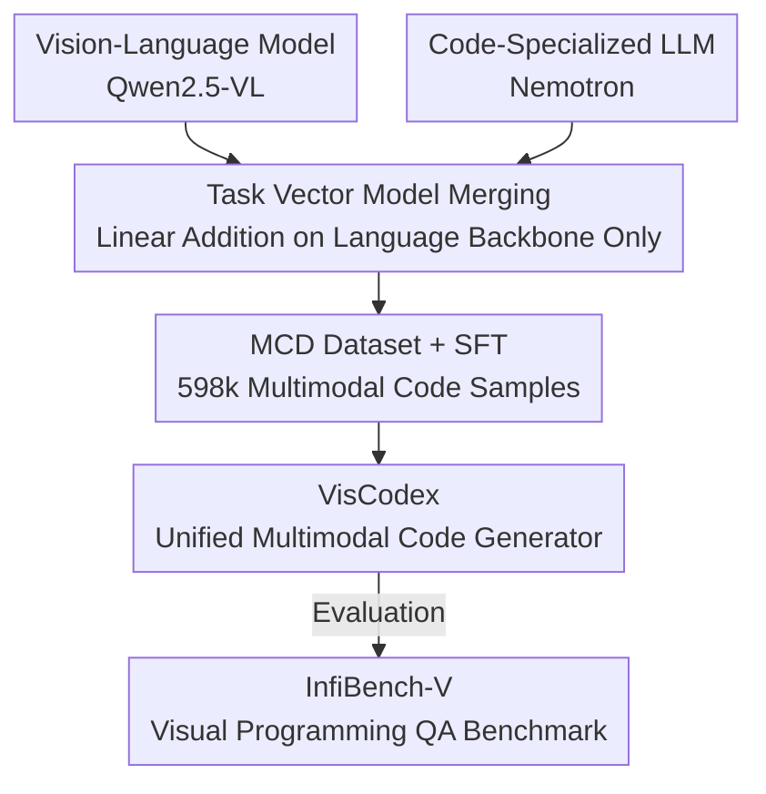

# VisCodex: Unified Multimodal Code Generation via Merging Vision and Coding Models

**Conference**: ICLR 2026  
**OpenReview**: [https://openreview.net/forum?id=hUXzPauNEM](https://openreview.net/forum?id=hUXzPauNEM)  
**Code**: https://github.com/JackLingjie/VisCodex  
**Area**: Multimodal VLM  
**Keywords**: Multimodal Code Generation, Model Merging, Task Vectors, Instruction Tuning Data, Vision-to-Code

## TL;DR
VisCodex utilizes "task vectors" to arithmetically merge a powerful code LLM into the language backbone of a Vision-Language Model (VLM), while keeping the vision encoder and projection layer frozen. Combined with a self-constructed 598k multimodal coding dataset (MCD) for supervised fine-tuning, the MLLM retains vision understanding while gaining strong coding capabilities. It achieves open-source SOTA on UI-to-code and chart-to-code tasks, approaching GPT-4o performance.

## Background & Motivation
**Background**: Multimodal Large Language Models (MLLMs) are already strong in visual question answering, image description, and multimodal dialogue, capable of "understanding" UI layouts, data charts, and programming-related screenshots. However, a highly practical direction—generating executable code from visual input (multimodal code generation)—remains significantly under-explored.

**Limitations of Prior Work**: Tasks like translating UI designs to HTML or replicating charts into matplotlib code require both meticulous interpretation of visual elements and the generation of syntactically and functionally correct code. Existing MLLMs generally "can describe but cannot write": they excel at visual description but lack the deep programming knowledge required for robust code generation.

**Key Challenge**: To make a model strong in both vision and code, the most direct approach is training from scratch or large-scale joint training, both of which are prohibitively expensive. Simply "replacing the backbone"—substituting the VLM's language model with a code LLM—disrupts the previously learned visual alignment (disturbing visual grounding). There exists a tension between vision and coding capabilities.

**Goal**: To create a unified model with "strong visual understanding + strong code generation" without expensive retraining, and to address the scarcity of training data and evaluation benchmarks in this field.

**Key Insight**: The authors noted that coding expertise primarily resides in the language model backbone, whereas visual understanding resides in the vision encoder and cross-modal projection modules. These components are "separable" in parameter space. Thus, model merging can be used to perform surgery only on the language backbone while keeping the vision components intact.

**Core Idea**: Linearly merge the language backbone parameters of a VLM and a code LLM using "task vectors"—injecting coding expertise without disturbing visual modules—followed by fine-tuning on large-scale multimodal code data to obtain a unified multimodal code generator at extremely low cost.

## Method

### Overall Architecture
The input to VisCodex consists of two off-the-shelf models with the same architecture: a VLM (Qwen2.5-VL, responsible for vision) and a code-specialized LLM (OpenCodeReasoning-Nemotron, responsible for code reasoning). The output is a unified multimodal code generation model. The pipeline follows two steps: first, "task vector linear merging" injects code capabilities into the VLM's language backbone to obtain merged initialization parameters; second, supervised fine-tuning (SFT) is performed on the self-built 598k multimodal coding dataset (MCD) to align the merged model with specific visual programming tasks. To ensure rigorous evaluation, the authors also created a real-world visual programming QA benchmark, InfiBench-V.

The key to the method is "only modifying the language backbone": both merging and fine-tuning act only on the language model. The vision encoder (ViT) and cross-modal projection module remain frozen throughout, preserving the original VLM's visual alignment while clearly attributing the new coding capabilities to the language side.

### Key Designs

**1. Task Vector Model Merging: Injecting Code Expertise into the Language Backbone Only**

This step addresses the pain point where backbone replacement destroys visual alignment. A task vector characterizes the parameter shift of a base model after being fine-tuned for a specific task: given a pre-trained base model $\theta_{base}$ and its fine-tuned variant $\theta_{ft}$, the task vector is defined as $\tau_{task} = \theta_{ft} - \theta_{base}$, packaging the parameter changes into a modular, transferable unit. The authors compute task vectors for the VLM and code model: $\tau_{vlm} = \theta_{vlm} - \theta_{base}$ (enabling the LLM to process text-image pairs) and $\tau_{code} = \theta_{code} - \theta_{base}$ (encoding code understanding and generation), then combine them linearly:

$$\theta_{VisCodex} = \theta_{base} + \lambda \tau_{vlm} + (1-\lambda)\tau_{code}$$

where $\lambda \in [0, 1]$ controls the trade-off between "preserving multimodal representation" and "injecting code expertise." Crucially, the merging is strictly limited to the language model backbone; the vision encoder and projection module do not participate. This is why it outperforms direct backbone replacement: replacement disrupts learned visual grounding, whereas merging preserves visual alignment while overlaying code capabilities. An engineering prerequisite is that the merged models must share the same architecture: since Qwen2.5-VL’s language backbone is derived from Qwen2.5, the authors chose Nemotron (also based on Qwen2.5) to ensure consistent $\theta_{base}$ and additive task vectors.

**2. MCD Multimodal Coding Dataset: Four Heterogeneous Sources Covering Real Visual Programming**

Merging provides a good initialization, but large-scale high-quality data is needed to align the model with multimodal programming tasks. The authors constructed the 598k-sample Multimodal Coding Dataset (MCD) from four complementary sources: (1) Enhanced HTML code—identifying that existing Web2Code data has broken images and poor styling. Instead of having GPT-4o rewrite old code, they used "image-driven generation": using 560k web images as style seeds, GPT-4o designed new pages, which were rendered via Playwright, resulting in 200k high-quality code-image pairs after filtering. (2) Chart Image to Code—combining 164k synthetic Chart2Code samples with 46k real samples from GitHub, refined via GPT-4o and aesthetic scoring. (3) Image-enhanced Code QA—scraping StackOverflow posts containing images and accepted answers with Python/HTML, resulting in 59k pairs. (4) Algorithmic Code—129k entries from Kodcode (LeetCode, Codeforces, etc.) to preserve core algorithmic reasoning.

**3. InfiBench-V Benchmark: Real-world Visual Programming Evaluation Where Images are Indispensable**

Existing benchmarks either test pure-text code QA (like InfiBench) or simple vision tasks, failing to measure scenarios where "visual context is critical for the correct answer." InfiBench-V fills this gap: starting from 1 million SO questions with images and accepted answers, filtered down to 10,000 where "images are indispensable and pure text is insufficient," and finally 322 expert-selected questions across 13 programming languages. To prevent pre-training leakage, experts paraphrased every question. Evaluation uses a normalized average of three metrics: keyword matching (weighted phrases with regex), unit tests (automated via expert scripts), and GPT-4o judging (correctness and completeness relative to reference answers).

**4. Supervised Fine-Tuning and Merging Coefficient: Tuning $\lambda$ and Freezing Vision Modules**

After merging to obtain $\theta_{VisCodex}$, the model undergo SFT on MCD. During training, the vision encoder and projection module remain frozen, while only the language backbone is updated. This efficiently leverages existing visual grounding while consolidating new code capabilities. The merging coefficient $\lambda$ was selected empirically: for the 8B model, the authors tested $\{0.7, 0.8, 0.85, 0.9\}$ based on MMCode performance, eventually choosing $\lambda = 0.7$—giving 0.7 weight to the vision task vector and 0.3 to the code task vector.

### Loss & Training
Standard instruction fine-tuning (SFT) objective on 598k MCD image-text-code samples; ViT and cross-modal projection are frozen, only the LLM backbone is updated. The 8B model uses the Nemotron-1.1-7B code task vector with $\lambda=0.7$; the 33B model uses the Nemotron-1.1-32B variant similarly.

## Key Experimental Results

### Main Results
Evaluated on Design2Code (UI-to-Code), ChartMimic (Chart-to-Code), MMCode (Vision algorithm pass@1), and InfiBench-V.

| Model | Size | Design2Code (Low/High) | ChartMimic (Low/High) | MMCode pass@1 | InfiBench-V | Average |
|------|------|------|------|------|------|------|
| GPT-4o-mini | - | 85.8 / 87.3 | 68.4 / 68.5 | 12.2 | 71.9 | 65.7 |
| GPT-4o | - | 90.2 / 90.4 | 79.0 / 83.5 | 17.0 | 79.9 | 73.3 |
| Qwen2.5-VL-7B-Instruct | 8B | 83.4 / 87.6 | 39.5 / 38.3 | 5.3 | 54.0 | 51.4 |
| InternVL3-14B | 15B | 82.9 / 88.3 | 53.9 / 55.0 | 11.4 | 70.5 | 60.3 |
| **VisCodex-8B** | 8B | **90.1 / 90.9** | **74.8 / 74.1** | 11.0 | **72.1** | **68.8** |
| Qwen2.5-VL-72B-Instruct | 73B | 86.9 / 88.7 | 66.7 / 68.7 | 15.2 | 75.2 | 66.9 |
| **VisCodex-33B** | 33B | **90.5 / 91.1** | **79.3 / 78.5** | 15.6 | 78.6 | **72.3** |

VisCodex-8B outperforms all open-source models in its range (7-15B) and exceeds GPT-4o-mini. VisCodex-33B is nearly on par with GPT-4o (72.3 vs 73.3) and outperforms larger open-source models (72B/78B). The main weakness is MMCode (pure algorithm pass@1), where VisCodex-8B (11.0) lags behind GPT-4o.

### Ablation Study

| Configuration | Key Metrics | Description |
|------|---------|------|
| VisCodex-8B (Full) | ChartMimic 74.8/74.1, MMCode 11.0 | Merging + MCD SFT |
| w/o model merge (8B) | ChartMimic 73.4/70.6, MMCode 6.8 | Merging removed; MMCode drops significantly |
| Replace (1-stage) | Design2Code 88.7, ChartMimic 70.4/69.2 | Direct backbone replacement |
| Replace (2-stage) | Design2Code 88.2, ChartMimic 73.4/70.9 | Re-aligning projector then joint tuning |
| **Model Merge (Ours)** | **Design2Code 90.1, ChartMimic 74.8/74.1** | Significantly better on vision-intensive tasks |

Selection of Code LLM: Merging code-specialized models is superior to merging general LLMs (e.g., Qwen2.5-7B-Instruct). Nemotron-1.1-7B improved MMCode pass@1 from 6.8 to 11.0.

### Key Findings
- **Model merging contributes most to code capability**: Removing merging causes the 8B model's MMCode score to drop from 11.0 to 6.8 (nearly halved). However, vision understanding (Design2Code) remains stable, proving visual grounding is preserved.
- **Merging is superior to backbone replacement**: Especially in vision-dense tasks like Design2Code and ChartMimic, merging outperforms 1-stage/2-stage replacement because the latter disrupts learned visual grounding.
- **Necessity of code-specialized models**: General-purpose LLMs cannot significantly boost MMCode performance; only code-specialized models like Nemotron significantly improve execution correctness.

## Highlights & Insights
- **Leveraging "Parameter Space Division"**: The authors recognized that code capabilities reside in the language backbone while vision resides in ViT + Projector. By applying task vector addition only to the language side, they combined these capabilities at low cost—a key insight for transplanting model merging to multimodal code scenarios.
- **Reusable "Image-driven Generation" for HTML data**: Instead of rewriting code under structural constraints, using images as style seeds to design new pages ensures better layout quality and rendering consistency.
- **Frozen vision modules for clean attribution**: Updating only the language side ensures that performance gains are clearly attributable to the injection of code knowledge, rather than hidden changes in the vision modules.

## Limitations & Future Work
- **Performance on complex algorithmic vision problems**: The gap in MMCode (11.0 vs 17.0 for GPT-4o) shows that merging has limited help for "long-chain reasoning + visual analysis" algorithm problems.
- **Architecture dependencies**: Merging requires compatible VLM backbones and code models (e.g., both based on Qwen2.5). This limits applicability when using heterogeneous model pairs.
- **Heavily reliant on GPT-4o for data construction**: HTML generation, chart rewriting, and benchmark selection all depend on GPT-4o, introducing potential bias and costs.
- **Future Directions**: Exploring joint (lightweight) adaptation of task vectors and vision modules, merging multiple code/reasoning vectors, or implementing layer-wise/task-adaptive merging coefficients ($\lambda$).

## Related Work & Insights
- **Compared to Backbone Replacement**: 1-stage replacement and 2-stage projector-first training both disrupt the VLM's original visual grounding. VisCodex preserves visual grounding while injecting code expertise, yielding better results on vision-dense tasks.
- **Compared to HTML Datasets like Web2Code**: Web2Code has issues with aesthetic quality and broken CSS; this work uses image-driven generation and Playwright filtering to create 200k higher-quality pairs.
- **Compared to other Merging-based MLLMs**: While other works used merging for VQA or math reasoning, this work is the first to demonstrate its effectiveness for multimodal code generation, providing both the MCD dataset and InfiBench-V benchmark.

## Rating
- Novelty: ⭐⭐⭐⭐ Applying model merging to multimodal code generation and verifying the effectiveness of backbone-only modification is a clear and effective insight.
- Experimental Thoroughness: ⭐⭐⭐⭐⭐ Comprehensive evaluation across four benchmarks and multiple ablations (merging vs replacement, model selection).
- Writing Quality: ⭐⭐⭐⭐ Well-structured flow from motivation to data construction and evaluation.
- Value: ⭐⭐⭐⭐⭐ High practical value by creating an open-source multimodal code generator approaching GPT-4o performance and releasing a large dataset/benchmark.

<!-- RELATED:START -->

## Related Papers

- [\[ICLR 2026\] OptMerge: Unifying Multimodal LLM Capabilities and Modalities via Model Merging](optmerge_unifying_multimodal_llm_capabilities_and_modalities_via_model_merging.md)
- [\[ICLR 2026\] Breaking the SFT Plateau: Multimodal Structured Reinforcement Learning for Chart-to-Code Generation](breaking_the_sft_plateau_multimodal_structured_reinforcement_learning_for_chart-.md)
- [\[ICLR 2026\] Lavida-O: Elastic Large Masked Diffusion Models for Unified Multimodal Understanding and Generation](lavida-o_elastic_large_masked_diffusion_models_for_unified_multimodal_understand.md)
- [\[ICLR 2026\] Omni-Weather: A Unified Multimodal Model for Weather Radar Understanding and Generation](omni-weather_a_unified_multimodal_model_for_weather_radar_understanding_and_gene.md)
- [\[ICLR 2026\] Thinking with Camera: A Unified Multimodal Model for Camera-Centric Understanding and Generation](thinking_with_camera_a_unified_multimodal_model_for_camera-centric_understanding.md)

<!-- RELATED:END -->
