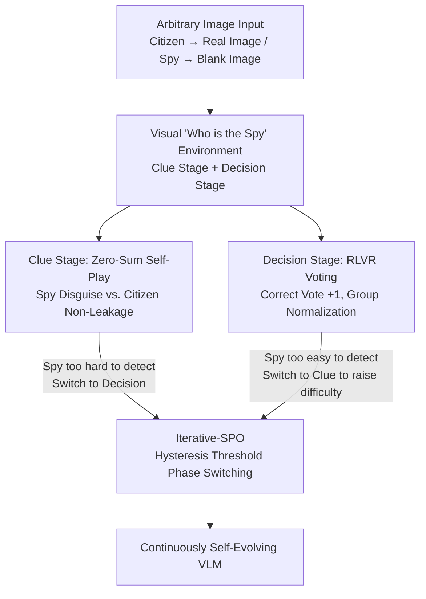

# Vision-Zero: Scalable VLM Self-Evolution via Multi-Agent Self-Play

**Conference**: ICLR 2026  
**OpenReview**: [https://openreview.net/forum?id=s00SNXREV6](https://openreview.net/forum?id=s00SNXREV6)  
**Code**: https://github.com/wangqinsi1/Vision-Zero  
**Area**: Multimodal VLM  
**Keywords**: VLM Self-Evolution, Multi-Agent Self-Play, Social Reasoning Games, RLVR, Zero-Label Training

## TL;DR
Bringing "Who is the Spy" into the visual world—providing real images to Citizens and blank ones to Spies, allowing VLMs to generate training data automatically through multi-role adversarial play. By alternating Self-Play and RLVR optimization (Iterative-SPO), Qwen2.5-VL-7B simultaneously outperforms SOTA models trained on expensive human-annotated data in reasoning, charts, and vision-centric tasks under a completely zero-annotation premise.

## Background & Motivation
**Background**: Current post-training for VLMs/MLLMs relies heavily on humans: SFT requires human-written reasoning trajectories, RLHF needs preference labels, and RLVR demands carefully designed verifiable rewards and question banks. While models trained this way are powerful, every step is bottlenecked by "how much supervision humans can provide."

**Limitations of Prior Work**: The cost of multimodal annotation is exorbitant—the paper cites stinging figures: labeling 200,000 objects in COCO Attributes costs $60,000, Ego4D consumed 250,000 annotation hours, and Visual Genome mobilized 33,000 annotators. This brings two bottlenecks: first, **data scarcity**, where cost limits the scale and diversity of data; second, a **knowledge ceiling**, where model capability is locked by the upper limit of human supervision, preventing it from learning strategies beyond human experience.

**Key Challenge**: To achieve continuous self-improvement for VLMs, "human-in-the-loop" must be eliminated, yet Self-Play in the VLM domain is almost non-existent. An ideal self-play environment must satisfy four conditions: ① the skills required to win must align highly with target tasks; ② difficulty should scale with capability (no convergence to a fixed cap); ③ the environment must be diverse and complex enough to cover broad tasks; ④ it should require only unlabelled or extremely low-cost data. Existing visual games (like Sudoku) satisfy at most two or three, failing to achieve all four—especially because VLMs involve both visual and linguistic modalities, making the design of such an environment non-trivial.

**Goal**: To create a zero-annotation, domain-agnostic, and difficulty-scaling visual self-play environment where VLMs produce supervision signals during gameplay and learn capabilities that transfer to general tasks.

**Key Insight**: The authors draw inspiration from social reasoning games (specifically "Who is the Spy" with alternating "Statement-Voting")—these games naturally require observation, inference, communication, and strategy. Furthermore, opponents evolve as one grows stronger, causing the difficulty to scale automatically, which perfectly addresses the aforementioned four conditions.

**Core Idea**: Construct a visual version of "Who is the Spy"—Citizens see real images while the Spy receives a blank image. The Spy must infer the hidden image and disguise themselves based solely on the Citizens' statements, while Citizens must balance "clarity" and "non-leakage." Iterative-SPO is then used to alternate between zero-sum Self-Play phases and verifiable RLVR phases to prevent self-play from falling into equilibrium stagnation.

## Method

### Overall Architecture
Vision-Zero is a gamified VLM post-training framework that takes any image (unlabelled) as input and outputs a continuously reinforced version of the same VLM. It decomposes training into rounds of "Who is the Spy": each round has $n_c$ Citizens and 1 Spy. Citizens receive the real image $I_c$, while the Spy receives a blank image $I_s$. A round consists of two stages—the **Clue Stage**, where each player takes turns describing their image in one sentence (statements are visible to subsequent players but thought processes remain private); and the **Decision Stage**, where Citizens vote to identify the Spy based on all clues and their own image, while the Spy does not vote as they know their identity. These two stages correspond to two training signals: the Clue Stage is a zero-sum confrontation between Citizen vs. Spy, optimized via Self-Play; the Decision Stage provides verifiable rewards based on "correctness of the vote," optimized via RLVR.

The key is not to mix these two types of training but to **alternate** them: when the Decision Stage makes it too easy to identify the Spy (indicating saturation in the Clue Stage), it switches to training the Clue Stage to increase difficulty; when the Spy becomes too hard to identify, it switches back to training the Decision Stage. This switching mechanism with hysteresis thresholds is Iterative-SPO, designed to prevent either side from converging prematurely to an equilibrium.

### Key Designs

**1. Visual "Who is the Spy" Environment: Forcing Visual Reasoning and Strategy through Information Asymmetry**

Addressing the pain point of "lacking a visual self-play environment that satisfies all four conditions," the authors visualize social reasoning games. The core mechanism is **information asymmetry**: Citizens see the real image and the Spy sees a blank one. Consequently, the Spy must act like a detective to infer the hidden image from the Citizens' fragmented statements and compose a clue that is both consistent with the consensus and not self-incriminating. Meanwhile, Citizens must provide accurate and clear descriptions to clear suspicion while minimizing information leakage to the Spy. This setting naturally forces the model to perform strategic reasoning across multiple roles and handle spatial relationships and object details simultaneously—rather than relying solely on linguistic shortcuts. Difficulty scales automatically: as the model improves, its opponents (clones of itself) also improve, keeping the environment challenging (Condition ②). The paper validates this using CLEVR synthetic scenes, charts, and real-world images (Conditions ③ and ④).

**2. Zero-Sum Self-Play Reward in Clue Stage + Role Advantage Estimation (RAE)**

The Clue Stage addresses "how to score individual clues without letting the Spy or Citizen naturally dominate due to information asymmetry." Rewards are designed according to a zero-sum game: more votes (looking more like a Spy) result in lower rewards. The Spy reward is $r^{clue}_s = -\beta(v_s - \bar{v}_c)$, and the Citizen reward is $r^{clue}_{c_j} = \frac{\beta}{n_c}(v_s - \bar{v}_c) - \lambda(v_{c_j} - \bar{v}_c)$, where $v_s$ is the Spy's votes, $\bar{v}_c$ is the average Citizen votes, $\beta$ controls adversarial intensity, and $\lambda$ penalizes inconsistent behavior among Citizens. This ensures the total reward for Spy and Citizens is zero, and whoever is suspected more receives a lower score.

However, since the Spy has a blank image and Citizens have the real one, the win rate is naturally imbalanced. The authors use **Role Advantage Estimation (RAE)** to eliminate this asymmetry: baselines $b_s, b_c$ for the Spy and Citizens are maintained and updated via exponential moving average $b_s = \alpha b_s + (1-\alpha)r^{clue}_s$. The advantage $A^{clue}_k = r^{clue}_k - b_k$ subtracts the role-specific baseline from the reward, effectively removing the "it's inherently harder being a Spy" component. The final objective is advantage-weighted log-likelihood with KL regularization (constrained to a reference policy $\pi_{ref}$ to prevent degenerate statements), while non-baselined returns remain zero-sum to promote equilibrium-seeking dynamics.

**3. Discrete Verifiable Reward in Decision Stage + Group Normalization (GRPO)**

The goal of the Decision Stage is straightforward—accurately voting for the Spy. Since Citizens share aligned information, they can be treated as a group, allowing for the application of GRPO. Rewards are discrete and verifiable: $+1$ for a correct vote, $-0.5$ for "n/a" (uncertainty), and $-1$ for an incorrect vote. This design is clever as it encourages the model to **honestly admit uncertainty** rather than guess randomly when unsure, preventing it from being misled by wrong answers. To eliminate difficulty variance between rounds, group normalization is applied $A^{dec}_{c_i} = (r^{dec}_{c_i} - \mu_r)/(\sigma_r + \varepsilon)$, ensuring the advantage reflects solely "who judged relatively better in this round" without being polluted by whether the round itself was easy to guess. Optimization also uses advantage-weighted log-likelihood with KL regularization.

**4. Iterative-SPO: Alternating Self-Play and RLVR via Hysteresis Thresholds to Solve Equilibrium Stagnation**

This is the algorithmic core of the paper, targeting two opposite failure modes: pure self-play converges to local equilibria and stops exploring new reasoning paths; pure RLVR suffers from knowledge saturation once the question bank is mastered. Iterative-SPO allows **alternating training** between the two stages, using performance in the Decision Stage as a signal for switching. It maintains the exponential moving average of batch accuracy $acc_t$ and "n/a" rate $na_t$, using a set of **hysteresis thresholds** for switching: when $\overline{acc}_t \ge \tau^{\uparrow}_{acc}$ and $\overline{na}_t \le \tau^{\downarrow}_{na}$ (Spy is too easy to identify, meaning clues are too weak), it switches to the Clue Stage to increase difficulty; when $1-\overline{acc}_t \ge \tau^{\uparrow}_{err}$ or $\overline{na}_t \ge \tau^{\uparrow}_{na}$ (Spy is too hard to identify), it switches back to the Decision Stage. To prevent frequent oscillations, a minimum of $K_{min}$ steps per stage is required. At each step, only the active module receives gradients, with the loss $L_t = m_t L_{clue}(\theta) + (1-m_t)L_{dec}(\theta)$. This alternation brings two benefits: dynamic detection of stagnation signals to avoid policy equilibrium or knowledge plateaus, and the injection of RLVR's supervision signals into self-play to stabilize training and prevent role collapse or divergence.

### Main Results
In the post-training of Qwen2.5-VL-7B, compared with several SOTA models using human-annotated data for RLVR (across six reasoning/math benchmarks on VLMEvalKit):

| Method | Training Data | MathVision | WeMath | LogicVista | Avg. |
|------|---------|-----------|--------|-----------|------|
| Qwen2.5-VL-7B (Base) | — | 25.4 | 36.1 | 47.2 | 41.1 |
| MM-Eureka-Qwen-7B | Human Annotated | 26.9 | 36.2 | 42.9 | 42.9 |
| VLAA-Thinker-7B | Human Annotated | 26.4 | 36.0 | 47.2 | 41.9 |
| ViGaL-Snake+Rotation | Game Logs | 27.5 | 36.9 | 46.5 | 43.0 |
| **VisionZero-Qwen-7B (CLEVR)** | **Zero-Annotated** | 28.4 | 39.2 | 49.8 | **44.3** |
| **VisionZero-Qwen-7B (Real-World)** | **Zero-Annotated** | 28.5 | 40.1 | 50.8 | **44.5** |

Vision-Zero (Zero-annotated) outperforms all baselines trained on hundreds or thousands of math/reasoning samples (strongest baseline +1.9% vs. Ours +3%), despite having **no specialized math training**—the capability is transferred from gameplay.

Cost comparison (Table 3) further highlights the advantage:

| Method | RL Data Size | Annotation Cost (tokens) | Training Time | MMMU |
|------|----------|----------------|---------|------|
| R1-OneVision-7B | 10k | ≥1.1M | ≥170 A100h | 51.9 |
| MM-Eureka-Qwen-7B | 15k | — | ≈700 A100h | 55.8 |
| ViGaL-Snake+Rotation | 72k | 0 | ≈170 A100h | 58.0 |
| **VisionZero-Qwen-7B (CLEVR)** | **2k** | **0** | **127 A100h** | **58.8** |

With zero annotation cost, only 2k images, and 127 A100 hours, it achieves the highest MMMU. Compared to original GRPO, training efficiency improved by $3.3\times$ and $6.4\times$ on Qwen2.5-VL-7B and InternVL3-8B respectively.

### Ablation Study

| Configuration | Final Accuracy (LogicVista) | Note |
|------|-------------------|------|
| Iterative-SPO (Full) | Highest | Alternating Self-Play + RLVR |
| Pure Clue (Self-Play only) | ~2% lower than Full | Lacks verifiable reward, reaches equilibrium too early |
| Pure Decision (RLVR only) | ~1% lower than Full | Knowledge saturation |

Cross-model generalization (trained on CLEVR, average of 6 reasoning benchmarks): InternVL3-8B improved from 34.7 → 36.5 (+1.8), and InternVL3-14B from 45.8 → 47.4 (+1.6), both exceeding baselines using MM-Eureka + GRPO under the same settings.

### Key Findings
- **Alternation is Key**: Pure self-play performed worst—its reward signal comes from the decision-making side. If the decision-maker lacks discriminative power, roles become indistinguishable and performance plateaus early. Continuous growth requires the verifiable supervision of RLVR.
- **Capability Transfer without Conflict**: VisionZero trained on chart data improved average performance across four chart benchmarks by +3.9%. Trained on CLEVR, it improved MMVP from 76.8% to 79.5%. This framework successfully improves reasoning, charts, and vision-centric tasks simultaneously, mitigating typical negative transfer between capabilities.
- **Reasoning becomes "Longer" and "Correcter"**: Win rates increased from 50% to 71% during training. Average output length in the decision stage grew from 250 to approximately 400 tokens, indicating the model genuinely engages in more thorough reasoning rather than just template following.

## Highlights & Insights
- **Information Asymmetry as a Training Engine**: Giving the Spy a blank image is a simple yet powerful setting that simultaneously forces four capabilities: visual understanding, spatial reasoning, inference, and communication. This is far more elegant than stacking specialized datasets.
- **Pragmatic Hysteresis Threshold Switching**: Using decision accuracy and "n/a" rate as probes for "Clue Stage saturation," combined with minimum step requirements to prevent jitter, provides an actionable engineering solution for "when to switch training objectives."
- **"n/a" Reward of -0.5**: Encouraging the model to abstain honestly when unsure is a neat design that embeds calibration into RLVR rewards, reusable in any verifiable task allowing "no answer."
- **Zero Annotation Overcoming Labelling**: The most counter-intuitive finding—zero labels, 2k images, and 127 A100h outperformed models trained on thousands of specialized annotations in math reasoning, strongly supporting the claim that "gameplay can break through the ceiling of human supervision."

## Limitations & Future Work
- The environment is fixed as "Who is the Spy," with a hardcoded interaction pattern (two rounds of clues + one round of decision). Whether the gameplay mechanism itself creates a capability ceiling for more complex tasks remains unverified.
- Switching thresholds (e.g., $\tau^{\uparrow}_{acc}=0.9$) and $\beta, \lambda$ are empirically set. No sensitivity analysis was provided, potentially requiring retuning for new models or data.
- While covering 14 tasks, the gain magnitude is mostly in the 1.6%–3.9% range, representing steady rather than disruptive improvement. Long-term self-play beyond 100 rounds requires further observation.
- Visual "Who is the Spy" primarily trains description and inference at the object/spatial/chart level. For tasks requiring fine-grained OCR, long documents, or complex causal chains, whether the "alignment" (Condition ①) between game skills and target tasks is sufficient deserves further examination.

## Related Work & Insights
- **vs Absolute Zero / SPIRAL (LLM Self-Play)**: These focus on pure linguistic games (Tic-Tac-Toe, Kuhn Poker). This work is the first to systematically introduce self-play to VLMs, with the key increment being the handling of the visual modality and creating supervision through asymmetric visual games—existing LLM games cannot force visual understanding.
- **vs ViGaL (Gamified VLM Training)**: ViGaL collects game data offline for training, whereas this work is online interactive self-play where data evolves with the model. ViGaL uses 72k samples; this work uses only 2k and achieves better results.
- **vs MM-Eureka / VLAA-Thinker / OpenVLThinker (RLVR + Human Annotation)**: These rely on human-constructed question banks and CoT annotations for RLVR. This work is zero-annotation, relying on gameplay to generate verifiable signals, resulting in significantly lower costs (0 labels, 127 vs ≥120–700 A100h) and higher performance.

## Rating
- Novelty: ⭐⭐⭐⭐⭐ First VLM gamified self-play framework; both asymmetric visual gameplay and Iterative-SPO are innovative.
- Experimental Thoroughness: ⭐⭐⭐⭐ 14 tasks across three models, comprehensive cost/efficiency/generalization/ablation, but lacks hyperparameter sensitivity and extreme long-term self-play validation.
- Writing Quality: ⭐⭐⭐⭐ Clear chain of motivation and methodology, complete reward and switching formulas.
- Value: ⭐⭐⭐⭐⭐ Zero annotation exceeding annotated SOTA provides a deployment-ready paradigm for VLMs to escape the ceiling of human supervision.

<!-- RELATED:START -->

## Related Papers

- [\[ICLR 2026\] Thinking as Society: Multi-Social-Agent Self-Distillation for Multimodal Misinformation Detection](thinking_as_society_multi-social-agent_self-distillation_for_multimodal_misinfor.md)
- [\[ICLR 2026\] ViPER: Empowering the Self-Evolution of Visual Perception Abilities in Vision-Language Models](viper_empowering_the_self-evolution_of_visual_perception_abilities_in_vision-lan.md)
- [\[ICLR 2026\] Self-Aug: Query and Entropy Adaptive Decoding for Large Vision-Language Models](self-aug_query_and_entropy_adaptive_decoding_for_large_vision-language_models.md)
- [\[ICLR 2026\] Self-Evolving Vision-Language Models for Image Quality Assessment via Voting and Ranking](self-evolving_vision-language_models_for_image_quality_assessment_via_voting_and.md)
- [\[AAAI 2026\] Multi-Agent VLMs Guided Self-Training with PNU Loss for Low-Resource Offensive Content Detection](../../AAAI2026/multimodal_vlm/multi-agent_vlms_guided_self-training_with_pnu_loss_for_low-resource_offensive_c.md)

<!-- RELATED:END -->
