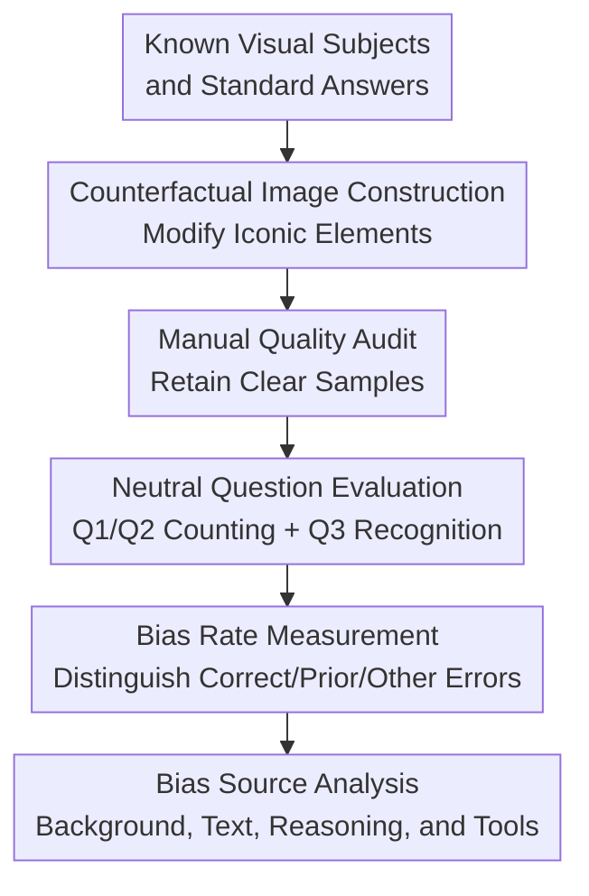

# Vision Language Models are Biased

**Conference**: ICLR 2026  
**OpenReview**: [https://openreview.net/forum?id=DG4S2OlGQA](https://openreview.net/forum?id=DG4S2OlGQA)  
**Paper**: [Project Page](https://vlmsarebiased.github.io)  
**Code**: https://vlmsarebiased.github.io  
**Area**: Multimodal VLM  
**Keywords**: VLM Bias, Counterfactual Images, Visual Counting, VLM Evaluation, VLMBias  

## TL;DR
This paper proposes the VLMBias counterfactual visual evaluation framework, which systematically modifies iconic visual elements in animals, logos, flags, chessboards, game boards, optical illusions, and patterned grids. It finds that mainstream VLMs achieve an average accuracy of only 17.05% on objective counting tasks, with 75.70% of responses reverting to commonsense priors rather than visual evidence.

## Background & Motivation
**Background**: VLMs have been deployed in numerous visual question answering, image understanding, and multimodal reasoning tasks. Many evaluations assume that models can both recognize semantic objects and observe detailed changes within images. Conversely, existing research on LLM/VLM bias typically focuses on social, cultural, or gender-related biases, or uses leading Yes/No questions to test if models hallucinate in response to textual prompts.

**Limitations of Prior Work**: These existing benchmarks struggle to address a more fundamental question: when the question is neutral and the answer is objectively countable, are VLMs still led astray by commonsense knowledge of familiar objects? For example, if a user asks "How many legs does this animal have?" for an image of a dog with one extra leg added, and the model answers 4, is it due to poor vision or because it knows dogs usually have 4 legs? Previous evaluations often embedded biases in prompts or answer choices, failing to cleanly isolate textual induction, visual difficulty, and model priors.

**Key Challenge**: The strength of VLMs is also a source of risk. Models learn strong priors from internet corpora, such as "chickens have two legs," "Adidas has three stripes," and "the US flag has thirteen stripes." While useful for general recognition, this knowledge conflicts with actual visual evidence in counterfactual images. The paper aims to verify whether VLMs trust local visual evidence or global commonsense/context when the two conflict.

**Goal**: The authors break the problem into three levels: first, verifying the model recognizes the original object; second, constructing counterfactual images with minimal changes to key elements to test counting and recognition performance; and third, analyzing the source of bias, including background visual cues, object names, reasoning tokens, tool usage, and whether the visual encoder itself contains the correct information.

**Key Insight**: The paper selects "counting" as the primary task because counting is common, relatively objective, yields clear right/wrong answers, and does not require complex semantic judgment. More importantly, precise counting requires the model to locate relevant visual elements and maintain a count, rather than relying on the shortcut of "outputting a standard answer upon seeing a familiar object."

**Core Idea**: Use counterfactual images to decouple "commonsense answers" from "visual answers," then use neutral counting/recognition questions to measure whether VLMs rely on visual evidence or memory priors under conflicting conditions.

## Method

### Overall Architecture
The overall workflow of VLMBias is an evaluation framework designed to "confirm priors, create conflict, and locate the source of bias." The input consists of well-known visual subjects and their standard attribute counts, while the output includes accuracy, bias rates, and error pattern analysis across 7 task categories, multiple models, and various intervention conditions. The key lies in semi-automated generation and manual auditing to produce sufficiently natural, decidable counterfactual images where commonsense priors and visual evidence collide.

Specifically, the authors select objects that can be systematically modified from common animals, brand logos, flags, chessboards, game boards, classic optical illusions, and custom patterned grids. Each image undergoes minimal counterfactual modification, such as adding a leg to a bird, an extra stripe to an Adidas logo, an additional horizontal stripe to the US flag, removing a piece from a standard chess opening, or making a grid cell deviate from the surrounding count pattern. Models are then asked neutral counting questions, such as "How many legs does this animal have?", requiring numerical output in curly braces to avoid ambiguity in answer parsing.

To confirm that failures are indeed related to bias, two control types are added. The first is a sanity check on original unmodified images: if a model cannot recognize a normal Adidas logo or animal, its failure on counterfactual images cannot be attributed to being "misled by priors." All tested models achieved 100% on sanity checks. The second is a Q3 Yes/No recognition question, e.g., "Is this a 4-legged animal?" or "Is this an Adidas logo?", used to verify if the model can even acknowledge that the object has been modified.

### Key Designs
**1. Counterfactual Image Construction: Forcibly Decoupling Commonsense and Visual Answers**

The most critical design is ensuring a familiar subject retains enough identity cues while changing only one countable, iconic element. Consequently, the VLM does not see a foreign image but an object that is "almost the original, but the answer has changed": a dog is still a dog but has an extra leg; the Audi logo context remains but with 5 rings instead of 4; the chessboard looks like a standard opening but is missing a piece. This construction makes errors diagnostic: if a model outputs the standard quantity, it is not a general failure to answer, but a choice of prior over visual evidence when they conflict.

**2. Neutral Counting and Bias Rate: Measuring Prior Dominance without Inductive Prompts**

The paper avoids settings like "Is this a normal dog?", which might embed the answer in the question. Instead, it uses two neutral counting questions (Q1/Q2) and one confirmatory question (Q3). Q1 and Q2 (e.g., "How many..." and "Count...") require purely numerical outputs. This design prevents models from attributing failure to biased statements in the prompt, as the task only requires observing the image.

To further distinguish between "wrong answer" and "wrong answer following the prior," the authors define **bias rate**. If an image of a 4-striped Adidas logo has a true answer of 4 but the model answers 3, it is recorded as *bias-aligned*. If the model answers 5 or another number, it is categorized as *other errors*. Formally, the bias rate for a task is $\text{BiasRate}=\frac{\#\{\hat{y}=y_{bias}\}}{N}$, where $y_{bias}$ is the commonsense answer.

**3. Seven Task Spectrums: Covering Exterior Commonsense and Internal Pattern Biases**

VLMBias includes not only animals and logos with strong internet priors but also flags, chessboards, illusions, and newly constructed *patterned grids*. The first six categories test external memory (animal leg counts, flag stripes, standard chess setups). The patterned grids are more subtle: they have no internet memory source; instead, most cells form a global numerical pattern, with one designated cell acting as an anomaly. This extends the concept of "bias" to the visual context itself, showing that VLMs tend to complete an "expected" structure rather than checking local evidence.

**4. Bias Source Analysis: Background, Text, Reasoning Length, and Visual Encoder**

To pinpoint where bias is triggered, the paper conducts multiple diagnostics: removing backgrounds, adding object names to images, using debiased/double-check prompts, counting thinking tokens, comparing tool usage, and using linear probes on the visual encoder and language layers of LLaVA-OneVision-S. Results suggest a consistent chain of evidence: background cues strongly trigger priors, naming objects further decreases accuracy, and while visual encoders often "see" the correct information, it is overwritten by memory priors during language generation.

### Loss & Training
This paper does not propose new training losses or strategies but rather an evaluation and diagnostic framework. Its "methodological goal" is to expose VLM failure modes through data construction and metric decomposition. Core metrics include counting/recognition accuracy, bias rate, and performance changes under interventions like background removal or tool usage. Models were called using default or paper-specified settings (e.g., Gemini-2.0 Flash, GPT-4o, Sonnet-3.7).

## Key Experimental Results

### Main Results
The main results are stark: while all models achieved nearly 100% on sanity checks for original images, the average accuracy on counterfactual counting was only 17.05%. Even the best-performing model (o4-mini) only reached 20.25%, indicating that "thinking" capabilities do not fundamentally solve the problem.

| Model | Counterfactual Counting Avg Acc | Original Image Sanity Check | Avg Bias Rate | Key Conclusion |
|------|---------------------------------|-----------------------------|---------------|----------------|
| Gemini-2.5 Pro | 16.02% | 100.00% | 76.79% | Recognizes originals perfectly but reverts to priors for counterfactuals |
| Sonnet-3.7 | 16.59% | 100.00% | 76.63% | Non-thinking models also consistently output commonsense answers |
| GPT-4.1 | 13.88% | 100.00% | 76.62% | Lowest accuracy among major models; high bias rate |
| o3 | 18.50% | 100.00% | 74.81% | Thinking provides limited help; still cannot reliably count images |
| o4-mini | 20.25% | 100.00% | 73.66% | Highest in main experiment, but far from usable |
| Average | 17.05% | 100.00% | 75.70% | Failures are due to prior overwrite, not lack of recognition |

| Task | Average Accuracy | Typical Bias Answer | Explanation |
|------|------------------|---------------------|-------------|
| Animal Legs | 2.12% | Birds (2), Mammals (4) | Models almost directly invoke animal knowledge |
| Modified Logos | 6.13% | Adidas (3 stripes), Audi (4 rings) | Background triggers iconic memory |
| Modified Flags | 9.25% | Standard star/stripe counts | Discrete stars are slightly better than stripes |
| Patterned Grids | 22.44% | Pattern of surrounding cells | Biased by internal image patterns |

### Ablation Study
Ablations show that background and text cues significantly amplify bias. Prompting the model to "only look at the image" or "check again" provides minimal gains. Tools and pointing capabilities provide help but are often not proactively used.

| Configuration / Intervention | Accuracy Change | Bias Rate Change | Explanation |
|------------------------------|-----------------|------------------|-------------|
| Remove Background | 17.05% → 38.14% | 75.70% → 35.12% | Background is a key trigger for commonsense answers |
| Add Object Name | 17.05% → 12.56% | - | Text cues further activate linguistic priors |
| o4-mini with tools | 20.25% → 25.08% | -3.49 | Tools help but are only triggered in ~29.66% of cases |
| Pointing VLM (Avg) | 36.02% | 34.50% | Explicit localization training is more effective than scale |

Linear probing shows that in the LLaVA-OneVision-S 4/5-leg animal task, the SigLIP visual encoder features reach 95.26% accuracy, while the final VLM output drops to ~50% with a near 100% bias rate. This confirms that correct visual information is often encoded but overwritten during decoding.

### Key Findings
- Counterfactual counting errors are highly concentrated on commonsense answers (75.70% bias-aligned).
- Background removal nearly doubles accuracy, suggesting background is an active trigger rather than decoration.
- The effect of thinking tokens is non-monotonic; excessive reasoning can lead to "overthinking," where accuracy decreases after an initial peak.
- Visual encoders often contain the correct features (95%+ accuracy via linear probe), but the language generation layer overrides them with memory priors.

## Highlights & Insights
- **Expanding Bias to Objective Tasks**: The paper shifts bias research from social stereotypes to "statistical commonsense bias" in objective visual tasks.
- **Clean Counterfactual Construction**: Decoupling "what it is" from "how many elements it has" allows for diagnostic error analysis.
- **Bias Rate as a Metric**: Demonstrates that low accuracy is not just "not knowing," but a systematic bias toward pre-defined standard answers.
- **The Visual-Language Gap**: Linear probe results suggest the bottleneck is in cross-modal fusion or language decoding rather than visual perception.

## Limitations & Future Work
- Some counterfactual images are AI-generated, which may contain artifacts, though they were manually screened.
- The framework primarily explores countable elements and does not yet cover complex spatial relations or action states in high-risk scenarios like medical imaging or autonomous driving.
- Tool use is effective but triggered infrequently; future work could focus on explicit uncertainty estimation or mandatory "locate-then-count" strategies.

## Related Work & Insights
- **Comparison with HallusionBench/VLind-Bench**: While previous benchmarks use leading text to induce hallucinations, VLMBias uses neutral questions to test if the image alone triggers the prior.
- **Comparison with BlindTest**: While BlindTest focuses on counting capability, VLMBias focuses on the conflict between counting and commonsense.
- **Implication for Robustness**: To improve VLM reliability, it is not enough to increase model size. Models need to treat "familiarity" as a risk signal and use active visual checking mechanisms.

## Rating
- Novelty: ⭐⭐⭐⭐⭐ 
- Experimental Thoroughness: ⭐⭐⭐⭐⭐ 
- Writing Quality: ⭐⭐⭐⭐ 
- Value: ⭐⭐⭐⭐⭐ 

<!-- RELATED:START -->

## Related Papers

- [\[ICLR 2026\] Post-hoc Probabilistic Vision-Language Models](post-hoc_probabilistic_vision-language_models.md)
- [\[ICLR 2026\] Prompt-Robust Vision-Language Models via Meta-Finetuning](prompt-robust_vision-language_models_via_meta-finetuning.md)
- [\[ICLR 2026\] Revisiting Multimodal Positional Encoding in Vision-Language Models](revisiting_multimodal_positional_encoding_in_visionlanguage_models.md)
- [\[ICLR 2026\] Mordal: Automated Pretrained Model Selection for Vision Language Models](mordal_automated_pretrained_model_selection_for_vision_language_models.md)
- [\[ICLR 2026\] Enhanced Continual Learning of Vision-Language Models with Model Fusion](enhanced_continual_learning_of_vision-language_models_with_model_fusion.md)

<!-- RELATED:END -->
