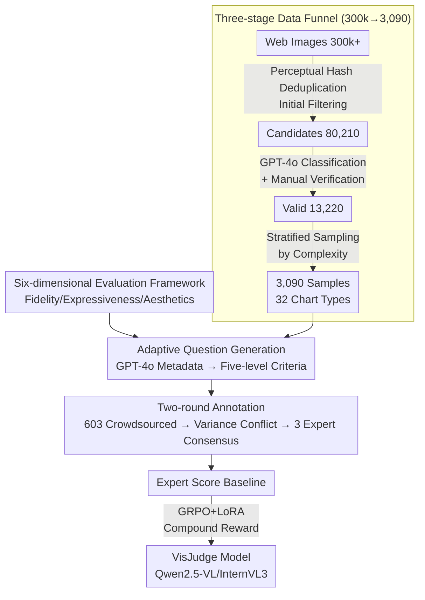

# VisJudge-Bench: Aesthetics and Quality Assessment of Visualizations

## Meta Information
- **Conference**: ICLR 2026
- **arXiv**: [2510.22373](https://arxiv.org/abs/2510.22373)
- **Code**: [GitHub](https://github.com/HKUSTDial/VisJudgeBench)
- **Area**: Multimodal Large Language Models / Visualization Quality Assessment
- **Keywords**: Visualization Evaluation, Aesthetic Quality, MLLM-as-a-Judge, Data Visualization, benchmark

## TL;DR

This paper proposes VisJudge-Bench, the first comprehensive benchmark for evaluating the aesthetics and quality of data visualizations (comprising 3,090 samples across 32 chart types). It further introduces the VisJudge model, which reduces MAE by 23.9% compared to GPT-5 and improves consistency with human experts by 60.5%.

## Background & Motivation

Data visualization is an effective way to transform complex data into intuitive insights. Its quality depends on three dimensions: **Fidelity** (whether data is accurately presented), **Expressiveness** (whether information is clearly communicated), and **Aesthetics** (whether the design is visually appealing). However, significant gaps exist in current research:

**Chart QA Benchmarks** (e.g., ChartQA, ChartInsights) focus only on understanding chart content without assessing design quality.

**Natural Image Aesthetic Benchmarks** (e.g., AVA, ArtiMuse) focus solely on artistic beauty, ignoring the core purpose of visualization—effective data communication.

**Visualization Evaluation Benchmarks** (e.g., VisEval) mainly evaluate the accuracy of NL2VIS generation rather than the intrinsic design quality of the visualization itself.

Consequently, there is a **lack of a systematic framework to measure the comprehensive capabilities of MLLMs in visualization aesthetics and quality assessment**. Even the state-of-the-art GPT-5 exhibits an MAE as high as 0.553 on this task, with a correlation of only 0.428 with human ratings.

## Method

### Overall Architecture

The paper aims to solve the problem of whether a machine can judge the quality of a visualization chart like a human—considering data accuracy, readability, and aesthetic appeal. It provides two core components: VisJudge-Bench, a benchmark of 3,090 expert-annotated samples, and VisJudge, a "judge" model trained on this data.

The pipeline follows the data flow: first, a six-dimensional framework (Fidelity, Expressiveness, Aesthetics) defines "good visualization" metrics; next, a multi-stage funnel filters 3,090 qualified visualizations from a large pool of web images. Five-level scoring criteria are adaptively generated based on chart types, leading to reliable scores via crowdsourcing and expert verification. Finally, a general MLLM is fine-tuned into a specialized evaluator using GRPO reinforcement learning.

### Key Designs

**1. Six-dimensional Evaluation Framework: Decomposing Abstract "Quality" into Scorable Dimensions**

The quality of a chart involves data accuracy, readability, and visual beauty. To standardize evaluation, the paper maps these to six observable dimensions: **Fidelity** checks if the visual faithfully reflects data (detecting improper axis settings, scale distortion, or truncated baselines); **Expressiveness** is divided into *Semantic Readability* (decoding visual elements) and *Insight Discovery* (revealing deep patterns, trends, or anomalies); **Aesthetics** is categorized into *Design Style* (uniqueness), *Visual Composition* (balance and order), and *Color Harmony* (balance between beauty and information). Each dimension is narrowed down to specific observation points, serving as a template for scoring questions.

**2. Three-stage Data Funnel: Refining 300k Images into 3,090 High-quality Samples**

Web-crawled images contain noise and duplicates. The paper uses a funnel to filter them: **Initial filtering** uses automated scripts and perceptual hashing to reduce 300k+ images to 80,210 candidates; **Validation** uses GPT-4o classification and manual checks to remove non-visualizations, resulting in 13,220 valid samples; **Stratified sampling** then selects 3,090 balanced samples—1,041 single charts, 1,024 composite charts, and 1,025 dashboards—covering 32 sub-types to ensure diversity and avoid bias.

**3. Adaptive Question Generation + Two-round Expert Annotation: Custom Criteria and Ground Truth**

To avoid irrelevant questions from generic templates and noise from crowdsourcing, GPT-4o extracts metadata (chart type, visual elements) to instantiate **customized scoring questions and five-level criteria**. For example, Fidelity scores range from "1 = Truncated axes or misleading scales" to "5 = Bar lengths strictly proportional to values." For annotation, 603 workers provided initial scores (3 people × 6 dimensions per sample). Conflicts identified by variance were then resolved by three visualization experts to establish a reliable baseline.

**4. GRPO Fine-tuning for Domain Judgment: Aligning MLLMs with Visualization Standards**

General MLLMs lack specialized visualization priors. The benchmark was split into 70%/10%/20% for training, validation, and testing. Using Qwen2.5-VL and InternVL3 as backbones, the model was fine-tuned via Group Relative Policy Optimization (GRPO) with LoRA ($5$ epochs, learning rate $1 \times 10^{-5}$). The compound reward includes an accuracy reward to minimize the error vs. human ground truth and a format reward to ensure structured output. This allows a 7B model to significantly outperform GPT-5.

## Key Experimental Results

### Main Results (MAE ↓)

| Model | Overall | Fidelity | Readability | Insight | Design | Composition | Color |
|------|---------|----------|-------------|---------|--------|-------------|-------|
| GPT-5 | 0.553 | 0.862 | 0.781 | 0.778 | 0.649 | 0.699 | 0.682 |
| GPT-4o | 0.610 | 0.988 | 0.806 | 0.744 | 0.609 | 0.695 | 0.657 |
| VisJudge (Qwen2.5-VL-7B) | **0.421** | **0.661** | **0.648** | **0.677** | **0.580** | **0.545** | **0.604** |

### Key Findings

1. **GPT-5 insufficiency**: Even the most powerful closed-source model has an MAE of 0.553 with a correlation of 0.428, indicating that general MLLMs do not automatically possess professional visualization assessment capabilities.
2. **VisJudge bridges the gap**: The best VisJudge model reduces MAE to 0.421 (↓23.9%) and increases correlation to 0.687 (↑60.5%).
3. **Open-source gap**: General open-source models usually exhibit MAE > 0.7, performing worst in Fidelity and Expressiveness.
4. **Aesthetics relative ease**: All models perform better in Aesthetics sub-dimensions than in Fidelity and Expressiveness.

### Ablation Study

- GRPO reinforcement learning significantly outperforms pure SFT training.
- Compound reward design (accuracy + format) is superior to single rewards.
- Models across different architectures and parameter scales benefit from fine-tuning, validating cross-architecture generalization.

## Highlights & Insights

- The first comprehensive benchmark for visualization aesthetics and quality, filling a critical research gap.
- The six-dimensional assessment framework is meticulously designed and comprehensive.
- High data quality with 3,090 expert-annotated samples covering 32 chart types.
- Effective GRPO fine-tuning enables small models to significantly surpass GPT-5.
- Identifies key weaknesses of current MLLMs in visualization assessment.

## Limitations & Future Work

- Assessment is based on the visual layer of fidelity; it lacks source data for true data-visual consistency verification.
- Samples primarily from web crawling may contain distributional bias.
- Fine-tuning was only explored on small-to-medium open-source models; larger models remain untested.
- Human expert annotation is inherently subjective, potentially introducing bias between annotators.

## Related Work & Insights

- **Visualization Recommendation**: Voyager, Draco (rule-driven); VizML, DeepEye (learning-driven).
- **NL2VIS Evaluation**: nvBench, MatPlotAgent — focus on code generation rather than design quality.
- **MLLM-as-a-Judge**: General aesthetics (AVA), chart understanding (ChartQA), and visualization evaluation (VisEval) have limitations.
- **Image Aesthetic Assessment**: AVA, ArtiMuse — target natural images, not applicable to visualizations.

## Rating

- **Novelty**: ⭐⭐⭐⭐ — First dedicated benchmark for visualization quality assessment.
- **Technical Depth**: ⭐⭐⭐⭐ — Comprehensive framework and rigorous annotation process.
- **Experimental Thoroughness**: ⭐⭐⭐⭐ — Systematic evaluation of 12 models with thorough ablations.
- **Value**: ⭐⭐⭐⭐ — Direct impact on the automated assessment of visualizations.

<!-- RELATED:START -->

## Related Papers

- [\[ICLR 2026\] WebDS: An End-to-End Benchmark for Web-based Data Science](webds_an_end-to-end_benchmark_for_web-based_data_science.md)
- [\[ICLR 2026\] Why Reinforcement Fine-Tuning Preserves Prior Knowledge Better: A Data Perspective](why_reinforcement_fine-tuning_enables_mllms_preserve_prior_knowledge_better_a_da.md)
- [\[AAAI 2026\] Plug-and-Play Clarifier: A Zero-Shot Multimodal Framework for Egocentric Intent Disambiguation](../../AAAI2026/multimodal_vlm/plug-and-play_clarifier_a_zero-shot_multimodal_framework_for_egocentric_intent_d.md)
- [\[AAAI 2026\] FT-NCFM: An Influence-Aware Data Distillation Framework for Efficient VLA Models](../../AAAI2026/multimodal_vlm/ft-ncfm_an_influence-aware_data_distillation_framework_for_efficient_vla_models.md)
- [\[AAAI 2026\] ReCAD: Reinforcement Learning Enhanced Parametric CAD Model Generation with Vision-Language Models](../../AAAI2026/multimodal_vlm/recad_reinforcement_learning_enhanced_parametric_cad_model_generation_with_visio.md)

<!-- RELATED:END -->
