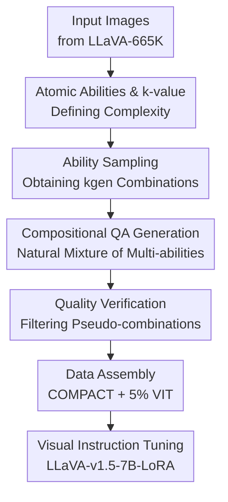

# Visual Compositional Tuning

**Conference**: ICLR 2026  
**OpenReview**: [https://openreview.net/forum?id=073WQjmWKU](https://openreview.net/forum?id=073WQjmWKU)  
**Paper**: [https://princetonvisualai.github.io/compact/](https://princetonvisualai.github.io/compact/)  
**Code**: Project page available; code not confirmed in cache  
**Area**: Multimodal VLM / Visual Instruction Tuning / Data-efficient training  
**Keywords**: Visual Compositional Tuning, Multimodal Large Language Models, Instruction Tuning, Data Synthesis, Compositional Generalization

## TL;DR
COMPACT transforms visual instruction tuning samples from "single-visual-ability QA" into "natural combinations of multiple atomic visual abilities," achieving or even slightly exceeding the average performance of full visual instruction tuning using only 10% of the LLaVA-665K data volume.

## Background & Motivation
**Background**: Visual Instruction Tuning (VIT) for Multimodal Large Language Models (MLLMs) has long followed the trajectory of "more data is better." LLaVA-665K has become a standard benchmark, while the Cambrian-10M and Eagle series have further scaled instruction data. Models indeed show performance gains in VQA, OCR, chart understanding, and spatial reasoning as the data scale increases.

**Limitations of Prior Work**: The issue lies in the fact that the information density of many samples in large-scale VIT datasets is not high. Numerous QA pairs only require the model to observe a single local attribute, such as "What color is the car?" or "What animal is in the image?" The model only needs a single ability, like object or color recognition, to provide the answer. While these samples help learn formats and basic visual alignment, they do not fully utilize the coexisting spatial relationships, actions, text, quantities, and scenes within a single image.

**Key Challenge**: Traditional scaling treats complexity as a byproduct of data size, hoping that enough complex combinations will naturally emerge from massive datasets. However, the true difficulty of visual reasoning often lies in binding multiple fundamental visual abilities together. For example, "What color is the object to the left of the car?" simultaneously requires identifying the car, locating the object to the left, and determining its color. If these compositional patterns are scarce in the training data, models tend to learn local shortcuts on complex benchmarks.

**Goal**: The authors aim to answer a specific question: Can we avoid blindly increasing the number of samples and instead improve the number of visual abilities invoked per sample, allowing the same image to contribute more training signals? Specifically, the paper needs to define "sample complexity," identify composable atomic visual abilities, and provide a recipe for automatically generating, filtering, and assembling training data.

**Key Insight**: Starting with the complexity distribution of questions in LLaVA-665K, the authors found that the average complexity is approximately $k=1.95$, with 77% of questions requiring two or fewer atomic visual abilities. Exploratory experiments further show that shifting the $k$-value of some questions to the right, while keeping the generation method constant, leads to better downstream performance. This suggests that "increasing sample complexity" itself may be an effective training signal, rather than just changing the generator or data source.

**Core Idea**: COMPACT uses a set of atomic visual abilities as building blocks. It first samples combinations of these abilities, then uses a VLM to generate concise QA pairs that must simultaneously employ these abilities. A validator is used to filter out pseudo-compositional samples, enabling higher-density visual compositional tuning with significantly less data.

## Method
### Overall Architecture
COMPACT (COMPositional Atomic-to-complex Visual Compositional Tuning) is essentially a visual instruction tuning data recipe rather than a new model architecture. It first defines 10 categories of atomic visual abilities and represents the number of required ability categories as $k$. It then samples several ability combinations for each image, generates QA pairs that naturally fuse these abilities, filters low-quality or mismatched questions, and finally mixes the synthesized compositional tuning data with a small amount of original LLaVA-665K instruction data to fine-tune LLaVA-v1.5-7B-LoRA.

The workflow clearly divides roles: COMPACT synthesized data forces the model to learn "comprehensive observation and accurate compositional" visual reasoning, while a 5% subset of the original VIT data is responsible for maintaining the response formats (e.g., multiple-choice, short answer, long answer) required by benchmarks. This prevents complex synthesized QA pairs from having to handle both visual ability learning and format alignment simultaneously.

### Key Designs
**1. Atomic Abilities and $k$-value: Turning "Complex Visual Problems" into Controllable Variables**

The first step of COMPACT is to decompose visual reasoning into composable atomic visual abilities. The paper defines 10 categories divided into three groups: Attributes (color and shape), Recognition (object, action, text, counting, and spatial recognition), and Relations (spatial relations, object interaction, and scene understanding). The set of atomic abilities required for a question is denoted as $\{c_1, \ldots, c_k\}$, effectively making the complexity $k$—the number of abilities that must be invoked simultaneously to answer the question.

The value of this definition is that it transforms the vague concept of "harder questions" into a training variable that can be sampled, statistically analyzed, and ablated. For instance, "What color is the car?" is roughly object recognition plus color ($k=2$), while "What color is the object on the car's left?" further requires understanding spatial relations ($k=3$). The authors do not claim these 10 categories cover all multimodal tasks, nor that they are perfectly orthogonal, but for a data recipe, the key is the ability to stably generate training samples that require integrating more image information.

**2. Ability Sampling: Controlling the Density of Mined Visual Information per Image via $k_{gen}$**

During the generation phase, COMPACT randomly draws images from LLaVA-665K and uniformly samples $k_{gen} \in \{1,2,3\}$ abilities from the 10 categories for each image. Here, $k_{gen}$ is not the final question complexity but the lower bound specified during question generation. Since the generator may implicitly introduce object recognition, and attributes like spatial relations or scene understanding often co-occur naturally, the final $k$ often satisfies $k_{gen} \le k$.

To avoid asking similar questions repeatedly for the same image, the sampling process prioritizes unused abilities for that image and discards duplicate combinations. This is crucial: COMPACT does not simply apply a single complex prompt to all images but generates multiple training signals around different combinations of visual abilities for each image. For an information-rich image, it might generate a question combining color + spatial relations + object recognition, and another involving text recognition + scene understanding, thereby allowing the model to learn various binding strategies on the same visual content.

**3. Compositional QA Generation: Natural Fusion of Abilities**

COMPACT utilizes Gemini-2.0-Flash to generate a single round of QA. It requires that the question must depend on the image, the answer must be concise, and the question must naturally integrate the sampled abilities without mechanically concatenating single-ability questions using "and" or commas. This constraint directly addresses the core pain point: training samples should force the model to perform multi-ability binding rather than answering multiple unrelated sub-questions within one sample.

For example, a poor question would be "What color is the car, and where is it?", which is merely two parallel sub-questions. A more COMPACT-compliant question would be "What color is the car parked next to the red brick building?", where the model must first locate the building, identify the adjacent vehicle, and then recognize its color. The authors also require questions to ask about clearly identifiable content that definitely exists in the image, avoiding subjective questions like "What might this person be thinking." This ensures synthetic samples act as visual supervision rather than linguistic imagination.

**4. Quality Verification and Data Assembly: Filtering Pseudo-combinations while Delegating Format Learning**

Generators do not always truly use all specified abilities. Therefore, COMPACT uses Gemini again for verification: it judges whether the generated question truly requires the $k_{gen}$ specified abilities, filtering samples with confidence below 70%, uninformative answers (e.g., "unknown," "not visible," "yes/no"), word overlap exceeding 60% with existing questions for the same image, or mismatched ability requirements. Analysis of failure modes in the appendix shows that multi-stage filtering rejects approximately 21% of generated questions. Ability mismatch is particularly common in high-$k$ questions, indicating that verification is not just a formal cleaning step but a necessary measure to prevent "seemingly complex but actually single-ability" pseudo-compositional samples from entering training.

The final data assembly is also restrained: COMPACT uses 32K synthetic compositional tuning samples mixed with 5% of LLaVA-665K (roughly 33K original VIT samples), totaling 65K. The original VIT subset handles response format adaptation for various benchmarks, while the synthetic data focuses on visual ability composition. Ablations show that performance improves significantly with the inclusion of a small amount of VIT data and stabilizes around 5%; increasing it to 7% leads to diminishing returns. This supports the authors' judgment that format alignment and visual compositional learning can be handled by a division of labor.

### Loss & Training
The paper does not propose a new training loss, instead following the LoRA visual instruction tuning setup of LLaVA-v1.5. They train a pre-VIT LLaVA-v1.5-7B-LoRA checkpoint for 1 epoch. The primary variable is the training data recipe: the default COMPACT consists of 32K compositional tuning data and a 5% LLaVA-665K VIT subset, totaling approximately 65K samples.

The training strategy can be summarized as: using the small original VIT subset to learn answer formats and using COMPACT synthetic QA to increase visual information density. Scaling experiments showed that as synthetic compositional data increased from 2K to 32K, the performance curve of COMPACT remained consistently above that of random VIT subsets of equal size, particularly on benchmarks like SeedBench2Plus and MM-Vet which rely heavily on compositional visual abilities.

## Key Experimental Results

### Main Results
The main experiments for COMPACT use LLaVA-v1.5-7B-LoRA, comparing full LLaVA-665K, random subsets, multiple data pruning methods, and COMPACT under identical training configurations. The core conclusion is: with only 65K samples, COMPACT achieves 100.18% of the relative average performance of the full 665K VIT. Compared to ICONS' 97.47% and the random subset's 95.38%, this demonstrates that COMPACT's success isn't just about training with less data, but specifically about the higher information density of its synthetic samples.

| Recipe | #Data | InfoVQA | TextVQA | MM-Vet | MMStar | LLaVA-W | Rel. Perf. |
|--------|-------|---------|---------|--------|--------|---------|------------|
| LLaVA-665K | 665K | 20.80 | 46.99 | 29.22 | 35.11 | 68.50 | 100.00% |
| Random | 65K | 20.05 | 42.88 | 30.46 | 34.13 | 64.30 | 95.38% |
| ICONS | 65K | 21.00 | 43.12 | 31.23 | 35.96 | 61.80 | 97.47% |
| COMPACT | 65K | 23.68 | 44.37 | 31.74 | 36.13 | 64.50 | 100.18% |

Notably, COMPACT does not simply dominate the full LLaVA-665K across all tasks. It is slightly lower on TextVQA and LLaVA-W but stronger on InfoVQA, MM-Vet, and MMStar—tasks that demand more image-text integration, spatial reasoning, or instance-level reasoning. This is consistent with the paper's explanation that "compositional abilities are better suited for complex visual tasks."

### Ablation Study
The authors conducted multiple ablations to decompose the sources of gain: one group controlled the ability and $k$-value distributions, showing that high complexity indeed contributes to gains; another varied the $k_{gen}$ range, proving that a distribution mixed with simple to complex samples is better when high-complexity samples are insufficient; and another varied the original VIT mix ratio, highlighting the necessity of a small amount of format-aligned data.

| Configuration | Data Size | Key Metric | Description |
|---------------|-----------|------------|-------------|
| Random | 49K | 96.28% Rel. | Random LLaVA-665K subset of equal size |
| COMPACTllava | 49K | 97.55% Rel. | Same generator, but abilities/k-distribution match LLaVA |
| COMPACT | 49K | 98.83% Rel. | Using higher k compositional tuning data |
| COMPACT (Qwen3 generator) | 65K | 98.31% Rel. | Replaced with Qwen3-VL-4B-Instruct; still superior to 65K baselines |

The ability-specific ablation is also informative. Removing "scene understanding" dropped relative performance by 5.2%, "spatial relationship" by 4.9%, "text recognition" by 4.7%, and "object recognition" by 4.0%; "shape" had the smallest impact at 0.7%. This indicates that the gains from COMPACT do not come from a single label but from various combinations of visual abilities providing training signals, with scene, spatial, text, and object grounding being particularly vital.

### Key Findings
- COMPACT's 65K data achieves 100.18% relative performance compared to the full 665K data (100.00%), suggesting that increasing sample complexity can offset a 90% deficit in data volume given a fixed model and training setup.
- High-$k$ training data is more beneficial for high-$k$ test questions. On MMStar, $k_{gen}=1,2,3$ improved performance on $k=3$ questions by 22.7% and $k=4$ questions by 33.5% compared to $k_{gen}=1$, while decreasing $k=1$ performance by 0.5%. This suggests that while complex samples are vital, simple samples are still needed to help decompose basic abilities.
- Gains on knowledge-intensive tasks are limited. In OK-VQA, MMMU, and MMMU-Pro, COMPACT showed slight improvements over random subsets but remained significantly behind or close to full VIT. This implies that the method primarily improves vision-centric ability composition and does not directly solve external knowledge, mathematics, or specialized reasoning.
- COMPACT is more token-efficient: In a 32K sample comparison, COMPACT uses ~104.87 tokens per sample vs ~197.42 for LLaVA, a reduction of 46.88%. The average answer length is only 1.70 tokens, showing the model concentrates on training visual binding through short QA rather than stacking supervision via long text outputs.

## Highlights & Insights
- Shifts the VIT data quality problem from "which samples to select" to "how many visual abilities are needed per sample." This perspective clearly explains why simple questions waste image information and provide a controllable knob for data synthesis.
- While the $k$-value is a coarse metric, it is sufficiently operational. Instead of seeking a perfect cognitive complexity index, it serves as a practical tool for sampling, generation, verification, and ablation.
- The key to COMPACT is not just generating complex questions but preventing "pseudo-complexity." Explicitly filtering parallel concatenations, uninformative answers, and ability mismatches makes compositional tuning feel like effective supervision rather than prompt engineering noise.
- The "original VIT for format, COMPACT for visual composition" approach is a transferable data recipe. Other VLM training setups could separate format alignment, domain knowledge, and visual composition into different data sources rather than making one mega-mixed dataset handle all objectives.
- The results serve as a caution for the current multimodal data expansion route: if a benchmark requires compositions of space, text, counting, and relations, continuing to add low-$k$ samples may yield very low marginal returns. A better direction is ensuring single samples cover more image content.

## Limitations & Future Work
- The primary generator, Gemini-2.0-Flash, is a closed-source model. Though Qwen3-VL-4B-Instruct experiments still showed 98.31% relative performance, the generator's ability and bias inevitably affect final training data quality.
- Data generation costs are non-zero. The appendix mentions that generating 32K compositional tuning data took about 2 hours with 32 parallel processes, costing about $86.50 in API fees, which remains a barrier for large-scale replication or frequent taxonomy iterations.
- The atomic ability taxonomy only covers vision-centric tasks, excluding cultural knowledge, historical common sense, math, and code. Consequently, COMPACT's improvement on knowledge-dense benchmarks is limited and it cannot directly replace broader multimodal post-training data.
- The $k$-value treats the "number of abilities" as complexity but does not characterize the difficulty differences between abilities. A combination of text recognition + spatial relations might be much harder than color + object recognition despite both having $k=2$. Future work could incorporate ability weights and image/linguistic complexity into sampling.
- Validation may still leak errors. The appendix admits residual failures include high-$k$ questions being too difficult, VLMs misidentifying image content, spatial ambiguity, and invisible attributes of occluded objects, which introduce noise into training.

## Related Work & Insights
- **vs. LLaVA Visual Instruction Tuning**: LLaVA-665K relies on massive human or model-generated instructions to train general instruction-following. Ours reserves a small amount of LLaVA data for format alignment and concentrates new data on atomic ability composition. The advantage is data efficiency; the disadvantage is continued reliance on LLaVA image sources and frameworks.
- **vs. Data Selection Methods (e.g., ICONS)**: Methods like ICONS, EL2N, and SemDeDup select high-value subsets from existing VIT data. COMPACT regenerates more complex QA instead. While selection saves generation costs, COMPACT actively alters the complexity distribution, outperforming ICONS (100.18% vs 97.47% relative average).
- **vs. Compositional Evaluation Benchmarks**: Work like MMStar and MM-Vet emphasizes evaluating compositional abilities. COMPACT moves compositionality from the evaluation end to the training data construction end. This transition is inspiring: if evaluation reveals compositional weaknesses, training data should explicitly cover those patterns.
- **vs. Large-scale VIT Expansion**: Routes like Cambrian and Eagle emphasize covering more abilities with more data. COMPACT proves that for vision-centric tasks, "making single samples more complex" can replace "making the sample count larger." These routes are not mutually exclusive and could be combined in the future.

## Rating
- Novelty: ⭐⭐⭐⭐☆ Using atomic visual abilities and $k$-values to control VIT sample complexity is a direct yet powerful way to address the key variable of data efficiency.
- Experimental Thoroughness: ⭐⭐⭐⭐☆ Covers main experiments, distribution control, $k_{gen}$ effects, VIT mixing ratios, ability ablations, and failure modes, though larger models and more data sources would be a welcome addition.
- Writing Quality: ⭐⭐⭐⭐⭐ The narrative is very clear, moving logically from complexity observations to the data recipe and ablation verification.
- Value: ⭐⭐⭐⭐⭐ Highly practical for VLM post-training data construction, especially for guiding "low-volume, high-density" visual instruction tuning workflows.

<!-- RELATED:START -->

## Related Papers

- [\[NeurIPS 2025\] Visual Instruction Bottleneck Tuning](../../NeurIPS2025/multimodal_vlm/visual_instruction_bottleneck_tuning.md)
- [\[ICLR 2026\] Revisit Visual Prompt Tuning: The Expressiveness of Prompt Experts](revisit_visual_prompt_tuning_the_expressiveness_of_prompt_experts.md)
- [\[NeurIPS 2025\] Advancing Compositional Awareness in CLIP with Efficient Fine-Tuning](../../NeurIPS2025/multimodal_vlm/advancing_compositional_awareness_in_clip_with_efficient_fin.md)
- [\[ICLR 2026\] CoMem: Compositional Concept-Graph Memory for Vision-Language Adaptation](comem_compositional_concept-graph_memory_for_visionlanguage_adaptation.md)
- [\[CVPR 2026\] LLaDA-V: Large Language Diffusion Models with Visual Instruction Tuning](../../CVPR2026/multimodal_vlm/llada-v_large_language_diffusion_models_with_visual_instruction_tuning.md)

<!-- RELATED:END -->
