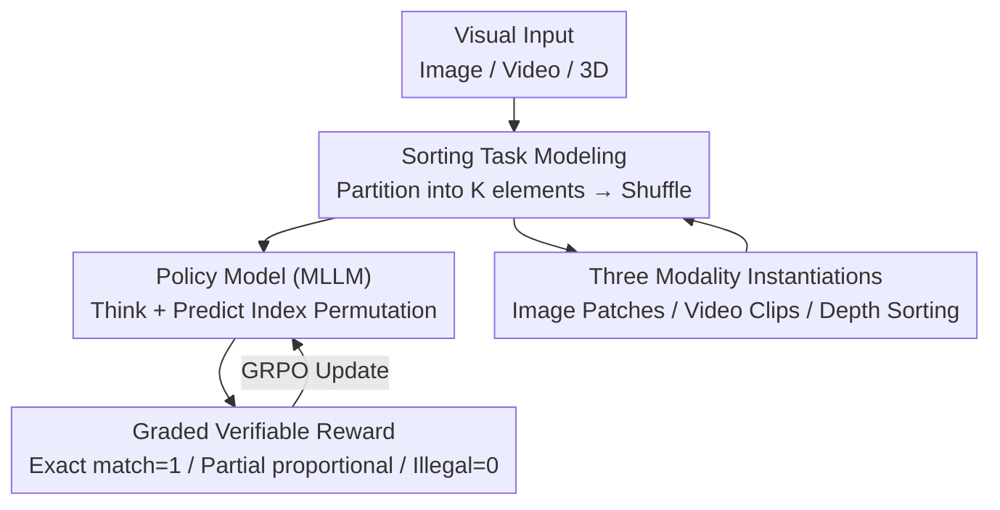

# Visual Jigsaw Post-Training Improves MLLMs

**Conference**: ICLR 2026  
**OpenReview**: [https://openreview.net/forum?id=tBf2SUzfZw](https://openreview.net/forum?id=tBf2SUzfZw)  
**Project**: [Project Page](https://penghao-wu.github.io/visual_jigsaw/)  
**Code**: See Project Page  
**Area**: Multimodal VLM  
**Keywords**: Self-supervised post-training, RLVR, Jigsaw tasks, Visual perception, MLLM

## TL;DR
The classic "shuffle and sort" jigsaw task is integrated into the reinforcement learning post-training phase of MLLMs. Without changing the architecture, adding generation modules, or requiring any human annotation, this self-supervised verifiable reward approach significantly enhances fine-grained perception, temporal understanding, and spatial reasoning across image, video, and 3D modalities.

## Background & Motivation
**Background**: After RLVR (Reinforcement Learning from Verifiable Rewards) ignited complex reasoning capabilities in LLMs, the multimodal community quickly applied this paradigm to MLLMs. Most existing works focus on text-based Multimodal Chain-of-Thought (CoT), targeting long-reasoning tasks like mathematics and science.

**Limitations of Prior Work**: In this "text-centric" post-training, dense visual input often serves merely as a pool of evidence. Models extract a few sparse clues and pivot to textual reasoning, while the deep, fine-grained understanding of visual signals is severely underestimated. A few works attempting to address this (e.g., explicitly adding visual reconstruction targets) require grafting extra visual generation modules and pixel-level reconstruction losses onto existing understanding-oriented MLLMs, which alters the architecture and may not be the optimal path for enhancing comprehension.

**Key Challenge**: Can visual signal understanding be strengthened directly without changing the architecture, modifying output formats (still text-only), or introducing generative components? High-fidelity requirements of pixel-level reconstruction might be an excessive burden for a model aimed at "understanding."

**Goal**: Identify a lightweight, automatically verifiable, visual-centric post-training task that is seamlessly compatible with existing text-only MLLMs and universally applicable across modalities.

**Key Insight**: Looking back at the history of self-supervised representation learning, jigsaw tasks (restoring shuffled patches or video frames) are "simplified versions of reconstruction/generation tasks." They only require restoring **structural order** rather than pixels. This naturally produces deterministic ground-truth, perfectly fitting the RLVR verifiable reward paradigm without needing human labels.

**Core Idea**: Reformulate visual understanding as a "sorting problem." Visual input is partitioned and shuffled; the MLLM must output the correct permutation in natural language. This is optimized using GRPO during post-training to inject visual-centric perception into the model.

## Method

### Overall Architecture
Visual Jigsaw is a universal self-supervised post-training framework for "visual sorting." Given a visual modality (Image / Video / 3D), modality-specific rules partition it into $K$ jigsaw elements (image patches, video clips, or depth-sampled points). These are shuffled and fed to the policy model. The model must predict a sequence of $K$ indices to restore the original structural order. This permutation is compared against the deterministic ground-truth to provide a graded reward based on the number of correctly placed elements, which guides the RL update via GRPO. The process requires no labels, no extra generation heads, and maintains pure text output, making it applicable to any off-the-shelf MLLM.

**Why Post-training?** Solving jigsaws requires basic visual understanding (otherwise, the model cannot recognize patch content). Furthermore, RL offers stronger generalization than SFT, allowing the model to transfer visual skills learned from jigsaws to downstream tasks rather than merely memorizing the jigsaw patterns.

### Key Designs

**1. Reformulating Visual Understanding as Verifiable Sorting: RLVR-Friendly and Zero-Label**

To address the key challenge of strengthening perception without architecture changes or annotations, the task is modeled as sorting. A random permutation $\pi:\{1,\dots,K\}\to\{1,\dots,K\}$ is applied to the data. Elements originally at position $i$ move to $\pi(i)$, resulting in a shuffled sequence $P_\pi=[p_{\pi^{-1}(1)},\dots,p_{\pi^{-1}(K)}]$. The model aims to predict $[\pi(1),\dots,\pi(K)]$ to restore it. This offers three benefits: the ground-truth is a deterministic index sequence that is **automatically verifiable** for RLVR; the output is **pure text**, maintaining compatibility; and supervision is derived from the data itself with **no manual labels**. Compared to generative reconstruction, sorting only requires structural recovery, serving as a "simplified" yet effective self-supervised signal.

**2. Graded Partial Correctness Reward: Enabling Learning of Difficult Jigsaws**

Binary rewards (scoring only for exact matches) lead to extremely sparse feedback in difficult configurations like $3\times3$ jigsaws, causing the model to fail to converge in early training. A graded reward is designed: 1 for an exact match; for valid but partially correct permutations, the reward is the "proportion of correct placements" multiplied by a discount factor $\gamma\in(0,1)$ (set to $0.2$ in experiments); and 0 for any invalid output (e.g., repeating the same index). Formally:

$$
\text{Reward}(o,g)=\begin{cases}1, & o=g\\[2pt]\gamma\cdot\frac{1}{K}\sum_{i=1}^{K}\mathbb{1}[o_i=g_i], & \text{Valid permutation and }o\neq g\\[2pt]0, & \text{Otherwise}\end{cases}
$$

The discount $\gamma$ penalizes "incomplete solutions" to prevent overestimating partial matches while preserving weak learning signals. A score of 0 for invalid permutations prevents "reward hacking" (e.g., filling all slots with the same number). Additionally, a $0.2$ format reward is added for using `<think></think>` and `<answer></answer>` tags. Ablations show that without the partial reward, the model fails to learn $3\times3$ configurations.

**3. Three-Modality Instantiation: A Unified Paradigm for Image, Video, and 3D**

To prove universality, the paradigm is applied to three modalities with specialized partitioning:
- **Image Jigsaw**: Images are split into $m\times n$ non-overlapping patches ($3\times3=9$, trained on 118k COCO images). The model restores the raster order (left-to-right, top-to-bottom), forcing it to focus on local details and global spatial layout.
- **Video Jigsaw**: Sorted along the temporal axis into $K=6$ clips (100k LLaVA-Video samples). To prevent "shortcut learning" via frame matching at boundaries, 5% of frames are cropped from the start and end of each clip.
- **3D Jigsaw**: Since general MLLMs process 3D via 2D views, a practical variant is used: $K=6$ points with varied depths are sampled from RGB-D images (300k ScanNet samples, depth range 0.1–10m, distance $\ge$40px, depth difference $>0.2$m). Points are labeled in the RGB view, and the model sorts them by depth (near-to-far).

### Loss & Training
The base model is Qwen2.5-VL-7B-Instruct. GRPO is used **without KL regularization or entropy loss** for pure jigsaw training; $\gamma=0.2$. Global batch size is 256 for images and 128 for video/3D. Learning rate is $1\times10^{-6}$, with 16 samples per prompt and temperature 1.0. (Note: KL constraints are **enabled** when training on reasoning-focused MLLMs to preserve existing capabilities.)

## Key Experimental Results

### Main Results
Using Qwen2.5-VL-7B as a base, the method is compared against other post-training variants. Image Jigsaws show consistent gains across 13 benchmarks covering fine-grained perception, spatial reasoning, and compositional understanding:

| Modality / Benchmark | Metric | Base Qwen2.5-VL-7B | Ours | Gain |
|--------|------|------|------|------|
| Image · MMVP | acc | 54.66 | 60.66 | +6.00 |
| Image · MMStar (Fine-grained) | acc | 59.75 | 65.81 | +6.06 |
| Image · V* | acc | 76.96 | 80.63 | +3.66 |
| Image · DA-2K | acc | 54.45 | 60.35 | +5.90 |
| Video · AoTBench (vqa, 16f) | acc | 45.52 | 51.67 | +6.15 |
| Video · Vinoground (64f) | group | 21.80 | 25.20 | +3.40 |
| 3D · SAT-Real | acc | 48.66 | 64.00 | +15.34 |
| 3D · DA-2K | acc | 54.45 | 71.56 | +17.11 |

The 3D Jigsaw shows the largest gain in depth-related tasks (DA-2K, +17.11) but also improves indirect tasks like single-view (3DSRBench), multi-view (ViewSpatial), and first-person video (VSI-Bench), suggesting the learning of generalized 3D spatial perception.

### Ablation Study

| Configuration | Key Metric | Description |
|------|---------|------|
| Image Jigsaw (RL, Full) | Consistent gains | Full method |
| Image Jigsaw (SFT) | Minor gains; drop in Grounding | SFT tends to overfit/fail to transfer |
| 2×2 Image Jigsaw | Avg 61.0 (Base 58.9) | Low difficulty; smaller gain |
| 3×3 Image Jigsaw | Avg 62.1 | Standard difficulty; maximum gain |
| 4-clip Video Jigsaw | Avg 45.0 (Base 44.0) | Low difficulty; smaller gain |
| 6-clip Video Jigsaw | Avg 46.2 | Standard difficulty; maximum gain |
| 3×3 without partial reward | Fails to learn | Sparse binary feedback prevents cold-start |

### Key Findings
- **RL Outperforms SFT**: SFT yields moderate gains but significant drops in LISA-Grounding and OVD-Eval, suggesting it memorizes jigsaws without transferring skills. RL successfully generalizes visual skills to downstream tasks.
- **Higher Difficulty, Stronger Signal**: $2\times2$ or 4-clip jigsaws provide gains, but $3\times3$ and 6-clip provide stronger supervision.
- **Complexity Ceiling**: The model fails at $4\times4$ image jigsaws due to low semantic content per patch, ambiguity in uniform areas (e.g., sky), and combinatorial explosion ($16!$ vs $9!$).
- **Cross-Model and Reasoning Preservation**: Gains are consistent when using MiMo-VL-7B-SFT as a base. When applied to reasoning-heavy ThinkLite-VL (with KL constraints), visual perception improves while mathematical reasoning capabilities are maintained.

## Highlights & Insights
- **"Sorting" as an Underestimated Self-Supervised Goldmine**: Jigsaws were sidelined in traditional representation learning by contrastive or masked modeling. The authors realized that "deterministic ground-truth + text-only output" is exactly what MLLM post-training in the RLVR era needs.
- **Task Design over New Modules**: Perception is enhanced solely by how supervision signals are constructed, without adding generation heads or changing formats. This lowers implementation barriers significantly.
- **Graded Rewards as a Critical Switch**: Switching from binary "all-or-nothing" rewards to proportional scoring is the watershed for learning complex $3\times3$ tasks, highlighting the importance of reward densification in RLVR for hard tasks.
- **Robust Shortcut Prevention**: Techniques like cropping video clip edges and enforcing depth/distance thresholds for 3D points ensure the model learns true visual understanding rather than exploiting dataset artifacts.

## Limitations & Future Work
- **Difficulty Scalability**: $4\times4$ images and 8-clip videos are too difficult given current training data resolutions/lengths. Breakthroughs may require curriculum learning or higher-resolution data.
- **2D Proxy for 3D**: 3D jigsaws are currently implemented via depth sorting on RGB-D, rather than native 3D representations like voxels or point clouds.
- **Perception vs. Reasoning**: The tasks primarily strengthen visual-centric perception rather than logical long-chain reasoning.
- **Future Directions**: Introducing curriculum learning, adaptive segmenting for long videos, and exploring native 3D partitioning.

## Related Work & Insights
- **vs. Jigsaw-R1**: While also using jigsaws, Jigsaw-R1 struggled with $2\times2$ and simplified the task to pairwise relative position. This work masters $3\times3$ and extends to video and 3D.
- **vs. Visual Reconstruction Post-training**: Methods using explicit reconstruction provide gains but require architectural changes and joint training. This work is pure post-training and cross-modal.
- **vs. Vision-Language Critics**: Those rely on detecting caption errors; this work derives signals directly from the structural understanding of the visual signal itself.

## Rating
- Novelty: ⭐⭐⭐⭐ Re-purposing jigsaw tasks for RLVR is a clever "old task, new framework" approach.
- Experimental Thoroughness: ⭐⭐⭐⭐⭐ 30+ benchmarks across three modalities, comprehensive ablations, and honest analysis of failure cases.
- Writing Quality: ⭐⭐⭐⭐⭐ Clear motivation, rigorous task formalization, and transparent reward definitions.
- Value: ⭐⭐⭐⭐⭐ Zero-label, architecture-agnostic, and low barrier to entry with stable gains.

<!-- RELATED:START -->

## Related Papers

- [\[ICLR 2026\] Reconstruction Alignment Improves Unified Multimodal Models](reconstruction_alignment_improves_unified_multimodal_models.md)
- [\[ICML 2026\] Med-Scout: Curing MLLMs' Geometric Blindness in Medical Perception via Geometry-Aware RL Post-Training](../../ICML2026/multimodal_vlm/med-scout_curing_mllms_geometric_blindness_in_medical_perception_via_geometry-aw.md)
- [\[ICLR 2026\] Post-hoc Probabilistic Vision-Language Models](post-hoc_probabilistic_vision-language_models.md)
- [\[AAAI 2026\] Revisiting the Data Sampling in Multimodal Post-training from a Difficulty-Distinguish View](../../AAAI2026/multimodal_vlm/revisiting_the_data_sampling_in_multimodal_post-training_from_a_difficulty-disti.md)
- [\[ICLR 2026\] OmniVideoBench: Towards Audio-Visual Understanding Evaluation for Omni MLLMs](omnivideobench_towards_audio-visual_understanding_evaluation_for_omni_mllms.md)

<!-- RELATED:END -->
