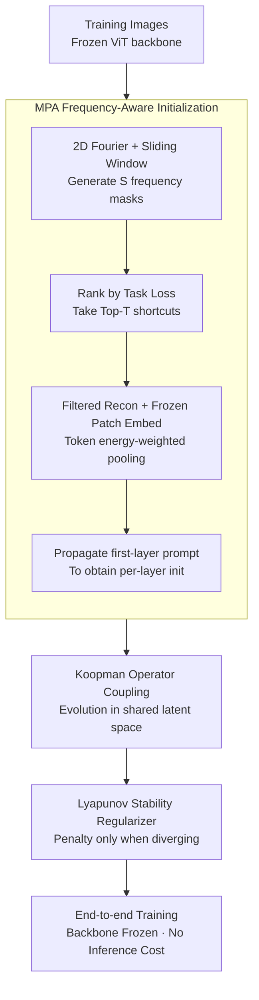

# Visual Prompt-Agnostic Evolution

**Conference**: ICLR2026  
**arXiv**: [2601.20232](https://arxiv.org/abs/2601.20232)  
**Code**: [reeive/PAE](https://github.com/reeive/PAE)  
**Area**: Multimodal VLM  
**Keywords**: Visual Prompt Tuning, Vision Transformer, Parameter-Efficient Fine-Tuning, Koopman Operator, Frequency Domain Initialization, Lyapunov Stability  

## TL;DR
The authors propose Prompt-Agnostic Evolution (PAE), which accelerates VPT convergence (average 1.41× speedup) and improves accuracy by 1–3% across 25 datasets through frequency-aware task initialization (MPA) and cross-layer prompt correlation via the Koopman-Lyapunov discrete dynamical system (KLD). It is plug-and-play for various VPT variants with zero inference overhead.

## Background & Motivation
1.  **Success and Limitations of VPT**: Visual Prompt Tuning (VPT) adapts to downstream tasks by inserting a small number of learnable prompt tokens into each layer of a frozen ViT. While parameter-efficient, it suffers from slow convergence and suboptimal accuracy in practice.
2.  **Gradient Oscillation**: Experiments reveal significant gradient oscillation in various VPT variants during training, particularly severe in the early and middle stages.
3.  **Cross-layer Mismatch**: Layer-wise gradient analysis shows that prompts in shallow layers experience a gradient surge early in training before quickly stagnating, while prompts in deep layers exhibit high-variance oscillation, leading to poorly coordinated optimization across layers.
4.  **Task-Agnostic Initialization**: Existing VPT initialization strategies are insensitive to downstream tasks. Consequently, early gradients are wasted on aligning with the pre-trained backbone, and higher learning rates required for adaptation exacerbate instability.
5.  **Independent Layer Optimization**: Prompts for each layer are pre-placed and optimized independently. Gradients must backpropagate through multiple frozen layers, causing shallow signals to decay and deep layers to be over-adjusted, lacking explicit cross-layer coordination.
6.  **Unresolved Fundamental Issues**: While numerous variants (structured, adaptive, projective, or perception-driven prompts) have emerged, none fundamentally address these training dynamic issues.

## Method

### Overall Architecture
PAE decomposes the problem of "how to train VPT quickly and stably" into two complementary tasks corresponding to the pre-training and in-training phases. Before training starts, the MPA (Modal Pre-Alignment) module performs frequency-aware task initialization: it searches for the "frequency shortcuts" the backbone relies on most within the training set, encodes them into the first-layer prompts, and propagates them layer-by-layer to achieve hierarchical semantic alignment with the backbone. This ensures gradients are cast in task-relevant directions from the start. During training, the KLD (Koopman-Lyapunov Discrete dynamical system) module couples the independently optimized prompts into a cross-layer evolution trajectory using a globally shared Koopman operator, adding a Lyapunov stability regularizer to suppress error accumulation. This workflow does not modify the frozen backbone or the prompt structure/inference path, making MPA and KLD orthogonal to specific prompt designs and compatible with variants like VPT, E2VPT, VFPT, SA2VP, and BPT.

### Key Designs

**1. MPA Frequency-Aware Initialization: Direct Targeting of Task-Dependent Frequency Shortcuts**

Existing VPT initialization is task-agnostic, wasting early gradients on backbone alignment. MPA frames initialization as a task-aware frequency search, leveraging the insight that pre-trained visual backbones rely on specific "frequency shortcuts" for correct predictions. It applies a 2D Fourier Transform to training batches using a sliding window ($w=16, \text{stride}=8$) to generate $S$ binary frequency masks $M_s$. These are applied to the spectrum, and the images are reconstructed via inverse transform. By ranking tasks losses $\mathcal{L}_{\text{task},s}$ on the frozen model, the most critical frequency regions are identified. The Top-$T$ masks with the lowest loss are selected as frequency shortcuts. The corresponding filtered images are passed through the frozen patch embedding to obtain patch tokens, which are then aggregated into $T$ representative vectors for the first-layer prompt $P_1^{init}$ using energy-weighted pooling (based on activation norms).

Crucially, instead of searching every layer, $P_1^{init}$ is fed through the frozen encoder blocks to use the output of each layer as its corresponding initialization $P_i^{init}$. This ensures the initialization trajectory is naturally consistent with the backbone's hierarchical semantics. Ablation studies confirm this: simply copying the first-layer prompt across all layers yields 73.17%, independent layer searching yields 74.29%, while the propagation method reaches 74.84%. The initialization takes only ~74 seconds (roughly 5.3 epochs) but directs early gradients toward task-relevant directions immediately.

**2. KLD via Koopman Operator: Transforming Independent Optimization into a Cross-Layer Trajectory**

Layer-wise gradient analysis indicates that shallow prompts stagnate while deep prompts oscillate due to independent optimization across frozen layers. KLD reformulates "layer-wise prompt changes" as a discrete dynamical system. It introduces a globally learnable projection matrix $U\in\mathbb{R}^{d\times K}$ to lift each layer's prompt into a shared latent space $z_i = P_i\,U$. A globally shared Koopman operator $\mathcal{K}\in\mathbb{R}^{K\times K}$ (initialized as an identity matrix) performs linear evolution in this space: $\hat{z}_{i+1} = z_i\,\mathcal{K}$, predicting the next layer's state from the previous one.

A consistency loss $\mathcal{L}_{kp}$ minimizes the Frobenius norm difference between the predicted state $\hat{z}_{i+1}$ and the actual projected state $z_{i+1}$. This couples the once-isolated layer optimizations into a smooth trajectory. A global operator is used because layer-specific operators exhibited divergence in experiments (spectral radius $\rho > 3$), whereas the global operator's eigenvalues concentrate on the positive real axis with $\rho(\mathcal{K}) < 1$. CKA visualization shows clear diagonal structures, indicating that prompts differentiate progressively with depth rather than being entangled in global redundancy. The optimal latent dimension is $K=256$, introducing minimal parameters.

**3. Lyapunov Stability Regularizer: Adaptive Inhibition of Error Accumulation**

Linear Koopman approximations are imperfect, and errors can amplify across layers. KLD adds a conditional regularizer based on Lyapunov stability theory. It defines Lyapunov energy as $V(z) = \mathrm{tr}(z\,Q\,z^\top)$, where $Q$ is a learnable symmetric positive definite matrix. "Stable evolution" is characterized as non-increasing energy across layers ($V(z_{i+1}) \le V(z_i)$). $\mathcal{L}_{stab}$ only penalizes when the $V$ value increases (divergence). This acts as adaptive damping for the cross-layer prompt trajectory, suppressing gradient oscillation within a stable range without over-constraining beneficial layer-wise variations. Combined with $\mathcal{L}_{kp}$, it provides an additional +1.29% gain on VTAB.

### Loss & Training
The system uses end-to-end joint optimization of the task loss and two regularizers: $L_{total} = L_{task} + \alpha\,\mathcal{L}_{kp} + \beta\,\mathcal{L}_{stab}$, with default values $\alpha=0.5, \beta=0.2$. MPA is a one-time pre-training step. The projection matrix $U$, Koopman operator $\mathcal{K}$, and Lyapunov matrix $Q$ are trained alongside the prompts.

## Key Experimental Results

### Table 1: Classification Accuracy and Speedup (ViT-B/16 on FGVC + VTAB-1k)

| Method + PAE | Speedup | FGVC | VTAB-Natural | VTAB-Specialized | VTAB-Structured | VTAB Mean |
|---|---|---|---|---|---|---|
| Full Fine-tune | - | 88.54 | 75.88 | 83.36 | 47.64 | 68.96 |
| VPT + PAE | 1.78× | 89.11 (+1.91) | 78.48 (+3.25) | 82.43 (+2.09) | 54.98 (+3.30) | 71.96 (+2.88) |
| E2VPT + PAE | 1.65× | 89.22 (+1.74) | 80.01 (+1.38) | 84.43 (+1.33) | 57.39 (+2.34) | 73.94 (+1.68) |
| VFPT + PAE | 1.27× | 89.24 (+2.24) | 81.35 (+0.72) | 84.93 (+1.03) | 60.19 (+0.77) | 75.39 (+0.94) |
| SA2VP + PAE | 1.60× | 90.08 (+1.12) | 80.97 (+1.89) | 85.73 (+0.85) | 60.80 (+2.25) | 75.83 (+1.66) |
| BPT + PAE | 1.37× | 90.86 (+1.35) | 80.24 (+2.22) | 84.45 (+1.88) | 60.39 (+1.66) | 75.02 (+1.92) |

### Table 2: Ablation Study (VPT baseline, ViT-B/16)

| MPA | L_kp | L_stab | FGVC | VTAB Mean |
|---|---|---|---|---|
| ✗ | ✗ | ✗ | 89.11 | 71.96 |
| ✓ | ✗ | ✗ | 89.63 | 74.02 |
| ✗ | ✓ | ✗ | 90.56 | 73.13 |
| ✗ | ✓ | ✓ | 90.78 | 74.42 |
| ✓ | ✓ | ✓ | 91.02 | 74.84 |

- MPA alone provides the largest increment (VTAB +2.06%); KLD losses add a further +1.29%.
- ADE20K semantic segmentation (ViT-L): PAE improves mIoU by 2–3% for VPT/E2VPT/VFPT with 1.15–1.29× speedup.
- Cross-architecture scalability: Consistently effective on ViT-B/16, Swin-B, ViT-L/16, and ViT-H/14.
- High-variance classes benefit most: Categories with larger intra-class variance see larger relative gains.

## Highlights & Insights
- **Formalizes VPT as a dynamical system control problem** for the first time, providing a novel perspective on prompt trajectories.
- **Frequency-domain initialization (MPA)** exploits the frequency bias of the backbone for task-aware initialization without extra data.
- **Koopman coupling** elegantly solves the bottleneck where shallow layers stagnate and deep layers oscillate.
- **Plug-and-play with zero inference cost**: Integrated into 8 different VPT variants with zero modifications to the backbone.
- **Loss landscape analysis**: PAE converges to wider, flatter minima; the maximum Hessian eigenvalue and condition number decrease significantly, explaining improved generalization.
- **Grad-CAM Visualization**: VPT+PAE focuses on discriminative regions very early (epoch 5), whereas vanilla VPT remains unstable even at epoch 50.

## Limitations & Future Work
- The Koopman operator assumes approximately linear evolution, which may not hold for extremely deep or heterogeneous architectures.
- While lightweight, MPA still introduces extra preprocessing time (~74s), which could accumulate in continuous learning scenarios.
- Generalization to more complex tasks like detection or video understanding has not yet been verified.
- The choice of hyperparameters $\alpha, \beta$ lacks an adaptive scheme.
- The theoretical grounding for selecting $K=256$ is insufficient.
- Possible synergy with text prompt tuning (e.g., CoOp) remains unexplored.

## Related Work & Insights
- **vs. Structural Prompts (VPT/E2VPT)**: PAE does not change the prompt design but enhances initialization and optimization dynamics; the approaches are complementary.
- **vs. Frequency Prompts (VFPT)**: While VFPT reweights prompt features in the frequency domain, PAE uses the frequency domain to find task shortcuts for initialization. PAE still provides a +0.94% gain when applied to VFPT.
- **vs. GatePT**: GatePT uses gating for adjustment, but CKA analysis shows its prompts remain redundant; PAE achieves better progressive depth differentiation.
- **vs. Full Fine-tuning**: Multiple VPT + PAE combinations significantly outperform full fine-tuning on VTAB-1k (e.g., 75.83% vs 68.96%) with less than 1% of the parameters.

## Rating
- Novelty: ⭐⭐⭐⭐ — Highly original framing of VPT optimization through dynamical systems.
- Overall: High practical value for prompt tuning enhancement, balancing theory and practice.
- Experimental Thoroughness: ⭐⭐⭐⭐⭐ — Extensive testing across 25 datasets, 8 variants, and 4 architectures.
- Writing Quality: ⭐⭐⭐⭐ — Clear motivation and derivation, though notation-heavy.
- Value: ⭐⭐⭐⭐ — A universal, plug-and-play accelerator for the prompt tuning community.

<!-- RELATED:START -->

## Related Papers

- [\[ICLR 2026\] Revisit Visual Prompt Tuning: The Expressiveness of Prompt Experts](revisit_visual_prompt_tuning_the_expressiveness_of_prompt_experts.md)
- [\[ICLR 2026\] ViPER: Empowering the Self-Evolution of Visual Perception Abilities in Vision-Language Models](viper_empowering_the_self-evolution_of_visual_perception_abilities_in_vision-lan.md)
- [\[NeurIPS 2025\] VIPAMIN: Visual Prompt Initialization via Embedding Selection and Subspace Expansion](../../NeurIPS2025/multimodal_vlm/vipamin_visual_prompt_initialization_via_embedding_selection_and_subspace_expans.md)
- [\[ICCV 2025\] PRO-VPT: Distribution-Adaptive Visual Prompt Tuning via Prompt Relocation](../../ICCV2025/multimodal_vlm/pro-vpt_distribution-adaptive_visual_prompt_tuning_via_prompt_relocation.md)
- [\[ICCV 2025\] Attention to the Burstiness in Visual Prompt Tuning!](../../ICCV2025/multimodal_vlm/attention_to_the_burstiness_in_visual_prompt_tuning.md)

<!-- RELATED:END -->
