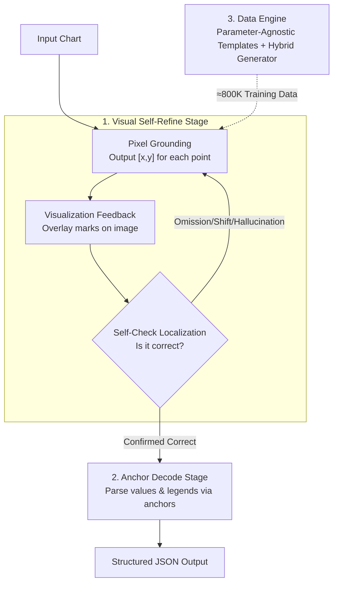

# Visual Self-Refine: A Pixel-Guided Paradigm for Accurate Chart Parsing

**Conference**: ICLR 2026  
**OpenReview**: [https://openreview.net/forum?id=RI0oNr1b0y](https://openreview.net/forum?id=RI0oNr1b0y)  
**Code**: https://github.com/InternLM/VSR  
**Area**: Multimodal VLM  
**Keywords**: Chart Parsing, Visual Self-Refine, Pixel-level Localization, Visual Feedback, Visual Perception

## TL;DR
Addressing the issues of missing points, misalignment, and hallucinations in vision-intensive chart parsing, this paper proposes the "Visual Self-Refine" (VSR) paradigm. The model first outputs pixel-level coordinates, visualizes these marks back onto the image for iterative error correction, and finally uses verified coordinates as "finger anchors" to parse numerical values. A 3B model outperforms Gemini-2.5-Pro on the self-constructed, high-difficulty ChartP-Bench.

## Background & Motivation
**Background**: Current large models with "thinking" capabilities (e.g., o1, Gemini-2.5-Pro) can reflect and correct answers at the **textual level**, which is effective for text-only tasks like mathematics. The goal of Chart Parsing is to reconstruct the underlying structured data (JSON/table) from a chart, serving as a fundamental step for downstream chart QA. The mainstream approach in the LVLM era involves end-to-end training on "Chart-Label" pairs.

**Limitations of Prior Work**: For charts with high visual information density and no explicit numerical labels, even strong models like GPT-4o and Gemini suffer from significant errors when parsing in one go—common issues include large numerical deviations, data misalignment, omission of data points, and even hallucinations of non-existent points. Crucially, when asked to "check and correct," models often insist that "all coordinates are correct," as **textual self-correction is almost ineffective for visual perception tasks** (Figure 2).

**Key Challenge**: Reflection in existing "reasoning" models occurs in text space, whereas the core difficulty of chart parsing lies in **visual perception**. Errors stem from "seeing incorrectly," and model deliberation in text cannot reveal perceptual mistakes. Perceptual errors require "re-looking" rather than "re-thinking."

**Goal**: Introduce a "visual feedback" mechanism for tasks centered on visual perception, allowing the model to "take another look at its previous output" to identify and correct localization errors.

**Key Insight**: The authors observe a human strategy for reading complex charts—using a **finger to point at data points one by one**. The finger position acts as a "visual anchor," effectively preventing repetitive reading, omissions, or alignment errors. Crucially, the finger reduces the high-dimensional perceptual problem of "reading a value" into a simpler localization problem of "pointing to the right spot."

**Core Idea**: Let the model generate pixel-level coordinates $\rightarrow$ plot coordinates back onto the image $\rightarrow$ feed the marked image back to the model $\rightarrow$ perform self-check and correction. Replace "textual reflection" with "visual feedback." Once corrections converge, use these trusted coordinates as anchors to parse numerical values.

## Method

### Overall Architecture
ChartVSR, based on the open-source Qwen2.5-VL-3B, decomposes traditional "one-shot" chart parsing into **two stages**: the **Refine Stage** makes the model responsible only for "pointing out" where each data element is by outputting pixel-level coordinates $[x, y]$. These are visualised using preset markers onto the original image and fed back for self-checking, looping "generation-feedback-correction" until confirmation or reaching the maximum iterations. The **Decode Stage** uses these high-precision, self-verified coordinates as "finger anchors" to translate each anchor into specific values based on the coordinate system and legend, outputting structured JSON. The training data for both stages is synthesized offline by a high-diversity **data engine** (approx. 800K samples).

The key is decoupling "perception (where it is)" and "parsing (what the value is)," using pixel-level localization as the bridge.

### Key Designs

**1. Visual Self-Refine: The Visual Closed-Loop of Generation-Feedback-Correction**

This design directly addresses the failure of textual self-correction in visual tasks. In the Refine Stage, the model does not read values directly but outputs pixel-level coordinates. This step reduces complex parsing to a simpler **visual grounding** task. The system then plots these coordinates back onto the image using markers. By observing its own marks, the model can intuitively see offsets, omissions, or hallucinations, and then output corrected coordinates. This loop continues until $N_{max}$ is reached. It is effective because errors are **rendered back into pixels**—the model "re-looks" at the result rather than justifying text coordinates from memory.

**2. Two-Stage Decoupling: Bridging with Pixel Anchors**

While the Refine Stage ensures "looking at the right spot," the Decode Stage handles "reading the value." During decoding, the model receives the original image plus the verified high-precision pixel anchors. The task shifts from "localization" to "interpretation": for each anchor, the model maps pixel coordinates (e.g., $[541, 458]$) to the chart's coordinate system (e.g., $(88.0, 8.9)$) and associates them with legend labels to form a value-rich JSON. Decoupling "perception" and "parsing" using anchors is critical for mitigating misalignment and omissions; once anchors are trusted, structural errors like "reading the wrong row" are minimized.

**3. High-Diversity Data Engine: Eliminating Implicit Patterns**

The authors identify two issues in existing datasets: monotonous styles (poor generalization) and **implicit patterns/homogenized data** (web data often contains monotonic trends or repetitive strings, which models overfit). They design a data engine with: **Parameter-Agnostic Templates** (general scripts covering all Matplotlib parameters for each chart type) + **Hybrid Configuration Generator** (sampling the full visualization space of colors/fonts/layouts and mixing real content with random data). This maximizes style diversity and breaks implicit patterns. Quality control is maintained via human-labeled positive/negative examples and a Qwen2-VL-2B filter. Four metrics (Avg. Points, Unique Value Ratio, Avg. Absolute Correlation, and Mean PMI) quantify its superiority over ChartQA/PlotQA.

### Loss & Training
The model is fine-tuned end-to-end on 8 H200 (144GB) GPUs. All components (visual encoder, LLM, MLP merger) are unfrozen. Images are resized to a long edge of 1036 pixels (multiple of 28). Training lasts 1 epoch with a total batch size of 128, using AdamW, a learning rate of $2\times10^{-7}$, 0.03 warmup ratio, and 0.01 weight decay. Refine Stage samples teach the model to generate coordinates, correct errors, and terminate cycles. Decode Stage training focuses on parsing JSON from given anchors.

## Key Experimental Results

### Main Results
General Chart Parsing Benchmarks (Metric: Average Precision AP of SCRM at Strict/Slight/High thresholds):

| Benchmark | Metric | ChartVSR (3B) | OneChart (0.2B) | ChartVLM (7.3B) |
|------|------|------|------|------|
| ChartQA-SE-Clean | AP-Slight | **83.69** | 78.89 | 77.17 |
| ChartQA-SE-Clean | AP-High | **85.64** | 83.92 | 82.11 |
| PlotQA-SE | AP-Slight | **84.61** | 84.18 | 46.83 |
| PlotQA-SE | AP-High | **88.10** | 86.10 | 54.00 |
| ChartX-SE | AP-High | **62.89** | 59.72 | 40.82 |

ChartVSR (3B) leads across all benchmarks, particularly in Slight/High thresholds.

High-difficulty ChartP-Bench (Avg. >20 points; Easy $\le 18$, Hard $> 18$):

| Model | Size | Easy Avg. | Hard Avg. | Total Avg. |
|------|------|------|------|------|
| GPT-4o | - | 2.81 | 1.71 | 2.09 |
| Gemini-2.5-Flash | - | 30.86 | 21.35 | 24.62 |
| Gemini-2.5-Pro | - | 27.54 | 37.50 | 34.07 |
| OneChart | 0.2B | 7.88 | 3.82 | 5.22 |
| **ChartVSR** | 3B | **39.83** | **37.66** | **38.41** |

ChartVSR (3B) achieves 38.41, significantly surpassing Gemini-2.5-Pro (34.07). GPT-4o fails on these high-density unlabeled charts. All models score near zero on AP-Strict due to precise labels (e.g., 17.12 vs 17).

### Ablation Study

| Configuration | Easy Avg. | Hard Avg. | Total Avg. |
|------|------|------|------|
| ChartVSR (Full) | 39.83 | 37.66 | 38.41 |
| w/o VSR | 39.20 | 36.54 | — |
| w/o VSR & w/o Pixel | 38.97 | 36.17 | — |

Removing VSR decreases performance, especially on the Hard subset. The marginal difference between "w/o VSR" and "w/o VSR & w/o Pixel" suggests that **pixel localization only provides value when paired with the VSR loop**.

Iterative correction capability (Table 5):

| Round | Sample w/ Errors | Recall of Prev. Error | Correct Confirmation Rate |
|------|------|------|------|
| 0 | 110 | - | - |
| 1 | 51 | 92.3% | 88.2% |
| 2 | 54 | 85.5% | 76.0% |
| 3 | 52 | 85.8% | 76.6% |

### Key Findings
- **Diminishing returns after the first round**: 92.3% of initial errors are identified in round 1. Subsequent rounds maintain high recall but total error count stabilizes, suggesting remaining errors exceed the model's perceptual limits.
- **VSR benefits complex charts**: Gains concentrate on structural errors (omissions/alignment) in complex charts rather than slight numerical deviations in simple charts.
- **Precision at the cost of inference**: VSR requires at least 3 passes ($3 \sim N_{max}+2$), trading compute for reliability.

## Highlights & Insights
- **Moving self-correction from text space to pixel space**: If an error is perceptual, it should be re-rendered for a "re-look." VSR creates an o1-style reflection loop using images as the medium.
- **Smart Dimensionality Reduction**: Decoupling "reading" (high-dimensional) into "pointing" (low-dimensional grounding) prevents mutual contamination between perception and parsing.
- **Generalizability**: VSR’s "visual feedback" mechanism is applicable to visual counting and object detection/grounding where outputs can be rendered back as pixels for self-assessment.

## Limitations & Future Work
- **Limitations**: Diminishing returns for "stubborn" errors; inference cost is $\ge 3\times$ baseline. Reliance on synthetic data means real-world label scarcity is bypassed rather than solved.
- **Future Work**: Bootstrapping for hard-example recovery; integrating Refine and Decode stages for joint optimization; improving coordinate system calibration for high-precision scenarios.

## Related Work & Insights
- **vs DePlot / ChartVLM / OneChart**: These are "one-shot" end-to-end models. ChartVSR uses a two-stage VSR loop to explicitly verify localization, allowing a 3B model to outperform a 7.3B ChartVLM and closed-source Gemini.
- **vs o1 / Gemini-2.5-Pro**: These reflect in text space. ChartVSR grounds "thinking" into pixel feedback, applying the "compute-for-accuracy" philosophy to visual tasks.

## Rating
- Novelty: ⭐⭐⭐⭐⭐ Clear "visual feedback" as a natural complement to textual reflection.
- Experimental Thoroughness: ⭐⭐⭐⭐ Extensive benchmarks and per-round analysis, though lack of comparison with larger models.
- Writing Quality: ⭐⭐⭐⭐⭐ Intuitive human analogies; logical flow.
- Value: ⭐⭐⭐⭐ Practical paradigm and benchmarks transferable to other vision tasks.

<!-- RELATED:START -->

## Related Papers

- [\[CVPR 2026\] RxnCaption: Reformulating Reaction Diagram Parsing as Visual Prompt Guided Captioning](../../CVPR2026/multimodal_vlm/rxncaption_reformulating_reaction_diagram_parsing_as_visual_prompt_guided_captio.md)
- [\[ICLR 2026\] ViPER: Empowering the Self-Evolution of Visual Perception Abilities in Vision-Language Models](viper_empowering_the_self-evolution_of_visual_perception_abilities_in_vision-lan.md)
- [\[ICLR 2026\] DaVinci: Reinforcing Visual-Structural Syntax in MLLMs for Generalized Scientific Diagram Parsing](davinci_reinforcing_visual-structural_syntax_in_mllms_for_generalized_scientific.md)
- [\[ICLR 2026\] PSP: Prompt-Guided Self-Training Sampling Policy for Active Prompt Learning](psp_prompt-guided_self-training_sampling_policy_for_active_prompt_learning.md)
- [\[ICLR 2026\] Uni-DPO: A Unified Paradigm for Dynamic Preference Optimization of LLMs](uni-dpo_a_unified_paradigm_for_dynamic_preference_optimization_of_llms.md)

<!-- RELATED:END -->
