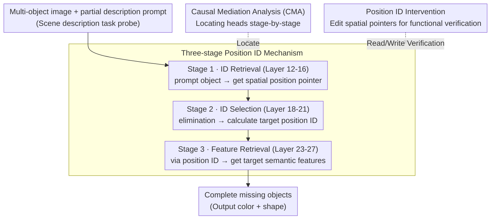

# Visual Symbolic Mechanisms: Emergent Symbol Processing in Vision Language Models

**Conference**: ICLR 2026 Oral  
**arXiv**: [2506.15871](https://arxiv.org/abs/2506.15871)  
**Code**: Available (open-sourced datasets, analysis, and intervention code)  
**Area**: Multimodal VLM / Interpretability  
**Keywords**: visual binding, position IDs, mechanistic interpretability, causal mediation, VLM

## TL;DR
This paper discovers an emergent three-stage symbolic processing mechanism (ID retrieval → ID selection → feature retrieval) within VLMs. It utilizes content-independent spatial position indices (position IDs) to solve the visual binding problem and demonstrates that binding errors can be directly traced to the failure of these mechanisms.

## Background & Motivation

**Background**: VLMs use compositional representations (e.g., "red" + "square") to efficiently encode visual scenes. Emergent binding IDs—content-independent symbolic indices—have already been identified in LLMs for tracking binding relationships between entities and attributes.

**Limitations of Prior Work**: VLMs perform poorly on tasks requiring precise binding (counting, visual search, visual analogy), such as failing to distinguish between "red square + blue circle" and "blue square + red circle." This is the classic **binding problem**. However, whether VLMs possess internal symbolic processing mechanisms similar to text-only LMs remains unknown.

**Key Challenge**: The cost of compositional representation is the necessity of solving the binding problem—binding the correct features to the correct objects. Many "puzzle-like" failures in VLMs (e.g., counting errors) are essentially binding failures, but the internal mechanisms behind these failures are unidentified.

**Goal**: (a) Do VLMs use symbol-like mechanisms to handle visual binding? (b) What are these specific mechanisms? (c) Can binding errors be traced back to the failure of these mechanisms?

**Key Insight**: Drawing from the discovery of binding IDs in text-only LMs and visual indexing theory in cognitive science (Pylyshyn, 2001), it is hypothesized that VLMs may utilize **spatial positions** as content-independent indices to bind object features.

**Core Idea**: VLMs emerge with three types of attention heads (ID retrieval, ID selection, and feature retrieval) that utilize spatial positions as symbolic variables to index and retrieve visual object features.

## Method

### Overall Architecture
The study investigates how VLMs internally process which features belong to which objects. The authors use a **scene description task** as a probe: given an image containing multiple objects with different shapes/colors and a text prompt describing only a subset, the model must complete the description for the missing objects. This task forces the model to map "positions" to "features," exposing binding mechanisms in intermediate layer activations. The authors identified a three-stage pipeline (ID retrieval → ID selection → feature retrieval) and validated it using three combined analytical techniques: representation analysis (PCA, RSA) for activation geometry, Causal Mediation Analysis (CMA) to pin stages to specific attention heads, and intervention experiments to directly edit these heads and confirm their control over output. This workflow was executed across 7 VLMs (Qwen2-VL, Qwen2.5-VL-3B/7B/32B, Llava1.5-7B/13B, Llava-OneVision-7B), yielding highly consistent conclusions.

### Key Designs

**1. Three-stage Position ID Mechanism: Using content-independent spatial positions as symbolic pointers to decompose the binding problem into "retrieve position, calculate position, and fetch features via position."**

This is the core discovery, addressing why VLMs confuse "red square blue circle" with "blue square red circle." The authors found that models do not perform binding directly on pixel features but rather through a pipeline of specialized intermediate layers. **Stage 1 (ID Retrieval, approx. Layer 12-16)** is responsible for "retrieving position": given objects described in the prompt (e.g., "red square"), ID retrieval heads extract their **spatial position indices** from the corresponding image tokens—note that these are abstract spatial pointers, not the object's color or shape. **Stage 2 (ID Selection, approx. Layer 18-21)** is responsible for "calculating position": given the position IDs of known objects, the model infers the position ID of the target (undescribed) object through a **process of elimination**. **Stage 3 (Feature Retrieval, approx. Layer 23-27)** handles "fetching features": using the position ID calculated in Stage 2 as a query, it retrieves the semantic features (color, shape) of the target object from the image tokens to generate the final answer.

PCA reveals that Layer 19 representations cluster by **spatial position** (objects with different features cluster if they share a position), while Layer 27 flips to clustering by **object features** (spatial information recedes). This transition corresponds to the Stage 2→3 handoff. This aligns with visual indexing theory (Pylyshyn, 2001), suggesting LLMs independently developed solutions similar to biological vision.

**2. Causal Mediation Analysis (CMA): Elevating "correlation" to "causality" by locating responsible attention heads stage-by-stage.**

PCA clustering only proves that activations correlate with positions/features; it doesn't prove a head **actually executes** a stage. The authors designed CMA conditions for each stage based on "patching" outputs between image pairs that differ only in key variables. Specifically: **ID retrieval condition** swaps object positions between clean and modified images, patching the prompt token attention head outputs; **ID selection condition** also swaps positions but patches the last token; **feature retrieval condition** uses images with different target object features, patching the last token output. The causal contribution of each head is measured by:

$$s = (M(c_1^*)[a_1^*] - M(c_1^*)[a_1]) - (M(c_1)[a_1^*] - M(c_1)[a_1])$$

This measures how much the logit difference between the correct answer $a_1^*$ and the original answer $a_1$ shifts after patching the head's output, subtracting the baseline effect. This cleanly maps specific functions to small groups of heads.

**3. Position ID Intervention: Directly editing spatial pointers to verify their status as readable/writable universal indices.**

To prove position IDs are **functional**, the authors applied additive edits to relevant head outputs:

$$\tilde{o}_h(x) = o_h(x) + \alpha \cdot (d_t - d_o)$$

where $d_o$ is the estimated direction of the original ID and $d_t$ is the target ID direction. If position IDs are universal indices, adding $d_t - d_o$ should systematically make the model "think" the object moved to a new position, thus changing the output. This was validated across three increasingly realistic settings: realistic rendered images (PUG environment), real photos (COCO), and transferring IDs estimated from scene description tasks to **spatial reasoning tasks** (cross-task transfer). The interventions were generally effective, proving these indices are a general underlying mechanism rather than task-specific artifacts.

### Key Experimental Results

#### Main Results

| Experiment | Model | Intervention Efficacy | Description |
|------|------|----------|------|
| PUG Image Intervention (ID retrieval) | 7-model avg. | >79% | Editing ID retrieval heads controls model output |
| PUG Image Intervention (ID selection) | 7-model avg. | >79% | Editing ID selection heads is equally effective |
| PUG Image Intervention (feature retrieval) | 7-model avg. | >79% | Editing feature retrieval heads is effective |
| Color Retrieval Intervention | All models | High | Position IDs are stored in image patch keys of objects |
| Cross-task Transfer | 5/7 models | Significant | IDs from scene description transfer to spatial reasoning |

#### Ablation Study

| Analysis | Key Findings | Description |
|------|---------|------|
| Relative vs Absolute encoding | Qwen series uses **relative** position encoding | Llava series shows no significant difference |
| High/Low Entropy Binding Errors | Low entropy (shared features) degrades ID retrieval/selection accuracy | Directly explains the cause of binding errors |
| High-entropy ID → Low-entropy Fix | Qwen2.5-VL-3B +11.1%, Llava1.5-13B +10.4% | Causal proof that ID mechanism failure causes binding errors |
| Counting Task Ablation | Removing top-250 heads → perf. drops to 0% | Position ID heads are critical for counting tasks |

#### Key Findings
- **Consistency**: The three-stage architecture is consistent across Qwen2-VL, Qwen2.5-VL (3B/7B/32B), Llava1.5 (7B/13B), and Llava-OneVision.
- **Relative Encoding**: The Qwen series uses relative positions relative to object groups rather than absolute image coordinates.
- **Storage**: Position IDs reside in the key vectors of corresponding image patches, independent of RoPE position encodings.
- **Transferability**: IDs estimated from scene description can improve performance on spatial reasoning tasks.
- **Causal Fix**: Injecting accurate IDs from high-entropy (distinguishable) conditions into low-entropy (similar features) conditions significantly reduces binding errors.

## Highlights & Insights
- **VLM Perception Mechanism**: It reveals that VLMs do not process pixels directly, but build an intermediate spatial indexing system to fetch features. This aligns with Pylyshyn’s (2001) visual indexing theory, suggesting neural networks independently discover solutions similar to biological vision.
- **Path from Diagnosis to Repair**: Beyond discovery, the paper demonstrates that intervening on position IDs can partially fix binding errors (+4.6-11.1% in low-entropy scenes). This points toward architectures with explicit spatial indices or training via spatial pointing tasks.
- **Unified symbolic processing**: Text-only LMs use binding IDs, while VLMs use position IDs. Both are emergent, content-independent symbolic variables, supporting the hypothesis that large-scale Transformers spontaneously develop symbolic processing capabilities.

## Limitations & Future Work
- **Scenario Complexity**: Experiments primarily use synthetic images with 2-3 objects. Efficiency in real-world scenes with dozens of objects is untested.
- **Closed-source Models**: Mechanisms in GPT-4V or Gemini, which perform better on binding tasks, remain unknown.
- **Text-Vision Interaction**: How position IDs interact with language representations in complex, multi-hop reasoning prompts is not fully explored.
- **Limited Repair**: The high-to-low entropy intervention improves performance by at most 11.1%, suggesting other unidentified sources of binding error.
- **Improvements**: Potential directions include adding spatial pointing/grounding tasks during training or designing object-centric attention (e.g., Slot Attention).

## Related Work & Insights
- **vs. Binding IDs (Feng & Steinhardt 2023)**: While text LMs assign symbols along the sequence dimension, VLMs utilize the 2D spatial dimension, naturally mapping to the structure of visual scenes.
- **vs. Yang et al. 2025**: While that work finds symbolic variables in abstract reasoning, this extends it to the visual domain with distinct circuit functions (scene parsing vs. relational induction).
- **Link to Visual Re-injection**: The discovery of position IDs suggests that in long-chain reasoning, visual information is tracked via spatial indices; degradation of these IDs might be a cause of visual forgetting in long reasoning chains.

## Rating
- Novelty: ⭐⭐⭐⭐⭐ (First to reveal internal visual symbolic mechanisms)
- Experimental Thoroughness: ⭐⭐⭐⭐⭐ (7 models, 3 analytical methods, and various interventions)
- Writing Quality: ⭐⭐⭐⭐⭐ (Extremely clear logic and high-quality visualizations)
- Value: ⭐⭐⭐⭐⭐ (Directly informs failure diagnosis and future architecture design)

<!-- RELATED:START -->

## Related Papers

- [\[CVPR 2026\] Mechanisms of Object Localization in Vision-Language Models](../../CVPR2026/multimodal_vlm/mechanisms_of_object_localization_in_vision-language_models.md)
- [\[CVPR 2026\] Understanding Counting Mechanisms in Large Language and Vision-Language Models](../../CVPR2026/multimodal_vlm/understanding_counting_mechanisms_in_large_language_and_vision-language_models.md)
- [\[CVPR 2026\] Boosting Document Parsing Efficiency and Performance with Coarse-to-Fine Visual Processing](../../CVPR2026/multimodal_vlm/boosting_document_parsing_efficiency_and_performance_with_coarse-to-fine_visual_.md)
- [\[ICML 2026\] Unveiling Visual Counting Bottlenecks in Vision-Language Models](../../ICML2026/multimodal_vlm/unveiling_the_visual_counting_bottleneck_in_vision-language_models.md)
- [\[ICLR 2026\] ERGO: Efficient High-Resolution Visual Understanding for Vision-Language Models](ergo_efficient_high-resolution_visual_understanding_for_vision-language_models.md)

<!-- RELATED:END -->
