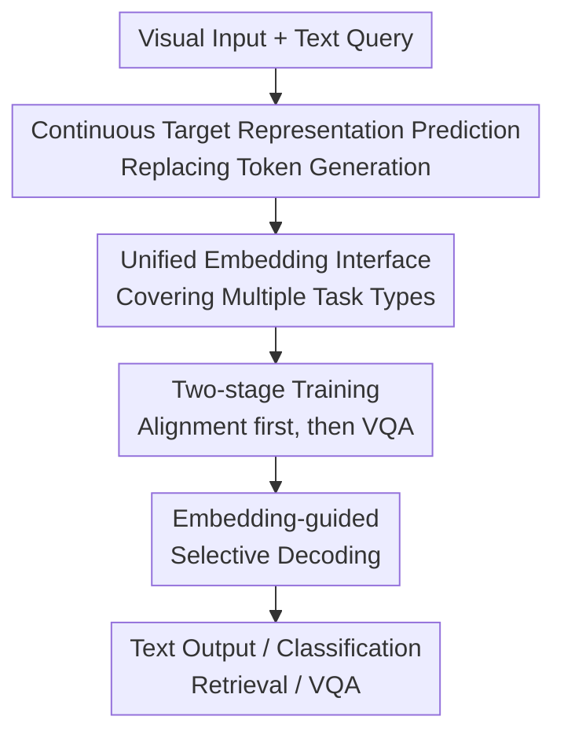

# VL-JEPA: Joint Embedding Predictive Architecture for Vision-language

**Conference**: ICLR2026  
**OpenReview**: [https://openreview.net/forum?id=tjimrqc2BU](https://openreview.net/forum?id=tjimrqc2BU)  
**Code**: Not yet confirmed  
**Area**: Multimodal VLM / Vision-Language Representation Learning  
**Keywords**: JEPA, VLM, continuous representation prediction, selective decoding, video understanding  

## TL;DR
VL-JEPA replaces the traditional autoregressive token generation of VLMs with non-autoregressive prediction of semantic embeddings for target text. Under identical training settings, it consumes fewer parameters and converges faster than token-space VLMs, while naturally supporting selective decoding for classification, retrieval, VQA, and online video scenarios.

## Background & Motivation
**Background**: Current general-purpose vision-language systems mostly follow the generative VLM paradigm: encoding images or videos into visual tokens, which are then fed into a language model alongside text queries to generate answers, descriptions, or explanations via next-token prediction. This approach is straightforward and compatible with the LLM ecosystem, making it mainstream for captioning, VQA, and visual instruction following.

**Limitations of Prior Work**: The issue lies in the fact that many vision-language tasks do not truly require the model to learn "how to write a specific sentence." For instance, the same video clip could be described as "the lamp is turned off" or "the room goes dark." These sentences are semantically close, yet their token sequences barely overlap. Generative VLM training still expends significant computation fitting these surface-level phrasing differences in discrete token space, focusing on non-task-critical information like word order, style, and synonymous paraphrasing.

**Key Challenge**: Genuine vision-language understanding requires extracting the correct semantics from visual states and questions, whereas autoregressive language generation couples "semantic understanding" with "token-by-token sentence writing." This coupling is merely a cost issue in offline QA but becomes a latency bottleneck in real-time video streams, where the model must continuously process video but only needs to output text when semantic shifts occur.

**Goal**: The authors aim to build a general-purpose vision-language model capable of covering captioning, open-vocabulary classification, text-to-video retrieval, and discriminative VQA. The training objective shifts from generating tokens to predicting target answer embeddings in a continuous semantic space; meanwhile, a lightweight text decoder is invoked only when text output is required to translate embeddings back into readable text.

**Key Insight**: The fundamental idea of JEPA is to "predict the target in representation space" rather than reconstructing raw data. The authors adapt this to vision-language: visual inputs are transformed into visual representations, and target text is transformed into text representations. The predictor learns to map visual representations and queries to the target text representation. Consequently, synonymous answers cluster in the embedding space, allowing the model to fit a smoother, more abstract target distribution.

**Core Idea**: Replace autoregressive token prediction with target text embedding prediction, shifting the VLM's learning focus from "writing the answer" to "predicting answer semantics," and then decoding semantic embeddings into text on demand.

## Method

### Overall Architecture
The training samples for VL-JEPA are triplets $\langle X_V, X_Q, Y \rangle$: $X_V$ represents the image or video frames, $X_Q$ is the text query, and $Y$ is the target text answer. The model uses an X-Encoder to obtain visual embeddings $S_V$ and a Y-Encoder for target text embeddings $S_Y$. The Predictor then predicts $\hat{S}_Y$ conditioned on the query. The training loss directly compares $\hat{S}_Y$ with $S_Y$, rather than comparing the generated text $\hat{Y}$ with the original answer $Y$.

During inference, VL-JEPA supports two modes. For open-ended generation or captioning, the predicted $\hat{S}_Y$ is passed to the Y-Decoder to be read as text. For classification, retrieval, or discriminative VQA, candidate texts are encoded into embeddings, and nearest-neighbor matching is performed directly in the embedding space without generating any tokens. For online video streams, the model can output a continuous sequence of $\hat{S}_Y$ and trigger text decoding only when significant semantic shifts are detected in the embeddings.

### Key Designs
**1. Continuous Target Representation Prediction: Compressing Answers from Token Distribution to Semantic Space**

Traditional VLMs optimize $L_{VLM}=D(\hat{Y},Y)$, predicting the ground truth text token-by-token. VL-JEPA optimizes $L_{VL\text{-}JEPA}=D(\hat{S}_Y,S_Y)$, predicting the continuous embedding of the target text. This change fundamentally alters the shape of the distribution the model learns: in discrete token space, semantically equivalent but differently phrased answers might be orthogonal; in embedding space, they cluster within the same semantic region.

This is particularly crucial for vision-language tasks where "correctness" does not depend on a unique expression. The model doesn't need to learn every surface form of acceptable answers, only to predict close to the correct semantics. Controlled experiments verify this: using the same visual encoder, data, batch size, and training steps, the embedding-predicting VL-JEPA improves faster than the token-predicting VLM. At 15M samples seen, VL-JEPA achieves an average CIDEr of 14.8 for captioning, while the VLM only reaches 7.1; Top-5 classification also improves from 27.2% for VLM to 41.0%.

**2. Unified Embedding Interface: One Architecture for Generation, Classification, Retrieval, and Discriminative VQA**

Instead of splitting each task into independent heads, VL-JEPA reformulates tasks as "predicting the relationship between predicted and candidate embeddings." For generation, the query is a caption prompt or question, and the Predictor outputs the answer embedding, which the Y-Decoder decodes into text. For open-vocabulary classification, category names are encoded into candidate embeddings, and the model selects the category closest to $\hat{S}_Y$. For text-to-video retrieval, a retrieval-style caption prompt is used to obtain video-side predicted embeddings, which are then ranked against text query embeddings.

While this unified interface simplifies the architecture, it makes the system performance upper-bounded by the Y-Encoder quality. The paper specifically evaluates the Y-Encoder on SugarCrepe++ and VISLA hard-negative text benchmarks. The text encoder of VL-JEPA_BASE reaches 63.9% on SugarCrepe++ and 42.9% on VISLA, outperforming strong baselines like PE-Core or SigLIP2, indicating that JEPA training makes the target text space more sensitive to fine-grained semantic differences.

**3. Two-stage Training: Establishing Vision-Language Alignment Before Injecting Query-conditioned VQA Capabilities**

The final model utilizes two-stage training. The first stage is query-free large-scale caption pre-training to establish stable image-text/video-text alignment. Data includes Datacomp, YFCC-100M, and ACTION100M video action descriptions built from HowTo100M. Training starts with single-image large-batch training for 100k iterations, followed by 8-frame video for 60k iterations, and finally 32-frame video for 10k iterations, resulting in VL-JEPA_BASE.

The second stage is query-conditioned SFT, using a mix of PLM data to train the model to answer specific questions while preserving the classification and retrieval capabilities from the first stage. Data includes 25M VQA, 2.8M captioning, 1.8M classification, and downsampled pre-training data to mitigate catastrophic forgetting. Ablations show that removing the first-stage caption pre-training drops classification from 49.0 to 27.3 and retrieval from 47.5 to 30.2, proving that SFT relies on the foundation laid in the first stage.

**4. Embedding-guided Selective Decoding: Let Online Video Systems Speak Only When Semantics Shift**

Another key value of VL-JEPA stems from non-autoregressive prediction. To obtain semantic output, generative VLMs must actually decode a segment of text, whereas VL-JEPA requires only one forward pass per sliding window to obtain $\hat{S}_Y$. These embeddings form a continuous semantic stream. The system can monitor changes in the embedding space before deciding whether to invoke the Y-Decoder.

The paper validates this on EgoExo4D long videos: uniform interval decoding acts as "speaking at fixed times" regardless of semantic shifts; VL-JEPA uses clustering with temporal connectivity constraints to partition the embedding sequence into semantically consistent segments, decoding only at the midpoint of each segment. Results show that selective decoding is Pareto-superior to uniform sampling across the entire decoding frequency range; 0.35 Hz selective decoding achieves the same performance as 1 Hz uniform decoding, reducing text decoding frequency by approximately $2.85\times$.

### A Complete Example
Suppose the input is a first-person cooking video, and the query is "What step is the user performing?" A traditional VLM would feed each query window into a language model, generating answers like "the person is chopping onions" token-by-token. If the user is still chopping onions a second later, the system might repeat the decoding of an equivalent sentence.

VL-JEPA follows a different workflow. Each video window passes through a frozen V-JEPA 2 X-Encoder to become visual tokens. The query and visual tokens enter the Predictor, which outputs a target semantic embedding $\hat{S}_Y$. If the variance of $\hat{S}_Y$ across consecutive windows is small, the semantic state remains near "chopping onions," and the system maintains the embedding stream without decoding. When the user switches from chopping onions to pouring oil, the embedding cluster shifts significantly, triggering the Y-Decoder to output new descriptive text.

If the task is classification, the process is even shorter. The system pre-encodes candidate labels like "chopping onions," "pouring oil," and "washing pan" using the Y-Encoder. The current window's $\hat{S}_Y$ is compared against these candidates, and the nearest label is the result, eliminating the need for full natural language generation. This explains how the same model is reused across captioning, classification, retrieval, and VQA.

### Loss & Training
The paper uses bi-directional InfoNCE to train the Predictor and Y-Encoder. Intuitively, InfoNCE performs two tasks simultaneously: it pulls the predicted embedding $\hat{S}_Y$ of a sample closer to its target embedding $S_Y$, while pushing embeddings of different samples in the batch apart to avoid collapse to a single point.

Several implementation details are critical. The X-Encoder uses a frozen V-JEPA 2 ViT-L, with video inputs sampled at $256^2$ resolution. The Predictor is initialized from the last 8 Transformer layers of Llama-3.2-1B with causal attention masks removed to allow bi-directional attention between visual and query tokens. The Y-Encoder is initialized from EmbeddingGemma-300M with a maximum context length of 512, using a $0.05\times$ learning rate multiplier for its parameters. A projection head maps Predictor and Y-Encoder outputs to a shared 1,536-dimensional embedding space.

Ablations support these choices. A Y-Encoder learning rate multiplier between 0.05 and 0.10 is stable; moving too fast or freezing it entirely hurts performance. InfoNCE significantly outperforms cosine, L1, or L2 regression for classification and retrieval. Using more Llama layers in the Predictor generally benefits VQA, and retaining causal attention drops VQA by 1.9 because it prevents visual tokens from attending to query tokens positioned after them.

## Key Experimental Results

### Main Results
The main experiments cover four categories: video classification, text-to-video retrieval, discriminative VQA, and world modeling. Notably, VL-JEPA_BASE outperforms general representation models like CLIP/SigLIP2/PE-Core in zero-shot classification and retrieval, while VL-JEPA_SFT significantly boosts classification performance after SFT while maintaining a unified architecture.

| Task / Dataset Group | Metric | VL-JEPA | Strong Baselines | Result Interpretation |
|--------|------|------|----------|------|
| 8 Video Classification Datasets | Avg Top-1 | VL-JEPA_BASE 52.5 | PE-Core-G 44.7 | Leads by 7.8 points among zero-shot general models, particularly strong on motion datasets like SSv2, EK100, EgoExo4D |
| 8 Text-to-Video Retrieval Datasets | Avg Recall@1 | VL-JEPA_BASE 63.7 | PE-Core-G 58.1 | Uses unified embedding interface for retrieval, leading by 5.6 points |
| 8 Video Classification Datasets | Avg Top-1 | VL-JEPA_SFT 75.4 | VL-JEPA_BASE 52.5 | Classification significantly improves after SFT due to exposure to in-domain tasks |
| WORLDPREDICTION-WM | Top-1 accuracy | VL-JEPA_SFT 65.7 | Strongest baseline approx. 57.0 | Sets new SOTA on video world modeling task (selecting actions based on initial/final states) |

VQA performance is "comparable to strong generative VLMs" rather than dominant. Despite having only 1.6B parameters, VL-JEPA_SFT reaches competitive levels on perceptual VQA benchmarks: GQA 61.5, TallyQA 69.9, POPE 85.7, POPEv2 86.3. It may not surpass the largest models but proves that the embedding prediction architecture fits discriminative VQA via candidate answer embeddings.

| VQA Dataset | VL-JEPA_SFT | Representatively Strong Baseline | Observation |
|------|---------|------|------|
| GQA | 61.5 | LLaVA-1.5 7B: 62.0; InternVL-Chat 13B: 66.6 | Close to medium-scale generative VLMs, but yet to catch up with the largest ones |
| TallyQA | 69.9 | InstructBLIP 13B: 68.0; PaliGemma 3B: 76.8 | Superior to some large models on complex counting, though room for improvement remains |
| POPE | 85.7 | LLaVA-1.5 7B: 85.9; SmolVLM-2B: 87.5 | Hallucination detection close to mainstream VLMs |
| POPEv2 | 86.3 | Qwen2-VL-2B: 91.3; SmolVLM-2B: 88.8 | Robust performance, though a gap remains compared to top-tier small models |

### Ablation Study
Ablations indicate that VL-JEPA's gains result from the synergy of pre-training, InfoNCE, bi-directional attention, and text encoder choice. Specifically, caption pre-training is vital for classification/retrieval, showing that such models still require large-scale vision-language alignment as a foundation.

| Configuration | Class. / Retr. / VQA | Description |
|------|---------|------|
| Full VL-JEPA_SFT | 75.4 / 63.8 / 74.2 | Final results at full training scale |
| w/ Pretraining | 49.0 / 47.5 / 46.1 | Default setting for small-scale ablation: caption pre-training followed by SFT |
| w/o Pretraining | 27.3 / 30.2 / 42.5 | Removing pre-training drops classification by 21.7, retrieval by 17.3, and VQA by 3.6 |
| Y-Encoder LR scale 0.05 | 27.3 / 30.2 / 42.5 | Stable default setting; avoids biasing text space when early predictions are poor |
| Y-Encoder LR scale 0.00 | 20.0 / 25.9 / 41.4 | Complete freezing significantly weakens classification and retrieval |
| InfoNCE | 23.3 / 30.3 / 44.3 | Outperforms direct regression for classification/retrieval and provides anti-collapse |
| Cosine loss | 16.5 / 20.2 / 46.6 | VQA slightly higher, but classification/retrieval drop sharply; lacks explicit anti-collapse |
| w/o Bi-direction Attention | 26.7 / 31.2 / 40.6 | VQA drops by 1.9, showing the utility of dual-way query and visual token interaction |

### Key Findings
- The sample efficiency of embedding prediction is evident: at 5M samples seen, VL-JEPA already achieves 14.7 CIDEr and 35.3% top-5 accuracy, while VLM training curves are significantly slower. At 15M samples, VL-JEPA maintains its absolute performance advantage.
- Selective decoding is an architectural inference advantage, not just a post-processing optimization. Since the model outputs semantic embeddings first, the system can decide if it's "worth speaking" without generating text.
- VL-JEPA_BASE is particularly strong on datasets involving motion, processes, and step recognition, but relatively weaker on appearance-centric datasets. Authors attribute this to its training data volume being far smaller than PE-Core-G's 86B samples.
- The Y-Encoder is not a static replacement for standard text encoders. After JEPA training, the VL-JEPA_BASE Y-Encoder performs better on hard-negative text evaluations, suggesting that the target semantic space itself is trained to better fit fine-grained vision-language matching.

## Highlights & Insights
- The primary highlight is decoupling "answer generation" into "answer semantic prediction" and "on-demand text readout." This separation aligns the training objective with the essence of the task and allows real-time video systems to save on decoding costs.
- The most persuasive aspect of the paper is the strictly controlled comparison between embedding prediction and token prediction. Keeping the encoder, data, batch size, and steps constant—changing only the target space—cleanly validates the core hypothesis.
- VL-JEPA bridges the worlds of CLIP-style representation models and generative VLMs: it performs retrieval and open-vocabulary matching like CLIP, yet generates text via a decoder. It centers the architecture on "answer semantic space" rather than simply appending an LLM to a vision encoder.
- The selective decoding logic is transferable to robotics, AR glasses, and online surveillance. For any task with a continuous state stream and sparse text output, one can monitor embeddings and decode only at semantic pivot points.
- This work serves as a reminder that VLM efficiency doesn't solely rely on token pruning, quantization, or smaller models; altering the supervision space itself can be more fundamental than local accelerations within a generative framework.

## Limitations & Future Work
- The authors acknowledge that VL-JEPA is not yet a generic replacement for generative VLMs. Evaluation currently focuses on visual perception, video understanding, retrieval, discriminative VQA, and online captioning, but has not yet covered tool-use, complex multi-step reasoning, or agentic behaviors where token-generative VLMs excel.
- Y-Decoder quality still dictates open-ended text output. While embedding prediction stabilizes semantics, the final sentence readable by humans depends on the decoder; if the decoder struggles with detail or long answers, generation tasks may be limited.
- Selective decoding is promising but primarily validated on EgoExo4D procedural activities. More complex real-world scenarios may involve both fleeting actions and long-term context dependencies, where simple trigger strategies based on variance or clustering might fall short.
- Training costs remain high. Final pre-training required 24 H200 nodes for approximately 4 weeks. Although trainable parameters are fewer than comparative VLMs, the overall construction remains resource-intensive.
- Future work could explore non-contrastive anti-collapse regularizers like VICReg or SIGReg, stronger Y-Encoder/Y-Decoder combinations, or applying continuous semantic streams for latent-space reasoning beyond just saving decoding costs.

## Related Work & Insights
- **vs CLIP / SigLIP / PE-Core**: CLIP-style models encode vision and text into the same space, excelling at classification and retrieval but lacking conditional prediction and natural text generation. VL-JEPA adds a query-conditioned Predictor to predict target answer embeddings from visual inputs and questions.
- **vs Generative VLM / PerceptionLM**: Generative VLMs optimize next-token cross-entropy; they are powerful at output but process token-level surface differences during training and inference. VL-JEPA shifts the main objective to embedding space, decoding only when necessary, showing better sample efficiency and performance in classification/captioning in controlled tests.
- **vs I-JEPA / V-JEPA**: Early JEPA focused on internal representation prediction within images or videos for self-supervised learning. VL-JEPA extends this to general vision-language conditional prediction, where the target is a semantic representation of a text answer rather than a visual patch.
- **vs Latent-space language modeling**: Works like Large Concept Models or COCONUT discuss language modeling or reasoning in continuous latent spaces. VL-JEPA applies similar ideas to multimodal alignment, sharing a predictable, retrievable, and decodable semantic space between visual states and text answers.
- **Insight**: For multimodal systems requiring long-term operation, one might separate "high-frequency understanding" from "low-frequency verbalization": the former updates continuously via embedding streams, while the latter triggers only when user-requested or upon semantic shifts.

## Rating
- Novelty: ⭐⭐⭐⭐⭐ Reframes the general VLM training objective from a JEPA perspective and makes selective decoding a natural architectural property.
- Experimental Thoroughness: ⭐⭐⭐⭐☆ Covers classification, retrieval, VQA, world modeling, controlled comparisons, and selective decoding, though complex reasoning/agent tasks are missing.
- Writing Quality: ⭐⭐⭐⭐☆ The structure is smooth and core controlled experiments are clearly explained, though some implementation details and tables are quite dense.
- Value: ⭐⭐⭐⭐⭐ Direct implications for real-time video VLMs, robotics/AR scenarios, and latent-space multimodal modeling; a highly significant architecture to follow.

<!-- RELATED:START -->

## Related Papers

- [\[ICML 2026\] CHARM: 用 Multimodal JEPA + 通道描述做时间序列 foundation embedding](../../ICML2026/multimodal_vlm/giving_sensors_a_voice_multimodal_jepa_for_semantic_time-series_embeddings.md)
- [\[CVPR 2026\] VL-Eraser: Vacuum Distillation for Machine Unlearning in Vision-Language Models](../../CVPR2026/multimodal_vlm/vl-eraser_vacuum_distillation_for_machine_unlearning_in_vision-language_models.md)
- [\[NeurIPS 2025\] HoPE: Hybrid of Position Embedding for Long Context Vision-Language Models](../../NeurIPS2025/multimodal_vlm/hope_hybrid_of_position_embedding_for_long_context_visionlan.md)
- [\[ICLR 2026\] Efficient Discriminative Joint Encoders for Large Scale Vision-Language Re-ranking](efficient_discriminative_joint_encoders_for_large_scale_vision-language_rerankin.md)
- [\[ICLR 2026\] Delving into Spectral Clustering with Vision-Language Representations](delving_into_spectral_clustering_with_vision-language_representations.md)

<!-- RELATED:END -->
