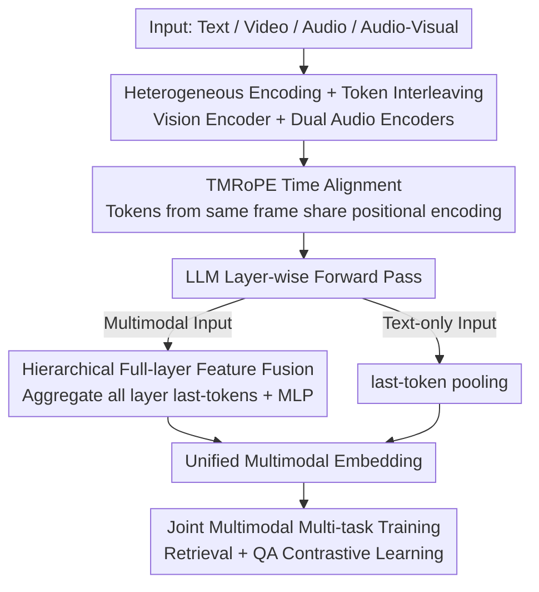

# WAVE: Learning Unified & Versatile Audio-Visual Embeddings with Multimodal LLM

**Conference**: ICLR 2026  
**OpenReview**: [https://openreview.net/forum?id=MiV3WXDYJb](https://openreview.net/forum?id=MiV3WXDYJb)  
**Code**: https://github.com/TCL606/WAVE (Available)  
**Area**: Multimodal VLM  
**Keywords**: Multimodal Embedding, Audio-Visual Representation, MLLM Embedding, Cross-modal Retrieval, prompt-aware

## TL;DR
WAVE projects text, audio, silent video, and synchronized audio-visual streams into a unified semantic space based on Qwen2.5-Omni. By employing "dual-audio encoders + hierarchical full-layer feature fusion + joint multimodal multi-task training," it achieves any-to-any retrieval and instruction-dependent prompt-aware embeddings, reaching SOTA on the MMEB-v2 video track.

## Background & Motivation
**Background**: The mainstream of multimodal embedding is the CLIP-style paradigm featuring "one independent encoder per modality + alignment via contrastive learning." The recent rise of LLMs has introduced a more integrated paradigm—using a single Multimodal LLM (MLLM) to produce embeddings for all modalities simultaneously, which inherently possesses better cross-modal interoperability, semantic alignment, and instruction-following capabilities.

**Limitations of Prior Work**: Most MLLM embedding research focuses on vision, especially static images, while audio and synchronized audio-visual streams remain significantly under-explored. Consequently, a "truly universal audio-visual embedding space" has yet to be fully realized. Furthermore, the original multimodal understanding capabilities of many models degrade significantly after being converted into embedders.

**Key Challenge**: Dynamic modalities (audio, video) are temporal signals. They must be aligned with text and each other in a unified space while preserving the MLLM's inherent reasoning capabilities. Moreover, a single static embedding is insufficient for tasks like multimodal QA that depend on specific questions—the same video should yield different representations for different questions.

**Goal**: To develop a unified audio-visual embedding MLLM covering four input configurations—text, audio, silent video, and synchronized audio-visual streams—while supporting any-to-any retrieval and prompt-conditioned embeddings.

**Key Insight**: The authors hypothesize that joint multimodal multi-task training fosters a more robust universal embedding space, allowing knowledge from one modality to positively transfer to another. Additionally, observing that different layers of MLLMs serve different functions, they extract information from all layers rather than just the final one.

**Core Idea**: An MLLM is used to interleave heterogeneous modalities into a unified token sequence with time-aligned encoding. Information is then aggregated from the last-token of all layers and processed via a lightweight fusion module. Combined with joint training for retrieval and QA, the model achieves both any-to-any retrieval and prompt-aware capability.

## Method

### Overall Architecture
WAVE accepts one of four input types—plain text, pure vision (video frames), pure audio, or synchronized audio-visual data—and outputs a multimodal embedding for classification, retrieval, or QA. The pipeline is as follows: non-text inputs pass through dedicated encoders to become tokens, which are interleaved into a unified sequence and appended with a text prompt. A TMRoPE time-aligned positional encoding is applied before feeding the sequence into the LLM. For non-text modalities, the last-token of **every layer** is collected, concatenated, and fed into a lightweight fusion module to produce the final embedding. For plain text, standard last-token pooling (the hidden state of the final layer's EOS) is used. Critically, all non-text inputs must include a text prompt as an instruction: a general prompt (e.g., "Describe the video") for retrieval and a specific question for QA, which enables the prompt-aware functionality.

### Key Designs

**1. Dual-Audio Encoding + Modality Interleaving: Composing heterogeneous temporal signals into unified sequences**

To address the issue that audio/video are temporal signals and that speech and environmental sounds are complementary, WAVE uses dual audio encoders instead of a single one: a speech encoder (from Qwen2.5-Omni) and an independent audio event encoder (BEATs + trainable aligner). These respectively produce speech-related and event-related tokens, covering both spoken content and background sounds. Since both encoders share the same frequency and token count, they are interleaved 1:1 into a unified auditory sequence. For synchronized audio-visual data, the visual and auditory sequences are segmented by sampled frames and interleaved. Finally, text prompt tokens are appended. This allows the LLM to consume heterogeneous signals as a single sequence while the dual encoders provide more comprehensive audio representation.

**2. TMRoPE Time Alignment: Strict positional alignment of multimodal tokens at the same timestamp**

Audio and video are naturally synchronized, but their spatial-temporal structure is broken if positional encodings are misaligned after interleaving. WAVE adopts the time-aligned multimodal rotary position embedding (TMRoPE) from Qwen2.5-Omni. Since the speech and audio encoders are synchronized to the same output frequency, their tokens are naturally aligned in time. All tokens belonging to the same frame share the same TMRoPE, ensuring precise temporal alignment. This is the prerequisite for dual-encoder interleaving, enabling the LLM to understand "the frame's image + the frame's sound" as a coherent whole.

**3. Hierarchical Full-layer Feature Fusion: Extracting information from all layers**

The standard approach is last-token pooling using only the final layer's EOS hidden state. However, the authors observe (citing Gou et al., 2025) that different MLLM layers specialize in different aspects of video understanding—lower layers focus on low-level perceptual cues, while higher layers handle high-level semantic abstractions. Consequently, WAVE collects the last-token status of **every layer**, concatenates them, and feeds them into a lightweight fusion module (a two-layer MLP with GELU activation). Ablations confirm that using only the first or middle layers results in significant performance drops, and full-layer MLP fusion consistently outperforms the strong final-layer baseline. Simple "weighted sums" perform worse than the final layer alone, suggesting that cross-layer interactions for video tasks are non-linear and require learnable transformations.

**4. Joint Multimodal Multi-task Training: Fostering a prompt-aware unified space via Retrieval + QA**

WAVE uses contrastive learning as its primary paradigm. For Retrieval tasks where source and target belong to different modalities, symmetric InfoNCE loss is used. For the $i$-th sample in a mini-batch with source embedding $e_{s_i}$ as query and target $e_{t_i}$ as the positive pair, the loss is:
$$L_{s_i} = -\log \frac{\exp(\mathrm{sim}(e_{s_i}, e_{t_i})/\tau)}{\sum_{j=1}^{N}\exp(\mathrm{sim}(e_{s_i}, e_{t_j})/\tau)}$$
The total $L_{\text{Retrieval}} = \frac{1}{2N}\sum_i (L_{s_i}+L_{t_i})$ ensures bidirectional alignment. For QA tasks, the source is "multimodal signal + question prompt" and the target is the correct answer text with $n$ distractor answers. The loss is:
$$L_{QA_i} = -\log \frac{\exp(\mathrm{sim}(e_{s_i}, e_{t_i})/\tau)}{\exp(\mathrm{sim}(e_{s_i}, e_{t_i})/\tau) + \sum_{k=1}^{n}\exp(\mathrm{sim}(e_{s_i}, e'_{t_i,k})/\tau)}$$
This forces the model to produce query embeddings close to the correct answer and far from distractors. A task-aware sampler ensures samples within a mini-batch share the same task and data source, enabling the model to learn both universal retrieval representations and discriminative, prompt-aware embeddings.

### Loss & Training
The process consists of two stages. First, BEATs aligner pre-training: everything is frozen except the aligner, which is trained via audio captioning (WavCaps / AudioCaps / Clotho) to help the LLM interpret BEATs features (3 epochs on 128 H20 GPUs). Second, the main training phase uses contrastive learning on 4.9M samples (Video-Text Retrieval, Video QA, Video-Audio Retrieval, Audio-Text Retrieval). The LLM is fine-tuned using LoRA (rank=128, scale=2.0, dropout=0.05). Trainable components include the vision aligner, LoRA weights, and the fusion module (1 epoch on 192 H20 GPUs, batch size 192, learning rate $2\times10^{-5}$, ~36 hours).

## Key Experimental Results

### Main Results
Video Track (MMEB-v2-Video Overall / LoVR theme-to-clip R@25):

| Model | MMEB-v2-Video Overall | QA | LoVR theme-to-clip |
|--------|------|------|------|
| LamRA 7B | 35.0 | 42.6 | 60.2 |
| GME 7B | 38.4 | 50.4 | 43.9 |
| CAFe 7B | 42.4 | 58.7 | - |
| Seed-1.6-Embedding (Proprietary) | 55.3 | 60.9 | - |
| **WAVE 7B (Ours)** | **59.9** | **72.5** | **66.0** |

WAVE significantly outperforms open-source models and even surpasses the proprietary Seed-1.6-Embedding. Audio/Audio-Visual domain (R@1 / Acc%):

| Task | Dataset | Ref Model | WAVE 7B (Ours) |
|------|------|------|------|
| Audio Retrieval A-RET | AudioCaps | 42.2 | **44.2** |
| Audio Retrieval A-RET | Clotho | 21.5 | **25.6** |
| Video→Audio AV-RET | VGGSound | 10.3 | **25.0** |
| Video→Music AV-RET | MusicCaps | 8.6 | **20.4** |
| Audio QA | MMAU | 71.5 | **76.6** |
| Audio QA | MMAR | 56.7 | **68.1** |

In high-difficulty tasks like Video→Audio/Music retrieval that bypass text, WAVE substantially outperforms encoder-only models trained on the same data. It also exceeds its base Qwen2.5-Omni on Audio QA without specific instruction-tuning for it, demonstrating cross-modal transfer.

### Ablation Study

| Configuration | Key Metrics | Note |
|------|---------|------|
| Joint Training | Opt. in 7/8 tasks | Positive cross-modal transfer |
| Separate Training | Lower in most tasks | Modality-specific training |
| Full-layer MLP Fusion | Video RET 50.5 | Complete proposal |
| Final-layer last-token pooling | 49.6 | Final layer only |
| Full-layer Weighted Sum | 48.3 | Linear addition is worse |
| Middle-layer last-token | 45.0 | Insufficient information |
| First-layer last-token | 38.8 | Massive performance drop |

The role of the prompt in QA is extremely significant: using "specific questions" as prompts yields 72.5, while switching to a universal prompt ("Please describe the video") causes a drop to 51.8.

### Key Findings
- **Prompt-aware capability is effective**: The jump from 51.8 to 72.5 in QA performance proves embeddings are conditioned on instructions rather than just encoding the primary video content.
- **Full-layer fusion requires learnable non-linearity**: A simple weighted sum (48.3) is worse than the final-layer baseline (49.6), whereas MLP fusion (50.5) is consistently superior, indicating non-linear cross-layer interactions.
- **Joint training enables positive transfer**: Joint training outperformed separate training in 7 out of 8 tasks, with audio data even improving video retrieval, supporting the hypothesis of a modality-agnostic unified semantic space.
- **No degradation, only gains**: WAVE maintains or even improves upon the multimodal understanding of its base Qwen2.5-Omni, unlike many embedding models that suffer understanding performance loss after conversion.

## Highlights & Insights
- **Dual-audio encoders are a crucial detail**: Separately encoding speech and audio events allows complementary acoustic cues to enter the embedding, which is key to surpassing others in audio-visual retrieval.
- **Engineering "every layer matters"**: Formulating the observation of layer-wise specialization into "full-layer last-token concatenation + MLP fusion" provides a clean, reusable recipe for MLLM embeddings.
- **Unifying retriever and QA discriminator**: The same embedding space can shift from a "universal retrieval representation" to a "question-conditioned discriminative representation" simply by changing the prompt. This "instruction as a view" concept is applicable to any task-adaptive representation scenario.

## Limitations & Future Work
- While prompt-aware embeddings mitigate the limitations of static representations for QA, performance collapses without informative prompts. Deployment requires informative instructions on the query side.
- High computational cost: Based on a 7B LLM, training requires 192 H20 GPUs; performance on smaller scales was not explored.
- MRET (moment retrieval) remains a weak point (50.8 vs Seed's 53.5), suggesting fine-grained temporal localization is still challenging for unified embeddings.
- Text quality is capped by the captioning models used (e.g., InternVL-2.5-8B for Panda-70M), potentially introducing bias.

## Related Work & Insights
- **vs. CLIP / CLAP / AudioCLIP**: These use independent encoders aligned in a joint space. WAVE uses a single MLLM, making cross-modal interoperability more natural and inheriting instruction-following for prompt-aware capabilities.
- **vs. VLM2Vec / GME / CAFe**: These focus on images/videos. WAVE is the first to unify text, audio, video, and synchronized AV streams in one MLLM, outperforming them on video benchmarks.
- **vs. Seed-1.6-Embedding (Proprietary)**: As an open-source 7B model, WAVE surpasses this proprietary baseline on MMEB-v2-Video Overall and QA while providing open code and checkpoints.

## Rating
- Novelty: ⭐⭐⭐⭐ First MLLM to unify text/audio/video/AV embedding; solid dual-audio + full-layer fusion.
- Experimental Thoroughness: ⭐⭐⭐⭐⭐ Comprehensive benchmarks plus detailed ablations on training, fusion, and prompts.
- Writing Quality: ⭐⭐⭐⭐ Clear structure with consistent formulas and results.
- Value: ⭐⭐⭐⭐ Establishes a strong baseline for universal audio-visual representation with clear any-to-any applications.

## Related Papers

- [\[ICLR 2026\] OmniVideoBench: Towards Audio-Visual Understanding Evaluation for Omni MLLMs](omnivideobench_towards_audio-visual_understanding_evaluation_for_omni_mllms.md)
- [\[NeurIPS 2025\] Watch and Listen: Understanding Audio-Visual-Speech Moments with Multimodal LLM](../../NeurIPS2025/multimodal_vlm/watch_and_listen_understanding_audio-visual-speech_moments_with_multimodal_llm.md)
- [\[ACL 2026\] ViLL-E: Video LLM Embeddings for Retrieval](../../ACL2026/multimodal_vlm/vill-e_video_llm_embeddings_for_retrieval.md)
- [\[CVPR 2026\] Illuminating Visual Identity in Universal Multimodal Embeddings](../../CVPR2026/multimodal_vlm/illuminating_visual_identity_in_universal_multimodal_embeddings.md)
- [\[CVPR 2026\] Semantic Noise Reduction via Teacher-Guided Dual-Path Audio-Visual Representation Learning](../../CVPR2026/multimodal_vlm/semantic_noise_reduction_via_teacher-guided_dual-path_audio-visual_representatio.md)

<!-- RELATED:END -->

<!-- RELATED:START -->

## Related Papers

- [\[ICLR 2026\] OmniVideoBench: Towards Audio-Visual Understanding Evaluation for Omni MLLMs](omnivideobench_towards_audio-visual_understanding_evaluation_for_omni_mllms.md)
- [\[ICLR 2026\] OptMerge: Unifying Multimodal LLM Capabilities and Modalities via Model Merging](optmerge_unifying_multimodal_llm_capabilities_and_modalities_via_model_merging.md)
- [\[ICLR 2026\] Language-Instructed Vision Embeddings for Controllable and Generalizable Perception](language-instructed_vision_embeddings_for_controllable_and_generalizable_percept.md)
- [\[ICLR 2026\] OmniVinci: Enhancing Architecture and Data for Omni-Modal Understanding LLM](omnivinci_enhancing_architecture_and_data_for_omni-modal_understanding_llm.md)
- [\[ICLR 2026\] VisCodex: Unified Multimodal Code Generation via Merging Vision and Coding Models](viscodex_unified_multimodal_code_generation_via_merging_vision_and_coding_models.md)

<!-- RELATED:END -->
