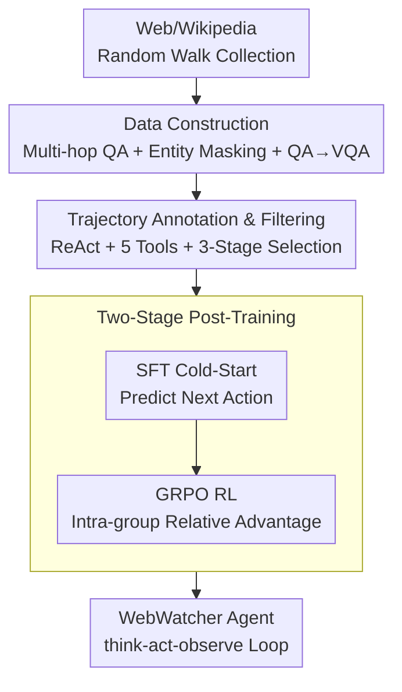

# WebWatcher: Breaking New Frontiers of Vision-Language Deep Research Agent

**Conference**: ICLR 2026  
**OpenReview**: [https://openreview.net/forum?id=8jsaazdAb3](https://openreview.net/forum?id=8jsaazdAb3)  
**Code**: https://github.com/Alibaba-NLP/DeepResearch/tree/main/WebAgent/WebWatcher  
**Area**: Multimodal VLM / Agent  
**Keywords**: Vision-Language Agent, Deep Research, Tool Call, GRPO, Multimodal VQA

## TL;DR
WebWatcher is a "deep research" web agent capable of joint reasoning across text and image modalities. It utilizes automatically synthesized high-quality tool-calling trajectories for SFT cold-starts, followed by GRPO reinforcement learning to refine decision-making. It also introduces the BrowseComp-VL benchmark requiring cross-modal retrieval, outperforming prompt-based workflows and existing open-source multimodal agents on challenging leaderboards like HLE, LiveVQA, and MMSearch.

## Background & Motivation
**Background**: Web agents represented by "deep research" can already perform multi-step planning and invoke search/browsing tools to solve extremely difficult information retrieval problems, demonstrating superhuman capabilities on benchmarks like BrowseComp and Humanity's Last Exam (HLE). However, most current work is "text-centric," treating the pervasive visual information in the real world as a blind spot.

**Limitations of Prior Work**: Numerous real-world scenarios—reading scientific charts, analyzing graphical data, navigating web pages with interfaces—require joint reasoning between vision and language. Current multimodal agents follow two ineffective paths. One is VL Agents: they focus on "visual perception" tools like OCR, detection boxes, cropping, and tagging. They can "see" images but fail to link visual perception with deep text understanding and cross-modal inference, failing on tasks like GAIA or HLE that require "multi-step reasoning after viewing images." The other is pure Search Agents: while retrieval-augmented methods answer many knowledge questions, they fail when answers are implicit, require interaction via links, or necessitate additional computation.

**Key Challenge**: The true barrier to multimodal deep research lies in the simultaneous requirement for stronger perception, logic, knowledge reasoning, and flexible orchestration of a set of tools with diverse input/output formats. Existing methods either have a limited toolset (only vision or only search) or rely on templated, fixed-scenario pipelines, lacking flexible reasoning and planning. The paper illustrates this with a GAIA case: identifying an animal in an image (an Atlantic Puffin), then searching its Wikipedia history to count revisions with the "visual edit" tag before 2020 (answer: 11). Pure vision agents over-infer on edge/texture analysis, while search agents cannot click into pages to browse; both fail.

**Goal**: To build a true "cross-modal deep research" agent, three sub-problems must be addressed: (1) a lack of training data featuring both high-quality visual content and complex multi-hop reasoning; (2) a lack of tool-calling trajectories that coordinate heterogeneous tools and align with real reasoning processes; (3) a lack of high-difficulty benchmarks to evaluate these capabilities.

**Core Idea**: Construct a complete pipeline consisting of "data synthesis $\rightarrow$ automatic trajectory annotation $\rightarrow$ SFT cold-start $\rightarrow$ GRPO reinforcement learning" to transform a standard multimodal large model into a deep research agent capable of planning, using five tools, and cross-modal reasoning. Accompanying this is the BrowseComp-VL benchmark, which brings "intentionally under-determined, human-challenging" problems from BrowseComp into the visual domain.

## Method

### Overall Architecture
The core of WebWatcher is not a new model architecture, but a comprehensive training pipeline that instills the ability to "see, search, and reason." On the input side, large-scale multimodal VQA data (BrowseComp-VL) is synthesized starting from open web/Wikipedia content. GPT-4o is then used to generate ReAct-style tool-calling trajectories on this data, followed by rigorous filtering. These high-quality trajectories are used for SFT cold-starts, and finally, GRPO reinforcement learning is employed to optimize tool usage and decision-making. During inference, the trained agent is equipped with five tools (Image Search, Text Search, Web Visit, Code Interpreter, and internal OCR), solving problems step-by-step through a think-act-observe loop until a "Finish" action provides the answer.

### Key Designs

**1. BrowseComp-VL Data Construction: From Random Walks to Masked Multimodal Multi-hop Problems**

The first pain point is the lack of training data with "authentic visual content + deep reasoning"—existing VQA datasets mostly involve shallow perception within two hops, lacking planning complexity. WebWatcher uses a three-stage pipeline. First is **QA Generation**: simulating human browsing by recursively traversing hyperlinks from Wikipedia pages, aggregating content, and using GPT-4o to synthesize QA pairs. Level 1 questions use explicit entities but require multi-hop reasoning. Level 2 questions follow the WebSailor approach of "entity blurring"—starting from a root entity $B_{root}$, a hyperlink tree is expanded with depth $d=3$ and branching $k=3$ (total $(k^{d+1}-1)/(k-1)$ nodes). A subgraph with $N$ entities is sampled to define the reasoning path to a target entity $B$, and precise references are replaced with "partial/vague descriptions," forcing the model to rely on context reasoning rather than string matching. Next is **QA $\rightarrow$ VQA Conversion**: entities lacking visual grounding (e.g., pure temporal references) are discarded. For the remaining entities $\hat{B}$, Google SerpApi retrieves $K=2$ real web images as visual anchors. The target entity in the text question $q_t$ is then masked with a visual reference token $r_{vis}$ like "the entity in this image," generating $K$ multimodal questions from one text question. Finally, **Two-stage Quality Control**: a Selector discards failed samples where the converted question remains identical to the original or where entity names/aliases are leaked. An Examiner tasks GPT-4o with answering the image query using only the image and caption; failure indicates insufficient visual context, leading to removal. The key is "strictly real images + masked entities + information density."

**2. Five-Tool Coordination and Automatic Trajectory Annotation: Distilling Real Tool Interactions into Learnable Demonstrations**

The second pain point is the difficulty of creating tool-calling trajectories—heterogeneous tool formats and reasoning roles vary, and manually templated trajectories are rigid and adapt poorly to tasks. WebWatcher equips the agent with: Web Image Search (with captions and URLs), Web Text Search, Visit (access and summarize web pages), Code Interpreter (symbolic/numeric calculation), and OCR (internalized via prompting and SFT). GPT-4o automatically constructs ReAct trajectories on BrowseComp-VL instances $(I,q,a)$: each step generates a Thought (internal reasoning/planning wrapped in `<think>`), Action (tool call in `<tool_call>` or final answer in `<answer>`), and Observation (environment feedback in `<tool_response>`). A trajectory of length $L$ is denoted as $\tau = \{(t_0,o_0),\dots,(t_L,o_L)\}$. These trajectories are grounded in "real tool behavior." Filtering is stringent with three stages: (1) final answer matches the ground truth; (2) GPT-4o checks logical consistency step-by-step to discard trajectories with hallucinations or contradictions; (3) trajectories with fewer than 3 tool calls are removed to ensure multi-step interaction.

**3. Two-Stage Post-Training: SFT Cold-Start + GRPO Reinforcement Learning**

To enable both tool proficiency and autonomous decision optimization, WebWatcher uses SFT for cold-starting. On $K$ high-quality trajectories, given image $I^{(i)}$, question $q^{(i)}$, and prior actions/observations $(t^{(i)}_{<l}, o^{(i)}_{<l})$, it maximizes the log-likelihood of the next correct action:

$$\max_{\theta} \sum_{i=1}^{K}\sum_{l=1}^{L_i} \log P_\theta\!\left(t^{(i)}_l \mid I^{(i)}, q^{(i)}, t^{(i)}_{<l}, o^{(i)}_{<l}\right).$$

Subsequently, GRPO RL is applied: for a problem, the current policy $\pi_\theta$ samples a group $G=\{\tau_1,\dots,\tau_K\}$ of trajectories. It uses intra-group relative advantage $A_{rel}(\tau^{(i)}) = R^{(i)} - \frac{1}{K}\sum_{j} R^{(j)}$ to normalize rewards, eliminating the need for a separate value function, and optimizes using a clipped surrogate loss $L_{GRPO}$ (including importance sampling ratio $\rho^{(i)}$, clipping threshold $\epsilon$, and KL penalty $\beta$). Rewards are provided only at the end of the episode, weighted by a format score $r_f\in[0,1]$ and an LLM-graded semantic accuracy score $r_a\in[0,1]$:

$$R = w\,r_f + (1-w)\,r_a, \quad w=0.2.$$

A low $w=0.2$ prioritizes task completion while maintaining structured tool usage. 16 rollouts per group are sampled to balance diversity and efficiency.

## Key Experimental Results

### Main Results
WebWatcher was evaluated on five high-difficulty benchmarks: HLE-VL, BrowseComp-VL (BC-VL), LiveVQA, MMSearch, and SimpleVQA.

| Benchmark | Metric | WebWatcher-32B | Strong Baseline | Notes |
|------|------|------|------|------|
| HLE-VL | Avg | 13.6 | o4-mini 16.0 / Gemini-2.5-Pro 15.8 | 32B model approaches large models; 33.8 in Biology |
| BC-VL | Avg | **27.0** | o3 24.9 / OmniSearch 16.3 | Multi-page browsing + fine-grained visual grounding |
| LiveVQA | Avg | **58.7** | o3 50.0 | SOTA |
| MMSearch | Avg | **55.3** | o3 54.3 | SOTA |
| SimpleVQA | Avg | 59.0 | o3 70.3 | High competitiveness in pure visual reasoning |

WebWatcher-32B outranks all compared methods on BC-VL (L1 28.4 / L2 25.0, Avg 27.0), LiveVQA, and MMSearch, achieving SOTA. The 7B version is also strong (BC-VL 21.2, LiveVQA 51.2). On HLE, the 32B model is slightly behind specialized reasoning models but has significantly fewer parameters.

### Ablation Study
The study ablated the required number of tool calls: 8,000 trajectories were sampled for SFT at different call counts and tested on HLE.

| Tool Call Count | Best Pass@1 | Average@3 | Best Pass@3 |
|------|------|------|------|
| =1 | 8.79 | 7.98 | 14.24 |
| =2 | 10.61 | 9.90 | 18.18 |
| =3 | 10.61 | 9.90 | 19.09 |
| ≥3 | **12.12** | **10.61** | **19.09** |
| =5 | 9.70 | 9.49 | 16.58 |
| =6 | 8.79 | 8.33 | 15.76 |

Performance peaks at **$\ge3$** tool calls, validating the trajectory filtering threshold.

### Key Findings
- **Agent surpasses humans on L2**: Human accuracy on L2 (blurred labels) is only 18.0%, with many giving up after 100 mins. WebWatcher-32B achieves 25.0% on L2 in 0.8 mins on average, showing agents are more patient and efficient for under-determined info integration.
- **Humans still lead on L1**: Humans achieve 33.2% vs. 28.4% for the Agent, but take 35 mins vs. 0.3 mins.
- **Search vs. Balanced Tool Use**: HLE requires balanced use of search, calculation, and reasoning tools. BC-VL and MMSearch are dominated by retrieval tools.
- **Parameter Efficiency**: The 32B model rivals closed-source models, highlighting the value of the "data + trajectory + training" pipeline.

## Highlights & Insights
- **Moving BrowseComp to the Visual Domain**: The combination of entity masking, real web images, and high info density forces cross-modal reasoning rather than string matching, serving as a "cheat-proof" data construction method.
- **Trajectories Grounded in Real Tool Behavior**: Using GPT-4o for trajectories with triple filtering (answer match + consistency + minimum calls) directly addresses the core issue of agents "guessing" the answer.
- **SFT + GRPO Combo**: SFT fixes tool usage during cold-start, while GRPO handles credit assignment under sparse rewards, avoiding the instability of RL from scratch.
- **L2 Superhuman Performance**: Agents excel at "hard nuts" that humans tend to abandon, proving the value of deep research agents in information-dense, vaguely defined scenarios.

## Limitations & Future Work
- **Heavy reliance on GPT-4o**: QA synthesis, VQA conversion, trajectory labeling, and RL grading all depend on GPT-4o, creating a quality ceiling and high construction costs.
- **Lagging in pure visual reasoning**: On SimpleVQA (59.0 vs. o3 70.3), the advantage of tool calling diminishes, revealing weaknesses in the base perception capability.
- **HLE scores trailing specialization models**: Cross-modal deep research may not beat pure reasoning models in purely logic-dense disciplines without external info needs.
- **Limited visual anchors**: $K=2$ images provide limited visual context for tasks requiring multi-image comparison or richer visual evidence.

## Related Work & Insights
- **vs. Visual VL Agents**: Those agents are strong in perception tools but cannot link vision with deep text inference. WebWatcher unifies five heterogeneous tools into the ReAct loop and uses RL for orchestration.
- **vs. Text-based Search Agents (e.g., WebSailor)**: This work extends the entity blurring concept into the visual domain, adding image search and OCR to solve tasks where the answer is hidden in images or requires interactive browsing.
- **vs. Template-driven Pipelines**: Older methods are rigid. WebWatcher creates training data that reflects real reasoning through automatic annotation and triple filtering, allowing for significantly higher flexibility via SFT+GRPO.

## Rating
- Novelty: ⭐⭐⭐⭐ Extends "Deep Research Agents" to multimodal vision-language. The pipeline is systematic, though individual components (GRPO, ReAct) are established.
- Experimental Thoroughness: ⭐⭐⭐⭐ Wide coverage across five benchmarks + human baselines. Strong verification at 7B/32B scales.
- Writing Quality: ⭐⭐⭐⭐ Clear motivation using GAIA cases. Pipe-lining is well-structured.
- Value: ⭐⭐⭐⭐⭐ Provides a trainable agent, a reusable data pipeline, and the BrowseComp-VL benchmark. Open-sourcing facilitates progress in multimodal research.

<!-- RELATED:START -->

## Related Papers

- [\[ACL 2026\] CogGen: A Cognitively Inspired Recursive Framework for Deep Research Report Generation](../../ACL2026/multimodal_vlm/coggen_a_cognitively_inspired_recursive_framework_for_deep_research_report_gener.md)
- [\[ICLR 2026\] FLARE: Fully Integration of Vision-Language Representations for Deep Cross-Modal Understanding](flare_fully_integration_of_vision-language_representations_for_deep_cross-modal_.md)
- [\[ICLR 2026\] Breaking the SFT Plateau: Multimodal Structured Reinforcement Learning for Chart-to-Code Generation](breaking_the_sft_plateau_multimodal_structured_reinforcement_learning_for_chart-.md)
- [\[ICLR 2026\] Vision-Zero: Scalable VLM Self-Evolution via Multi-Agent Self-Play](vision-zero_scalable_vlm_self-evolution_via_multi-agent_self-play.md)
- [\[CVPR 2026\] World in a Frame: Understanding Culture Mixing as a New Challenge for Vision-Language Models](../../CVPR2026/multimodal_vlm/world_in_a_frame_understanding_culture_mixing_as_a_new_challenge_for_vision-lang.md)

<!-- RELATED:END -->
