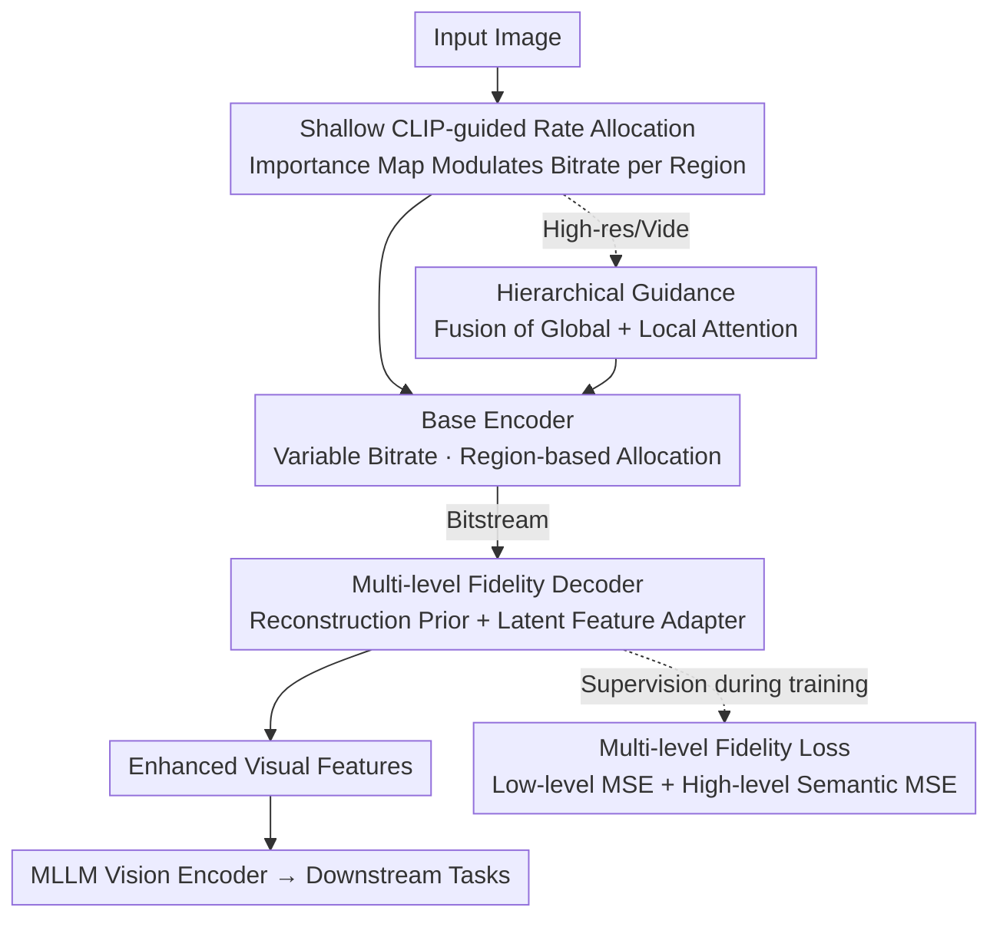

# When MLLMs Meet Compression Distortion: A Coding Paradigm Tailored to MLLMs

**Conference**: ICLR 2026  
**Paper**: [OpenReview](https://openreview.net/) (ICLR 2026 conference paper)  
**Code**: https://github.com/jmliu206/CoTAM  
**Area**: Multimodal VLM / Image Coding  
**Keywords**: MLLM Image Coding, Compression Distortion, Rate Allocation, CLIP Semantic Prior, Cross-level Features

## TL;DR
The authors systematically analyze the impact of image compression distortion on Multimodal Large Language Models (MLLMs), identifying "cross-level features" as the most vulnerable. Consequently, they propose CoTAM, an image codec tailored for MLLMs. It utilizes shallow CLIP attention for semantic rate allocation at the encoder and preserves multi-level information via a reconstruction prior, adapters, and multi-level losses at the decoder, saving up to 35.99% bitrate while maintaining downstream performance.

## Background & Motivation
**Background**: MLLMs (such as GPT-4o, Gemini, LLaVA) are mostly deployed in the cloud. Edge devices must compress images/videos before transmission. Currently available compressors fall into two categories: traditional codecs (JPEG, ELIC, etc.) optimized for the Human Visual System (HVS) to achieve pixel fidelity, and Image Coding for Machines (ICM) methods optimized for specific narrow tasks (e.g., detection, segmentation).

**Limitations of Prior Work**: Both types show inconsistent performance when applied to MLLMs. HVS codecs perform well on low-level structural tasks (like large-font OCR) but suffer in high-level tasks. Conversely, ICM methods excel in high-level semantic tasks (like landmark recognition) but fail elsewhere. This is because they do not address the fundamental question: How do MLLMs perceive and react to compression distortion holistically?

**Key Challenge**: Downstream tasks of MLLMs span multiple granularities—OCR requires low-level structure, object recognition requires high-level semantics, and counting requires both. Existing ICM paradigms attempt to preserve high-level semantics while discarding low-level details, which specifically damages tasks requiring both.

**Key Insight**: Borrowing from inflow/outflow attention analysis, the authors dissect the CLIP vision encoder and find that information processing occurs in **three stages**: ① Shallow layers perform initial screening (divergent attention, capturing textures/edges); ② Middle layers perform local information extraction (attention contracts to neighboring patches, extracting low-level features with clear structures); ③ Deep layers perform global semantic integration (attention converges to a few "summary tokens," assembling local features into high-level semantics). Quantifying this with average attention distance $D_{avg}$ and maximum attention distance $D_{top1}$ reveals a clear "U-shaped curve," confirming the three stages.

**Key Findings**: Measuring the cosine similarity between tokens of original and compressed images across layers shows that low-level features in Stages 1 and 2 are robust to compression (linear gradual decline). However, **similarity drops sharply at the beginning of Stage 3**, which is the critical point for the formation of "cross-level features." These are fragile because they rely on both high-fidelity low-level details from Stage 2 and emerging high-level semantics from Stage 3; even slight damage to low-level details causes disproportionate collapse during synthesis. Interestingly, "coarse high-level semantics" in late Stage 3 regain robustness.

**Core Idea**: An effective MLLM codec must **simultaneously** preserve low-level fidelity and high-level semantics to prevent the collapse of fragile cross-level features—this serves as the foundation of CoTAM.

## Method

### Overall Architecture
CoTAM is a dual-strategy codec featuring "semantic rate allocation at the encoder and multi-level fidelity restoration at the decoder." The entire pipeline freezes the base codec and only inserts lightweight peripheral modules. For an input image, the encoder uses shallow attention from a frozen CLIP model to calculate an "importance map," directing the base encoder to allocate more bits to significant regions. After transmission as a bitstream, the decoder treats the decoded image as a "reconstruction prior" to maintain low-level structure and utilizes a lightweight adapter to inject high-level semantic enhancement into the feature domain before feeding it to the MLLM's vision encoder. During training, an additional "multi-level fidelity loss" supervises the restoration of both low-level and high-level features. For high-resolution images and videos, a "hierarchical guidance" mechanism is added to fuse global and local attention.

### Key Designs

**1. Shallow CLIP-guided Encoder: Using Three-layer Attention as a "Semantic Compass" for Bitrate Allocation**

**Function**: This addresses the issue where traditional codecs distribute bits uniformly and ICM focuses only on narrow tasks, neither knowing which regions are semantically important for MLLMs. Based on Takeaway 2 (shallow layers perform initial screening with maximum attention distance), the authors average the [CLS] attention scores from the **first three layers** of a frozen CLIP model. This is downsampled into a small spatial map (e.g., $8\times8$) to quantify semantic richness. This continuous map is then quantized into a **three-level discrete mask** using statistical $\mu \pm k\sigma$. These three integer levels correspond directly to bitrate instructions: decrease bitrate / maintain baseline / increase bitrate. This patch-based mask modulates the internal quantization parameters of the base encoder, shifting bits to semantic key areas relevant to MLLMs. The overhead is negligible—the map is tiny, only 128 bits for a $336\times336$ input. Shallow layers are used instead of deep layers because shallow attention is divergent and suitable for "global screening," whereas deep attention converges to summary tokens, and using it for rate allocation actually degrades performance (validated by ablation).

**2. Multi-level Fidelity Decoder: Reconstruction Prior for Low-level, Latent Adapter for High-level**

**Function**: This addresses a common flaw in ICM methods—in pursuing high-level semantic fidelity, they damage low-level structural information, causing cross-level features to collapse. The decoder employs two strategies: First, it uses the **decoded image itself as a reconstruction prior**. Standard compression maintains robust low-level structures relatively well (Takeaway 3), and using the decoded image stabilizes this base information. Moreover, since MLLM vision encoders are pre-trained on natural RGB images, feeding the decoded image directly avoids domain shift. Second, a **lightweight Latent Feature Adapter** (a single transformer block) is attached to this prior. it acts directly on the latent codes decoded from the bitstream to generate "semantically enhanced features," which are then integrated into the patch embeddings extracted from the decoded image via element-wise addition. This injects high-level semantic guidance into the feature domain without disturbing low-level information, achieving the best of both worlds.

**3. Multi-level Fidelity Loss: Supervising Both Ends of the Feature Spectrum**

Using only one type of loss is insufficient—high-level loss alone leads to loss of low-level detail, while low-level loss alone provides detail without semantic coherence. The authors use a weighted multi-level fidelity loss for end-to-end training:

$$L_{total} = \lambda_{low} L_{low} + \lambda_{high} L_{high}$$

The low-level fidelity loss $L_{low}$ constrains **shallow layers**, minimizing the MSE between original and decoded patch embeddings to recover fine-grained details often destroyed by existing methods. The high-level perceptual loss $L_{high}$ constrains **final layers**, minimizing the MSE between original and processed token representations to ensure global semantic coherence. Managing both ends aligns with the core principle of preserving both low-level fidelity and high-level semantics. The training protocol involves 5 epochs, with the first epoch using only $L_{low}$ for initialization to stabilize the optimization trajectory by learning base structure. Hyperparameters are $k=0.75$, $\lambda_{low}=0.1$, and $\lambda_{high}=1$.

**4. Hierarchical Guidance: Extending to High-Resolution Images and Videos**

High resolution is essential for MLLMs, but guidance from a single fixed-size downsampled image is too coarse (blurry background attention fails to capture keys like human heads), while purely patch-by-patch local guidance lacks global context. The authors propose **hierarchical guidance**: fusing global and local importance maps to obtain a "locally precise and globally aware" signal. Simultaneously, decoded high-resolution features are resized into a global feature and passed through the adapter to match the MLLM input structure of "multiple high-res patches + one downsampled global patch." For video MLLMs, which treat frames as images, this semantic guidance is applied frame-by-frame.

### Loss & Training
Refer to Key Design 3. The core is the multi-level fidelity loss $L_{total} = \lambda_{low} L_{low} + \lambda_{high} L_{high}$. Training is conducted on one million images sampled from CC3M for 5 epochs, with the first epoch as a $L_{low}$ warm-up. Throughout the process, the **base codec is frozen**, and only the peripheral adapter and guidance modules are learned, thereby bypassing the "performance vs. reconstruction fidelity" trade-off.

## Key Experimental Results

### Main Results
Universality is verified using two learned compression models, ELIC and DCAE, as base codecs. MLLMs include LLaVA-1.5 (7B/13B) primarily, with generalization verified on LLaVA-OneVision-7B (SigLIP) and InternVL2-8B (InternViT). Complexity and BD-Rate are shown below:

| Method | Encoding (s) | Decoding (s) | Total Time (s) | BD-Rate↓ |
|------|---------|---------|-----------|----------|
| ELIC | 0.173 | 0.096 | 0.269 | 0.00 |
| Ours(ELIC) | 0.178 (+2.9%) | 0.101 (+5.2%) | 0.279 (+3.7%) | **-35.99%** |
| DCAE | 0.077 | 0.085 | 0.162 | 0.00 |
| Ours(DCAE) | 0.080 (+3.9%) | 0.091 (+7.1%) | 0.171 (+5.6%) | **-31.05%** |

- Given equivalent downstream performance, the ELIC base saves 35.99% bitrate, and the DCAE base saves 31.05%. Encoding time increases only by roughly 3–6% since only the first three CLIP layers are used and the codec is not fine-tuned. PSNR shows only slight decreases (on Kodak).
- Consistently outperforms baselines (ELIC, DCAE, Bridge-d1/d3, ICMH-adapt) across 6 image benchmarks (MME / TextVQA / POPE / SeedBench / VQAv2 / MMMU / MMBench) and extends the framework to high-res and video (Video-MME) MLLM scenarios for the first time.

### Ablation Study

| Configuration | Performance | Description |
|------|------|------|
| Full model | Optimal | Complete CoTAM |
| w/o Adapter | Catastrophic drop across all benchmarks | The adapter is an indispensable bridge between compressed features and the MLLM |
| w/o Rec. (No Reconstruction Prior) | Sharp drop in TextVQA/SeedBench, minor in MME | Different tasks have varying dependencies on visual fidelity |
| w/o CLIP guidance | Consistent drop across all benchmarks | Semantic rate allocation is an effective general optimization |
| only $L_{high}$ | Loss of low-level detail | Lacks fine-grained structure |
| only $L_{low}$ | Semantic incoherence | Sufficient detail but inconsistent high-level semantics |

### Key Findings
- **Adapter contributes the most**: Removing it causes a total collapse across three benchmarks, indicating its universal and critical role in aligning compressed features with the downstream MLLM feature space.
- **Value of reconstruction prior varies by task**: Tasks like TextVQA and SeedBench, which rely on visual fidelity, suffer heavily without it, whereas MME shows moderate impact—confirming that different tasks depend on low-level details to different degrees.
- **Shallow attention outperforms deep**: Using the first three layers of CLIP for guidance is optimal. Deep attention is globally convergent and results in performance drops when used for bitrate allocation, consistent with the three-stage information flow model.
- **Multi-level loss is essential**: Using only high-level or only low-level loss is suboptimal; the fusion of both is best.

## Highlights & Insights
- **"Cross-level features are the most fragile" is the "aha" moment**: Deconstructing the MLLM vision encoder into three stages and locating the sharp drop at early Stage 3 via token cosine similarity explains why counting tasks collapse most under compression—it is not a uniform loss of features, but a disproportionate failure of the synthesis process bridging low and high levels.
- **Zero-cost Semantic Compass**: Utilizing frozen shallow CLIP attention with $\mu\pm k\sigma$ three-level quantization encodes an importance map in just 128 bits. This "lightweight semantic prior for rate allocation" can be migrated to any learned codec with almost no bitrate overhead.
- **Frozen Codec Bypasses Trade-off**: By not fine-tuning the base codec and only adding peripheral adapters and losses, the method serves MLLMs while preserving general reconstruction quality. This decoupling allows for plug-and-play use with models like ELIC or DCAE.
- **Ready for High-res/Video**: Hierarchical guidance and frame-by-frame application extend the method from low-res images to high-res images and video MLLMs, representing the first unified framework in this direction.

## Limitations & Future Work
- The analysis isolates the vision encoder and deliberately strips away the LLM backbone influenced by text prompts. Therefore, the conclusions represent general laws at the "vision processing pipeline" level and may not cover secondary amplification/compensation effects of compression distortion at the LLM end.
- Rate allocation depends on frozen CLIP attention. If the MLLM uses a vision encoder significantly different from CLIP (e.g., pure SigLIP/InternViT), whether the guidance remains optimal requires further validation (though generalization has been tested, the guidance still comes from CLIP).
- The three-level discrete mask (decrease/stable/increase) is relatively coarse; future work could explore finer-grained or learnable rate instructions. On the video side, it is still "frame-by-frame," not yet exploiting inter-frame temporal redundancy.
- Many BD-Rate and performance values are presented in figures (Fig. 7–9). While representative numbers like 35.99% and 31.05% are highlighted, specific gains for each benchmark should refer to the original tables/figures.

## Related Work & Insights
- **vs. Traditional HVS Codecs (ELIC, DCAE)**: These are optimized for human fidelity, performing well on low-level structural tasks but failing on high-level semantic ones. CoTAM uses them as a base and adds semantic guidance/multi-level fidelity, transforming "for human" into "for MLLM."
- **vs. ICM Methods (Bridge-d1/d3, ICMH-adapt)**: These preserve only high-level semantics and discard low-level details, destroying cross-level features. CoTAM preserves both, preventing collapse in cross-level tasks like counting.
- **vs. Fine-tuned Codec ICM (Bridge-d3)**: CoTAM's main scheme freezes the codec to bypass the performance-reconstruction trade-off. Even when compared as a fine-tuned variant with rate loss, it outperformed competitors, and both significantly surpassed the non-fine-tuned base.

## Rating
- Novelty: ⭐⭐⭐⭐⭐ First to systematically characterize the differential impact of compression distortion on MLLM multi-level features and design a codec accordingly.
- Experimental Thoroughness: ⭐⭐⭐⭐ Spans 4 MLLMs, 7+ benchmarks, two base codecs, covers high-res/video, and includes complete ablations.
- Writing Quality: ⭐⭐⭐⭐ Clear logical loop from analysis to method, though key results are mostly in figures, making specific numbers slightly harder to find.
- Value: ⭐⭐⭐⭐⭐ Transmission bottlenecks for cloud MLLM deployment are a real-world demand; a 35.99% bitrate saving with plug-and-play capability has high deployment value.

<!-- RELATED:START -->

## Related Papers

- [\[ICLR 2026\] Constructive Distortion: Improving MLLMs with Attention-Guided Image Warping](constructive_distortion_improving_mllms_with_attention-guided_image_warping.md)
- [\[AAAI 2026\] When Eyes and Ears Disagree: Can MLLMs Discern Audio-Visual Confusion?](../../AAAI2026/multimodal_vlm/when_eyes_and_ears_disagree_can_mllms_discern_audio-visual_confusion.md)
- [\[ICLR 2026\] EventFlash: Towards Efficient MLLMs for Event-Based Vision](eventflash_towards_efficient_mllms_for_event-based_vision.md)
- [\[ICLR 2026\] Visual Jigsaw Post-Training Improves MLLMs](visual_jigsaw_post-training_improves_mllms.md)
- [\[ICLR 2026\] Sparsity Forcing: Reinforcing Token Sparsity of MLLMs](sparsity_forcing_reinforcing_token_sparsity_of_mllms.md)

<!-- RELATED:END -->
