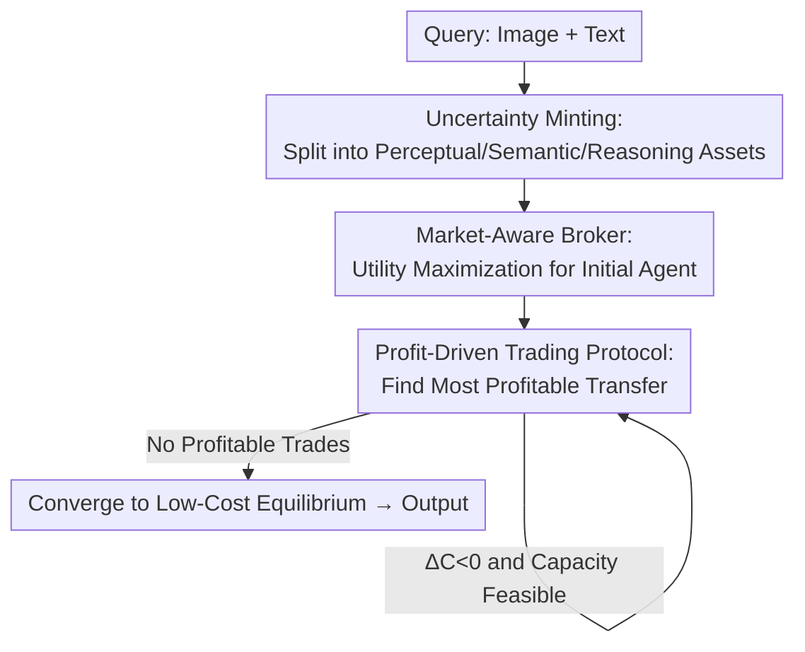

# Why Keep Your Doubts to Yourself? Trading Visual Uncertainties among Vision-Language Models

**Conference**: ICLR 2026  
**OpenReview**: [https://openreview.net/forum?id=zeqCjGQB4U](https://openreview.net/forum?id=zeqCjGQB4U)  
**Area**: Multimodal VLM / Multi-Agent Systems  
**Keywords**: VLM Multi-Agent, Uncertainty Trading, Market Mechanism, Cost-Aware Coordination, Thompson Sampling

## TL;DR
This paper proposes **Agora**, which reconstructs the collaboration among multiple heterogeneous VLMs into an "uncertainty trading market." It decomposes epistemic uncertainty into three-dimensional tradable assets (perceptual, semantic, and reasoning). Agents sell uncertainty to the most capable and cost-effective experts according to economic rules of "minimizing total system cost." A market broker extended from Thompson Sampling selects the initial agent. Agora achieves significant performance gains (e.g., +8.5% on MMMU) while reducing costs by more than 3x across five multimodal benchmarks.

## Background & Motivation

**Background**: As VLM capabilities strengthen, researchers naturally look toward Multi-Agent Systems (MAS) to aggregate multiple VLMs for collective intelligence. Current coordination paradigms fall into two categories: aggregation methods like Mixture-of-Agents (MoA), which use "multi-model voting for consensus," and routing methods like KABB, which select models based on historical performance and semantic similarity.

**Limitations of Prior Work**: These methods become economically unsustainable as the scale increases, with invocation costs spiraling out of control due to coordinating heterogeneous agents with information asymmetry. More critically, their coordination relies on "heuristic proxies": MoA assumes errors are independent and identically distributed (i.i.d.), but when models share architectural biases, they produce **correlated hallucinations** for ambiguous inputs, and voting amplifies these common errors. KABB's scoring function $S = \alpha \cdot P_{hist} + \beta \cdot Sim_{sem}$ ignores the cost vector $c$ and collapses the entire uncertainty vector into a scalar, losing structural information.

**Key Challenge**: The authors abstract these failures into a unified defect termed **Agnostic Coordination**. If a coordination mechanism is simultaneously "cost-agnostic" (ignoring processing costs) and "uncertainty-structure-agnostic" (collapsing uncertainty vectors), it is proven to be necessarily suboptimal for tasks where the heuristically strongest agent is not the most cost-effective solver (the paper's Inefficiency Theorem). The root cause is treating intelligence as a commodity that can be accumulated by brute force rather than a scarce economic resource requiring precise management.

**Goal**: Design a coordination mechanism that **explicitly incorporates both cost and uncertainty structure into decision-making**. The objective is to solve a constrained optimization problem: minimize the total expected system cost while keeping the final uncertainty below an acceptable threshold $\epsilon$: $\min_\pi \mathbb{E}_{t\sim T}[C(\pi, u(t), c, \Xi)]$ s.t. $\|u_{final}\|\le\epsilon$.

**Key Insight**: Borrowing from economics, since the fundamental problem is coordinating self-interested agents under information asymmetry, the system should not attempt to approximate a central planner. Instead, it should use a **decentralized market mechanism** where price signals and economic incentives drive agents to reveal private information and route uncertainty to those best equipped to handle it.

**Core Idea**: **"Minting" epistemic uncertainty into currency**. Structure it into a priceable, tradable three-dimensional asset. Agents trade uncertainty according to profit rules (cost reduction equals successful transaction), transforming multi-agent coordination into a micro-economy that converges toward a low-cost equilibrium.

## Method

### Overall Architecture

The input to Agora is a multimodal query (text + images), and the output is the final answer. Coordination is executed as a three-step serial market process: **establishing tradable assets → defining transaction rules → initialization and convergence by the broker**.

Specifically: ① The system decomposes the query's epistemic uncertainty into vectorized assets across three dimensions: perception $U_{perc}$, semantics $U_{sem}$, and reasoning $U_{inf}$. Each agent maintains its own uncertainty "portfolio." ② A "market broker" uses a market-aware utility function to select the most cost-effective initial handler from the agent pool and assigns all initial uncertainty to it. ③ During the iterative trading phase, the system repeatedly identifies the "most profitable transaction"—transferring a dimension of uncertainty from agent $i$ to agent $j$, who is more specialized and cheaper for that dimension. A trade is executed if it reduces the total system cost. The market converges to a locally optimal, cost-efficient equilibrium when no further profitable trades exist. A "historical transaction ledger" records past deals to price subsequent uncertainty transfers.

### Key Designs

**1. Uncertainty Minting: Decomposing Cognitive Burden into Tradable Assets**

To address the structure-agnostic nature of prior work (like KABB), Agora first "mints currency" by defining well-structured assets. Total uncertainty $u$ is split into **tradable epistemic uncertainty $u_{epis}$** (the reducible part that can be eliminated with information) and **non-tradable aleatory uncertainty $u_{alea}$** (inherent, irreducible risk). The $u_{epis}$ entering the market is a 3D vector $u_{epis} = [u_{perc}, u_{sem}, u_{inf}]^T$. This vectorization allows uncertainty to be **priced and traded independently** per dimension. An agent might have strong perception but weak reasoning; thus, it can "buy" perceptual uncertainty from others while "selling" its reasoning uncertainty. Each agent $a_i$ maintains a portfolio $U(a_i,t) = U_{base}(a_i,t) + \sum_{j\ne i} U_{transfer}(a_j\to a_i,t)$.

**2. Mechanism: Profit-Driven Trading Protocol via Cost Increment $\Delta C$**

This is the core mechanism for overcoming "cost-agnosticism." All trades follow a purely rational economic rule. When the system identifies an "arbitrage opportunity" (potential to reduce total cost), it calculates the cost increment after transferring an uncertainty package $T_{ij}(t)$ from $a_i$ to $a_j$:

$$\Delta C(T_{ij}(t)) = \underbrace{[c_i(U_i - T_{ij}) + c_j(U_j + (1-\xi_j)T_{ij})]}_{\text{Post-trade cost}} - \underbrace{[c_iU_i + c_jU_j]}_{\text{Pre-trade cost}} = T_{ij}(t)\cdot[c_j(1-\xi_j) - c_i]$$

The simplified formula is intuitive: $\xi_j$ is the expertise of the receiver $a_j$ in that dimension. A trade is profitable only when assigning it to a more capable or cheaper expert costs less than keeping it. The rule is: **execute if and only if the trade is profitable ($\Delta C < 0$) and feasible (receiver has cognitive capacity $U_j + T_{ij} \le C_j$)**. Every transaction constitutes a greedy descent toward the global cost objective.

**3. Market Broker: Finding Economic Origins via Extended Thompson Sampling**

While the trading protocol ensures cost-saving directions, decentralized optimization requires a good **starting point** to avoid poor local solutions. Agora employs a broker extended from Thompson Sampling to maximize market-aware expected utility:

$$\tilde{\theta}^{(t)}_{S} = (\mathbb{E}[Reward^{(t)}_S] - Cost^{(t)}_S)\cdot \exp(-\lambda\cdot Dist(S,t))\cdot U_{strategic}(S)^\omega \cdot Synergy(S)^\eta \cdot \gamma^{\Delta t}$$

This function considers net return (Expected Reward - Cost) as the primary term, adjusted by task distance $Dist$, strategic uncertainty $U_{strategic}$ (whether choosing this agent enables profitable future trades), synergy with other agents, and time decay $\gamma^{\Delta t}$. Ablation studies show that **strategic uncertainty $U_{strategic}$ contributes most**, confirming that selecting a starting point that leverages subsequent profitable trades is key to the broker's intelligence.

### Loss & Training

Agora is an **inference-time coordination algorithm** rather than an end-to-end trainable network. The agent pool consists of five representative VLMs (qwen2.5vl-72b/7b, gemini-2.0-flash, gemma-3-27b, gpt-4o-mini) acting as "experts" with specific prompts. The system is accessed via OpenRouter API with greedy decoding (`do_sample=False`). Optimization happens through greedy cost descent in the trading protocol and online selection in the broker's Multi-Armed Bandit (MAB) process, requiring no gradient-based training.

## Key Experimental Results

### Main Results

Across five multimodal benchmarks, Agora improves the performance of the best base models in the pool (relative gains in parentheses):

| Benchmark | Best Base in Pool | Agora | Gain |
|-----------|-------------------|-------|------|
| MMMU (Val) | 70.7% (gemini-2.0-flash) | 79.2% | +8.5% |
| MMBench V11 Test | 88.4% (qwen-72b) | 89.5% | +1.1% |
| MathVision | 41.3% (gemini-2.0-flash) | 44.3% | +2.0% |
| InfoVQA (test) | 87.3% (qwen-72b) | 88.9% | +1.6% |
| CC-OCR | 79.8% (qwen-72b) | 81.2% | +1.4% |

On MMBench, Agora achieves the highest accuracy (89.50%) with a relative cost of 1.00. In comparison, KABB-VLM and MoA achieve lower accuracies (87.12%, 86.65%) while costing 1.24x and 3.11x more, respectively. Methods like FrugalGPT reduce costs (0.73–0.91x) but suffer significant accuracy drops (8–9.6 points). Agora occupies a superior Pareto frontier for accuracy and cost.

### Ablation Study

Comparison of Broker Strategies (MMMU Val, trading enabled except for "No Trading"):

| Configuration | Accuracy (%) | $U_{final}$↓ | COI↓ | UAPS (%)↑ |
|---------------|--------------|--------------|------|-----------|
| Agora (Ours, MAB) | 79.0 | 0.15 | 1.2 | 70.5 |
| Agora (No Trading) | 75.5 | 0.22 | 1.0 | 65.0 |
| KABB Selector + Trading | 76.0 | 0.25 | 1.5 | 65.5 |
| PPO Selector + Trading | 74.0 | 0.28 | 1.6 | 62.0 |
| DQN Selector + Trading | 73.0 | 0.30 | 1.7 | 60.0 |

Ablation of Utility Factors (MMBench V11 Test, $N=6$):

| Variant | Accuracy (%)↑ | $U_{final}$↓ | UAPS (%)↑ | Relative Cost↓ |
|---------|---------------|--------------|-----------|----------------|
| Agora (Full) | 89.50 | 0.16 | 78.33 | 1.00 |
| w/o $U_{strategic}$ | 86.42 | 0.23 | 71.58 | 1.06 |
| w/o Synergy | 87.91 | 0.19 | 74.88 | 1.03 |
| w/o Dist | 88.53 | 0.18 | 76.21 | 1.01 |
| Only Net Return | 82.15 | 0.31 | 60.72 | 0.92 |

### Key Findings
- **Trading is a primary performance driver**: On MMMU, enabling trading (Agora 79.0%) vs. No Trading (75.5%) yields a 3.5% gain and drops residual uncertainty from 0.22 to 0.15.
- **Market-Aware Broker > RL/Heuristic Selectors**: The MAB broker outperforms KABB and several RL methods (PPO/DQN), suggesting economic utility functions are better suited for coordination than general RL.
- **Strategic uncertainty is the most critical factor**: Removing $U_{strategic}$ caused the largest accuracy drop (3.08%) and increased costs, confirming its role in guiding the market toward profitable chains of trades.
- **Sub-linear cost growth**: Performance peaks at $N=8$, showing diminishing returns and validating the economic rationality that infinite agents are not required.

## Highlights & Insights
- **Paradigm Shift from "Coordination" to "Market"**: Instead of approximating an omniscient scheduler, the authors accept information asymmetry and use price signals. The "uncertainty as currency" metaphor provides a computable criterion: $\Delta C = T_{ij}\cdot[c_j(1-\xi_j)-c_i]$.
- **Vectorization Enables Fine-Grained Division of Labor**: Decomposing uncertainty allows specialized experts to handle specific sub-tasks (e.g., cheap OCR models for perception, expensive models for reasoning), which is a fundamental advancement over MoA's undifferentiated voting.
- **Transferable Framework**: The approach of formalizing costs/uncertainties as tradable assets combined with marginal cost criteria for greedy allocation can be applied to any heterogeneous model ensemble or cascade (e.g., LLM routing, RAG budget allocation).

## Limitations & Future Work
- **Reliability of Uncertainty Quantification**: The market relies on accurate 3D decomposition of epistemic uncertainty ($u_{perc}/u_{sem}/u_{inf}$). If this estimation is noisy, pricing and trading will become distorted.
- **Greedy Local Optima**: The trading protocol only guarantees a locally optimal equilibrium. While the broker mitigates this through initialization, suboptimal outcomes remain possible.
- **Dependency on Closed-Source APIs**: Experiments use OpenRouter models; the robustness of expertise vectors $\xi$ and costs $c$ across dynamic pools remains to be tested.
- **Theoretical vs. Real-world Gap**: The Inefficiency Theorem relies on formalized assumptions. In reality, expertise may drift and API prices fluctuate, necessitating research into market stability under these conditions.

## Related Work & Insights
- **vs. Mixture-of-Agents (MoA)**: MoA relies on consensus and assumes i.i.d. errors. Agora identifies that shared biases amplify collective hallucinations and that MoA ignores voting costs. Agora's dimensional trading is more efficient and avoids consensus traps.
- **vs. KABB / Knowledge Routers**: KABB collapses uncertainty into a scalar and is cost-agnostic. Agora preserves structural dimensions and incorporates cost into the rule set, achieving higher accuracy (89.5% vs 87.12%) at lower cost (1.00x vs 1.24x).
- **vs. FrugalGPT / RouteLLM**: These methods save cost but significantly sacrifice accuracy. Agora occupies a better Pareto frontier by using trading instead of a "one-shot" cheap model selection.

## Rating
- **Novelty**: ⭐⭐⭐⭐⭐ Reconstructing VLM coordination as a decentralized market with tradable structural uncertainty is a genuine conceptual breakthrough.
- **Experimental Thoroughness**: ⭐⭐⭐⭐ Solid across five benchmarks with multiple baselines (RL, routing, MAS), though more validation on the uncertainty estimation itself would be beneficial.
- **Writing Quality**: ⭐⭐⭐⭐ Clear economic narrative with supporting theorems. Some core metrics are relegated to the appendix.
- **Value**: ⭐⭐⭐⭐⭐ Provides a practical, high-performance, and cost-efficient paradigm for the pressing issue of VLM economic sustainability.

<!-- RELATED:START -->

## Related Papers

- [\[ICCV 2025\] ViLU: Learning Vision-Language Uncertainties for Failure Prediction](../../ICCV2025/multimodal_vlm/vilu_learning_vision-language_uncertainties_for_failure_prediction.md)
- [\[ICLR 2026\] ERGO: Efficient High-Resolution Visual Understanding for Vision-Language Models](ergo_efficient_high-resolution_visual_understanding_for_vision-language_models.md)
- [\[ICLR 2026\] Multimodal Prompt Optimization: Why Not Leverage Multiple Modalities for MLLMs](multimodal_prompt_optimization_why_not_leverage_multiple_modalities_for_mllms.md)
- [\[ICLR 2026\] ViPER: Empowering the Self-Evolution of Visual Perception Abilities in Vision-Language Models](viper_empowering_the_self-evolution_of_visual_perception_abilities_in_vision-lan.md)
- [\[CVPR 2026\] The LLM Bottleneck: Why Open-Source Vision LLMs Struggle with Hierarchical Visual Recognition](../../CVPR2026/multimodal_vlm/the_llm_bottleneck_why_open-source_vision_llms_struggle_with_hierarchical_visual.md)

<!-- RELATED:END -->
