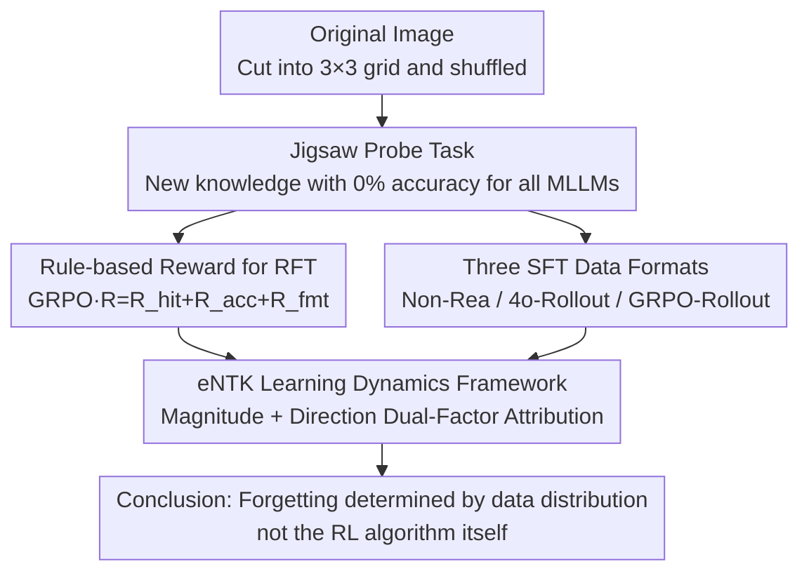

# Why Reinforcement Fine-Tuning Preserves Prior Knowledge Better: A Data Perspective

## Meta Info
- **Conference**: ICLR 2026
- **arXiv**: [2506.23508](https://arxiv.org/abs/2506.23508)
- **Code**: Not released
- **Area**: Multimodal Large Language Models / Reinforcement Fine-Tuning / Catastrophic Forgetting
- **Keywords**: RFT, SFT, Catastrophic Forgetting, Learning Dynamics, GRPO, Jigsaw Tasks

## TL;DR

This work systematically investigates the impact of SFT and RFT on prior knowledge through jigsaw tasks, revealing that RFT's ability to avoid catastrophic forgetting stems from its **data distribution** rather than algorithmic differences—data sampled by RFT naturally aligns with the base model's probability landscape, resulting in minimal interference.

## Background & Motivation

SFT and RFT are the two primary methods for post-training large models, but their effects on preserving prior knowledge remain unclear. Existing research predominantly focuses on downstream task performance, neglecting the impact of fine-tuning on pre-trained knowledge.

Key Observations:
- SFT learns new tasks rapidly but leads to **catastrophic forgetting**.
- RFT learns more slowly but **preserves prior knowledge better**.
- The underlying cause remains unknown: is it due to algorithmic differences or data distribution differences?

This paper introduces **jigsaw tasks** as a novel benchmark (where existing MLLMs, including GPT-4o, achieve 0% accuracy) to systematically study this problem.

## Method

### Overall Architecture

The paper does not propose a new algorithm but designs a controlled experiment to decompose the causal chain of why "RFT forgets less than SFT." It uses a jigsaw task, which no MLLM can solve, as a pure probe for "new knowledge." RFT and SFT (with various data formats) are trained on the same task. Finally, an eNTK learning dynamics framework is used to quantify the perturbation of each training sample on prior knowledge, attributing the difference to data distribution rather than the optimization algorithm.

### Key Designs

**1. Jigsaw Probe Task: A zero-baseline "new knowledge" probe**
The prerequisite for studying forgetting is ensuring the new task is entirely novel to the model. The paper cuts original images into $3 \times 3$ grids and shuffles them, requiring the model to output the correct index sequence to reconstruct the image. Key SOTA MLLMs (e.g., GPT-4o, Qwen2.5-VL-72B) achieve 0% accuracy, ensuring any performance gain comes from fine-tuning and any prior knowledge decline is a side effect of the fine-tuning itself.

**2. Rule-based Reward for RFT: Leveraging partial correctness with GRPO**
Jigsaw answers are sparse. To address the lack of early signals, the reward is decomposed: $R = R_{\text{hit}} + R_{\text{acc}} + R_{\text{fmt}}$. The hit reward $R_{\text{hit}} = \frac{\#\text{correct indices}}{m \times n}$ provides continuous partial credit based on correctly placed tiles. The accuracy reward $R_{\text{acc}} \in \{0, 1\}$ is binary for full completion, and the format reward $R_{\text{fmt}} \in \{0, 1\}$ ensures the output follows the `<think>...</think><answer>...</answer>` structure.

**3. Three SFT Data Formats: Decoupling algorithm from data**
To verify if differences arise from data rather than the SFT algorithm, SFT is trained on different supervision sources: Non-Reasoning (Non-Rea) with direct answers; Rea-4o-Rollout using GPT-4o generated reasoning traces; and GRPO-Rollout using correct rollouts produced by the RFT-trained model. GRPO-Rollout is the critical group—it follows the standard SFT process but uses data from the RFT self-sampled distribution. If it preserves prior knowledge, the data distribution is the primary factor.

**4. eNTK Learning Dynamics Framework: Quantifying prior perturbation**
This framework explains the mechanism by which a training sample $x_u$ changes the probability of a prior sample $x_v$. Based on the empirical Neural Tangent Kernel (eNTK), the change in log-probability after one update is approximated as:

$$\Delta \log \pi^t(x_v)|_{x_u} \approx \eta \cdot \underbrace{\nabla_\theta \log \pi_{\theta^t}(x_v)^\top \nabla_\theta \log \pi_{\theta^t}(x_u)}_{\text{eNTK}(x_u, x_v)}$$

This is decomposed into two factors: **Magnitude** (the norm of the eNTK), reflecting the intensity of the perturbation, and **Direction** (gradient alignment), determining if the perturbation increases (enhances) or decreases (forgets) the prior probability. RFT self-sampled data falls into regions where the base model already has moderate probability, leading to smaller gradient norms and better alignment with prior knowledge.

## Key Experimental Results

### New Task Learning Capability (Qwen2.5-VL-3B / 7B)

| Method | Training Steps | 3×3 Jigsaw Accuracy |
|------|---------|---------------|
| Base | - | 0% |
| RFT (GRPO) | 27,360 | 66% / 75% |
| SFT-Non-Rea | 200 / 400 | 53% / 80% |
| SFT-Rea-4o-Rollout | 4,100 | 70% / 78% |
| SFT-Rea-GRPO-Rollout | 2,670 / 3,000 | 70% / 81% |

### Prior Knowledge Preservation (Qwen2.5-VL-7B, Performance Change)

| Benchmark | RFT | SFT-Non-Rea | SFT-Rea-4o | SFT-GRPO-Roll |
|------|-----|-------------|------------|----------------|
| RefCOCO_val | ↓0.6 | **↓57.2** | **↓37.5** | ↓8.6 |
| DocVQA | ±0.0 | **↓27.4** | ↓2.3 | ↓0.9 |
| MME | ↓8 | **↓1854** | ↓249 | ↓126 |
| MMStar | ↑1.7 | **↓62.8** | ↓3.7 | ↓2.4 |
| POPE | ↓0.2 | **↓69.9** | **↓12.1** | ↓3.1 |

### Key Findings

1. **RFT can learn entirely new tasks from scratch**: After sufficient exploration (27k steps), accuracy improved from 0% to 66-75%.
2. **SFT learns fast but forgets severely**: It reaches RFT-level performance in only 200-400 steps, but Grounding capability drops by 57.2%.
3. **Data is key, not the algorithm**: SFT trained on rollouts from the RFT model (SFT-Rea-GRPO-Rollout) preserves prior knowledge, with much less forgetting than standard SFT.
4. **Reasoning traces mitigate forgetting**: Data with reasoning (Rea-4o and GRPO-Rollout) shows significantly less forgetting than Non-Rea.
5. **eNTK Magnitude Analysis**: RFT rollout data has smaller eNTK norms, causing less interference with prior knowledge.
6. **eNTK Direction Analysis**: RFT rollouts are located in regions where the base model has moderate initial probability, making gradient directions more aligned with prior knowledge.

### Math/Science QA Validation
Consistent trends in forgetting and learning dynamics were observed in Math and Science QA tasks on Qwen2.5, verifying the generalizability of the conclusions.

## Highlights & Insights

- Clever choice of the jigsaw task as a touchstone for "new knowledge" where all MLLMs start at a zero baseline.
- First to explain the forgetting difference between RFT and SFT from a data perspective, providing a verifiable causal chain.
- The learning dynamics framework (magnitude + direction decomposition) provides theoretical depth.
- Training SFT on GRPO-Rollout serves as critical evidence, cleanly isolating the roles of algorithm and data.
- Provides a counter-argument to the view that "RFT cannot acquire new capabilities."

## Limitations & Future Work

- While novel, the jigsaw task is relatively simple with a fixed output format; its generalizability to more complex tasks is not fully verified.
- Experiments were limited to Qwen2.5-VL 3B/7B; larger-scale models were not tested.
- eNTK analysis is based on approximations, and its precision in massive models may be limited.
- No new anti-forgetting algorithm was proposed; the work is primarily analytical and explanatory.
- Generating GRPO-Rollout requires completing RFT training first, increasing the total computational cost.

## Related Work & Insights

- **Jigsaw Tasks**: Noroozi & Favaro (Self-supervised learning); Lyu et al. (MLLM weakness probing); Jigsaw-R1 (RFT for solving jigsaws).
- **MLLM Reinforcement Fine-Tuning**: DeepSeek-R1; Meng et al. (OOD generalization); RFT for perceptual tasks.
- **Catastrophic Forgetting Mitigation**: EWC (regularization); Experience Replay (data mixing); Architectural methods — often inapplicable to large-scale MLLMs.
- **RL's Razor**: Shenfeld et al. suggest RL implicitly biases towards KL-minimal solutions; this work provides a complementary explanation from a data perspective.

## Rating

- **Novelty**: ⭐⭐⭐⭐⭐ — A fresh perspective explaining forgetting differences through data distribution.
- **Technical Depth**: ⭐⭐⭐⭐⭐ — Rigorous learning dynamics analysis with a tight coupling of theory and experiment.
- **Experimental Thoroughness**: ⭐⭐⭐⭐ — Validated across multiple models and tasks with sophisticated ablation designs.
- **Value**: ⭐⭐⭐⭐ — Provides direct guidance for post-training strategy selection.

<!-- RELATED:START -->

## Related Papers

- [\[ICLR 2026\] WebDS: An End-to-End Benchmark for Web-based Data Science](webds_an_end-to-end_benchmark_for_web-based_data_science.md)
- [\[AAAI 2026\] ReCAD: Reinforcement Learning Enhanced Parametric CAD Model Generation with Vision-Language Models](../../AAAI2026/multimodal_vlm/recad_reinforcement_learning_enhanced_parametric_cad_model_generation_with_visio.md)
- [\[AAAI 2026\] FT-NCFM: An Influence-Aware Data Distillation Framework for Efficient VLA Models](../../AAAI2026/multimodal_vlm/ft-ncfm_an_influence-aware_data_distillation_framework_for_efficient_vla_models.md)
- [\[ICLR 2026\] VisJudge-Bench: Aesthetics and Quality Assessment of Visualizations](visjudge-bench_aesthetics_and_quality_assessment_of_visualizations.md)
- [\[ICCV 2025\] SC-Captioner: Improving Image Captioning with Self-Correction by Reinforcement Learning](../../ICCV2025/multimodal_vlm/sc-captioner_improving_image_captioning_with_self-correction_by_reinforcement_le.md)

<!-- RELATED:END -->
