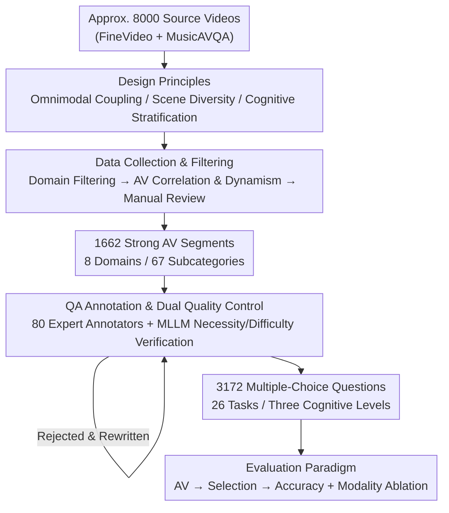

# WorldSense: Evaluating Real-World Omnimodal Understanding for Multimodal LLMs

**Conference**: ICLR 2026  
**OpenReview**: [https://openreview.net/forum?id=YxsfxAvJv4](https://openreview.net/forum?id=YxsfxAvJv4)  
**Paper**: [Project Page](https://jaaackhongggg.github.io/WorldSense)  
**Code**: https://github.com/jaaackhongggg/WorldSense (Project Page)  
**Area**: Multimodal VLM / Omnimodal Benchmarking  
**Keywords**: Omnimodal understanding, audio-visual synergy, video QA benchmark, MLLM evaluation, real-world scenarios

## TL;DR
WorldSense is the first real-world omnimodal video understanding benchmark that **mandates audio-visual synergy**. It comprises 1,662 synchronized audio-visual segments and 3,172 multiple-choice questions, each designed such that "it cannot be answered correctly if either audio or video is removed." Results show that even the strongest Gemini 2.5 Pro achieves only 65.1% accuracy, while most open-source omnimodal models perform close to random guessing.

## Background & Motivation

**Background**: Multimodal Large Language Models (MLLMs) have made significant progress in tasks such as classification, captioning, QA, OCR, segmentation, and autonomous driving. Supporting benchmarks have evolved from static image understanding to temporal video understanding.

**Limitations of Prior Work**: Existing multimodal analysis and evaluation **focus almost exclusively on "Vision + Language"**, neglecting the audio modality which is crucial in the real world. This leads to an incomplete assessment of model multimodal capabilities. The few benchmarks that incorporate audio have significant drawbacks: OmniBench and AV-Odyssey essentially evaluate **static images + audio** rather than true video; Music-AVQA and AVQA are limited to single domains with monotonous question patterns; LongVALE only evaluates captioning.

**Key Challenge**: Real-world understanding is inherently **multimodally coupled**. For example, when driving, humans must integrate visual cues (traffic lights), auditory cues (horns/sirens), and haptic cues (steering wheel feedback) to make decisions; any single modality fails to provide the full context. However, existing benchmarks either lack audio or exhibit "weak correlation" between audio and video (where questions can be answered by watching video or reading captions alone), failing to elicit true audio-visual synergy from models.

**Goal**: To construct a comprehensive benchmark that strictly evaluates the ability of MLLMs to "perceive, understand, and reason about omnimodal information in real-world scenarios." Specifically, it aims to solve three sub-problems: ensuring every question **truly requires audio-visual synergy**, covering **sufficiently diverse** real-world scenes and cognitive levels, and ensuring **high-quality, reliable** annotations.

**Key Insight**: The key to evaluation is not whether the "question includes audio," but whether "answering correctly **requires** audio." Therefore, "modality necessity" is treated as a hard constraint throughout the process, enforced via a dual verification system involving experts and MLLMs.

**Core Idea**: By using a strongly coupled design where "removing either modality leads to failure," the benchmark transforms omnimodal video understanding from an "optional bonus" into a "mandatory requirement," honestly exposing the significant gap in current MLLM real-world omnimodal reasoning.

## Method

WorldSense is a **benchmark paper** and does not propose a new model. The core contribution is a dataset construction methodology spanning "design principles → data collection → quality control → evaluation paradigm," as well as a systematic evaluation of three types of MLLMs.

### Overall Architecture

The construction of the benchmark can be viewed as a pipeline with a quality closed-loop. Following the design principles of "omnimodal coupling / scene diversity / cognitive stratification," 1,662 clips with strong audio-visual relevance are **filtered in two stages** from large-scale video libraries. Then, 80 experts manually annotate multiple-choice questions for each clip. Finally, a **dual quality control loop** involving "expert review + MLLM automated verification" rejects unqualified questions for rewriting, resulting in 3,172 evaluable questions. During evaluation, models are fed "synchronized audio-visual input + multiple-choice questions," scored by accuracy, and quantified via modality ablation.

### Key Designs

**1. Strong Omnimodal Coupling: Audio-Visual Synergy as a Hard Constraint**

This is the fundamental differentiator of WorldSense. Addressing the pain point of "weak correlation" in existing benchmarks, Ours requires that **every question satisfies the condition: "removing either audio or video results in a wrong answer."** For instance, if a person holds fruit in a video, the visual modality shows "what the fruit is," but only the narration clarifies whether "they are counting the blueberries" or "showing the size." Similarly, identifying "which country corresponds to the highest-pitched, cheerful music" requires both cultural visual cues and auditory cues. This constraint is not just subjective; it is enforced by the automated verification mechanism (see Design 3).

**2. Hierarchical Taxonomy + Three-Level Cognitive Evaluation**

To address the "single domain and monotonous questioning" of existing benchmarks, WorldSense expands across two dimensions. In the **content dimension**, it builds a hierarchical classification: 8 top-level domains (Tech & Science, Culture & Politics, Daily Life, TV & Film, Performance, Gaming, Sports, Music) subdivided into 67 fine-grained categories. It deliberately covers three acoustic modalities: speech, environmental events, and music. In the **cognitive dimension**, it designs a three-tier framework: Recognition (detecting basic elements), Understanding (grasping multimodal relationships), and Reasoning (higher-order tasks like causal inference). A total of 26 tasks are aligned with these levels. The 1,662 videos have an average duration of 141.1 seconds.

**3. Quality Control Loop with 80 Experts + MLLM Dual Verification**

This design serves as the enforcer of "modality necessity." While 80 professional annotators write the questions, a **parallel expert review and automated verification** loop ensures quality. Experts score based on linguistic clarity, multimodal necessity, and appropriate difficulty. The automated verification uses two paths: a **vision-only model Qwen2-VL** attempts the questions; if it succeeds using only vision, the question fails "audio necessity" and is revised. Simultaneously, omnimodal models like **Video-LLaMA2 and OneLLM** assess difficulty; questions correctly answered by all models are discarded as "too easy."

### Loss & Training
Ours does not involve model training. The evaluation paradigm is: each test instance = one synchronized audio-visual segment + one multiple-choice question. Models provide an answer after processing the multimodal input, which is compared with the ground truth using **match-based extraction**. The metric is accuracy. To quantify contributions, multiple modality configurations are ablated (Audio-only / Audio + Captions / Audio + Video Frames; Video / Video + Captions / Video + Raw Audio, etc.).

## Key Experimental Results

The evaluation covers three model categories: open-source omnimodal MLLMs (Unified-IO-2, OneLLM, VideoLLaMA2, Qwen2.5/3-Omni, etc.), open-source video MLLMs (Qwen2-VL, LLaVA-OneVision, InternVL2.5, LLaVA-Video, etc.), and closed-source MLLMs (Claude 3.5, GPT-4o, Gemini 1.5/2.5).

### Main Results

| Model Category | Representative Model | Avg. Accuracy |
| :--- | :--- | :--- |
| Closed-source MLLM | **Gemini 2.5 Pro** (AV) | **65.1%** (Highest) |
| Closed-source MLLM | Gemini 2.5 Flash | 52.3% |
| Closed-source MLLM | Gemini 1.5 Pro | 48.0% |
| Closed-source MLLM | GPT-4o (Vision-only) | 42.6% |
| Closed-source MLLM | Claude 3.5 Sonnet | 34.8% |
| Open-source Omnimodal | video-SALMONN 2+ (72B) | 56.5% |
| Open-source Omnimodal | Qwen3-Omni (7B) | 54.0% |
| Open-source Omnimodal | Unified-IO-2 / OneLLM / VideoLLaMA2 | 22.8–25.9% (≈Random) |
| Open-source Video | LLaVA-Video / InternVL2.5 (7-8B) | 39–40% |

Key observations: (i) Even the strongest Gemini 2.5 Pro only achieves 65.1%, far below the threshold for reliable real-world application; (ii) **Counter-intuitively**, early open-source omnimodal models (e.g., Unified-IO-2, OneLLM) perform worse (~25%) than vision-only models, showing that "having multimodal input capability" does not equate to "multimodal fusion ability."

### Ablation Study (Modality Contribution)

| Configuration | Rep. Result (Gemini 1.5 Pro) | Conclusion |
| :--- | :--- | :--- |
| Audio-only → +Video Frames | 34.6% → 48.0% (+13.4) | Visual info significantly improves understanding |
| Video-only → +Captions → +Raw Audio | 34.4% → 39.3% → 48.0% | Captions are useful, but **raw audio is more beneficial** |
| Video → +Captions (GPT-4o) | 42.6% → 50.1% (+7.5) | Transcribed captions complement video models |
| Video → +Raw Audio (OneLLM) | 12.6% → 22.8% (+10.2) | Audio gain is most evident for weaker models |

### Key Findings
- **Raw Audio > Captions**: In tasks like Music, captions fail to capture acoustic features like melody and rhythm. Raw audio preserves prosody, tone, emotion, and ambient cues, providing additional gains beyond text.
- **Audio-Visual Complementarity**: Vision provides the foundation, and audio provides a significant increment; synergy is required for robust real-world understanding. This explains why "weakly fused" models underperform.
- **Capability Bottlenecks**: Models perform worst in **audio-related tasks** (recognition/counting), **spatial reasoning**, and **emotion-related tasks**. Emotion tasks require integrating subtle cues from facial expressions and vocal tones.
- **Acoustic Type Inconsistency**: Even Gemini 1.5 Pro shows significantly lower accuracy on environmental events compared to speech and music, indicating a common weakness in understanding complex ambient sounds.

## Highlights & Insights
- **Turning "Modality Necessity" into an Enforceable Filter**: Using vision-only models to "reverse-falsify" the data—if a model can answer correctly via vision alone, the question is disqualified. This logic makes the requirement machine-verifiable.
- **Value in Failure Modes**: Rather than just a leaderboard, Ours provides fine-grained task/acoustic analysis, identifying audio understanding, counting, and emotion as three major bottlenecks for future model improvement.
- **Confirmed: "Input Capability ≠ Fusion Capability"**: The fact that some omnimodal models are outperformed by vision-only counterparts highlights that multimodal interfaces are not enough; the fusion mechanism itself remains the bottleneck.

## Limitations & Future Work
- **Single Question Format**: Relying solely on multiple-choice questions (MCQs) may allow models to guess correctly or use elimination, and it does not assess open-ended generation or explanation.
- **Data Source Bias**: Videos primarily come from FineVideo (YouTube) and MusicAVQA, potentially biasing towards specific content styles or languages.
- **Missing Modalities**: While covering speech/events/music, other modalities like touch (highlighted in the introduction) are not included; "omnimodal" currently refers to "Audio + Visual + Text."
- **Future Directions**: The work serves as a "roadmap to real-world understanding." Future work could explore stronger fusion architectures or targeted training for the identified emotional and counting weaknesses.

## Related Work & Insights
- **vs OmniBench / AV-Odyssey**: These lack temporal dynamics (static image + audio); WorldSense uses real synchronized video for temporal events and motion.
- **vs Music-AVQA / AVQA**: These are domain-specific or have monotonous questioning; WorldSense is open-domain and multi-task (8 domains, 26 tasks).
- **vs LongVALE**: LongVALE only evaluates captioning; WorldSense evaluates three layers of cognition from recognition to reasoning.
- **vs Video-MME**: Video-MME is often "weakly correlated" (answerable by vision alone), whereas WorldSense is the first to make "mandatory audio-visual synergy" a hard constraint.

## Rating
- Novelty: ⭐⭐⭐⭐⭐ First real-world omnimodal benchmark mandating synergy; original "verifiable necessity" approach.
- Experimental Thoroughness: ⭐⭐⭐⭐⭐ Covers dozens of MLLMs with extensive ablation and failure analysis.
- Writing Quality: ⭐⭐⭐⭐ Clear progression from principles to evaluation, though model abbreviations are dense.
- Value: ⭐⭐⭐⭐⭐ Honestly exposes the gap (65% for SOTA) and pinpoints three major shortcomings for the community.

<!-- RELATED:START -->

## Related Papers

- [\[ACL 2026\] EDU-CIRCUIT-HW: Evaluating Multimodal Large Language Models on Real-World University-Level STEM Student Handwritten Solutions](../../ACL2026/multimodal_vlm/edu-circuit-hw_evaluating_multimodal_large_language_models_on_real-world_univers.md)
- [\[ICLR 2026\] Bongard-RWR+: Real-World Representations of Fine-Grained Concepts in Bongard Problems](bongard-rwr_real-world_representations_of_fine-grained_concepts_in_bongard_probl.md)
- [\[ICLR 2026\] MotionSight: Boosting Fine-Grained Motion Understanding in Multimodal LLMs](motionsight_boosting_fine-grained_motion_understanding_in_multimodal_llms.md)
- [\[ACL 2026\] GuideDog: A Real-World Egocentric Multimodal Dataset for Blind and Low-Vision Accessibility-Aware Guidance](../../ACL2026/multimodal_vlm/guidedog_a_real-world_egocentric_multimodal_dataset_for_blind_and_low-vision_acc.md)
- [\[ICML 2026\] TimeSpot: Benchmarking Geo-Temporal Understanding in Vision-Language Models in Real-World Settings](../../ICML2026/multimodal_vlm/timespot_benchmarking_geo-temporal_understanding_in_vision-language_models_in_re.md)

<!-- RELATED:END -->
