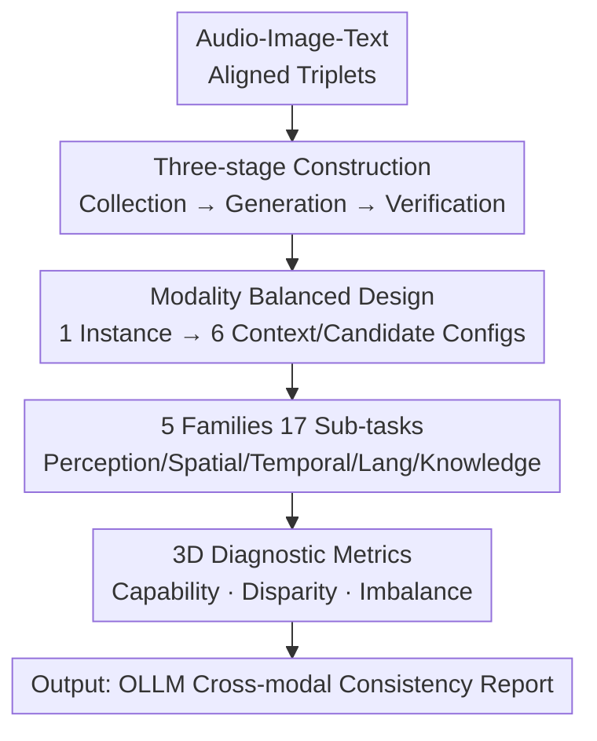

# XModBench: Benchmarking Cross-Modal Capabilities and Consistency in Omni-Language Models

**Conference**: ICLR 2026  
**Paper**: [Project Page](https://github.com/XingruiWang/XModBench)  
**Code**: https://github.com/XingruiWang/XModBench (Available)  
**Area**: Multi-modal VLM  
**Keywords**: Omni-modal LLM, cross-modal consistency, audio-video-text, evaluation benchmark, modality bias

## TL;DR
XModBench is the first "tri-modal fully balanced" multiple-choice benchmark, comprising 61,000 questions that ask the same semantic content across Audio/Image/Text modalities and 6 "context $\to$ candidate" directions. It specifically diagnoses whether Omni-modal Large Language Models (OLLMs) achieve modality-agnostic reasoning or rely on surface-level features—concluding that even the strongest Gemini 2.5 Pro falls far short of the standard.

## Background & Motivation
**Background**: Omni-modal LLMs (OLLMs) such as Gemini 2.5 and Qwen2.5-Omni integrate text, vision, and audio into a single reasoning framework, claiming "unified understanding." Existing benchmarks (Music-AVQA, OmniBench, WorldSense, AVQA, etc.) primarily evaluate "whether models can answer cross-modal questions correctly," focusing on overall accuracy.

**Limitations of Prior Work**: Most benchmarks fix the context or candidates to a single modality (e.g., always "look at image, choose text"), failing to cover all modality directions. Crucially, they **do not test consistency**—whether the model's answer changes when the same semantic content is switched to "hear sound, choose image" or "look at image, choose sound." Sparse work on consistency is limited to the Vision-Text modality pair.

**Key Challenge**: Human cross-modal integration is seamless—the conclusion for "dog barking" is identical whether it is heard, seen, or read. Do OLLMs reason on **shared semantic representations** (modality-agnostic) or memorize modality-specific surface patterns (modality-specific bias)? Accuracy-only benchmarks cannot distinguish between the two: a high score in "Image $\to$ Text" might indicate strong visual channels rather than cross-modal reliability.

**Goal**: To build a benchmark capable of separating and quantifying "modality-agnostic reasoning," "modality disparity," and "directional imbalance."

**Key Insight**: By asking the **same semantic question** across different modality configurations, accuracy divergence serves as direct evidence of "reliance on surface patterns." This study applies the "controlled variable" principle to evaluation design: fixing semantic content while varying only the modality.

**Core Idea**: Create questions from Audio-Image-Text aligned triplets, instantiating each into all 6 "context modality $\to$ candidate modality" directions. Define two diagnostic metrics on this balanced design to measure modality bias and directional asymmetry.

## Method

### Overall Architecture
XModBench is a "data construction + metric definition" evaluation pipeline rather than a model. It addresses "how to measure cross-modal consistency." The process follows three steps: first, collect **aligned triplets** (Audio-Image-Text representing the same semantics); second, instantiate each triplet into **6 modality configurations** based on permutations of context and candidates; third, define **3 diagnostic dimensions** (Task Capability / Modality Disparity / Directional Imbalance) on this balanced set. The benchmark covers **5 task families and 17 sub-tasks**, totaling 10,220 instances and 61,320 questions after LLM filtering and human verification.

### Key Designs

**1. Modality Balanced Design: Forcing 6 directions for the same question**

This addresses the limitation where fixed modalities cannot measure consistency. Each question is a four-choice multiple-choice question consisting of a `<context>` and four `<candidates>`. By permuting Text (T), Vision (V), and Audio (A) across context and candidate positions, 6 configurations are obtained: $A\!\to\!T, A\!\to\!V, T\!\to\!A, T\!\to\!V, V\!\to\!A, V\!\to\!T$. Since the semantic content remains identical across versions, any accuracy difference is attributed to the modality itself, enabling "controlled variable" evaluation.

**2. 5 Task Families 17 Sub-tasks: Comprehensive competency spectrum**

XModBench designs 5 task families: **Perception** (identifying objects/activities/instruments), **Spatial Reasoning** (2D/3D positioning and movement; audio uses stereo cues), **Temporal Reasoning** (event order, counting, and simple arithmetic on counts), **Language Understanding** (cross-modal OCR/ASR, translation, sentiment), and **External Knowledge** (identifying movies/genres/singers requiring world knowledge). Distractors are designed to be "semantically close but non-ambiguous" to force precise discrimination.

**3. 3D Diagnostic Metrics: Decomposing "Overall Accuracy"**

- **Task Capability**: The average accuracy across all 6 modality directions, providing a modality-agnostic estimate of capability.
- **Modality Disparity**: Measures relative modality weakness by fixing semantics and switching modalities. For example, comparing Text vs. Vision:
$$\Delta_{T\ \text{vs}\ V} = (\text{Acc}_{A\to V} - \text{Acc}_{A\to T}) + (\text{Acc}_{V\to A} - \text{Acc}_{T\to A})$$
A larger negative value indicates a sharper drop in performance when using that specific modality.
- **Directional Imbalance**: Measures the asymmetry when swapping context and candidate roles:
$$\Delta_{X\leftrightarrow Y} = \text{Acc}(X\to Y) - \text{Acc}(Y\to X),\quad (X,Y)\in\{(A,T),(V,T),(V,A)\}$$
This reveals defects in cross-modal grounding, where an ideal model should yield equal performance.

**4. Three-stage Data Construction: Ensuring alignment and challenge**

(i) **Cross-modal Collection**: Merging re-annotated datasets (VGG-Sound, STARSS23), synthesized missing modalities (FireRedTTS), and web-scraped niche domains. (ii) **Question Generation**: Using templates followed by GPT-5 for fluency polishing without introducing new information. (iii) **LLM Filtering + Human-in-the-loop**: Filtering out low-quality samples and conducting double-checks and internal trials.

## Key Experimental Results

### Main Results
Evaluation was conducted on 14 OLLMs (Gemini, Qwen2.5-Omni, EchoInk-R1, etc.) with human and "No Context" baselines.

| Model | Avg. | Perc. | Spat. | Temp. | Ling. | Knwl. | Std. (6-config) |
|------|------|-------|-------|-------|-------|-------|------|
| Human | 91.5 | 91.0 | 89.7 | 88.9 | 93.9 | 93.9 | 3.0 |
| **Gemini 2.5 Pro** | **70.6** | 75.9 | 50.1 | 60.8 | 76.8 | 89.3 | 11.7 |
| Gemini 2.5 Flash | 63.7 | 66.1 | 48.0 | 48.6 | 73.1 | 82.8 | 14.2 |
| EchoInk-R1 (Open Source SOTA) | 59.2 | 75.8 | 36.6 | 37.1 | 73.3 | 73.3 | 11.3 |
| Qwen2.5-Omni | 58.6 | 75.5 | 38.4 | 32.3 | 74.1 | 72.8 | 10.1 |
| Gemini 1.5 Pro | 55.0 | 56.2 | 40.1 | 37.1 | 72.6 | 69.4 | 16.7 |

**Key Findings**: ① Even the strongest Gemini 2.5 Pro (70.6) lags far behind humans (91.5), with **Spatial (50.1) and Temporal (60.8) as major bottlenecks**. ② Open-source models match Gemini in perception but struggle with External Knowledge. ③ "No Context" scores stay near 25%, validating the benchmark's difficulty.

### Diagnostic Metric Analysis

| Dimension | Key Value (Gemini 2.5 Pro) | Note |
|---------|---------------------------|------|
| $\Delta_{T\ \text{vs}\ A}$ (Text vs. Audio) | **−49** | Largest gap; **Audio is the weakest modality** |
| $\Delta_{T\ \text{vs}\ V}$ (Text vs. Vision) | −15 | Smallest gap; Text is most robust |
| $\Delta_{T\to V \leftrightarrow V\to T}$ | 8.8 (16.6 for Qwen2.5) | Significant Visual-Text asymmetry |

- **Audio is the weakest link**: Performance drops sharply whenever audio is involved.
- **Directional imbalance reveals alignment gaps**: Models are generally more accurate when candidates are in Text modality; $T\to V$ is systematically higher than $V\to T$.
- **Std. is an undervalued diagnostic**: Gemini 2.5 Pro has a low Std. (11.7), indicating higher stability across modalities compared to Gemini 1.5 Pro (>14).

## Highlights & Insights
- **Controlled variable evaluation**: Decoupling modality weakness from task difficulty by fixing semantics and varying only the modality.
- **Reusable diagnostic metrics**: The definitions of $\Delta_{\text{vs}}$ and $\Delta_{\leftrightarrow}$ are generalizable to any multi-modal system evaluating modality bias.
- **Std. as a robustness metric**: Provides a perspective on stability beyond simple average accuracy.
- **Data construction recipe**: A systematic approach for creating strictly aligned tri-modal datasets.

## Limitations & Future Work
- **Modality coverage**: Restricted to Audio, Image, and Text; excludes complex video temporal dynamics or tactile/3D modalities.
- **MCQ format**: Limits the assessment of open-ended generation and long-chain reasoning consistency.
- **Exclusion of GPT series**: Due to API limitations regarding simultaneous audio and video input during testing.

## Related Work & Insights
- **Comparison with OmniBench/WorldSense**: Those benchmarks focus on "breadth" but fix modality directions; XModBench focuses on "depth" via balanced 6-direction testing.
- **Comparison with Modality Importance Score**: Previous research was limited to single pairs (e.g., Video-QA); XModBench extends this to all tri-modal pairs with systematic quantification.

## Rating
- **Novelty**: ⭐⭐⭐⭐⭐ (First tri-modal balanced design for consistency)
- **Experimental Thoroughness**: ⭐⭐⭐⭐⭐ (14 OLLMs + human baseline + multidimensional diagnosis)
- **Writing Quality**: ⭐⭐⭐⭐ (Clear definitions and motivation)
- **Value**: ⭐⭐⭐⭐⭐ (Provides clear improvement directions for OLLM alignment)

<!-- RELATED:START -->

## Related Papers

- [\[ICLR 2026\] OmniVinci: Enhancing Architecture and Data for Omni-Modal Understanding LLM](omnivinci_enhancing_architecture_and_data_for_omni-modal_understanding_llm.md)
- [\[ICLR 2026\] Omni-Captioner: Data Pipeline, Models, and Benchmark for Omni Detailed Perception](omni-captioner_data_pipeline_models_and_benchmark_for_omni_detailed_perception.md)
- [\[ICLR 2026\] PhysLLM: Harnessing Large Language Models for Cross-Modal Remote Physiological Sensing](physllm_harnessing_large_language_models_for_cross-modal_remote_physiological_se.md)
- [\[CVPR 2026\] ProSoftArena: Benchmarking Hierarchical Capabilities of Multi-modal Agents in Professional Software Environments](../../CVPR2026/multimodal_vlm/prosoftarena_benchmarking_hierarchical_capabilities_of_multi-modal_agents_in_pro.md)
- [\[ICLR 2026\] FLARE: Fully Integration of Vision-Language Representations for Deep Cross-Modal Understanding](flare_fully_integration_of_vision-language_representations_for_deep_cross-modal_.md)

<!-- RELATED:END -->
