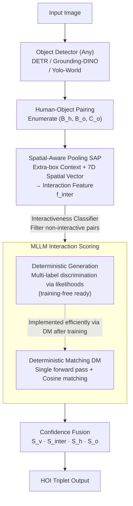

# Zero-shot HOI Detection with MLLM-based Detector-agnostic Interaction Recognition

**Conference**: ICLR 2026  
**arXiv**: [2602.15124](https://arxiv.org/abs/2602.15124)  
**Code**: [https://github.com/SY-Xuan/DA-HOI](https://github.com/SY-Xuan/DA-HOI)  
**Authors**: Shiyu Xuan, Dongkai Wang, Zechao Li, Jinhui Tang  
**Area**: Multimodal VLM  
**Keywords**: HOI detection, zero-shot, MLLM, interaction recognition, detector-agnostic

## TL;DR

Ours proposes DA-HOI, a zero-shot HOI detection framework that completely decouples object detection from interaction recognition. It leverages the VQA capabilities of MLLMs to replace traditional CLIP features for interaction recognition. The core contributions include Deterministic Generation (reaching 31.50 mAP training-free), Spatial-Aware Pooling (SAP, introducing spatial priors and cross-attention), and single-pass Deterministic Matching (DM, reducing $M$ forward passes to one). It outperforms state-of-the-art (SOTA) methods across four zero-shot settings on HICO-DET and allows for plug-and-play switching of any detector after training.

## Background & Motivation

**Background**: HOI detection requires the simultaneous localization of humans and objects and the recognition of their interaction relationships. Recent CLIP-based zero-shot methods (such as GEN-VLKT, HOICLIP, ADA-CM, LAIN) have made initial progress by constructing interaction classifiers via text embeddings, but performance bottlenecks remain significant.

**Limitations of Prior Work**:

- **Insufficient Discriminative Power of CLIP Features**: CLIP excels at category-level alignment but lacks fine-grained distinction for visually similar interactions like "holding a cup" and "lifting a cup," necessitating additional detector features for compensation.
- **Severe Coupling Between Detector and Interaction Recognition**: In two-stage methods like ADA-CM and BCOM, interaction recognition modules rely on specific detector features or relationship modeling (e.g., UPT). Changing the detector requires retraining—BCOM's Full mAP plummeted from 33.74 to 20.31 when switching to Grounding-DINO.
- **Low Generalization Ceiling**: CLIP-based methods essentially align visual and text features only on trained categories, struggling to generalize to unseen verb/object categories.

**Key Challenge**: Open-vocabulary detectors can already localize unseen objects effectively; the real bottleneck lies in interaction recognition—which happens to be tied to specific detectors.

**Key Insight**: MLLMs are trained on massive image-text pairs and instruction-following tasks, possessing cross-modal generalization and fine-grained understanding far exceeding CLIP. By splitting HOI detection into two independent processes—where the detector handles localization and the MLLM handles interaction recognition—one can utilize the strongest models for each task, while decoupling enables plug-and-play flexibility.

**Core Idea**: Interaction recognition is modeled as a VQA task posed to an MLLM, using Deterministic Generation to obtain multi-label confidence, Spatial-Aware Pooling to inject spatial priors, and Deterministic Matching to eliminate redundant inference overhead.

## Method

### Overall Architecture

DA-HOI decouples HOI detection into two completely independent stages:

1. **Object Detection Stage**: Any detector (DETR / Grounding-DINO / Yolo-World) is used to obtain detection results $\{C^i, B^i\}_{i=1}^{N_{\text{det}}}$.
2. **Interaction Recognition Stage**: All human and object instances are paired. For each human-object pair $(B_h, B_o, C_o)$, a VQA prompt is constructed for the MLLM (Qwen2.5-VL) to predict interaction confidence.

The only interface between the two stages is the bounding box coordinates and category labels; no features are shared, allowing for detector replacement without retraining. The pipeline is: after the detector enumerates human-object pairs, SAP compresses the appearance and spatial relationships into interaction features, MLLM scores candidate interactions via Deterministic Generation, and final HOI triplets are output through confidence fusion.

### Key Designs

**1. Deterministic Generation: Transforming MLLM Free-text Answers into Scored Multi-label Discrimination**

Directly asking an MLLM "What is this person doing with this cup?" faces three issues: a format error rate as high as 36.78% (outputting non-standard terms), severe single-output bias (80.91% of answers provide only one interaction despite the multi-label nature), and the lack of confidence scores for mAP evaluation. Deterministic Generation bypasses "letting the model talk": for each candidate $T_k$ in the interaction list $\Theta(C_o) = \{T_1, T_2, \dots, T_M\}$, it calculates the conditional likelihood of generated tokens given the image and query, using it as the confidence score:

$$S_v[k] = p(T_k | I, Q) = \prod_{j=1}^{N} p(t[j] | T_k[<j], I, Q)$$

This eliminates format errors and single-output bias. Compared to CLIP-based similarity in ADA-CM, this uses conditional generation probability; even without training, the training-free performance reaches 31.50 mAP, exceeding ADA-CM's 25.19.

**2. Spatial-Aware Pooling (SAP): Incorporating Extra-box Context and Relative Spatial Relations**

ROIAlign features are limited to the bounding box, making them vulnerable to occlusions or background noise. Crucially, they lack relative positioning, which is vital for distinguishing "sit on chair" from "stand next to chair." SAP enhances interaction features in three steps: human/object features $f_h, f_o$ from ROIAlign are fused into an initial $f_{\text{inter}}$ via MLP; a cross-attention layer aggregates context from outside the boxes; and a 7D pairwise spatial vector is encoded:

$$U = [w_h h_h, w_o h_o, \frac{w_h}{h_h}, \frac{w_o}{h_o}, \text{IoU}(B_h, B_o), \frac{x_h - x_o}{w_h}, \frac{y_h - y_o}{h_h}]$$

It explicitly includes area (size differentiation), aspect ratio (shape), IoU (overlap), and direction. SAP also trains a linear classifier $S_{\text{interactiveness}} = \sigma(\text{Linear}(f_{\text{inter}}))$ to filter non-interactive pairs, reducing inference time from 569ms to 217ms.

**3. Deterministic Matching (DM): Condensing M Forward Passes into One**

While effective, Deterministic Generation's cost scales with the number of candidates $M$. DM replaces per-candidate likelihood calculation with a single-pass feature matching: a special token `<|hoi|>` is inserted after each candidate in a single prompt. The output features $\hat{f}_{\text{hoi}}[k]$ of these tokens and the interaction feature $\hat{f}_{\text{inter}}$ are used for scoring via cosine similarity:

$$S_v[k] = \text{cosine}(\hat{f}_{\text{hoi}}[k], \hat{f}_{\text{inter}})$$

This reduces inference time from the 569ms baseline to 91ms, achieving a 6.3x speedup.

### Loss & Training

Two-stage training with visual encoders frozen:

1. **First Stage**: Only SAP is trained (30 epochs, lr=1e-4) using Binary Focal Loss for interactiveness and spatial encoding.
2. **Second Stage**: SAP is frozen; MLLM is fine-tuned using LoRA (16 epochs, lr=1e-4) with Focal BCE for Deterministic Matching.

Final confidence: $\hat{S}^i_v[k] = S^i_v[k] \cdot S^i_{\text{interactiveness}} \cdot S^i_h \cdot S^i_o$. Experiments were conducted on 4x RTX 3090 GPUs.

## Key Experimental Results

### Main Results: HICO-DET Zero-shot Performance

| Method | RF-UC Full | NF-UC Full | UO Full | UV Full | Avg Full |
|------|-----------|-----------|---------|---------|----------|
| GEN-VLKT | 30.56 | 23.71 | 25.63 | 28.74 | 27.16 |
| HOICLIP | 32.99 | 27.75 | 28.53 | 31.09 | 30.09 |
| CLIP4HOI | 34.08 | 28.90 | 32.58 | 30.42 | 31.50 |
| LAIN | 34.41 | 33.23 | 34.27 | 33.12 | 33.76 |
| EZ-HOI | 36.73 | 34.84 | 36.38 | 36.84 | 36.20 |
| BC-HOI (BLIP2) | 40.99 | 36.40 | 34.18 | 39.89 | 37.87 |
| **DA-HOI (Ours)** | **43.56** | **40.33** | **43.60** | **42.88** | **42.59** |
| Ours + Grounding-DINO | 44.81 | 41.51 | 45.28 | 44.43 | 44.00 |
| Ours + Yolo-World | 44.00 | 42.01 | 44.82 | 43.88 | 43.68 |
| ADA-CM (training-free) | - | - | 25.19 | 25.19 | 25.19 |
| **Ours (training-free)** | - | - | **31.50** | **31.50** | **31.50** |

### Ablation Study: Component Contribution & Efficiency

| Configuration | UO Full | UV Full | Inference Time (ms/img) |
|------|---------|---------|-----------------|
| Baseline (SFT + Det. Gen.) | 39.24 | 37.84 | 569 |
| + SAP only | 42.31 | 41.95 | 217 |
| + DM only | 40.50 | 39.24 | 189 |
| + SAP + DM (Full) | **43.60** | **42.88** | **91** |
| Full − Pairwise Spatial | 41.98 | 40.77 | 86 |
| Full − Cross Attention | 41.37 | 40.74 | 87 |
| Replace SAP with UPT | 41.76 | 40.58 | 122 |

### Key Findings

- **Deterministic Generation is the most critical design**: In a training-free setting, it improves mAP from 14.23 to 31.50 (+17.27). With SFT, it adds +8.26 over standard generation.
- **SAP is the strongest fine-tuning component**: Improving UO Full by +3.07 while speeding up inference by 2.6x.
- **DM is an efficient accelerator**: Combining SAP and DM reduces inference from 217ms to 91ms while continuing to improve performance.
- **Significant MLLM Scale Effect**: LLaVA-0.5B (42.00) → Qwen-3B (43.60) → Qwen-7B (45.99), proving performance gains from stronger base models.
- **Superior Cross-Dataset Generalization**: Achieves 59.91% on V-COCO (HICO-DET pretrained), 11.04% higher than BCOM.
- **Robustness to Candidate Order**: Fluctuation is only ±0.02 mAP across different permutations.
- **LoRA vs. Full Tuning**: LoRA on the LLM reaches or exceeds full tuning performance, preserving pre-trained knowledge.

## Highlights & Insights

- **Decoupled Design as a Paradigm Shift**: Ours is the first to split HOI detection into completely independent modules. This allows HOI detection to benefit "for free" from developments in detectors (e.g., +1.41 Gain by switching to Grounding-DINO).
- **Deterministic Generation Bridges the Gap**: It converts generation models into discriminators without architectural changes, a trick applicable to any multi-label classification or ranking task using MLLMs.
- **Superiority of SAP over UPT**: While UPT couples with specific detectors by modeling relations between all boxes, SAP maintains decoupling by focusing on context and relative spatial relations of the target pair.

## Limitations & Future Work

- **Inference Efficiency**: 91ms/img (≈11 FPS) is still insufficient for real-time applications like autonomous driving.
- **Pairing Strategy**: The $O(N^2)$ brute-force pairing is redundant in dense scenes; learned pairing priors could be explored.
- **Predefined Candidate Lists**: Dependency on fixed lists limits applicability for completely open-vocabulary interaction discovery.
- **Deployment Costs**: Even a 3B parameter MLLM has high memory requirements for edge deployment.

## Related Work & Insights

- **vs. EZ-HOI**: While EZ-HOI enhances zero-shot capabilities, it relies on CLIP alignment. Ours uses MLLM for recognition, achieving a 6.39 Avg Full gain, proving MLLM's superior cross-modal understanding.
- **vs. BC-HOI**: BC-HOI uses MLLM for auxiliary captioning but remains coupled to the detector. Ours uses MLLM for direct discrimination, exceeding its UO Full by 9.42 points.
- **vs. ADA-CM / BCOM**: These methods suffer performance drops when changing detectors because they implicitly rely on the original detector's relational modeling. Ours truly achieves detector-agnosticism.

## Rating

- Novelty: ⭐⭐⭐⭐ The decoupled framework and Deterministic Generation are substantial innovations.
- Experimental Thoroughness: ⭐⭐⭐⭐⭐ Comprehensive coverage of zero-shot settings, detectors, datasets, and ablations.
- Writing Quality: ⭐⭐⭐⭐ Clear structure and motivation, though some sections are slightly redundant.
- Value: ⭐⭐⭐⭐⭐ Establishes a new paradigm for HOI detection in the MLLM era with high engineering value.

<!-- RELATED:START -->

## Related Papers

- [\[CVPR 2025\] Locality-Aware Zero-Shot Human-Object Interaction Detection](../../CVPR2025/multimodal_vlm/locality-aware_zero-shot_human-object_interaction_detection.md)
- [\[ICCV 2025\] NegRefine: Refining Negative Label-Based Zero-Shot OOD Detection](../../ICCV2025/multimodal_vlm/negrefine_refining_negative_label-based_zero-shot_ood_detection.md)
- [\[CVPR 2026\] CrossHOI-Bench: A Unified Benchmark for HOI Evaluation across Vision-Language Models and HOI-Specific Methods](../../CVPR2026/multimodal_vlm/crosshoi-bench_a_unified_benchmark_for_hoi_evaluation_across_vision-language_mod.md)
- [\[ICLR 2026\] Memory-Free Continual Learning with Null Space Adaptation for Zero-Shot Vision-Language Models](memory-free_continual_learning_with_null_space_adaptation_for_zero-shot_vision-l.md)
- [\[CVPR 2026\] From Attraction to Equilibrium: Physics-Inspired Semantic Gravitons for Zero-Shot Anomaly Detection](../../CVPR2026/multimodal_vlm/from_attraction_to_equilibrium_physics-inspired_semantic_gravitons_for_zero-shot.md)

<!-- RELATED:END -->
