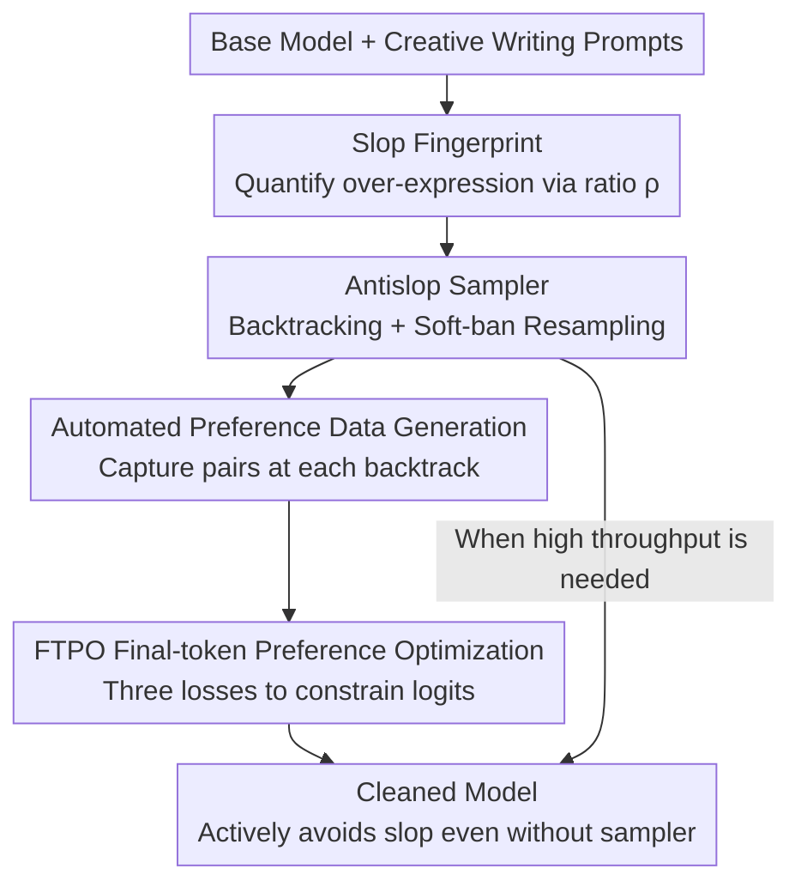

# Antislop: A Comprehensive Framework for Identifying and Eliminating Repetitive Patterns in Language Models

**Conference**: ICLR2026  
**OpenReview**: [https://openreview.net/forum?id=gLcyM1khyp](https://openreview.net/forum?id=gLcyM1khyp)  
**Code**: https://github.com/sam-paech/auto-antislop (MIT)  
**Area**: Text Generation / Preference Optimization  
**Keywords**: Slop suppression, Backtracking sampling, Preference optimization, Creative writing, Lexical diversity

## TL;DR
Antislop treats "AI-typical repetitive phrases (slop) in LLM generation" as quantifiable, locatable, and erasable objects. It first maps model-specific "slop fingerprints" using frequency ratio statistics, then utilizes an inference-time backtracking sampler to precisely suppress these patterns. Finally, it automatically converts the sampler's interception records into preference data for the newly proposed FTPO fine-tuning, permanently welding the suppression capability into the weights—achieving a 90% reduction in slop with almost no performance degradation on GSM8K/MMLU/Creative Writing.

## Background & Motivation
**Background**: Current LLMs, especially in creative writing scenarios, frequently reuse a small set of words and phrases—protagonists are always named "Elara," speech is constantly a "voice barely above a whisper," and functional writing is riddled with "it's not just X, it's Y." The authors term these over-reused patterns as **slop**. To combat generation degeneration, the community has adopted stochastic decoding strategies like top-k, top-p (nucleus), and min-p, as well as anti-repetition samplers like XTC and DRY.

**Limitations of Prior Work**: These methods treat symptoms rather than the cause. Top-k/top-p/min-p only modify the entropy or size of the candidate set without altering the relative ranking of tokens that trigger slop, leaving the global over-expression of words/trigrams largely unchanged. DRY only blocks local loops of "verbatim repetition." Direct "token banning" causes severe collateral damage—an attempt to ban "catatonic" might ban the tokens ["cat", "atonic"], inadvertently affecting all words starting with "cat." Prompting the model to "avoid these words" has limited effectiveness and can backfire due to the "pink elephant problem" (the more you say not to think of an elephant, the more you do).

**Key Challenge**: Eliminating a model's most preferred high-frequency patterns essentially requires significant probability adjustments to its "most likely tokens." However, such large logit shifts can easily damage the model, leading to overall degradation or collapse. This creates a tension: **the stronger the suppression, the greater the collateral damage**. Preference optimization like DPO can train suppression on final-token pairs, but it is known to reduce the likelihood of chosen responses, induce diversity collapse, and curtail syntactic/n-gram variation. Its only constraint knob, $\beta$, is too coarse—large values hinder learning, while small values damage the model.

**Goal**: (1) Quantify and locate slop; (2) Suppress any word/phrase/regex pattern losslessly during inference; (3) Permanently train this suppression into weights with minimal collateral damage.

**Key Insight**: Rather than "sprinkling pepper" at the candidate set level, use **sequence-aware** intervention. Wait until the forbidden pattern actually appears in the inference trajectory, then backtrack to its first token, lower its probability, and resample. This avoids the collateral damage of token banning while precisely intervening exactly when "slop is about to emerge."

**Core Idea**: Establish an end-to-end pipeline: "Statistical Forensics (Slop Fingerprint) → Backtracking Sampler (Inference-time Hard/Soft Ban) → Automated Preference Data → FTPO (Final-token Preference Optimization)." This connects identification, suppression, and solidification, ensuring the model prefers alternative words even when the sampler is disabled.

## Method

### Overall Architecture
Antislop is a closed-loop pipeline that takes a base model prone to slop and outputs a fine-tuned model that is "clean" without capability loss, plus a plug-and-play inference sampler. The pipeline consists of four steps: **① Forensics**—Analyzing 2,000 creative writing samples to calculate the relative over-expression ratio of words/bigrams/trigrams against human corpora, adding the highest-ratio patterns to a banlist to form a model-specific "slop fingerprint"; **② Sampler Suppression**—During inference, maintaining a token + logit trajectory and backtracking to the first token of a pattern whenever a banlist match is found, lowering its probability by an adjustable intensity and resampling with min-p; **③ Automated Data Generation**—Capturing a preference pair (the rejected first token vs. a set of coherent alternative tokens) at each backtracking event without human intervention; **④ FTPO Training**—Fine-tuning the model using these final-token preference pairs with a three-part loss to weld suppression into the weights while anchoring non-target vocabulary to reference logits to prevent drift.

### Key Designs

**1. Slop Fingerprint: Quantifying and locating "slop" via frequency ratios**

To eliminate slop, one must first define what it is. The authors generate 2,000 creative writing outputs for each model and calculate the frequency ratio $\rho(p)=\dfrac{f_{\text{LLM}}(p)}{f_{\text{human}}(p)}$ for words, bigrams, and trigrams. Human baselines use `wordfreq` for words and a combination of Reddit Creative Writing + Project Gutenberg for n-grams (with stop-words removed before processing). Analysis is limited to $n\leq3$ as patterns with $n\geq4$ typically appear fewer than 5 times in 2,000 samples. $\rho>1$ is considered over-expression, and the most extreme subset is added to the banlist. The findings are stark: in gemma-3-12b, "elara" has a $\rho$ of **85,513×**, while the trigram "heart hammered ribs" is 1,192×. Crucially, **slop fingerprints are highly clustered within model families but differ significantly between them**, justifying the need for model-specific customization.

**2. Antislop Sampler: Sequence-aware backtracking soft-bans to avoid collateral damage**

Unlike token banning, which triggers on the **first token** of a forbidden sequence and kills innocent prefixed words, Antislop **triggers only when the entire sequence appears in the trajectory**. During generation, it maintains all tokens and logit distributions. After each token (or chunk), it scans the banlist. Upon a hit, it backtracks to the pattern's start and depresses the probability of that starting token via $p_{\text{new}}=p_{\text{old}}\cdot 10^{-10s}$ (where $0\leq s\leq 1$ is the suppression strength). After re-normalization ($p'_i=p_i/\sum_j p_j$), it resamples using min-p with a threshold of 0.1. The **soft-banning** philosophy allows $s=0$ (no suppression) to $s=1$ (hard ban); if a token is still sampled after depression (indicating high probability and lack of alternatives), the sampler allows it and ignores it in subsequent checks to avoid infinite loops. This allows words like "tapestry" in an essay about tapestries while suppressing it elsewhere. The cost is throughput: vLLM throughput drops by 69%–96% due to restarts, motivating the training-side FTPO solution.

**3. Automated Preference Data Generation: Directly converting interceptions into training samples**

FTPO requires preference data, and the sampler naturally generates it. For every backtracking event, a **final-token preference pair** is captured at the precise location where the slop sequence would have started. The top-$k$ ($k=20$) logits at that position are cached; the rejected token is removed, the remainder re-normalized, and 4–8 coherent alternative tokens are sampled to form the chosen set $C$. A preference pair consists of the prompt (including chat template + generated text up to the slop), the single rejected token (e.g., "Elara"), and a set of alternative tokens (e.g., ["Madelyne", "Nadia", "Freya"]). This entire pipeline is fully automated and open-source.

**4. FTPO: Final-token Preference Optimization via "soft-touch" precise suppression**

While DPO can train on final-token pairs, it updates only one chosen token at a time and relies on the coarse $\beta$ parameter. FTPO defines a rejected token $r$ and a chosen set $C$ at the final trajectory position and optimizes three losses. The **preference loss with margin** requires chosen logits to exceed $r$ by at least $m$:
$$L_{\text{pref}}=\frac{\sum_{c\in C} w_c\cdot \text{softplus}((m-\Delta_c)/\tau)}{\sum_{c\in C} w_c}$$
where $\Delta_c=y[c]-y[r]$ is the logit difference. Weights $w_c=\text{clamp}((m-\Delta_c)/m,0,1)$ automatically zero out once the margin is met—this is **margin auto-stop**, preventing over-training. **Target regularization** anchors the "target logits" $T=C\cup\{r\}$ to reference values $y_{\text{ref}}$ from a frozen base model using MSE, with a zero-penalty window $\tau_{\text{target}}$:
$$L_{\text{target}}=\frac{1}{|T|}\sum_{j\in T}\max(|y[j]-y_{\text{ref}}[j]|-\tau_{\text{target}},0)^2$$
**Non-target regularization** strongly anchors all other vocabulary $N$ to prevent drift: $L_{\text{nontarget}}=\frac{1}{|N|}\sum_{j\in N}(y[j]-y_{\text{ref}}[j])^2$. The total loss is $L_{\text{FTPO}}=L_{\text{pref}}+\lambda_{\text{target}}L_{\text{target}}+\lambda_{\text{nontarget}}L_{\text{nontarget}}$.

These designs explain why it is more stable than DPO: **① Logit-space operations**—unlike KL regularization which applies compensatory pressure to unrelated logits, logit-level MSE localizes updates; **② Margin auto-stop**—training signals cease once the preference is sufficient; **③ Two-stage regularization**—target logits move relatively freely while others are tethered, allowing high preference accuracy without destructive divergence.

### Loss & Training
All FTPO results use default settings: margin $m=2.0$, target tethering $\lambda_{\text{target}}=0.05$ with window $\tau_{\text{target}}=0.5$, and non-target tethering $\lambda_{\text{nontarget}}=0.4$. To minimize weights perturbation, all layers except the last 5 and the LM head are frozen. A high-rank LoRA ($r\in[128,512]$) is used for 1 epoch with early stopping upon reaching the target suppression rate. DPO baseline uses $\beta=0.1$. For Llama-3.3-70B, which is more sensitive to preference training, LoRA updates are restricted to the LM head to avoid repetition at the cost of lower suppression (66%).

## Key Experimental Results

### Main Results
Three model families (gemma-3-12b, Mistral-Small-3.2, Llama-3.3-70B) were evaluated. Training used 2,000 Reddit Writing Prompts for slop fingerprints and FTPO data. Evaluation used a held-out set + cross-distribution EQ-Bench for creative writing. Metrics included banlist suppression rate, GPT-5-as-Judge quality (0–100), length-controlled vocabulary diversity, MMLU, GSM8K, and 30k-token long-form writing.

| Method (gemma-3-12b) | Banlist Suppression | Writing Quality (0-100) | Notes |
|--------|------|------|------|
| Baseline | 0% | 67.8 | — |
| Antislop Sampler | **100%** | Higher than baseline | Inference-time, no quality loss |
| FTPO | 83–92% | Baseline ±1% | Permanently in weights |
| DPO | 80–82% | -6 to -15 points | Weaker suppression, worse quality |
| Token Banning | — | Crashes to 28 at 8k | Severe repetition/spelling/grammar damage |

Detailed FTPO vs. DPO comparison: FTPO achieves 8.5% higher suppression than DPO under equivalent settings. MMLU/GSM8K stay within 1–3% of baseline (DPO drops 2–5%). Vocabulary diversity is 95–102% (DPO collapses to 74–92%). Long-form writing remains stable with FTPO but significantly degrades with DPO.

### Ablation Study

| Configuration | Key Finding |
|------|---------|
| Train to high preference accuracy | FTPO holds steady at ~100%; DPO collapses after 40%. |
| DPO $\beta$ 1.0 | Degradation slows but suppression drops by 15.9%. |
| Logit divergence regularization | FTPO logits stay near reference; DPO diverges uncontrollably. |
| Regex bans (qwen3-4b) | "It's not X, it's Y" dropped from 1.10/kb to **exactly 0**. |

### Key Findings
- FTPO's advantage over DPO stems from its "soft-touch" approach: constraining logits to reference while allowing target logits to move freely.
- Fine-tuned slop fingerprints + cosine embedding analysis show that over-expressed patterns are **truly reduced**, not just replaced by new AI-isms. Semantic drift is far smaller than a simple style-prompt switch.
- The sampler is perfect for suppression but slow; FTPO is nearly as effective with zero throughput overhead.

## Highlights & Insights
- **Engineering the "AI Taste"**: Using frequency ratio $\rho$ transforms the vague sense of "slop" into a quantifiable, model-specific, and erasable list.
- **Sequence-aware Backtracking**: Waiting for the full pattern to emerge before backtracking avoids the prefix-matching pitfalls of token banning. The $10^{-10s}$ soft-ban prevents broken coherence.
- **Reusable FTPO "Soft-touch" Triad**: Logit-space MSE for localization, margin auto-stop for stability, and two-stage regularization for distribution anchoring. This strategy is applicable to any surgical preference alignment task.
- **Synergetic Loop**: The sampler generates the data and serves as a fallback; FTPO solidifies the intent.

## Limitations & Future Work
- **Lexical/n-gram constraint**: Detection is currently limited to mechanical patterns. High-level semantic slop (metaphor abuse, narrative tropes) remains an open challenge due to high detection costs.
- **Throughput overhead**: Inference-time suppression reduces throughput by 69–96%, making FTPO the only viable path for performance-sensitive deployments.
- **Evaluation Bias**: Quality relies on GPT-5/Claude as judges without human verification; evaluation is concentrated on creative writing.
- **Banlist size**: Long fixed-phrases ($\geq$ 4-gram) escape the current $n\leq3$ statistical net.

## Related Work & Insights
- **vs. Decoding Strategies**: top-k/p do not change the relative ranking of slop tokens; Antislop makes precise interventions to change the global fingerprint.
- **vs. Token Banning**: Banning is brittle and damages the model at scale; Antislop handles 8,000+ patterns while maintaining quality.
- **vs. DPO**: DPO induces diversity collapse; FTPO maintains diversity and capability by tethering logits specifically.
- **vs. Unlikelihood Training**: FTPO provides a concrete answer for how to construct negative samples and what positive targets to use.

## Rating
- Novelty: ⭐⭐⭐⭐⭐ Quantifying "AI taste" as slop fingerprints and providing a complete identification-suppression-solidification loop is highly innovative.
- Experimental Thoroughness: ⭐⭐⭐⭐⭐ Covers multiple model families, large banlists, and diverse metrics including long-form writing and reasoning.
- Writing Quality: ⭐⭐⭐⭐ Clear motivation, formulas, and diagrams.
- Value: ⭐⭐⭐⭐⭐ MIT-licensed code/data and a fully automated pipeline make this a directly applicable engineering solution for de-slopping AI text.

<!-- RELATED:START -->

## Related Papers

- [\[ACL 2025\] PerSphere: A Comprehensive Framework for Multi-Faceted Perspective Retrieval and Summarization](../../ACL2025/nlp_generation/persphere_a_comprehensive_framework_for_multi-faceted_perspective_retrieval_and_.md)
- [\[ACL 2026\] Investigating the Representation of Backchannels and Fillers in Fine-tuned Language Models](../../ACL2026/nlp_generation/investigating_the_representation_of_backchannels_and_fillers_in_fine-tuned_langu.md)
- [\[ACL 2025\] An Empirical Study of Many-to-Many Summarization with Large Language Models](../../ACL2025/nlp_generation/an_empirical_study_of_manytomany_summarization.md)
- [\[ACL 2025\] Theme-Explanation Structure for Table Summarization Using Large Language Models](../../ACL2025/nlp_generation/theme-explanation_structure_for_table_summarization_using_large_language_models_.md)
- [\[ICLR 2026\] Unveiling the Potential of Diffusion Large Language Model in Controllable Generation](unveiling_the_potential_of_diffusion_large_language_model_in_controllable_genera.md)

<!-- RELATED:END -->
