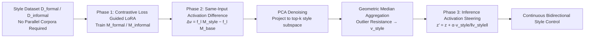

# Causal-Steer: Disentangled Continuous Style Control without Parallel Corpora

**Conference**: ICLR 2026  
**OpenReview**: [https://openreview.net/forum?id=yfiOYXvsX5](https://openreview.net/forum?id=yfiOYXvsX5)  
**Code**: [https://github.com/APTX574/Causal-Steer](https://github.com/APTX574/Causal-Steer)  
**Area**: Controllable Text Generation / Activation Steering  
**Keywords**: activation steering, style control, LoRA, causal intervention, contrastive learning, PCA denoising  

## TL;DR
This paper proposes Causal-Steer: by treating LoRA as a "causal intervention," it computes the difference in activations with and without LoRA perturbations on the **same input**. This approach eliminates the need for parallel corpora and extracts a clean style vector. After PCA denoising and robust aggregation via geometric median, it achieves continuous, bidirectional, and linearly interpolatable style control for LLMs using a single scalar $\alpha$ during inference.

## Background & Motivation
**Background**: Adjusting "style dimensions" (formality, conceptual complexity, toxicity, etc.) while maintaining content consistency is a core requirement for human-computer interaction. Current mainstream approaches include three categories: prompt engineering / instruction fine-tuning (discrete control space, limited to coarse-grained jumps like "novice vs. expert"), LoRA parameter interpolation (task arithmetic, creates continuous space but prone to absorbing spurious content features), and the recently emerged activation steering (direct manipulation of representations in latent space, theoretically optimal for continuous fine-grained control).

**Limitations of Prior Work**: The effectiveness of activation steering depends entirely on obtaining a high-quality "steering direction." Existing methods (CAA, RepE, etc.) almost exclusively rely on **parallel corpora**—text pairs with aligned content but differing styles. Such pairs are nearly impossible to construct for dimensions like conceptual complexity. This leads to two critical issues: ① **Content Contamination**: when content is not perfectly aligned, the direction derived from subtraction encodes both style and semantic differences, leading to poor generalization. ② **Poor Robustness**: even if style signals are isolated, steering directions are easily biased by noise and outliers, resulting in instability across different topics.

**Key Challenge**: Style control is essentially a "continuous spectrum," yet existing methods either rely on discrete jumps or depend on expensive/non-existent parallel corpora to achieve continuity, often resulting in directions that are entangled with content and non-robust.

**Goal**: To extract a style vector that is decoupled from content and robust against outliers **without requiring any parallel corpora** (even a single-style dataset suffices). This enables continuous, fine-grained, and bidirectionally interpolatable style control with near-zero inference overhead.

**Core Idea**: **[Reinterpreting LoRA as a Causal Intervention Tool]** — Instead of comparing activation differences between "two different batches of text" (which requires content alignment), the method fixes the same input $d_i$ and compares the activation differences between the "base model" and the "model with a style LoRA." This naturally controls the semantic variables, cleanly isolating the pure style perturbation injected by LoRA.

## Method

### Overall Architecture
Causal-Steer assembles a pipeline in three phases: ① Inject a low-rank style perturbation into the base model using **Contrastive Loss Guided LoRA**; ② Perform "perturbed vs. unperturbed" activation subtraction for each sample, then use **PCA denoising and geometric median** to robustly aggregate thousands of difference vectors into a single style vector $v_{\text{style}}$; ③ During inference, add the normalized $v_{\text{style}}$ to the MLP outputs of specific layers scaled by intensity $\alpha$, achieving continuous bidirectional control.

### Key Designs

**1. Contrastive Loss Guided LoRA: Ensuring low-rank perturbations capture style, not content**. Standard LoRA fine-tuning often learns content preferences from the corpus into $\Delta W$, which then leaks into the style vector. This paper adds an InfoNCE-style contrastive loss during training: using internal samples of $D_{\text{formal}}$ as anchor/positive pairs and $D_{\text{informal}}$ samples as negatives: $L_{\text{contrastive}} = -\mathbb{E}\left[\log \frac{\exp(\text{sim}(h_{d_a}, h_{d_p})/\tau)}{\exp(\text{sim}(h_{d_a}, h_{d_p})/\tau) + \sum_{d_n}\exp(\text{sim}(h_{d_a}, h_{d_n})/\tau)}\right]$. This discriminative objective forces $\Delta W$ to identify generalizable features that distinguish styles across content, actively suppressing content-related activations. The result is a pure style representation rather than corpus-specific spurious features—a key factor in bypassing the need for parallel corpora.

**2. Same-Input Causal Difference: Justifying "Activation Difference ≈ Pure Style Perturbation" via first-order Taylor expansion**. For each formal sample $d_i$ and layer $l$, the style perturbation vector is defined as $\Delta v^{(l)}_{\text{formal},i} = f_l(M_{\text{formal}}, d_i) - f_l(M_{\text{base}}, d_i)$, where $f_l(M,d)$ is the mean of the MLP outputs across all **generated tokens** (excluding the prompt). This ensures that the global style is captured rather than prompt structures or semantic biases of individual tokens. Unlike naive observation methods that subtract activations of different text batches $D_{\text{formal}}$ and $D_{\text{informal}}$—which assume content cancels out and thus require parallel corpora—Ours fixes $d_i$, ensuring the content in both terms is identical and semantics are naturally neutralized. Theoretically, viewing activations as a function of weights and data $h^{(l)}(W,d)$, a first-order expansion at $W_0$ yields $\Delta h^{(l)}(d) \approx J_{h,W}(W_0,d)\cdot \Delta W$. This indicates that the extracted activation difference is the image of the weight-space style perturbation $\Delta W$ under the Jacobian mapping into the latent space, providing a direct, decoupled handle for style control.

**3. PCA Denoising + Geometric Median: Compressing thousands of noisy differences into one robust direction**. After aligning the difference directions of both styles to form a unified set $X^{(l)} = \{\Delta v^{(l)}_{\text{formal}}\} \cup \{-\Delta v^{(l)}_{\text{informal}}\}$, the data is modeled as "shared low-dimensional style signal + sample-specific content noise": $x_i = v^{(l)}_{\text{style}} + \epsilon_{\text{content},i}$. Assuming the style signal corresponds to the principal component with the largest variance while content noise resides in low-variance components, PCA is used to project each vector into the top-$k$ principal subspace $\tilde{x}_i = (P^{(l)}_k)^\top x_i$ (experiments show $k=8$ is sufficient, confirming style is a low-dimensional attribute). After PCA filters structural noise, the **geometric median** $\tilde{m}^{(l)}_* = \arg\min_{\tilde m}\sum_i \|\tilde{x}_i - \tilde m\|_2$ is used for central estimation in the subspace, as it is far less sensitive to outliers than the arithmetic mean. Finally, it is projected back to the original space to obtain the final style vector $v^{(l)}_{\text{style}} = P^{(l)}_k \tilde{m}^{(l)}_*$. This two-step denoising and robust aggregation is the engineering core that ensures stability across topics and languages.

**4. Single-Vector Bidirectional Inference Steering: Controlling a continuous spectrum with one scalar $\alpha$**. During inference, the normalized style vector is injected into the MLP outputs of a selected set of layers $L_{\text{steer}}$: $z'^{(l)}_t = z^{(l)}_t + \alpha \cdot \frac{v^{(l)}_{\text{style}}}{\|v^{(l)}_{\text{style}}\|_2}$. Normalization ensures the intervention intensity is determined solely by the adjustable scalar $\alpha$: $\alpha > 0$ steers toward the target style (e.g., complex/formal), $\alpha < 0$ steers toward the opposite (e.g., simple/colloquial), and $\alpha = 0$ recovers the original model. Remarkably, **unilateral data enables bidirectional control**—vectors extracted using only "complex concept" corpora can make output simpler by reversing the sign of $\alpha$. Since the vector is pre-calculated, inference involves only vector addition with negligible overhead, and it supports the simultaneous superposition of multiple attributes.

## Key Experimental Results

### Main Results (Conceptual Complexity Control, excerpt from Qwen2.5-7B-Instruct)
Diff. indicates the magnitude of style differentiation (higher is better for Complex, lower for Simple). F-G./SMOG/C-L are readability metrics.

| Method | Complex Acc.↑ | Complex Diff.↑ | Complex C-L.↑ | Simple Acc.↑ | Simple Diff.↓ | Simple C-L.↓ |
|---|---|---|---|---|---|---|
| CAA | 8.19 | 5.37 | 15.64 | 7.58 | 4.18 | 15.71 |
| ITI | 8.48 | 5.16 | 15.45 | 7.83 | 4.17 | 17.14 |
| RepE | 8.24 | 5.35 | 14.84 | 8.17 | 4.37 | 17.93 |
| CLMI | 7.60 | 8.36 | 26.91 | 7.64 | 3.47 | 10.02 |
| **CS (Ours)** | **8.59** | **8.42** | **31.55** | 6.85 | **2.77** | **7.46** |
| CS_single | 8.56 | 8.40 | 27.28 | 6.76 | 2.80 | 9.74 |

Causal-Steer leads significantly in style differentiation (Diff./C-L) and achieves the widest separation between Complex and Simple ends. $\text{CS}_{\text{single}}$, using only unilateral data, performs closely to the full version, validating "bidirectional control from a single dataset."

### Ablation Study (Qwen2.5-7B-Instruct)

| Variant | Complex Acc. | Complex Diff. | Simple Acc. | Simple Diff. |
|---|---|---|---|---|
| **Causal-Steer (Full)** | **8.59** | **8.42** | 6.85 | 2.77 |
| − w/o Contrast | 8.50 | 8.24 | 6.87 | 3.01 |
| − w/o Difference | 7.95 | 7.90 | 6.67 | 2.85 |
| − w/o Mean Token | 7.28 | 4.26 | 8.24 | 4.73 |
| − w/o PCA | 8.27 | 8.18 | 5.20 | 2.81 |
| − w/o Mean (used Mean instead of GeoMedian) | 8.48 | 8.24 | 6.61 | 2.82 |

### Key Findings
- **Mean Token extraction is critical**: Removing it caused Diff. to drop from 8.42 to 4.26, indicating that averaging over generated tokens (rather than prompts or single tokens) is vital for capturing global style.
- **Causal Difference + Contrastive Loss ensure decoupling**: Removing either led to accuracy drops, confirming they work synergistically to suppress content contamination.
- **PCA denoising primarily stabilizes the Simple end**: Removing PCA decreased Simple Acc. from 6.85 to 5.20, showing the contribution of denoising to robustness.
- **Generalization across models/tasks/languages**: SOTA or second-best results were achieved on LLaMa-3.1-8B, detoxification (APPDIA→RealToxicityPrompts), and formality control (→ELI5), with support for simultaneous multi-attribute control.

## Highlights & Insights
- **The perspective shift of "LoRA = Causal Intervention" is elegant**: By replacing the parallel corpora paradigm with "same-input difference with/without perturbation," the method bypasses a long-standing bottleneck using variable control principles, supported by first-order Taylor expansions.
- **Empirical evidence of style as a low-dimensional attribute**: The fact that $k=8$ principal components capture core style variance provides clear evidence for the separability of style vs. content in the representation space.
- **Geometric Median belongs in Steering**: Activation differences naturally contain outliers; using center estimation insensitive to extreme values proves more suitable than the arithmetic mean.
- **Single-dataset bidirectional control + zero inference overhead**: High practical feasibility for real-world deployment, with a continuous, interpretable $\alpha$ interface ideal for productization.

## Limitations & Future Work
- **Reliance on first-order linear approximation**: The method assumes a roughly linear relationship between weight perturbations and activation changes. For larger LoRA perturbations or highly non-linear style dimensions, this approximation may fail; its boundaries remain uncharacterized.
- **Prerequisite of style LoRA training**: Unlike zero-training methods like ActAdd/CAA, this requires a one-time contrastive LoRA training step, which may be costly or difficult for extremely scarce style data.
- **Layer selection and $\alpha$ tuning**: The set $L_{\text{steer}}$ and intensity coefficients require per-task tuning. While the paper provides selection criteria, an automated solution is missing. Excessive $\alpha$ could degrade fluency.
- **Evaluation heavily reliant on GPT-4o scoring**: Subjective metrics like complexity/formality are judged by LLMs. Despite supplements like readability metrics and human evaluation, evaluation bias may persist.
- **Interference in simultaneous multi-attribute control**: Though multi-attribute superposition is claimed, a systematic analysis of orthogonality and mutual interference between different style vectors is lacking.

## Related Work & Insights
- **Parameter-space approaches**: Task Arithmetic (Ilharco 2022), Multi-LoRA interpolation (Dekoninck 2023), CLMI—these create continuous spaces but are prone to corpus-specific spurious features, which this paper directly addresses.
- **Activation engineering approaches**: ActAdd (single prompt pairs), CAA (large-scale paired means), GCAV (linear classifiers), ITI (intervention on specific heads), RepE (unified representation engineering framework)—Ours belongs to the steering family but solves parallel corpora dependency and stability issues via causal difference and robust aggregation.
- **Insights**: ① The "variable control" concept can be transferred to other representation editing tasks; ② Robust statistics (geometric median/trimming) should become standard in activation engineering; ③ If the "low-dimensional style" hypothesis holds, future work could explore compact style codebooks or composable multi-attribute subspaces.

## Rating
- **Novelty**: ⭐⭐⭐⭐ — "LoRA as causal intervention + same-input difference" is a clear, theoretically-backed perspective shift that solves the core dependency on parallel corpora in a crowded field.
- **Experimental Thoroughness**: ⭐⭐⭐⭐ — Covers three tasks, two models, cross-lingual and multi-attribute settings, with a detailed ablation of components and 9 baselines. Deducted marks for heavy reliance on GPT evaluation and lack of non-linear boundary testing.
- **Writing Quality**: ⭐⭐⭐⭐ — Motivation is logically progressive, methods correspond clearly with diagrams and formulas, and the "content contamination/robustness" challenges are well-defined.
- **Value**: ⭐⭐⭐⭐ — Eliminating parallel corpora while providing continuous bidirectional control with zero inference overhead makes this highly valuable for controllable generation and personalized interaction.

<!-- RELATED:START -->

## Related Papers

- [\[ACL 2026\] Can You Make It Sound Like You? Post-Editing LLM-Generated Text for Personal Style](../../ACL2026/nlp_generation/can_you_make_it_sound_like_you_post-editing_llm-generated_text_for_personal_styl.md)
- [\[ICLR 2026\] FS-DFM: Fast and Accurate Long Text Generation with Few-Step Diffusion Language Model](fs-dfm_fast_and_accurate_long_text_generation_with_few-step_diffusion_language_m.md)
- [\[ICLR 2026\] Diverse Text Decoding via Iterative Reweighting](diverse_text_decoding_via_iterative_reweighting.md)
- [\[ICLR 2026\] Rethinking Uncertainty Estimation in LLMs: A Principled Single-Sequence Measure](rethinking_uncertainty_estimation_in_llms_a_principled_single-sequence_measure.md)
- [\[ICLR 2026\] Improving Attributed Long-form Question Answering with Intent Awareness](improving_attributed_long-form_question_answering_with_intent_awareness.md)

<!-- RELATED:END -->
