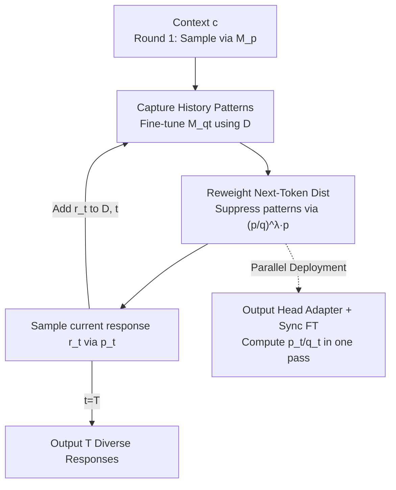

# Diverse Text Decoding via Iterative Reweighting

**Conference**: ICLR 2026  
**OpenReview**: [https://openreview.net/forum?id=2Xd5RlypLx](https://openreview.net/forum?id=2Xd5RlypLx)  
**Code**: https://github.com/shi-rq/OverRIDE  
**Area**: Text Generation / LLM Decoding  
**Keywords**: Diverse Decoding, Reweighting, Test-time Fine-tuning, Guidance Model, Parallel Decoding

## TL;DR
This paper proposes OverRIDE (Reweighting-based Iterative DEcoding), which incrementally fine-tunes a "guidance model" using historical generated results during multi-round sampling. By suppressing the probabilities of tokens that lead to historical pattern recurrence, it significantly enhances diversity across multiple responses with minimal quality loss and can be integrated into serving systems like vLLM with only 6.4% throughput loss (72B).

## Background & Motivation
**Background**: To generate multiple responses for the same prompt from an LLM, the mainstream approach relies on sampling techniques—top-k, top-p, temperature sampling, min-p, etc. These methods truncate or rescale the probability distribution at the token level to introduce stochasticity.

**Limitations of Prior Work**: Despite these techniques, multiple generated responses often exhibit "structural similarity, differing only in terminal or local details." In code generation, models might only change variable names/formatting while the underlying logic remains identical, repeating the same errors. Mathematical solutions also frequently share identical starting sequences.

**Key Challenge**: The root cause is the "path dependency" of autoregressive decoding—given the same context, the model uses the **same** next-token distribution in each round. Sampling only independently perturbs this distribution at the token level and **completely fails to learn from historical generated samples**. Consequently, the model repeatedly "competes" within high-probability regions, leading to insufficient diversity and potential degradation (repetition, low quality). Increasing temperature diversifies outputs by flattening the distribution but often at the cost of quality.

**Goal**: Enable the decoding process to "remember" previous outputs and actively avoid those patterns while minimizing quality and efficiency losses.

**Key Insight**: The authors observe that historical samples themselves cannot directly serve as constraints because sampling is non-deterministic. However, if historical samples are used to **fine-tune a guidance model**, it can learn and generalize the recurring "common semantic patterns" within those samples, which can then be used to identify and suppress such patterns.

**Core Idea**: Iteratively fine-tune a guidance model $M_{q_t}$ during inference to capture commonalities in historical responses. Then, use the ratio of "original model probability / guidance model probability" to reweight the next-token distribution, encouraging the model to explore "roads less traveled."

## Method

### Overall Architecture
Given a pre-trained LLM $M_p$ and a set of contexts $C=\{c_i\}_{i=1}^N$, the goal is to generate $T$ diverse responses for each context. OverRIDE organizes the generation into $T$ iterations: the first round uses original model sampling; from the second round onwards, four steps are performed—① Generate a new response using the current reweighted distribution; ② Merge the new response into the historical set $D$, and (incrementally) fine-tune the guidance model $M_{q_t}$ to fit historical patterns; ③ Use $M_{q_t}$ to reweight the original model $M_p$ next-token distribution to obtain $p_t$; ④ Use $p_t$ to drive the next round. The core constraint is that $p_t$ must remain close to $M_p$ (to preserve quality) while avoiding directions that replicate historical responses (to gain diversity).

To deploy on serving systems like vLLM/SGLang, the authors adapt this serial process into a parallel version: limiting the trainable parameters of the guidance model to a low-rank adapter on the output head, allowing $p_t$ and $q_t$ to be calculated in a single forward pass, and synchronizing fine-tuning to occur immediately after sampling to maintain compatibility with KV cache reuse.

### Key Designs

**1. Guidance Model for Capturing Historical Patterns: Distilling History into Generalizable Distributions**

Directly using history as hard constraints is ineffective due to sampling variability. OverRIDE fine-tunes a guidance model $M_{q_t}$ (starting from $M_p$) on the historical response set $D=\{(c_i,r_i)\}$ to maximize the likelihood of historical responses:

$$\mathcal{L}_{q_t} = -\frac{1}{|D|}\sum_{(c,r)\in D}\log q_t(r\mid c).$$

This step "generalizes": $M_{q_t}$ learns the **common semantic patterns** (similar openings, shared reasoning steps) rather than specific instances. This provides a differentiable "historical pattern detector" to identify tokens that would pull generation back into old paths.

**2. Ratio-based Reweighting: Guidance Model as a "Repulsion Term"**

$M_{q_t}$ is used to rewrite the distribution in each round. The reweighted distribution is:

$$p_t(x_i\mid x_{<i}) = \frac{1}{Z}\left(\frac{p(x_i\mid x_{<i})}{q_t(x_i\mid x_{<i})}\right)^{\lambda} p(x_i\mid x_{<i}),$$

where $p$ is the original distribution, $q_t$ is the guidance distribution, $Z$ is a normalizer, and $\lambda$ controls intensity. If a token has high probability in $M_{q_t}$, the ratio $p/q_t$ decreases, suppressing its selection. This "directional repulsion" selectively manufacturing differences while maintaining quality.

**3. Output Head Adapter + Synchronous Fine-tuning: Test-time Training for Parallel Systems**

To reconcile "iteration" with parallel KV cache reuse, the authors: (1) Constrain trainable parameters to a low-rank adapter on the **output head**. $p_t$ and $q_t$ are computed via:

$$\text{logit}_p = Wh,\qquad \text{logit}_{q_t} = Wh + W_B^t W_A^t h.$$

The adapter captures small shifts between the original and historical distributions. (2) Use **Synchronous Fine-tuning**: Once $p_t$ is computed and a token is sampled, the adapter for head $t+1$ is updated immediately using cross-entropy, ensuring readiness for the next round while reusing KV caches through sequential batching.

## Key Experimental Results

### Main Results
Evaluations cover code generation (HumanEval), math reasoning (MATH500 / GSM8K), and story generation (CCNews) using Qwen-2.5-7B-Instruct and Mistral-7B-Instruct-v0.3 across various sampling methods. Metrics include PASS@k, CodeBLEU↓, pairwise cosine similarity↓, and MAUVE↑. Selected results for Qwen-2.5-7B:

| Task | Sampling | PASS@5 | PASS@10 | Similarity↓ / CodeBLEU↓ |
|------|---------|--------|---------|------|
| HumanEval | Greedy | 64.9 → 81.2 | 64.9 → 86.0 | 1.000 → 0.626 (CodeBLEU) |
| HumanEval | Top-p τ=1.0 | 82.1 → 83.6 | 85.5 → 88.5 | 0.666 → 0.578 (CodeBLEU) |
| MATH500 | Greedy | 72.5 → 84.3 | 72.5 → 87.0 | 1.000 → 0.938 (Sim) |
| MATH500 | Top-p τ=0.6 | 84.1 → 84.8 | 86.8 → 87.3 | 0.950 → 0.936 (Sim) |

OverRIDE **simultaneously** increases PASS@k and decreases similarity across nearly all settings. Gains over greedy decoding are particularly significant (HumanEval PASS@10 from 64.9 to 86.0), surpassing the typical diversity-quality trade-off.

### Ablation Study
Rank $r$ of the output head adapter (Qwen-2.5-7B, MATH500, top-p τ=0.6):

| Config | PASS@10 | Throughput (token/s) | Drop |
|------|---------|--------------|---------|
| Baseline | 86.8 | 3709.6 | / |
| r = 4 | 86.9 | 3453.1 | -6.9% |
| **r = 16 (Used)** | **87.5** | **3435.8** | **-7.4%** |
| r = 256 | 87.1 | 2569.2 | -30.7% |
| Full Head | 87.3 | 1984.1 | -46.5% |

$r=16$ provides the optimal balance between modeling capacity and efficiency.

### Key Findings
- **More Scalable for Larger Models**: As Qwen-2.5 scales from 3B to 72B, throughput loss drops from 8.2% to 6.4%, as the adapter overhead becomes negligible relative to total parameters.
- **Unique Decoding Dynamics**: Entropy spikes in Round 2 as OverRIDE suppresses high-probability modes, then stabilizes. This differs from temperature sampling by dynamically exploring high/low probability regions rather than simply flattening the distribution.
- **$\lambda$ is Model-Dependent**: Optimal values are $\lambda=0.8$ for Qwen-2.5 and $\lambda=0.4$ for Mistral-7B.

## Highlights & Insights
- **Novel Perspective**: Re-framing diversity as "test-time learning of historical patterns + directional suppression" moves the solution from static sampling to dynamic online learning.
- **Directional Repulsion via $(p/q)^\lambda p$**: Selectively penalizes paths toward history rather than adding indiscriminate noise, preserving quality while creating variance.
- **Engineering Excellence**: By restricting parameters and synchronizing updates, the authors make "test-time training" viable for 72B models with minimal overhead.

## Limitations & Future Work
- The hyperparameter $\lambda$ requires model-specific tuning and lacks an adaptive mechanism.
- Incremental fine-tuning adds architectural and scheduling complexity compared to pure sampling.
- Forced suppression might lead to lower quality if correct solutions are highly concentrated or rare.
- Migration to open-ended long-form text and subjective conversational scenarios remains to be verified.

## Related Work & Insights
- **vs. Sampling Methods**: OverRIDE learns across rounds, whereas standard sampling (top-p/k) treats each round independently. OverRIDE can be **stacked** on top of existing sampling methods.
- **vs. Temperature**: Temperature flattens the entire distribution indiscriminately; OverRIDE performs "directional repulsion," maintaining higher overall quality.
- **vs. Contrastive Decoding**: While similar in the use of a reference distribution, the reference $q_t$ here is not a fixed weak model but an online model distilled from current historical samples.

## Rating
- Novelty: ⭐⭐⭐⭐⭐ 
- Experimental Thoroughness: ⭐⭐⭐⭐ 
- Writing Quality: ⭐⭐⭐⭐ 
- Value: ⭐⭐⭐⭐ 

<!-- RELATED:START -->

## Related Papers

- [\[ACL 2025\] Odysseus Navigates the Sirens' Song: Dynamic Focus Decoding for Factual and Diverse Open-Ended Text Generation](../../ACL2025/nlp_generation/odysseus_dynamic_focus_decoding.md)
- [\[ICLR 2026\] p-less Sampling: A Robust Hyperparameter-Free Approach for LLM Decoding](p-less_sampling_a_robust_hyperparameter-free_approach_for_llm_decoding.md)
- [\[AAAI 2026\] Structured Language Generation Model: Loss Calibration and Formatted Decoding for Efficient Text](../../AAAI2026/nlp_generation/structured_language_generation_model_loss_calibration_and_formatted_decoding_for.md)
- [\[ICLR 2026\] Text Summarization via Global Structure Awareness](text_summarization_via_global_structure_awareness.md)
- [\[ACL 2025\] CoCoLex: Confidence-guided Copy-based Decoding for Grounded Legal Text Generation](../../ACL2025/nlp_generation/cocolex_legal_text_gen.md)

<!-- RELATED:END -->
