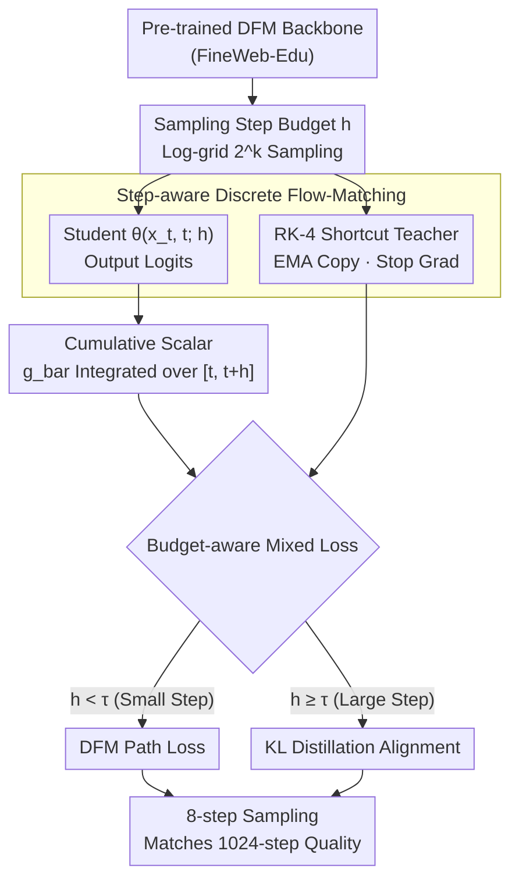

# FS-DFM: Fast and Accurate Long Text Generation with Few-Step Diffusion Language Model

**Conference**: ICLR 2026  
**arXiv**: [2509.20624](https://arxiv.org/abs/2509.20624)  
**Code**: [GitHub](https://github.com/apple/ml-fs-dfm)  
**Area**: Text Generation  
**Keywords**: Discrete Diffusion Models, Few-step Sampling, Flow Matching, Cumulative Scalar, Text Generation

## TL;DR

Proposes FS-DFM (Few-Step Discrete Flow-Matching), which reduces the sampling steps of discrete flow-matching language models from 1024 to 8 via step-aware training and a cumulative scalar update rule, achieving 128x acceleration while maintaining comparable perplexity and generation quality.

## Background & Motivation

Autoregressive Models (ARMs) provide excellent generation quality but suffer from high sequentiality—each token requires a forward pass, limiting throughput. Diffusion Language Models (DLMs) enable parallel generation across positions, but standard discrete diffusion typically requires hundreds to thousands of function evaluations to achieve high quality, essentially trading parallel width for iterative depth.

Specifically:
- **Limitations of Prior Work**: ARMs are strictly serial, leading to high latency for long sequences.
- **Key Challenge**: DLMs are parallel but require many steps. For instance, LLaDA requires roughly one inference step per output token to match ARM quality; DFM (Discrete Flow-Matching) requires ~1024 steps for a 1024-token generation.
- **Goal**: Enable DLMs to achieve the generation quality of many steps (e.g., 1024) within a few steps (e.g., 8). Previous few-step methods (like SDTT) still require 16-256 steps and target short texts. FS-DFM is the first few-step discrete flow-matching method for long text (1024 tokens).

## Method

### Overall Architecture

FS-DFM is built upon Discrete Flow-Matching (DFM), which models text as a Continuous-Time Discrete Markov Chain (CTMC). It learns a probabilistic velocity field to transport the source distribution (uniform or mask) to the target data distribution. Generation starts from a noise sequence and iteratively denoises along the velocity field. FS-DFM introduces two primary enhancements: injecting the step budget as an explicit conditioning signal and distilling large-step consistency using a shortcut teacher, while replacing instantaneous scalars with cumulative scalars integrated over step intervals to allow 8-step sampling to approximate 1024-step quality. The training follow a two-stage pipeline: "Pre-trained DFM backbone → Step-aware fine-tuning."

### Key Designs

**1. Step-aware Discrete Flow-Matching: Informing the Model of Step Sizes**

Standard DFM is unaware of the inference step budget during training, causing performance collapse in few-step settings. FS-DFM feeds the step budget $h$ as an explicit condition: logits $= \theta(x_t, t; h)$. During training, $h$ is sampled from a log-grid $h \in \{2^k,\, k=-10,\dots,0\}$, allowing the same model to learn both fine path tracking (small $h$) and large-step generation (large $h$). The "correct transition" over large intervals cannot be directly solved from the generator $u_t$, but since transition probabilities satisfy the Kolmogorov equations (essentially an ODE), they can be approximated via numerical integrators. This work uses a classic 4th-order Runge–Kutta (RK-4) as a shortcut teacher: evaluating the model at $t$, $t+h/2$, and $t+h$ to obtain $l_1,\dots,l_4$, and weighting them as $\bar l = \tfrac{1}{6}(l_1 + 2l_2 + 2l_3 + l_4)$. RK-4 reduces approximation error by ~12% compared to RK-2. To stabilize training, an EMA copy of the model is used as the teacher.

**2. Cumulative Scalar: Solving the "Stall" at Small t**

This is the Core Idea of FS-DFM. DFM decomposes marginal velocity into a scalar and a direction: $u_t^i(x^i, z) = g(t)\,[\,p_{1|t}(x^i|z) - \delta_z(x^i)\,]$, where the instantaneous rate is $g(t) = \kappa'(t)/(1-\kappa(t))$. In few-step sampling, the first step often starts at a very small $t$, where $g(t)$ is too weak to trigger effective token transitions, causing sampling to stall. FS-DFM replaces the instantaneous scalar with a cumulative scalar integrated and normalized over the interval $[t, t+h]$:

$$\bar g_{t,h} = \frac{1}{h}\,\ln\!\frac{1-\kappa(t)}{1-\kappa(t+h)}$$

With a linear scheduler $\kappa(t)=t$, this becomes $\bar g_{t,h} = \tfrac{1}{h}\ln\frac{1-t}{1-t-h}$. This ensures that even for small $t$, a large $h$ provides sufficient probability flow to drive jumps. As $h \to 0$, $\bar g_{t,h} \to g(t)$, allowing FS-DFM to smoothly revert to standard DFM. Ablations show this reduces PPL from 1312 to 514 (a 60.8% drop) for 1-step sampling.

**3. Budget-aware Mixed Loss: Selecting Signals Based on Step Size**

Small and large steps require different supervision: small steps need to stay faithful to the local probability path, while large steps need to align with the shortcut teacher. FS-DFM switches at $\tau = 2^{-9}$. For $h < \tau$, it uses the DFM path loss $L_{\text{dfm}}$ (Bregman divergence). For $h \ge \tau$, it uses KL divergence $L_{\text{dist}}$ to pull the student toward the RK-4 teacher.

$$L = \frac{1}{B}\sum_b \big[\,m_b\, L_{\text{dfm}}^{(b)} + (1-m_b)\, L_{\text{dist}}^{(b)}\,\big]$$

The mask $m_b$ is determined by whether $h$ is less than $\tau$, covering both regimes in a single training pass.

### Loss & Training

A two-stage strategy is adopted: Stage 1 trains a standard DFM backbone (without step-awareness) on FineWeb-Edu; Stage 2 fine-tunes this checkpoint using the step-aware objective and cumulative scalars. This avoids expensive scratch training for step awareness. The model uses a GPT-2 tokenizer, sequence length 1024, and scales of 0.169B / 1.3B / 1.7B.

## Key Experimental Results

### Main Results

**Table 1: Cumulative Scalar Ablation (0.169B Model)**

| Sampling Steps (NFE) | Normal Scalar PPL | Cumulative Scalar PPL | Gain |
|:---:|:---:|:---:|:---:|
| 1 | 1312.65 | 514.40 | -60.8% |
| 2 | 462.31 | 333.07 | -28.0% |
| 4 | 194.29 | 176.19 | -9.3% |
| 8 | 97.51 | 90.49 | -7.2% |
| 1024 | 85.61 | 87.36 | ~Parity |

Cumulative scalars provide massive gains in few-step settings while converging to standard levels as steps increase.

**Table 2: FS-DFM vs. Diffusion LMs (512-token continuation)**

| Method | Scale | 1-step PPL | 2-step PPL | 4-step PPL | 8-step PPL | 16-step PPL |
|------|:---:|:---:|:---:|:---:|:---:|:---:|
| Dream | 7B | 1163.08 | 785.87 | 752.11 | 739.40 | 630.30 |
| LLaDA | 8B | 256.07 | 290.35 | 495.17 | 441.26 | 432.65 |
| **FS-DFM** | **0.17B** | **173.39** | **143.77** | **97.07** | **75.78** | **67.42** |

FS-DFM 0.17B at 8 steps (PPL 75.78) significantly outperforms LLaDA 8B at 16 steps (PPL 432.65), despite being 40x smaller.

### Ablation Study

- **RK-4 vs. RK-2**: RK-4 achieves median PPL ratios of ~0.88x relative to RK-2 across various NFE.
- **EMA Teacher**: Using an EMA copy significantly improves training stability compared to using the online model as a teacher.
- **Cumulative Scalar**: The single most critical component for very large steps (1-2 NFE).

### Key Findings

1. **128x Speedup**: FS-DFM matches 1024-step DFM quality in just 8 steps for 1024-token generation.
2. **Small Model Dominance**: The 0.17B FS-DFM outperforms 7-8B Dream/LLaDA in few-step generation.
3. **Smooth Convergence**: FS-DFM smoothly reverts to standard DFM as $h \to 0$.
4. **MAUVE Comparison**: FS-DFM reaches MAUVE scores of 0.39-0.58 at 16 steps, whereas LLaDA/Dream score ~0.005.

## Highlights & Insights

- **Mechanism**: Identifies that the core obstacle in few-step DFM is the weakening of instantaneous scalars at small $t$; the cumulative scalar is an elegant mathematical solution.
- The RK-4 shortcut teacher implementation seamlessly combines ODE solvers with discrete diffusion training.
- Effectively demonstrates that discrete diffusion has massive potential for language modeling if step efficiency is addressed.
- First open-source release of DFM + FS-DFM models and code by Apple.

## Limitations & Future Work

1. Evaluation primarily focuses on 1024-token lengths; scalability to much longer sequences (4K+) remains unverified.
2. Comparisons against modern large-scale ARMs (7B+) are limited due to model size constraints.
3. RK-4 training requires 4x forward passes per step, increasing training overhead.
4. Performance on conditional generation tasks (summarization, translation) is not yet explored.

## Related Work & Insights

FS-DFM represents the first comprehensive application of few-step/single-step distillation ideas (like consistency models or shortcut models) from continuous-space flow-matching to discrete text spaces. The cumulative scalar concept is potentially applicable to other CTMC-based applications requiring large discrete updates.

## Rating

- Novelty: ⭐⭐⭐⭐⭐
- Technical Depth: ⭐⭐⭐⭐⭐
- Experimental Thoroughness: ⭐⭐⭐⭐
- Value: ⭐⭐⭐⭐
- Writing Quality: ⭐⭐⭐⭐

<!-- RELATED:START -->

## Related Papers

- [\[ICLR 2026\] Unveiling the Potential of Diffusion Large Language Model in Controllable Generation](unveiling_the_potential_of_diffusion_large_language_model_in_controllable_genera.md)
- [\[AAAI 2026\] Structured Language Generation Model: Loss Calibration and Formatted Decoding for Efficient Text](../../AAAI2026/nlp_generation/structured_language_generation_model_loss_calibration_and_formatted_decoding_for.md)
- [\[ICLR 2026\] Planner Aware Path Learning in Diffusion Language Models Training](planner_aware_path_learning_in_diffusion_language_models_training.md)
- [\[ICLR 2026\] Improving Attributed Long-form Question Answering with Intent Awareness](improving_attributed_long-form_question_answering_with_intent_awareness.md)
- [\[ICLR 2026\] Rainbow Padding: Mitigating Early Termination in Instruction-Tuned Diffusion LLMs](rainbow_padding_mitigating_early_termination_in_instruction-tuned_diffusion_llms.md)

<!-- RELATED:END -->
