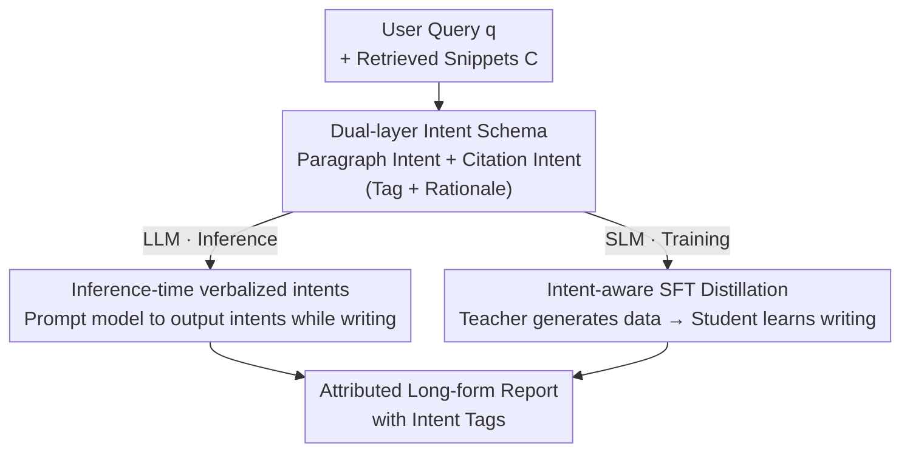

# Improving Attributed Long-form Question Answering with Intent Awareness

**Conference**: ICLR 2026  
**OpenReview**: [https://openreview.net/forum?id=fRCm5c8x0j](https://openreview.net/forum?id=fRCm5c8x0j)  
**Code**: https://github.com/colinzhaoust/intent-aware-deep-research  
**Area**: Text Generation / Long-form Question Answering / Attributed Generation  
**Keywords**: Intent awareness, citation attribution, long-form report generation, deep research system, knowledge distillation

## TL;DR
Addressing the issues of "poor citation quality and low readability" in long-form reports generated by deep research systems, this paper proposes a tag-based dual-layer intent (paragraph intent + citation intent) writing framework. This framework enhances Large Language Models (LLMs) via direct prompting during inference and distills Small Language Models (SLMs) using intent-aware synthetic data. Across three scientific report generation benchmarks, LLMs improved by an average of +2.9 points and SLMs by +12.3 points, with citation metrics showing particularly significant gains.

## Background & Motivation
**Background**: Deep research systems enable LLMs to synthesize information from dozens or hundreds of sources into multi-paragraph reports with citations, which has become a mainstream form of knowledge-intensive QA. Unlike traditional QA that retrieves a few documents for a brief answer, these tasks require reconciling organization, argumentation, and source attribution.

**Limitations of Prior Work**: Existing methods primarily follow the RAG paradigm—stuffing retrieved documents into the context and asking the model to add citations while writing. However, models only learn the "textual style" of human writing without capturing the underlying "thinking process." A study of scholars writing on Overleaf found that nearly 10% of keystrokes are spent on outlining, planning, and organizing, yet these high-level intents are erased in the final text and are thus absent from training corpora. Consequently, models mimic the writing style but fail to explicitly plan "why this paragraph is written this way" or "why this citation is placed here."

**Key Challenge**: Human writing has a "purpose for every paragraph and every sentence" (intent), but this purpose is invisible in the final draft. Models are never exposed to these intents, resulting in low citation recall, unstable citation precision, and reports that read like a collection of isolated paragraphs lacking argumentative coherence in long-form attribution tasks.

**Goal**: Explicitly inject writing intents into the generation process, decomposed into two sub-problems: (i) how to represent intent during writing; (ii) how to inject intent awareness into the inference phase (for LLMs) and the training phase (for SLMs).

**Key Insight**: Drawing on human sensemaking and writing theories, the authors hypothesize that "enhancing the model's intent awareness can significantly improve the quality of long-form reports." Intents are categorized into two granularities: paragraph-level (e.g., background/comparison/causality) and citation-level (e.g., background/motivation/method borrowing), implemented using mature classification systems for citation intent and discourse modes.

**Core Idea**: Use an inline "tag + rationale" intent schema to explicitly output the intent of each paragraph and citation during report generation as a writing scaffold. This serves as test-time scaling during inference and as high-quality distillation signals during training.

## Method

### Overall Architecture
The core of the method is an **intent-aware writing framework**: given a user query $q$, the system generates a multi-paragraph report $R$. Each paragraph $p_i$ contains several sentences, with citations $c_j \in C$ (from parametric knowledge or retrieved snippets) inserted where external evidence is needed. The framework does not alter the underlying RAG architecture but focuses on the "how to write" layer—first defining a dual-layer intent annotation schema, then injecting this schema into two paths: the inference path (prompting LLMs to output intents while writing) and the training path (using a large teacher model to generate intent-aware data for distilling a student model). The final output is an attributed long-form report with embedded intent tags, improved reliability, and higher readability.

### Key Designs

**1. Dual-layer Intent Schema: Making Implicit Writing Purposes Explicit via "Tag + Rationale"**

This step addresses the pain point that "models have never seen writing intents." The authors design two granularities of intent: **Paragraph Intent** (PIT) describes the function of the entire paragraph in the report narrative (e.g., background, comparison of two SOTA methods), and **Citation Intent** (CIT) is finer, describing why a citation $c_j$ supports a specific sentence (e.g., borrowing its method, expressing similarities/differences). Inspired by STaR and ToW, the representation uses an inline tag template `<begin intent> [Intent Type] Rationale <end intent>`. Citation intents use `<bcit>...<ecit>` placed between the sentence and the inline citation, while paragraph intents use `<bpit>...<epit>` placed before each paragraph. Intent types are derived from established systems: citation intents use the six categories from ACL-ARC (Background / Motivation / Uses / Extension / Comparison / Future), and paragraph intents use functional categories from discourse mode research (Exposition / Definition / Argumentation / Compare-contrast / Cause-effect / Problem-solution / Evaluation / Narration). Crucially, each tag is paired with a natural language **rationale**, making the intent a readable annotation that explains "why," serving as both a writing hint for the model and a navigation aid for the reader.

**2. Inference-time Verbalized Intents: Intent as a Targeted Test-time Scaling**

For powerful commercial LLMs, the authors do not perform training but modify the prompt during inference to require the model to output reports with embedded paragraph and citation intent tags. This strategy, termed verbalized intents, is essentially a variant of test-time scaling—unlike generalized "thinking" like CoT, it specifically induces the "intent" type of thought. The intuition is that requiring the model to declare the function of a paragraph before writing it, and the role of a citation before inserting it, acts as a lightweight writing plan. This leads to more disciplined argumentation and more accurate mapping of citations to the claims they actually support. Experiments confirm this primarily improves attribution quality (citation precision/recall), while metrics like rubric and answer accuracy remain stable because SOTA LLMs are already adept at extracting key points.

**3. Intent-aware SFT Distillation: Generating Intent Data and Feeding SLMs at Three Granularities**

SLMs often struggle with the added complexity of generating intents while writing. The authors' solution is to first prompt a large teacher model (gemini-2.5-pro) using verbalized intents to generate training data with intent tags and rationales. Then, they perform SFT on SLMs with three variants of decreasing instruction complexity. **Intent-implicit SFT** removes all intent tags and rationales before training—the data is produced "with intent in mind," but the student only learns to write the report directly. **Intent-explicit SFT** retains the tags and rationales, using them as extra explanations to help the SLM understand how to organize paragraphs and use citations. **Intent-multiview SFT** further decomposes intent-aware generation into multiple sub-tasks: for each data point, four "instruction-report" pairs are generated (Full Intent, Paragraph Intent Only, Citation Intent Only, No Intent) and trained jointly to reduce the per-sequence instruction complexity. For fairness, although multiview has 4x the data points, training steps are reduced to 1/4 to ensure comparable compute. Baselines include direct prompting without training and standard SFT on teacher-generated data without intents.

### A Complete Example
Figure 1 illustrates how intent changes generation: for the query "What empirical studies examine the causes of major pivots in research projects?", a default deep research agent might discuss career shifts instead of research pivots, leading to off-topic content and vague citations. With intent annotation, the model first outputs a paragraph intent `[PIT-Cause-Effect] This paragraph explains how unexpected results lead to major changes in research direction`. This functional constraint keeps the content focused. At the citation point, it marks `[1][2]: [CIT-Motivation] Unexpected findings` and `[3]: [CIT-Background] Hypothesis restructuring`. Thus, the model understands the role of each citation, and the resulting paragraph focuses on the "unexpected findings drive pivot" causal chain, with citations correctly placed. Readers can immediately judge whether to expand the paragraph or click a citation based on these tags.

## Key Experimental Results

### Main Results
Three long-form report generation benchmarks: **SQA-CS-V2** (AstaBench scientific QA, four metrics: rubric / answer accuracy / citation precision / citation recall), **DeepScholar Bench** (generating related work sections), and **ResearchQA** (rubric scores derived from surveys, using paragraph intent only without retrieval). Retrieval sets are fixed per query to isolate writing differences from retrieval quality.

Effect of adding intent (+intent) to LLMs during inference:

| Model (SQA-CS-V2) | Overall | Citation Precision | Citation Recall |
|--------|------|------|------|
| o3 | 85.1 | 89.4 | 63.4 |
| o3 + intent | 86.0 | 89.9 | 66.9 |
| gemini-2.5-pro | 88.1 | 93.2 | 82.4 |
| gemini-2.5-pro + intent | **89.7** | 95.7 | 86.1 |
| Claude opus-4 | 85.4 | 89.6 | 79.6 |
| Claude opus-4 + intent | **89.0** | 95.1 | 86.0 |

Claude's citation precision/recall improved by 5-7 absolute points. Paired t-tests show gemini's Overall improvement is significant at $p=0.013$ and o3 at $p=0.072$ ($\alpha=0.1$). LLMs across benchmarks achieved a macro-average of +2.9 points, with citation metrics increasing by +3.7 points.

Intent-aware SFT for SLMs (SQA-CS-V2):

| Base / Variant | Overall | Citation Precision | Citation Recall |
|--------|------|------|------|
| gemini-2.5-pro (Ref) | 88.1 | 93.2 | 82.4 |
| qwen3-8b Untrained | 80.7 | 83.2 | 66.9 |
| qwen3-8b baseline SFT | 83.2 | 85.8 | 73.9 |
| qwen3-8b intent-multiview | **88.6** | 93.7 | 84.7 |
| llama3.1-8b Untrained | 66.4 | 67.2 | 56.1 |
| llama3.1-8b intent-multiview | **89.2** | 95.4 | 86.7 |
| qwen3-4b Untrained | 80.9 | 82.8 | 68.1 |
| qwen3-4b intent-explicit | **87.5** | 91.5 | 81.3 |

Qwen3-8b / Llama3.1-8b / Qwen3-4b improved by +7.9 / +22.8 / +6.1 points relative to their base versions, respectively. The multiview variant of 8B models even outperformed gemini-2.5-pro. SLMs across tasks averaged +12.3 points, with citation metrics averaging +18.7 points.

### Ablation Study
Ablation of intent categories and comparison of methods for gemini-2.5-pro on SQA-CS-V2-dev:

| Configuration | Overall | Citation Precision | Citation Recall | Note |
|------|---------|---------|---------|------|
| No Intent | 88.1 | 93.2 | 82.4 | Baseline |
| Citation Intent only | 88.6 | 95.3 | 86.2 | Citation metrics jump |
| Paragraph Intent only | 89.1 | 95.2 | 85.6 | Effective alone |
| All Intents | **89.7** | 95.7 | 86.1 | Orthogonal optimal |
| CoT | 81.3 | 83.3 | 76.1 | Performed worse |
| ReAct | 77.6 | 76.5 | 72.0 | Much worse |

### Key Findings
- **Citations are the main battlefield for gains**: Rubric and answer accuracy are mostly unchanged; improvements come almost entirely from citation precision and recall—intents fix "attribution" rather than "finding key points."
- **Dual intents are orthogonal and complementary**: Paragraph and citation intents both yield gains individually and perform best when combined. Both significantly outperform general reasoning prompts like CoT or ReAct (which actually degraded performance for long reports).
- **Intents make SLMs "cite like LLMs"**: Analysis shows SLMs with intents use a much higher proportion of retrieved candidates (baseline SFT ~34% → multiview ~64%) without losing precision. Their citation overlap with gemini rose from ~58 to ~87.
- **Multiview is most stable for 8B**: Decomposing intent generation into multiview sub-tasks to reduce per-point instruction complexity consistently worked best for 8B models. For the 4B model, explicit/multiview was significantly better than implicit, supporting the "intent tag = extra explanation" hypothesis.
- **Anomaly in o3's citation behavior**: Approximately 60% of claims in o3 reports cited its own memory rather than context snippets. Adding citation intents for o3 on DeepScholar degraded quality; only paragraph intents were stable (+2.5 points).
- **Intent distribution reveals model gaps**: Models generally followed the human trend of "Background/Uses" dominance but severely underutilized Comparison/Contrast (~5% vs human 17%), showing current systems prefer "stating" over "synthetic comparison."
- **User study confirms readability**: In a study with 20 subjects and 71 reports, readability Likert scores for reports with intents were 4.47/4.46 (paragraph/citation), significantly higher than the baseline 3.84/3.62. Intents help readers quickly decide whether to expand a section or follow a citation.

## Highlights & Insights
- **Intent as both scaffold and diagnostic probe**: The same set of tags is used for test-time scaling in inference, distillation for training, and as a post-hoc diagnostic tool to analyze "model vs. human" writing gaps (e.g., lack of contrast).
- **RAG-agnostic, purely decoding and distillation**: The method is plug-and-play, preserving existing RAG architectures and only adding an intent layer to the writing stage, ensuring low migration costs.
- **Dual value of "Tag + Rationale"**: Rationales serve as writing prompts for the model and navigation aids for the reader, integrating explainability directly into the output.
- **Transferable Trick**: When an implicit skill (like writing intent) of a large model is hard to distill, having the teacher explicitly output the intermediate representation and then using multiview decomposition to lower the learning difficulty for the student is a universal distillation recipe.

## Limitations & Future Work
- The intent schema is **purely synthetic** and consists of only two layers (paragraph and citation). Human writing involves multi-layered, hierarchical intents where paragraphs support each other and citations perform complex rhetorical roles (critique, anticipation, contextualizing). Future work could ground this using human annotations or writing logs and explore tree/graph intent representations.
- The study is **limited to the scientific domain**, where writing structures are relatively standardized. Domains like policy, law, or humanities may involve rhetorical, historical, or ethical citation roles not covered by this schema, requiring domain adaptation.
- The o3 case shows the method **depends on the model's inherent citation behavior**: when a model prefers parametric memory over context, citation intents might backfire, requiring model-specific intent selection.
- Evaluation relies heavily on LLM-judge pipelines; the reliability of metrics like citation precision/recall depends on the judge. The user study (20 people) is also relatively small.

## Related Work & Insights
- **Vs. standard RAG attributed generation**: Prior work focuses on training LLMs to combine external knowledge with citations, focusing on citation quality itself. This paper leaves RAG unchanged and injects intent ("why write this/why cite this"), transforming attribution into an intent planning problem.
- **Vs. CoT / ReAct**: These are also inference-time enhancements, but CoT/ReAct induce general "thinking/acting" which can degrade long reports. Verbalized intents specifically induce "writing intent," which is better suited for report organization and attribution.
- **Vs. STaR / ToW rationale methods**: Borrows the "tag + rationale" format but replaces "problem-solving reasoning" with "writing intent," applying it systematically to both inference enhancement and SLM distillation.
- **Vs. Citation Intent Classification / Discourse Parsing**: Historically, these were analysis tasks (post-hoc analysis of existing text). This paper flips the perspective, using intent categories as prospective planning signals for generation.

## Rating
- Novelty: ⭐⭐⭐⭐ Converting "writing intent" from an analysis task to a generation scaffold and bridging inference and distillation is a fresh perspective.
- Experimental Thoroughness: ⭐⭐⭐⭐ Three benchmarks + multiple base models + intent ablation + citation behavior analysis + user study provide a complete picture, though it relies on LLM-judges.
- Writing Quality: ⭐⭐⭐⭐ Clear motivation, intuitive examples in Figure 1, and insightful intent distribution analysis.
- Value: ⭐⭐⭐⭐ Plug-and-play with massive gains for SLMs (+12.3), providing direct practical value for deep research and long-form attribution systems.

<!-- RELATED:START -->

## Related Papers

- [\[ACL 2026\] Frankentext: Stitching Random Text Fragments into Long-Form Narratives](../../ACL2026/nlp_generation/frankentext_stitching_random_text_fragments_into_long-form_narratives.md)
- [\[ICLR 2026\] Text Summarization via Global Structure Awareness](text_summarization_via_global_structure_awareness.md)
- [\[ICLR 2026\] FS-DFM: Fast and Accurate Long Text Generation with Few-Step Diffusion Language Model](fs-dfm_fast_and_accurate_long_text_generation_with_few-step_diffusion_language_m.md)
- [\[ACL 2026\] Difficulty-Controllable Cloze Question Distractor Generation](../../ACL2026/nlp_generation/difficulty-controllable_cloze_question_distractor_generation.md)
- [\[ACL 2025\] Context-Aware Hierarchical Merging for Long Document Summarization](../../ACL2025/nlp_generation/context-aware_hierarchical_merging_for_long_document_summarization.md)

<!-- RELATED:END -->
