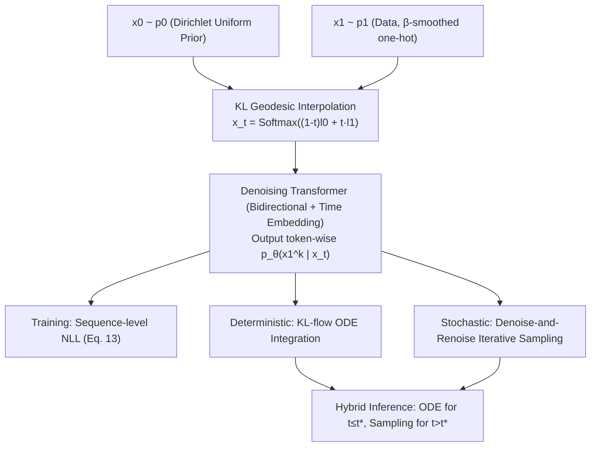

# Logit-KL Flow Matching: Non-Autoregressive Text Generation with Sampling-Mixing Inference

**Conference**: ICLR 2026  
**OpenReview**: [https://openreview.net/forum?id=scgtQSpROE](https://openreview.net/forum?id=scgtQSpROE)  
**Code**: TBD  
**Area**: Non-Autoregressive Text Generation / Discrete Flow Matching  
**Keywords**: Non-Autoregressive Generation, Conditional Flow Matching, KL Geodesic, Logit Interpolation, Iterative Sampling  

## TL;DR
Ours uses "linear interpolation in logit space" (equivalent to the KL geodesic on the simplex) as the path for discrete flow matching. It proves that maximizing conditional likelihood exactly recovers the velocity field and introduces a "denoise-and-renoise" iterative sampler and hybrid inference scheme, significantly reducing perplexity and improving BLEU for non-autoregressive text/code generation.

## Background & Motivation
- **Background**: Non-autoregressive (NAR) language models generate all tokens in parallel, bypassing the sequential bottleneck of autoregressive decoding for higher efficiency. Recent works apply flow matching or diffusion to discrete sequences, representing tokens as one-hot vectors on a $(V-1)$-dimensional simplex and interpolating a probability path $\rho_t$ between a prior $\rho_0$ and the data distribution $\rho_1$.
- **Limitations of Prior Work**: The choice of path is the core design variable, but existing options are flawed. **Linear interpolation on the simplex** (straight lines in probability space) performs poorly on discrete data. **Fisher-Rao geodesics** follow hyperspheres; while theoretically elegant, they suffer from signal decay. This paper identifies the root cause: both paths cause $\mathrm{KL}(x_1\|x_t)$ to collapse toward 0 rapidly as $t \to 0$, compressing the transport into "one step." Consequently, the model receives uninformative gradients over most of the time axis, exacerbated by large vocabularies ($|V|=10000$).
- **Key Challenge**: NAR requires a "signal-rich interpolation path" to provide sustained training signals, but existing geometric paths lose signals prematurely in large vocabularies. Furthermore, NAR approximates the sequence conditional distribution as a token-wise independent product, leading to inaccurate dependency modeling during inference.
- **Goal**: Find a geometrically reasonable discrete interpolation path that retains learning signals in large vocabularies and bridges the performance gap caused by the token-independence assumption during inference.
- **Key Insight**: **[Path Geometry]** Use the KL-divergence-induced geodesic, which is a straight line in logit space ($l_t=(1-t)l_0+t l_1$ passed through Softmax). $\mathrm{KL}(x_1\|x_t)$ decays much slower along this path, ensuring gradients throughout. **[Mechanism]** Layer a stochastic iterative sampler with a deterministic ODE in a hybrid scheme to compensate for the distortion of token-independence approximations at small $t$.

## Method

### Overall Architecture
During training: Sample $x_0 \sim p_0$ (uniform Dirichlet(1) prior on the simplex) and $x_1 \sim p_1$ (data, $\beta$-smoothed one-hot vertices). Interpolate to get the intermediate state $x_t=\mathrm{Softmax}((1-t)\log x_0+t\log x_1)$ via the KL geodesic. A denoising network (bidirectional attention Transformer + continuous time embedding) outputs token-wise conditions $p_\theta(x_1^{(k)}\mid x_t)$, trained via sequence-level NLL. Inference offers three complementary routes: deterministic KL-flow ODE integration, stochastic iterative sampling, and a hybrid scheme switching at time $t^\star$.

### Key Designs

**1. KL Geodesic = Logit Space Linear Interpolation: Trading Geometry for Gradient Signals.** Ours defines the interpolation path as the KL-divergence-induced geodesic: $x_t=C_t\, x_0^{1-t} x_1^{t}$, where $C_t$ normalizes the result back to the simplex. A key property is that it is a straight line in logit space: letting $l_0=\log x_0, l_1=\log x_1$, then $l_t=(1-t)l_0+t l_1$ and $x_t=\mathrm{Softmax}(l_t)$, corresponding to the linear ODE $\frac{dl_t}{dt}=l_1-l_0$. Since $\log$ diverges at 0, target one-hots are $\beta$-smoothed as $x_1=(1-\beta)\delta_i+\frac{\beta}{V}\mathbf{1}$. This path allows $\mathrm{KL}(x_1\|x_t)$ to decay much slower than Linear or Fisher-Rao paths, especially at $|V|=10000$. Table 1 confirms this: with a 150M model, KL-Flow perplexity (41/53/62) is far superior to Fisher-Rao (192/298/379) and Linear (>1300).

**2. Conditional Likelihood Maximization $\iff$ Flow Matching Velocity Field: Converting Velocity Regression to Denoising.** For a single token, the conditional flow matching objective $\mathcal{L}_{\text{CFM}}=\mathbb{E}\|v_\theta(x_t,t)-(l_1-l_0)\|^2$ fits the velocity directly. Ours reparameterizes $v_\theta(x_t,t)=\frac{\hat v_\theta(x_t,t)-l_t}{1-t}$, rewriting the objective as a denoising regression on the "clean target logit": $\mathcal{L}_{\text{CFM}}=\mathbb{E}\|\hat v_\theta(x_t,t)-l_1\|^2$. Proposition 3.2 gives the unique optimal solution $\hat v_\theta^\star(x_t,t)=\mathbb{E}_{x_1\sim p(x_1\mid x_t)}[l_1]$. Thus, the velocity field is obtained through a learned conditional density $p_\theta(x_1\mid x_t)$ rather than direct parameterization. Proposition 3.4 proves this expectation factorizes per token under the KL geodesic, reducing sequence-level velocity learning to estimating marginal posteriors $p_\theta(x_1^{(k)}\mid x_t)$ via sequence-level NLL (Eq. 13).

**3. Denoise-and-Renoise Iterative Sampler: Bypassing Token-Independence Distortion.** Deterministic ODE integration (KL-flow basic) is stable but yields higher perplexity. Based on the Markov decomposition $p(x_{t+h}\mid x_t)=\int p(x_{t+h}\mid x_1)p(x_1\mid x_t)dx_1$, a stochastic sampler is designed: at each step, sample a complete target $x_1^{(k)}\sim p_\theta(x_1^{(k)}\mid x_t)$ from the factorized posterior, then "renoise" along the KL geodesic to sample $x_{t+h}^{(k)}\sim p(x_{t+h}^{(k)}\mid x_1^{(k)})$. Each step requires one forward pass, matching ODE solver complexity, though it explicitly relies on the token-independence approximation $p(x_1\mid x_t)\approx\prod_k p_\theta(x_1^{(k)}\mid x_t)$.

**4. Hybrid Inference: Balancing Mechanisms via $t^\star$.** The token-independence approximation is exact at $t=1$, but as $t$ decreases, dependencies emerge, causing sampler distortion. Deterministic ODEs are more stable in early stages (small $t$). The hybrid scheme uses Algorithm 1 (deterministic) for early transport ($t \le t^\star$) and Algorithm 2 (stochastic) for late-stage details ($t > t^\star$). While $t^\star$ requires tuning, it provides an optimal perplexity/entropy trade-off—hybrid scores highest on Lamini (multi-answer), while pure sampling is stronger for machine translation (low entropy).

## Key Experimental Results

### Main Results: Unconditional Generation (FineFineWeb, Perplexity ↓)

| Method | NFE 256/512/1024 (Llama-2 ppl ↓) |
|------|------|
| GPT-2 (AR) | 48.7 (NFE=1024) |
| DFM | 150.6 / 107.3 / 75.0 |
| SEDD | 70.8 / 57.7 / 47.6 |
| KL-flow (150M) | 61.0 / 47.1 / 35.1 |
| **KL-flow (1.5B)** | **51.5 / 41.7 / 32.7** |

The 1.5B KL-Flow achieves the best perplexity across all evaluation LMs (Llama-2/GPT-3/GPT-2) and NFEs. Even with NFE reduced to 256 (4x speedup), it outperforms autoregressive GPT-2.

### Main Results: Conditional Generation (BLEU ↑)

| Dataset | Method | BLEU Top-5 / Avg |
|------|------|------|
| Lamini Instruction | DFM | 8.1 / 3.6 |
| Lamini Instruction | **KL-flow (hybrid)** | **9.5 / 4.3** |
| WMT14 De-En | DFM | 21.3 / 11.2 |
| WMT14 De-En | **KL-flow (sampling)** | **27.0 / 18.1** |

Hybrid is optimal for multi-answer instruction tasks; sampling is optimal for deterministic translation tasks.

### Key Findings
- **Path Geometry Determines Success**: The gap between KL-Flow (41/53/62 ppl) and Fisher-Rao (192/298/379) or Linear (>1300) in Table 1 is logarithmic, confirming that slow-decaying KL paths are essential to preserve gradient signals in large vocabularies.
- **Overall Gains**: Unconditional generation perplexity dropped by at least 27% (FineFineWeb); conditional task BLEU increased by 17%/26% (Lamini/WMT14); code completion Pass@1/Pass@10 rose by 56%/14%.
- **Acceleration without Quality Loss**: Performance remains stable when NFE is halved or quartered, realizing the theoretical speed advantages of NAR parallel decoding.

## Highlights & Insights
- **Geometrically Grounded Theory**: The path choice is not empirical but derived from diagnosing the "early collapse" of Linear/Fisher-Rao paths via $\mathrm{KL}(x_1\|x_t)$, followed by proof that the KL geodesic is linear in logit space.
- **Dimensionality Reduction for Velocity Field**: Reparameterization allows learning the conditional density $p_\theta(x_1\mid x_t)$, which factorizes per token under the KL geodesic. This allows standard (bidirectional) Transformers + NLL to be used.
- **Three-Pronged Inference**: Deterministic for stability, stochastic for detail, and hybrid for balancing. Experiments reveal that optimal strategies vary by task (high-entropy multi-answer vs. low-entropy deterministic), providing clear guidance for practitioners.

## Limitations & Future Work
- **Token-Independence Bottleneck**: The stochastic sampler assumes $p(x_1\mid x_t)\approx\prod_k p_\theta(x_1^{(k)}\mid x_t)$, which degrades at small $t$ due to inter-token dependencies. Hybrid schemes mitigate but do not resolve this.
- **Hyperparameter $t^\star$**: The switching moment is an extra hyperparameter without a theoretical guide for automatic determination.
- **Sampling Theory Gaps**: The authors note that the denoise-and-renoise iterator lacks complete theoretical analysis, relying currently on empirical effectiveness.
- **Scale and Baselines**: Limited to 1.5B parameters. Comparisons focus on DFM/SEDD/GPT-2, without direct comparison to the latest larger-scale diffusion language model baselines.

## Related Work & Insights
- **Discrete Flow/Diffusion Spectrum**: Discrete Flow Matching (Gat et al. 2024), Dirichlet Flow Matching (Stärk et al. 2024), and SEDD/score-based discrete diffusion (Lou et al. 2024). Ours contributes a geometrically superior KL geodesic path and underlying theory.
- **Insight**: When a framework allows freedom in "interpolation paths/noise schedules," diagnosing the path using quantifiable metrics (like $\mathrm{KL}(x_1\|x_t)$ decay speed) is more effective than blind network tuning. Rewriting velocity regression as denoising regression provides a practical bridge between flow matching and diffusion.

## Rating
- Novelty: ⭐⭐⭐⭐ Clear perspective on KL geodesic = logit linear interpolation, supported by solid theory connecting likelihood to velocity.
- Experimental Thoroughness: ⭐⭐⭐⭐ Covers unconditional, conditional, and code completion across multiple LMs/NFEs with fair baseline retraining.
- Writing Quality: ⭐⭐⭐⭐ Strong synergy between theoretical proofs (Prop 3.2/3.4) and geometric visualization (Fig 2).
- Value: ⭐⭐⭐⭐ Provides geometric principles, denoising-style implementation, and task-adaptive inference for NAR generation.

## Related Papers

- [\[ICLR 2026\] FS-DFM: Fast and Accurate Long Text Generation with Few-Step Diffusion Language Model](fs-dfm_fast_and_accurate_long_text_generation_with_few-step_diffusion_language_m.md)
- [\[ICLR 2026\] Unveiling the Potential of Diffusion Large Language Model in Controllable Generation](unveiling_the_potential_of_diffusion_large_language_model_in_controllable_genera.md)
- [\[ICLR 2026\] Rainbow Padding: Mitigating Early Termination in Instruction-Tuned Diffusion LLMs](rainbow_padding_mitigating_early_termination_in_instruction-tuned_diffusion_llms.md)
- [\[ICLR 2026\] Text Summarization via Global Structure Awareness](text_summarization_via_global_structure_awareness.md)
- [\[ICLR 2026\] Rethinking Uncertainty Estimation in LLMs: A Principled Single-Sequence Measure](rethinking_uncertainty_estimation_in_llms_a_principled_single-sequence_measure.md)

<!-- RELATED:END -->

<!-- RELATED:START -->

## Related Papers

- [\[ICLR 2026\] p-less Sampling: A Robust Hyperparameter-Free Approach for LLM Decoding](p-less_sampling_a_robust_hyperparameter-free_approach_for_llm_decoding.md)
- [\[ACL 2025\] Balancing Diversity and Risk in LLM Sampling: How to Select Your Method and Parameter for Open-Ended Text Generation](../../ACL2025/nlp_generation/balancing_diversity_and_risk_in_llm_sampling_how_to_select_your_method_and_param.md)
- [\[ICLR 2026\] FS-DFM: Fast and Accurate Long Text Generation with Few-Step Diffusion Language Model](fs-dfm_fast_and_accurate_long_text_generation_with_few-step_diffusion_language_m.md)
- [\[ICML 2026\] Score-Repellent Monte Carlo: Toward Efficient Non-Markovian Sampler with Constant Memory in General State Spaces](../../ICML2026/nlp_generation/score-repellent_monte_carlo_toward_efficient_non-markovian_sampler_with_constant.md)
- [\[ICLR 2026\] Diverse Text Decoding via Iterative Reweighting](diverse_text_decoding_via_iterative_reweighting.md)

<!-- RELATED:END -->
