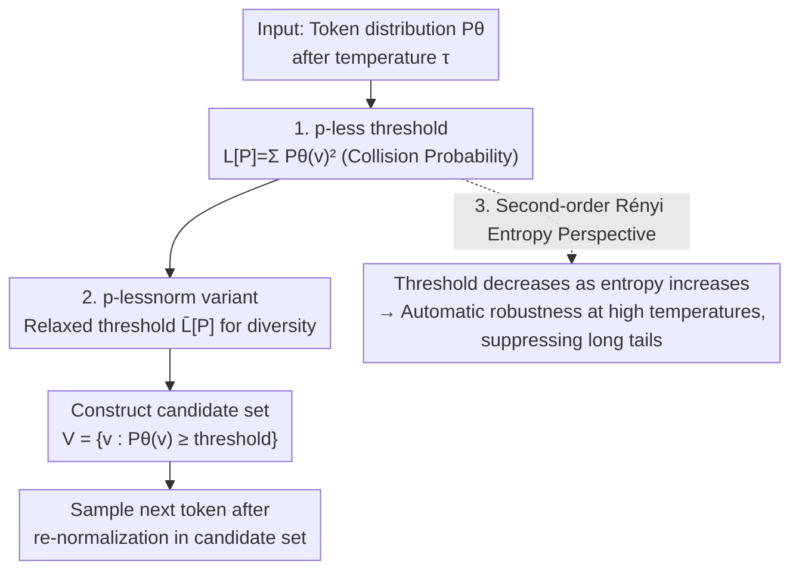

# p-less Sampling: A Robust Hyperparameter-Free Approach for LLM Decoding

**Conference**: ICLR 2026  
**OpenReview**: [https://openreview.net/forum?id=ItFuNJQGH4](https://openreview.net/forum?id=ItFuNJQGH4)  
**Code**: Open sourced (provided in footnotes, not explicitly listed in the body)  
**Area**: Text Generation / LLM Decoding / Sampling Strategy  
**Keywords**: Truncation Sampling, Hyperparameter-Free Decoding, Information Theory, Collision Entropy, Temperature Robustness

## TL;DR
This paper proposes p-less sampling: a **completely hyperparameter-free** truncation decoding method. At each step, it uses the "collision probability" $\sum_v P_\theta(v)^2$ of the entire token distribution as a dynamic truncation threshold. It outperforms methods like top-p and min-p in mathematics, logical reasoning, and creative writing, showing minimal degradation at high temperatures while offering faster inference.

## Background & Motivation

**Background**: Probabilistic decoding in LLMs relies heavily on **truncation sampling**, which first truncates the next-token distribution into a "high-probability subset" before sampling. Mainstream approaches include top-k (taking the top k tokens), top-p (taking the smallest set whose cumulative probability exceeds p), $\epsilon$-sampling (removing tokens with probability below $\epsilon$), mirostat (maintaining target surprisal assuming Zipf’s law), and min-p (using "mode probability × fraction p" as a threshold).

**Limitations of Prior Work**: These methods **all require hyperparameters** ($k$, $p$, $\epsilon$, target surprisal, learning rate, etc.), and their optimal values drift depending on the **generation task** and **sampling temperature**. A top-p value tuned for GSM8K might fail in creative writing or when the temperature is adjusted from 0.7 to 2.0. Worse, when temperature increases and the distribution is "flattened," fixed-threshold methods include many long-tail low-probability tokens in the candidate set, causing text degeneration (incoherence).

**Key Challenge**: Should the threshold adapt to the **current distribution** and **temperature**? Existing methods either use fixed thresholds regardless of the distribution (top-p / top-k / $\epsilon$), rely on a **single statistic** of the distribution (min-p only uses the mode probability), or only consider the distribution under specific conditions ($\eta$-sampling). No method "observes the entire distribution without requiring parameter tuning."

**Key Insight**: The authors start with an information-theoretic question: "Given a token distribution, which tokens are **worth** keeping for sampling?" The answer should be determined by the **full information of the distribution itself**, rather than externally imposed hyperparameters.

**Core Idea**: The truncation threshold is defined as the "**probability of a randomly sampled token exactly matching the ground truth**," which is the collision probability $L[P]=\sum_v P_\theta(v)^2$. A token is eligible for the candidate set only if its probability is "at least as high as this random hit probability." This is inherently hyperparameter-free and naturally varies with the distribution and temperature.

## Method

### Overall Architecture

p-less does not modify training or the model; it only replaces the **truncation rule for each step during decoding**. At step $t$, the autoregressive model provides the (post-temperature) vocabulary distribution $P_\theta(v\mid x_{1:t-1})$. p-less performs three actions: ① calculates a scalar threshold $L[P]$ using the entire distribution; ② includes tokens with probabilities no lower than the threshold into the candidate set $V_{\text{p-less}}$; ③ re-normalizes within the candidate set and samples the next token. The entire process **introduces no tunable parameters**, as the threshold is entirely determined by the current distribution.

The authors also introduce a diversity-oriented variant, **p-lessnorm** (relaxed threshold), and explain from the perspective of **second-order Rényi entropy** why this threshold adapts to temperature, ensuring robustness at high temperatures.

### Key Designs

**1. p-less threshold: Using "random hit probability" as a dynamic truncation line**

To address whether the threshold should consider the entire distribution, the authors provide a pure information-theoretic answer. Let $S$ be the sampled token and $T$ be the ground-truth token. Assuming they are independent (sampling without feedback), the probability of "the sample exactly matching the ground truth" is:

$$L[P]=\sum_{v\in V} P(S=v)\,P(T=v)=\sum_{v\in V} P_\theta(v\mid x_{1:t-1})^2,$$

where a key approximation is made: since only the model's predicted distribution is available without external ground truth, $P(T=v)$ is taken directly from the model distribution $P_\theta$. Thus, $L[P]$ becomes the "sum of squares of the distribution," known as the **collision probability**. The truncation rule is:

$$V_{\text{p-less}}=\{\,v\in V: P_\theta(v\mid x_{1:t-1})\ge L[P]\,\},$$

followed by normalized sampling within $V_{\text{p-less}}$. The intuition is that $L[P]$ represents the "line of picking one randomly and getting it right"; a token must be more certain than a "random guess" to enter the candidate set. This line is **calculated entirely from the distribution**, requiring no hyperparameters. A sharper distribution (higher confidence) results in a larger $L[P]$ and a smaller candidate set, while a flatter distribution results in a smaller $L[P]$ and a larger set. The authors also note that $L[P]=|V|\cdot M[P]$, where $M[P]$ is an unbiased estimator of the second moment of the probability mass function, providing a statistical moment interpretation.

**2. p-lessnorm variant: Relaxing the threshold for diversity-preferred scenarios**

While p-less defaults to coherence, creative writing tasks prioritizes diversity, requiring a slightly lower threshold to include more tokens. The authors constructed p-lessnorm by subtracting the "probability of sampling an **incorrect** token," normalized by the ratio of correct to incorrect outcomes, from the original threshold:

$$\bar L[P]:=L[P]-\frac{1}{|V|-1}\sum_{\substack{u,v\in V\\ u\ne v}}P_\theta(u)P_\theta(v)=\frac{|V|}{|V|-1}L[P]-\frac{1}{|V|-1}.$$

Since $\bar L[P]\le L[P]$, the threshold is systematically lowered, increasing the candidate set and making sampling more divergent. It shares the same mechanism as p-less but uses a more relaxed boundary, remaining **hyperparameter-free**. Whether to use the norm version depends on the task preference (coherence vs. diversity) rather than a numerical value that needs tuning.

**3. Connection to second-order Rényi entropy: Automatic temperature robustness**

This section explains why p-less does not degrade at high temperatures. The $\alpha$-order Rényi entropy is $H_\alpha(p)=\frac{1}{1-\alpha}\log\sum_i p_i^\alpha$, where the second order (collision entropy) is:

$$H_2(p)=-\log\sum_i p_i^2=-\log L[P].$$

Since $\log$ is monotonic, **$L[P]$ increases as collision entropy decreases**. Because $H_2(p)\le H_1(p)$ (Shannon entropy), it follows that $L[P]\ge \exp(-H_1(p))$, meaning the threshold is **negatively correlated** with Shannon entropy. This is crucial: increasing temperature flattens the distribution and raises entropy, causing $L[P]$ to automatically **decrease**. However, the authors emphasize that p-less still reasonably prunes the long tail, whereas methods like top-p or min-p admit many low-probability tokens at high temperatures, leading to degradation. Second-order Rényi entropy is sensitive to the "concentration of probability mass," measuring global confidence better than looking at a single token (min-p) or assuming a distribution shape (mirostat). This explains why the p-less threshold remains meaningful as temperature approaches 0 or ∞, while other hyperparameters fail.

### Loss & Training
None. p-less is a **purely inference-time** method and does not involve any training, fine-tuning, or additional models. It can directly replace the truncation step in existing samplers.

## Key Experimental Results

**Settings**: Experiments were conducted on Llama-2-7B (Chat), Mistral-7B (Instruct), and Llama3-70B (Instruct), covering math/logic reasoning (GPQA, GSM8K, QASC, CSQA) and creative writing (Writing Prompts). Temperatures ranged from 0.5 to 2.0. To compare temperatures fairly, the authors used **Area Under the Accuracy-Temperature Curve (AUC)** (normalized to 0-1) as the primary metric. Creative writing was evaluated using length-controlled win rates and human evaluation.

### Main Results (Math / Logic Reasoning AUC, higher is better)

| Model | Dataset | top-p | min-p | mirostat | p-less | p-lessnorm |
|------|--------|-------|-------|----------|--------|------------|
| Llama2-7b | CSQA | 0.410 | 0.488 | 0.410 | 0.503 | **0.503** |
| Llama2-7b | QASC | 0.393 | 0.502 | 0.419 | 0.537 | **0.538** |
| Llama2-7b | GSM8K | 0.210 | 0.256 | 0.201 | **0.267** | 0.267 |
| Mistral-7b | GSM8K | 0.438 | 0.523 | 0.392 | 0.562 | **0.564** |
| Mistral-7b | QASC | 0.604 | 0.730 | 0.684 | 0.736 | **0.739** |
| Llama3-70b | GSM8K | 0.870 | 0.924 | 0.879 | **0.932** | 0.930 |

On Llama2-7b and Mistral-7b, p-less / p-lessnorm led in AUC across **all datasets**. On the stronger Llama3-70b, they were either the highest or within 0.005 of the highest. Based on accuracy-temperature curves, all baselines degraded to varying degrees as temperature rose, while p-less **widened its lead** at temperatures ≥ 1.0.

### Creative Writing (Writing Prompts, length-controlled win rate)

| Model | Temp | $\epsilon$ | min-p | top-p | p-less | p-lessnorm |
|------|------|-----------|-------|-------|--------|------------|
| Llama-2-7b | 1.0 | 62.18 | 57.48 | 62.07 | 55.08 | 58.74 |
| Llama-2-7b | 1.5 | 1.99 | 58.17 | 4.39 | 58.23 | **59.58** |
| Llama-2-7b | 2.0 | 0.00 | 48.94 | 0.00 | **65.64** | 59.29 |
| Mistral-7b | 1.5 | 3.71 | 62.17 | 0.00 | **66.97** | 66.89 |
| Mistral-7b | 2.0 | 0.00 | 54.11 | 0.00 | 60.32 | **61.99** |

Key observation: When the temperature rises to 1.5 or 2.0, the win rates for $\epsilon$-sampling, top-p, and $\eta$-sampling **collapse to nearly 0** (severe text degeneration), while p-less / p-lessnorm remain stable at ~60. Human evaluations align with automated metrics, with annotators preferring stories generated by p-less.

### Key Findings
- **Temperature robustness is the biggest selling point**: p-less is comparable to other methods at low temperatures but significantly pulls ahead at high temperatures (≥1.0), confirming the theory of "entropy/temperature adaptive thresholds."
- **Higher efficiency**: The authors report lower average per-token sampling time and shorter generation lengths for p-less, improving inference efficiency without sacrificing accuracy.
- **Not a degeneration into greedy decoding**: In low-entropy math/reasoning tasks, p-less approaches or exceeds greedy decoding, but in high-entropy creative writing, it performs significantly better than greedy, indicating dynamic adjustment based on distribution entropy.
- **p-less vs p-lessnorm**: They are nearly identical in reasoning tasks; in creative writing, the superior version varies by temperature/model, though the norm version generally favors diversity.

## Highlights & Insights
- **Removing hyperparameters from truncation sampling**: The threshold is a closed-form function of the distribution ($\sum P^2$), eliminating the need to tune parameters for every task/temperature—highly practical for deploying one decoder across multiple tasks.
- **Three interpretations of one formula**: Collision probability (probability theory), second-order Rényi entropy (information theory), and unbiased estimation of the second moment (statistical moments) all point to the same threshold, providing strong theoretical grounding.
- **High-temperature stability** is highly transferable: Any workflow requiring high-diversity sampling (synthetic data generation, creative writing) without degeneration can simply replace the truncator with p-less, saving the effort of retuning top-p/min-p.

## Limitations & Future Work
- **Reliance on the approximation of model distribution as ground truth**: The method sets $P(T=v) \approx P_\theta$. When the model is poorly calibrated (overconfident or underconfident), whether the threshold remains reasonable requires further investigation.
- **Fixed threshold shape**: $\sum P^2$ provides a deterministic line, lacking a knob like min-p for "looser or tighter" control. Although p-lessnorm offers one level of relaxation, it is still essentially two discrete choices, making fine-tuning for specific "coherence vs. diversity" preferences difficult.
- **Evaluation focuses on 7B/70B open-source models**: On larger or heavily RLHF-aligned models where distributions are typically sharper, it remains to be verified if the truncation behavior and gains of p-less persist.
- **Future Directions**: Generalizing p-less to a $k$-order Rényi entropy threshold (mentioned in the appendix), using the order $k$ as an **interpretable** coherence-diversity knob to provide finer control while maintaining low tuning overhead.

## Related Work & Insights
- **vs top-p / top-k / $\epsilon$-sampling**: These use fixed thresholds, ignore the current distribution, and their hyperparameters lose meaning at extreme temperatures; p-less uses the full distribution for a threshold and adapts to temperature without hyperparameters.
- **vs min-p**: min-p uses "mode probability × fraction" as a threshold, relying on a **single statistic** and still requiring the tuning of that fraction; p-less uses the second moment of the full distribution and has no parameters.
- **vs $\eta$-sampling**: $\eta$ introduces entropy awareness but only considers the distribution under certain conditions, adding hyperparameters and assuming entropy follows a uniform baseline; p-less always uses the full distribution without parametric assumptions.
- **vs mirostat**: mirostat assumes Zipf’s law and maintains target surprisal via feedback, requiring tuning of target values and learning rates; p-less makes no distribution assumptions, requires no feedback, and has no parameters, avoiding extra estimation errors.
- **vs Contrastive Decoding / Search / Arithmetic Sampling**: These are decoding enhancements orthogonal to truncation (multi-model contrast, parallel sampling, etc.) and can be used in conjunction with p-less.

## Rating
- Novelty: ⭐⭐⭐⭐ Connecting collision probability/second-order Rényi entropy to truncation sampling to achieve true hyperparameter-free decoding is a clean, theoretically supported approach.
- Experimental Thoroughness: ⭐⭐⭐⭐ Broad coverage across three models and five datasets, with cross-temperature AUC, human evaluation, and efficiency analysis; however, it leans toward 7B-scale open-source models.
- Writing Quality: ⭐⭐⭐⭐ Motivational-methodological-theoretical-experimental chain is clear, and the three interpretations are well-integrated.
- Value: ⭐⭐⭐⭐ Plug-and-play, zero-tuning, and temperature-robustness make it very deployment-friendly with high practical value.

<!-- RELATED:START -->

## Related Papers

- [\[ACL 2025\] Balancing Diversity and Risk in LLM Sampling: How to Select Your Method and Parameter for Open-Ended Text Generation](../../ACL2025/nlp_generation/balancing_diversity_and_risk_in_llm_sampling_how_to_select_your_method_and_param.md)
- [\[AAAI 2026\] Structured Language Generation Model: Loss Calibration and Formatted Decoding for Efficient Text](../../AAAI2026/nlp_generation/structured_language_generation_model_loss_calibration_and_formatted_decoding_for.md)
- [\[ACL 2026\] ConlangCrafter: Constructing Languages with a Multi-Hop LLM Pipeline](../../ACL2026/nlp_generation/conlangcrafter_constructing_languages_with_a_multi-hop_llm_pipeline.md)
- [\[ACL 2025\] IMPARA-GED: Grammatical Error Detection is Boosting Reference-free Grammatical Error Quality Estimator](../../ACL2025/nlp_generation/impara-ged_grammatical_error_detection_is_boosting_reference-free_grammatical_er.md)
- [\[ACL 2026\] Are Emotion and Rhetoric Neurons in LLM? Neuron Recognition and Adaptive Masking for Emotion-Rhetoric Prediction Steering](../../ACL2026/nlp_generation/are_emotion_and_rhetoric_neurons_in_llm_neuron_recognition_and_adaptive_masking_.md)

<!-- RELATED:END -->
