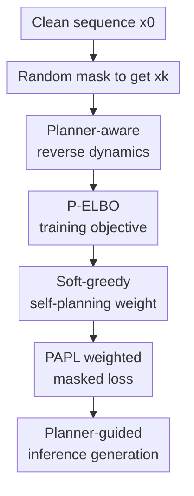

# Planner Aware Path Learning in Diffusion Language Models Training

**Conference**: ICLR2026  
**OpenReview**: [https://openreview.net/forum?id=lAlI5FuIf7](https://openreview.net/forum?id=lAlI5FuIf7)  
**Code**: https://github.com/pengzhangzhi/PAPL  
**Area**: Text Generation / Diffusion Language Models  
**Keywords**: Diffusion Language Models, Path Planning, Masked Diffusion, P-ELBO, Code Generation  

## TL;DR
This paper points out the mismatch between the default "random unmasking paths" used in training and the actual "planner-guided paths" used during inference in masked diffusion language models. It proposes Planner-Aware Path Learning (PAPL), which reweights the masked diffusion loss using planner confidence to align training more closely with the inference path. This leads to steady quality improvements in protein sequence, text, and code generation.

## Background & Motivation
**Background**: Discrete diffusion language models, specifically Masked Diffusion Language Models (MDLMs), treat generation as a process of iteratively recovering clean tokens from a fully masked sequence. Compared to autoregressive models that must generate from left to right, MDLMs can fill tokens in any order, making them naturally suitable for discrete data like text, code, and protein sequences that lack a unique "correct generation order" or require parallel generation.

**Limitations of Prior Work**: Standard MDLM training typically masks a random subset of tokens and applies uniformly weighted cross-entropy across all masked positions. This implicitly assumes that each step of inference will also involve choosing a position to decode uniformly at random from the current masked set. However, in practice, planners such as greedy confidence, MaskGIT, P2 self-planning, or remasking are often used to determine the next position to fill to improve sample quality.

**Key Challenge**: While the model is trained to treat all random paths equally, the planner during inference favors certain high-confidence, more successful paths. In other words, the training objective optimizes a "denoiser on uniform paths," but the model is deployed on "paths selected by the planner." If the denoiser is imperfect, different decoding orders yield different quality levels, making the standard ELBO an inaccurate description of the generation probability for planner-guided inference.

**Goal**: The authors aim to answer not which planner is better at inference time, but how the training objective should be modified to let the denoiser learn the paths it will actually take, given that a planner will be used. This requires theoretically incorporating the planner into the reverse dynamics of diffusion language models and deriving a trainable approximation from a new lower bound.

**Key Insight**: The paper views the token-by-token unmasking process of MDLMs as a discrete-time Markov chain and compares the path-wise KL divergence between the model's planner-guided reverse dynamics and an "ideal planner reverse dynamics" that knows the ground truth. This perspective treats the planner not just as an inference trick, but as a direct component in the definition of the generative distribution and the ELBO.

**Core Idea**: Use the probability that a planner will select a certain masked position to reweight the denoising loss. This directs more training capacity toward the generation paths most likely to be traversed during inference, rather than wasting it on random paths that the planner will rarely take.

## Method

### Overall Architecture
The logic of PAPL consists of four steps: formalizing the "unmasking process with a planner," proving that the standard uniform ELBO no longer matches planner-guided inference, deriving the Planner-Aware ELBO (P-ELBO), and finally approximating the theoretical objective into a training algorithm that primarily modifies loss weights. The input is a clean sequence $x_0$. During training, a partial mask state $x_k$ is randomly generated. The denoiser predicts the original tokens for each masked position, and the planner assigns a weight to each position based on denoiser confidence. The final loss applies stronger supervision to positions more likely to be selected by the planner.

The primary contributions are the planner-aware reverse dynamics, the P-ELBO, the soft-greedy self-planning weights, and the PAPL-weighted masked loss. The clean sequence, random masking, and inference generation serve as the scaffold for the workflow.

### Key Designs
**1. Planner-aware reverse dynamics: Incorporating "where to fill" into the generative distribution**

A single reverse transition in a standard MDLM can be understood as follows: in current state $x_k$, a position $i$ is sampled uniformly from the masked positions, and then a token is sampled at that position using the denoiser $D_\theta^i(x_k)$. This paper replaces the "uniform sampling" with a planner $G_\phi$. The planner observes the candidate predictions $z \sim D_\theta(x_k)$ from the denoiser, outputs probabilities for selecting each position, and only the selected position is updated.

Thus, the transition step is no longer just $\mathrm{Cat}(y;D_\theta^i(x_k))/(L-k)$, but the token probability multiplied by the effective probability of the planner choosing that position:

$$
q_{\theta,\phi}^i(y\mid x_k)=\mathrm{Cat}(y;D_\theta^i(x_k))F_{\theta,\phi}(x_k,y,i).
$$

Here $F_{\theta,\phi}$ represents the expected probability that the planner chooses position $i$ after the $i$-th candidate token is fixed to $y$. This definition binds "what token the model guesses" and "which position the planner thinks should be filled first" into the same transition kernel, allowing the subsequent ELBO to accurately describe planner-guided sampling.

**2. P-ELBO: Shifting the training objective from uniform paths to planner paths**

The theoretical core is the Planner-Aware ELBO (P-ELBO). The authors construct a reference Markov chain that starts from a full mask and selects positions according to the planner at each step, but fills the selected position with the ground-truth token $x_0^i$. The model chain follows the same planner logic but uses the denoiser to sample tokens. The path-wise KL between the two provides a lower bound, making the training objective equivalent to aligning the model's planner-guided paths with the "ideal planner paths that know the answer."

The first term of P-ELBO is intuitive: it remains the cross-entropy for predicting ground-truth tokens, but the weight of each masked position changes from $1/(L-k)$ to the probability of the planner selecting that position $\mathrm{Cat}(i;G_\phi(x_0,x_k))$. The second term is a new "planner correction" that captures the gap between "the ideal planner's choice given the real sequence" and the "effective choice made by the model's planner relying on denoiser predictions." A uniform planner is a special case where the second term vanishes, recovering the standard MDLM ELBO.

This explains why standard masked diffusion loss is merely an empirically usable surrogate rather than a strict lower bound for greedy or P2 sampling distributions. The paper even provides counter-examples proving that $\log p_\theta^{greedy}(x_0)$ can be smaller than the standard uniform ELBO, indicating a genuine objective mismatch.

**3. Soft-greedy self-planning weights: Approximating planner supervision with denoiser confidence**

Exactly optimizing P-ELBO with a greedy planner is costly because it requires simulating multiple steps of the denoiser along greedy paths and handling complex correction terms. PAPL adopts a practical approximation: relaxing the hard argmax planner into a softmax planner, where the denoiser's confidence in the ground-truth token determines the position weight. If a masked position is currently easier for the model to recover correctly, it receives a higher planner weight. As temperature $\tau$ decreases, the weight approaches a greedy selection.

This design involves a trade-off. Since planner weights originate from the denoiser, backpropagating through the weights would involve complex planner corrections and high-variance path effects. The paper chooses to detach the planner weights, keeping only the planner-weighted cross-entropy. This is theoretically grounded in P-ELBO while remaining a weighted version of common masked loss in practice.

**4. PAPL weighted masked loss: A single-line change to align training and inference**

Ultimately, PAPL does not actually sample planner paths during training. Instead, it continues to use the random mask states $x_k$ of standard MDLMs but modifies the loss weight of each masked position:

$$
L_{PAPL}(\theta)=-\mathbb{E}_{x_0,k,x_k}\left[\sum_{i:x_k^i=m}\frac{1}{L-k}(1+\alpha w_i)\log \mathrm{Cat}(x_0^i;D_\theta^i(x_k))\right].
$$

Where $w_i$ comes from the soft-greedy planner and $\alpha$ controls the intensity of the planner weight. When $\alpha=0$, it reduces to standard MDLM loss; when $\alpha>0$, the model emphasizes positions the planner is more likely to select. This interpolation is crucial because a pure planner-weighted loss might cause the model to focus on a few paths too early, leading to instability. Mixed with uniform loss, PAPL maintains the coverage of standard training while pushing signals toward actual inference paths.

### Function Example
Consider a code snippet of length 6 with 4 masked positions: function name, loop boundary, return variable, and an expression inside an indented block. Standard MDLM training treats these 4 positions equally with a weight of $1/4$ each, even though a planner during inference would likely fill the most certain or most restrictive positions first.

PAPL first calculates the denoiser's probability of predicting the ground-truth tokens for these 4 positions. If the function name and return variable have significantly higher confidence, the soft-greedy planner might output weights $w=[0.45, 0.15, 0.30, 0.10]$. With $\alpha=1$, the loss weights become $\frac{1}{4}(1+w_i)$, giving stronger supervision to the function name and return variable. The loop boundary and expression are still trained but with lower weights.

From an inference perspective, this informs the model during training: "You will use a confidence-aware planner to traverse these more reliable tokens first, so learn the denoising on these paths more thoroughly now." The model is not forced to be equally strong on all possible random orders, but rather allocates capacity toward the local conditional distributions it will actually visit.

### Loss & Training
The PAPL training procedure is largely consistent with standard masked diffusion. Each iteration samples a clean sample $x_0$, a random timestep $k$, and a uniformly masked state $x_k$. The denoiser forward pass produces token distributions for each masked position. The soft-greedy planner calculates $w_i$ based on ground-truth token confidence. Finally, $\theta$ is updated using the masked cross-entropy weighted by $\frac{1}{L-k}(1+\alpha w_i)$.

The paper suggests starting with $\tau=1, \alpha=1$. For tuning, $\alpha$ can be increased gradually. In protein experiments, $\alpha \approx 5$ showed significant gains, though further increases can cause instability. Training curves for pure PAPL loss (without the uniform base) show high fluctuations, suggesting planner-aware weighting should complement rather than replace uniform loss.

## Key Experimental Results

### Main Results
The paper validates PAPL across three distinct discrete generation domains: protein sequence generation, unconditional text generation (OpenWebText), and code generation/infilling (HumanEval). PAPL maintains the same model scale and configurations as DLM baselines, specifically using planner-based decoding (primarily P2 self-planning) at inference.

| Task | Metric | DLM baseline | DLM + PAPL | Gain |
|------|------|--------------|------------|------|
| Protein Sequence Gen | Foldability | 42.43% | 59.40% | ~40% relative |
| OpenWebText, $T=128$ | MAUVE | 0.015 | 0.067 | ~4.5x |
| OpenWebText, $T=128$ | Gen PPL | 61.5 | 24.33 | Significant decrease |
| HumanEval Code Gen | pass@1 | 18.5 | 20.8 | +2.3 pts |
| HumanEval Code Gen | pass@10 | 31.1 | 38.4 | +7.3 pts |
| HumanEval-Infill | pass@1 | 30.0 | 32.5 | +2.5 pts |
| SantaCoder-FIM | exact match | 30.7 | 32.3 | +1.6 pts |

In protein experiments, PAPL-150M's pTM increased from 0.65 to 0.72, pAE dropped from 12.00 to 8.97, and foldability rose from 42.43% to 59.40%. Entropy and diversity only slightly decreased, suggesting quality gains are not due to simple mode collapse. In text generation, PAPL outperformed other diffusion baselines across different sampling steps ($T=32, 64, 128$). In code generation, the improvement in pass@10 was more pronounced than pass@1, suggesting PAPL stabilizes the quality of the candidate solution set.

### Ablation Study
| Ablation / Analysis | Key Metric | Description |
|-------------|----------|------|
| Pure PAPL loss, $\tau=1$ | Unstable validation loss | Focuses too early on high-confidence paths, increasing training variance. |
| Decreasing $\tau$ (Protein) | Increased foldability | Sharper planner distributions provide more effective path supervision. |
| Increasing $\alpha$ to 5 (Protein) | Increased foldability | Stronger weights align closer to inference paths, though excessive values hit stability. |
| Text Planner Comparison, $T=128$ | P2-Self MAUVE 0.067 | P2-Self outperforms Greedy (0.056) and Probability Margin (0.051). |
| Code Planner Comparison | P2-Self pass@1 20.8 | Vanilla ancestral only 3.3, highlighting the criticality of inference path selection. |
| Approx. Loss Analysis | greedy loss > vanilla loss | Supports the theory that uniform loss is no longer an upper bound for greedy planners. |

### Key Findings
- PAPL's gains are cross-domain: Despite structural differences between proteins, text, and code, the commonality of planner-dependent inference makes training-inference mismatch a universal issue.
- Quality improvements do not sacrifice diversity: In protein tasks, diversity only dropped from 92.45% to 91.73%, and text entropy decreased only marginally. Gains mainly come from more reasonable generation paths.
- Planners and objectives must be considered together: In code ablation, P2-Self significantly outperformed vanilla ancestral, suggesting training objectives should match the final sampling planner.
- Stability comes from interpolation: Discarding the uniform loss entirely allows early-stage denoiser errors to mislead the training. Retaining the $1/(L-k)$ base weight prevents the training from collapsing into too few paths.

## Highlights & Insights
- The most valuable aspect of this paper is elevating "planners" from mere inference tricks to "generative distribution definitions." Framing the issue through path-wise KL turns training-inference inconsistency into a mathematical object rather than an intuition.
- P-ELBO provides a unified framework for many existing sampling strategies. Uniform, greedy, soft-greedy, and remasking can all be seen as different reverse Markov dynamics, allowing future researchers to design losses by asking what training objective corresponds to their sampler.
- The engineering implementation of PAPL is restrained. It does not introduce extra teachers, separate planner models, or full planner trajectory simulations. Compressing a theoretical target into a single-line loss weight makes it very easy to adopt in existing MDLM pipelines.
- The choice of experimental tasks is insightful. Protein sequences highlight structural constraints, text generation shows open-ended distribution quality, and code generation demonstrates effectiveness in high-logic environments.

## Limitations & Future Work
- PAPL's default planner weights rely on the denoiser's own confidence. In early training, these are unreliable, which is why uniform loss is needed for stabilization. Consequently, PAPL's benefits depend on the model already having some foundational capability.
- The practical algorithm is primarily tailored for soft-greedy/confidence-based planners. Deriving similarly efficient training targets for complex remasking planners remains difficult.
- Scaling to large models remains a hurdle. Verifying whether a decoding strategy can be further improved via planner-aware loss usually requires extra post-training, which is more expensive than simply changing samplers during inference for 7B+ models.
- While relative gains are significant, absolute quality in text generation still lags behind autoregressive baselines. PAPL narrows the gap but doesn't yet prove MDLMs can fully replace AR models in general text tasks.
- Future work could explore external or learned planners rather than self-confidence. In code or reasoning tasks, planners incorporating syntax checkers or unit tests might be more effective than token confidence.

## Related Work & Insights
- **vs. Standard MDLM / SEDD**: Standard methods optimize for a uniform masking objective and attach confidence-based samplers later. This paper identifies the mismatch and biases the loss toward the planner's paths.
- **vs. MaskGIT / Greedy Decoding**: MaskGIT fills tokens based on confidence as an inference heuristic; this paper shows that the resulting distribution is not described by the vanilla ELBO, requiring a planner-aware objective for training.
- **vs. P2 Path Planning**: P2 focuses on better inference paths (self-planning/remasking). PAPL focuses on adapting the denoiser to these paths during training. They act as downstream and upstream components, respectively.
- **vs. Any-order Autoregressive Models (AOARMs)**: AOARMs also care about generation order, but often use high-variance search or policy gradients. PAPL uses the MDLM loss structure to approximate path learning via position weighting with lower engineering cost.

## Rating
- Novelty: ⭐⭐⭐⭐☆ Re-evaluating DLM training-inference mismatch via planner-aware ELBO is a clear theoretical perspective, and PAPL is a natural approximation.
- Experimental Thoroughness: ⭐⭐⭐⭐☆ Covers proteins, text, code, and multiple ablations, though gains on massive general LMs need further verification.
- Writing Quality: ⭐⭐⭐⭐☆ The flow from mismatch to P-ELBO is logical with complete derivations. Some appendices are dense and require familiarity with Markov chains.
- Value: ⭐⭐⭐⭐⭐ Highly practical for diffusion language model training, especially for those wanting to utilize planner sampling without structural changes.

<!-- RELATED:START -->

## Related Papers

- [\[ICLR 2026\] Antislop: A Comprehensive Framework for Identifying and Eliminating Repetitive Patterns in Language Models](antislop_a_comprehensive_framework_for_identifying_and_eliminating_repetitive_pa.md)
- [\[ICLR 2026\] Unveiling the Potential of Diffusion Large Language Model in Controllable Generation](unveiling_the_potential_of_diffusion_large_language_model_in_controllable_genera.md)
- [\[ICLR 2026\] FS-DFM: Fast and Accurate Long Text Generation with Few-Step Diffusion Language Model](fs-dfm_fast_and_accurate_long_text_generation_with_few-step_diffusion_language_m.md)
- [\[ICML 2025\] Understanding and Mitigating Memorization in Diffusion Models for Tabular Data](../../ICML2025/nlp_generation/understanding_and_mitigating_memorization_in_diffusion_models_for_tabular_data.md)
- [\[ACL 2026\] Investigating the Representation of Backchannels and Fillers in Fine-tuned Language Models](../../ACL2026/nlp_generation/investigating_the_representation_of_backchannels_and_fillers_in_fine-tuned_langu.md)

<!-- RELATED:END -->
