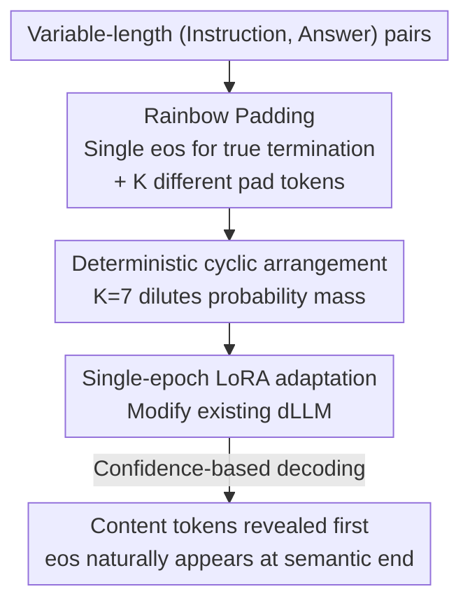

# Rainbow Padding: Mitigating Early Termination in Instruction-Tuned Diffusion LLMs

**Conference**: ICLR 2026  
**OpenReview**: [https://openreview.net/forum?id=cznTlh7Msz](https://openreview.net/forum?id=cznTlh7Msz)  
**Code**: https://ai-isl.github.io/rainbow-padding  
**Area**: Text Generation / Diffusion Language Models  
**Keywords**: Diffusion LLM, early termination, eos padding, cyclic padding, instruction-tuning

## TL;DR
This paper identifies a persistent " `<eos>` overflow" early termination issue in instruction-tuned diffusion language models—where longer allocated generation lengths lead to shorter or even collapsed answers (sequences of `<eos>`). The root cause is that `<eos>` serves as both a terminator and a padding token. The authors propose Rainbow Padding: retaining a single `<eos>` for actual termination while filling remaining positions with a deterministic cycle of $K$ distinct padding tokens. Using only 7 tokens and single-epoch LoRA, it restores length robustness, improving LLaDA's accuracy on MATH from 0.6% to 32.6%.

## Background & Motivation
**Background**: Discrete diffusion language models (dLLMs, such as LLaDA and Dream) are considered powerful alternatives to autoregressive (AR) LLMs. They do not enforce left-to-right generation, maintaining global consistency through denoising-based any-order decoding, which shows advantages in multi-step reasoning and planning. However, unlike AR models, dLLMs must **specify a fixed generation length `max_length` in advance**, inputting the entire sequence at once and predicting all positions at every step.

**Limitations of Prior Work**: The authors observe a counter-intuitive phenomenon: increasing the `max_length` allocated to a dLLM paradoxically leads to shorter generated answers. For instance, LLaDA's accuracy on MATH drops from 17.1% at `max_length=128` to 0.9% at `max_length=1024`, with average answer lengths shrinking from 119.9 tokens to 1.4 tokens. In extreme cases, the model outputs almost nothing, with the sequence collapsing into repeated `<eos>` tokens. The authors name this failure mode **`<eos>` overflow**. Its impact is significant: even at budgets like 512/1024, which are standard for modern tasks, performance on reasoning and coding tasks is destroyed, undermining the usability of dLLMs in real-world instruction-following scenarios.

**Key Challenge**: The root cause lies in the instruction-tuning process where `<eos>` performs dual roles—it is both a legitimate termination marker ("the answer ends here") and a padding character used to fill variable-length sequences. This confusion has two consequences: first, the model cannot distinguish whether an `<eos>` is a true stopping point or padding, weakening its ability to learn correct termination. Second, because answers in training batches vary in length, positions closer to the end are increasingly filled with `<eos>`, and masked cross-entropy training aligns predictions with empirical word frequencies. Consequently, $\Pr[x_i=\texttt{<eos>}]\to 1$ as position $i$ approaches `max_length`, creating an excessively high `<eos>` prior for tail positions.

**Goal + Key Insight**: The authors aim to eliminate `<eos>` overflow at its source, rather than applying heuristic patches like manually suppressing `<eos>` confidence (which causes overshooting or solving the same problem repeatedly) or forcing block-wise semi-autoregressive decoding (which sacrifices any-order advantages and introduces sensitive hyperparameters). The key insight is that since the problem stems from "termination" and "padding" sharing the same symbol and the resulting concentration of probability mass, these two functions must be decoupled and the padding probability mass must be diluted.

**Core Idea**: Retain a single `<eos>` specifically to mark the actual end, and replace remaining padding positions with a **deterministic cycle** of different padding tokens. This decouples `<eos>` and prevents any single padding character from monopolizing high confidence.

## Method

### Overall Architecture
Rainbow Padding essentially modifies only the padding scheme during instruction-tuning. Understanding its mechanism involves three steps: diagnosing how `<eos>` overflow cascades, replacing the tail `<eos>` padding with "one `<eos>` + K cyclic padding tokens," and explaining why cyclic padding outperforms random padding, why $K=7$ is sufficient, and how to adapt existing models using lightweight LoRA. The result is that the confidence of padding tokens remains low; confidence-based decoding **reveals content tokens first and leaves padding to the end**, allowing `<eos>` to appear at the semantic end of the content rather than being sampled early with high probability before generation begins.

### Key Designs

**1. Diagnosis of `<eos>` overflow: Reverse cascade caused by shared symbols**

This is the first contribution: defining and quantifying a failure mode that was noticed in practice but never systematically analyzed. The authors point out that the issue lies in the instruction-tuning padding convention, not the decoding itself: `<eos>` serves as both a terminator and padding, leading to massive overexposure in later positions. Under masked cross-entropy, the model predicts empirical frequencies: $\mathbb{E}[p_\theta(x_i=\texttt{<eos>}\mid x_{\overline{M}})]\approx\Pr[x_i=\texttt{<eos>}]$. Since this frequency approaches 1 at the tail, `<eos>` confidence near the end reaches 1.0 before generation even starts. This bias is amplified by adaptive decoding: once a tail position is sampled as `<eos>` due to high probability, earlier positions are also skewed. The authors quantify this using conditional probabilities $p_\theta(x_i=\texttt{<eos>}\mid x_{i+k}=\texttt{<eos>})$; even for $k=10$, this probability rises sharply. Termination probability thus **cascades backwards** from the tail, ultimately collapsing the entire answer. Experiments show that as `max_length` increases, the proportion of `<eos>` revealed in the first 50% of decoding steps rises from 0.081 to 1.000, which is the micro-mechanism behind "larger budget, less content."

**2. Rainbow Padding: Decoupling terminators + Diluting probability over K tokens**

Addressing the root cause, the authors modify only the padding scheme: the true end of the answer is marked by a single `<eos>`, and all subsequent padding positions are **filled cyclically** with a set of $K$ dedicated padding tokens $\mathcal{P}=\{\texttt{<pad0>},\texttt{<pad1>},\dots,\texttt{<pad}_{K-1}\texttt{>}\}$. Simply replacing a string of `<eos>` with a single `<pad>` is insufficient, as that would merely shift the probability mass from `<eos>` to `<pad>`, re-triggering the overflow. Rainbow Padding provides two essential effects: **Decoupling**, where `<eos>` only appears at true termination events so its prior is no longer contaminated by padding, restoring it as a clean stop signal; and **Dilution**, where the padding area is divided among $K$ tokens. Each `<pad_k>` appears regularly but sparsely, causing the model to learn them as low-probability placeholders rather than high-confidence guesses. Together, content tokens have higher relative probability and are revealed earlier during confidence decoding, allowing the model to build coherent context before `<eos>` naturally falls at the end of the content.

**3. Why deterministic cycles and why K=7?**

A natural alternative would be **randomly** sampling padding tokens from a uniform distribution to dilute probability. However, the authors found this creates a difficult random prediction task that consumes model capacity away from "instruction following." In experiments, models failed to learn reasonable padding placement with random sampling. In contrast, a deterministic cycle is a **pattern that is extremely easy to learn**. Training loss for the padding area drops to near zero within less than 5% of an epoch. Regarding $K$, the core criterion is that "the expected probability of each padding token $\approx 1/K$ must be lower than the confidence of content tokens" so that padding is not revealed prematurely. Checking content tokens with the lowest confidence in the first 20 decoding steps revealed that for $K\ge 7$, $1/K$ falls significantly below content confidence, whereas at $K=3$ it overlaps (failing to eliminate early termination). Gains saturate quickly beyond $K=7$ (20 tokens provide no significant advantage over 7). Thus, 7 is the "sweet spot" for effectiveness vs. learning cost.

**4. Single-epoch LoRA adaptation for existing instruction-tuned models**

Because cyclic padding is so easy to learn, Rainbow Padding does not require instruction-tuning from scratch. It can directly adapt existing models previously trained with `<eos>` padding. The authors use LoRA on 0.5M data for only **one epoch** (approx. 6 GPU-hours on two H200s) to essentially eliminate the early termination issue in LLaDA and Dream. Compared to the original instruction-tuning (e.g., LLaDA using 4.5M samples for 3 epochs), this overhead is negligible. This design turns the method from a "retrain requirement" into a "plug-and-play patch."

## Key Experimental Results

### Main Results
Supervised fine-tuning on LLaDA-Base / Dream-Base, differing only in padding schemes. Evaluation covers `max_length` robustness (MATH-500, GSM8K, HumanEval) and generalization (MMLU, HellaSwag). `res length` refers to the valid answer length before the first `<eos>`.

| Model / Task (max_length=1024) | Metric | `<eos>` Padding | Rainbow Padding (Ours) | Gain |
|--------|------|------|------|------|
| LLaDA-Base · MATH (#Blocks=1) | Acc. | 0.6 | 32.6 | +32.0 |
| LLaDA-Base · GSM8K (#Blocks=1) | Acc. | 13.2 | 75.5 | +62.3 |
| LLaDA-Base · HumanEval (#Blocks=1) | Acc. | 20.7 | 40.2 | +19.5 |
| LLaDA-Base · MATH | res length | 0.98 | 282.1 | restored |
| Dream-Base · MATH | Acc. | 0.0 | 34.3 | +34.3 |
| Dream-Base · GSM8K | Acc. | 9.1 | 77.3 | +68.2 |

Under standard decoding (#Blocks=1), Rainbow Padding significantly outperforms `<eos>` padding. `<eos>` padding only approaches these levels if the block count is increased to 16 (MATH 29.8%), but performance crashes as the block count decreases (only 1.4% at #Blocks=4), exposing the fragility of semi-autoregressive heuristics. Rainbow Padding is stable across block counts (32.6/32.8/32.8), suggesting that once padding is calibrated, the block-wise patch becomes unnecessary. MMLU/HellaSwag results are comparable, indicating that learning the cyclic pattern has almost no side effects.

### Ablation Study: LoRA & K-token ablation

| Configuration | MATH Acc. | GSM8K Acc. | Description |
|------|---------|---------|------|
| LLaDA Vanilla | 0.1 | 3.0 | Severe early termination |
| LLaDA +Rainbow (1 epoch LoRA) | 28.6 | 73.8 | Recovery with 1-epoch adaptation |
| Dream Vanilla | 0.0 | 60.6 | — |
| Dream +Rainbow (1 epoch LoRA) | 32.4 | 77.3 | Significant improvement |
| K=1 (Single pad) | 21.9 | 15.9 | Insufficient; mass remains concentrated |
| K=3 | 33.3 | 58.3 | Termination not fully eliminated |
| K=7 | 34.3 | 79.6 | Sweet spot |
| K=20 | 36.2 | 76.5 | Saturated gains |

### Key Findings
- **K=7 is the threshold**: Fewer than 7 padding tokens (especially 1–3) fail to push $1/K$ below content confidence, causing performance drops on tasks like GSM8K. Above 7, gains saturate and the learning burden increases without reward.
- **Universal across decoding strategies**: Performs stably under margin-based, entropy-based, and confidence-based adaptive decoding because cyclic padding lowers the probability of all padding tokens, naturally creating low margin / high entropy.
- **Minimal learning cost**: Padding area loss zeroes out within 5% of an epoch, providing direct evidence that single-epoch LoRA is sufficient.

## Highlights & Insights
- **Turning a known bug into a measurable failure mode**: `<eos>` overflow is not just defined but quantified at both the task level and token level (conditional probability cascades, `<eos>` ratio in early steps). This diagnostic approach itself is a contribution.
- **Root cause solution with minimal changes**: No architecture changes, no data changes, no extra decoding hyperparameters. Simply switching tail padding from a "string of `<eos>`" to "single `<eos>` + cyclic K-pads" eliminates the problem as an inherent model property.
- **Intuition on "Deterministic vs. Random"**: While random padding dilutes probability, it wastes model capacity on learning random noise. Deterministic cycles offer both dilution and ease of learning. This strategy of "using structure rather than randomness to dilute distributions" is transferable to other scenarios where probability mass needs to be dispersed without increasing the learning burden.

## Limitations & Future Work
- The method specifically targets the `<eos>`/padding confusion in dLLMs and is not applicable to AR models (which exclude padding from the training objective). It is limited to the "fixed-length decoding + padding" diffusion paradigm.
- Validation is primarily on LLaDA and Dream; effects on larger scales or different architectures (e.g., non-Transformer encoder dLLMs) remain to be confirmed.
- The $K=7$ sweet spot depends on the " $1/K <$ content confidence" criterion. If task content confidence distributions differ significantly (e.g., extremely low-entropy tasks), the optimal $K$ might need recalibration.
- Cyclic padding provides a "weak length structure signal"; the paper does not deeply explore its robustness during extreme length extrapolation (far beyond the training `max_length`).

## Related Work & Insights
- **vs. Manual suppression of `<eos>` confidence (Zhu et al., 2025)**: Their approach suppresses `<eos>` probability during decoding, which yields small gains but risk overshooting the true answer length and repeating solutions. Rainbow Padding decouples termination and padding at the training level, providing a cure rather than temporary suppression.
- **vs. Semi-autoregressive block-wise decoding (LLaDA native)**: Splitting sequences into blocks avoids premature `<eos>` but sacrifices the bidirectional context and any-order advantages of dLLMs, while introducing sensitive block-count hyperparameters. Rainbow Padding is stable even in standard decoding, making block-wise patches redundant.
- **vs. Single `<pad>` replacement**: Replacing `<eos>` with a single `<pad>` seemingly decouples the terminator but moves the probability mass directly to `<pad>`, re-triggering overflow. This work uses "cyclic multi-pad" to solve both decoupling and dilution.

## Rating
- Novelty: ⭐⭐⭐⭐ Systematizes a neglected failure mode and provides a minimalist yet root-cause fix.
- Experimental Thoroughness: ⭐⭐⭐⭐ Complete ablations across two models, multiple tasks, block counts, decoding strategies, and K-values.
- Writing Quality: ⭐⭐⭐⭐⭐ Extremely clear logic from Phenomenon → Root Cause → Method → Verification.
- Value: ⭐⭐⭐⭐⭐ Plug-and-play with single-epoch LoRA; likely to become standard practice for dLLM instruction-tuning.

## Related Papers

- [\[ICML 2025\] Understanding and Mitigating Memorization in Diffusion Models for Tabular Data](../../ICML2025/nlp_generation/understanding_and_mitigating_memorization_in_diffusion_models_for_tabular_data.md)
- [\[ICLR 2026\] Rethinking Uncertainty Estimation in LLMs: A Principled Single-Sequence Measure](rethinking_uncertainty_estimation_in_llms_a_principled_single-sequence_measure.md)
- [\[ICLR 2026\] Unveiling the Potential of Diffusion Large Language Model in Controllable Generation](unveiling_the_potential_of_diffusion_large_language_model_in_controllable_genera.md)
- [\[ICLR 2026\] FS-DFM: Fast and Accurate Long Text Generation with Few-Step Diffusion Language Model](fs-dfm_fast_and_accurate_long_text_generation_with_few-step_diffusion_language_m.md)
- [\[ACL 2026\] Investigating the Representation of Backchannels and Fillers in Fine-tuned Language Models](../../ACL2026/nlp_generation/investigating_the_representation_of_backchannels_and_fillers_in_fine-tuned_langu.md)

<!-- RELATED:END -->

<!-- RELATED:START -->

## Related Papers

- [\[ICML 2025\] Understanding and Mitigating Memorization in Diffusion Models for Tabular Data](../../ICML2025/nlp_generation/understanding_and_mitigating_memorization_in_diffusion_models_for_tabular_data.md)
- [\[ICLR 2026\] Rethinking Uncertainty Estimation in LLMs: A Principled Single-Sequence Measure](rethinking_uncertainty_estimation_in_llms_a_principled_single-sequence_measure.md)
- [\[ICLR 2026\] Unveiling the Potential of Diffusion Large Language Model in Controllable Generation](unveiling_the_potential_of_diffusion_large_language_model_in_controllable_genera.md)
- [\[ICLR 2026\] FS-DFM: Fast and Accurate Long Text Generation with Few-Step Diffusion Language Model](fs-dfm_fast_and_accurate_long_text_generation_with_few-step_diffusion_language_m.md)
- [\[ACL 2026\] Investigating the Representation of Backchannels and Fillers in Fine-tuned Language Models](../../ACL2026/nlp_generation/investigating_the_representation_of_backchannels_and_fillers_in_fine-tuned_langu.md)

<!-- RELATED:END -->
