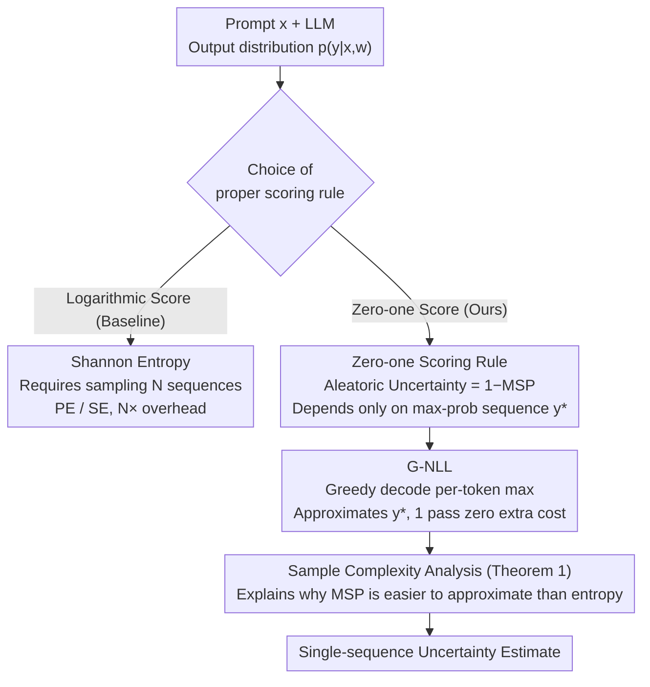

# Rethinking Uncertainty Estimation in LLMs: A Principled Single-Sequence Measure

**Conference**: ICLR 2026  
**arXiv**: [2412.15176](https://arxiv.org/abs/2412.15176)  
**Code**: None  
**Area**: Text Generation / Uncertainty Estimation  
**Keywords**: Uncertainty Estimation, Greedy Decoding, Negative Log-Likelihood, proper scoring rules, LLM  

## TL;DR
Starting from the framework of proper scoring rules, this work proves that the negative log-likelihood of the maximum probability output sequence (MSP) is a theoretically sound uncertainty measure. It proposes G-NLL—which approximates this measure using a single greedy decoding pass—matching or exceeding state-of-the-art (SOTA) sampling-based methods across multiple scenarios.

## Background & Motivation

**Background**: LLM uncertainty estimation primarily relies on logarithmic scoring rules. Derived measures such as Predictive Entropy (PE) and Semantic Entropy (SE) require sampling multiple output sequences for approximation, which is computationally expensive.

**Limitations of Prior Work**: Multi-sequence sampling methods are impractical for real-world deployment; sampling 10 sequences implies 10 times the inference cost. Furthermore, differences between sampled sequences may reflect lexical variations rather than true uncertainty, necessitating additional Natural Language Inference (NLI) models for semantic clustering, which further increases complexity.

**Key Challenge**: Logarithmic scoring rules inherently require taking the expectation over the entire output sequence distribution (Shannon entropy). This distribution grows exponentially with sequence length, making exact calculation impossible. Is there a proper scoring rule that does not require traversing the entire distribution?

**Goal**: (a) Provide a theoretical foundation for single-sequence uncertainty measures; (b) Analyze the sample complexity advantages of its approximation; (c) Propose the most efficient implementation.

**Key Insight**: Explore the zero-one score as an alternative proper scoring rule. Under this rule, aleatoric uncertainty depends only on the likelihood of the highest probability sequence, eliminating the need to sample the full distribution.

**Core Idea**: Replace the logarithmic scoring rule with the zero-one scoring rule to derive uncertainty measures. This reveals that the negative log-likelihood of a greedy decoded sequence is a sufficient approximation.

## Method

### Overall Architecture
Given an LLM and prompt $\bm{x}$, the method outputs a theoretically grounded uncertainty estimate using only a standard decoding pass. The mechanism involves: replacing the logarithmic rule with the zero-one rule within the proper scoring rule framework to reduce aleatoric uncertainty to a term depending only on the "highest probability sequence"; then, using greedy decoding to approximate this sequence. Total uncertainty reduces to the accumulated negative log-probability of the greedy path, achieving zero extra cost compared to the $N$-fold sampling overhead of PE/SE.

### Key Designs

**1. Zero-one Scoring Rule: Decoupling uncertainty from the full distribution**

Logarithmic scoring is expensive because its derived aleatoric uncertainty is Shannon entropy, requiring an expectation over all possible sequences ($|\mathcal{V}|^T$). This work employs the zero-one score, another valid (proper) scoring rule:

$$\mathbf{S}_{0\text{-}1}(p, \bm{y}') = (1 - p(\bm{y}=\bm{y}'|\bm{x})) \cdot \mathbb{1}\{\bm{y}'=\arg\max p(\bm{y}|\bm{x})\}$$

Substituting this into the standard "Total Uncertainty = Aleatoric + Epistemic" decomposition, the aleatoric term simplifies to $1 - p(\bm{y}=\bm{y}^*|\bm{x},\bm{w})$, which is the complement of the Maximum Sequence Probability (MSP). Crucially, this term only concerns the highest probability sequence $\bm{y}^*$, removing the need for summation over the distribution. This provides a formal theoretical justification for MSP, which was previously treated as an ad hoc baseline.

**2. G-NLL: Approximating the max-probability sequence via token-level maximization**

Design 1 reduces the problem to finding $\bm{y}^* = \arg\max p(\bm{y}|\bm{x})$, which is NP-hard. Ours approximates this sequence using greedy decoding by taking the maximum probability at each token step:

$$\text{G-NLL} = -\sum_{t=1}^T \log\Big(\max_{y_t} p(y_t|\bm{x}, \bm{y}_{<t}, \bm{w})\Big)$$

While greedy decoding does not guarantee the global maximum, it represents the path the model already takes during standard inference. Thus, the measure is "free"—involving no additional sampling or forward passes. Experimental and theoretical simulations demonstrate that the deviation of the greedy sequence from the true $\bm{y}^*$ is significantly smaller than the estimation bias of entropy from finite sampling.

**3. Sample Complexity Analysis (Theorem 1): Why MSP is easier to approximate**

The paper compares the sampling complexity of both measures. The number of samples required to approximate MSP $M(p(\bm{y}))$ is:

$$O\Big(\frac{C_\epsilon}{P_\epsilon}\log\frac{1}{\delta}\Big),$$

depending on the probability concentration $P_\epsilon$ within an $\epsilon$-neighborhood. In contrast, the complexity for Shannon entropy $H(p(\bm{y}))$ is:

$$O\Big(\frac{(b-a)^2 C^2}{2\epsilon^2}\log\frac{2}{\delta}\Big),$$

governed by the range $[a,b]$ of the likelihood and importance weights $C$. Since LLM output distributions are typically highly concentrated, $M$ is easily approximated, whereas $H$ suffers from high variance.

### Loss & Training
G-NLL is a purely inference-time method requiring no training or auxiliary models. A critical implementation detail is: **do not apply length normalization** to G-NLL. While normalization is often used in entropy measures (like PE) to counter sequence length bias, it violates the theoretical correspondence between G-NLL and MSP. Experiments confirm performance degradation when normalization is applied.

## Key Experimental Results

### Main Results (6 Models × 6 Tasks, AUROC for Correct/Incorrect Classification)
Evaluating across 6 LLMs spanning different architectures (Transformer, SSM), sizes (7B to 70B), and training stages (PT, IT):

| Method | Samples | Average AUROC | Description |
|------|-----------|----------|------|
| PE | 10 | Baseline | Predictive Entropy |
| LN-PE | 10 | Slightly Higher | Length-Normalized PE |
| SE | 10 | Medium | Semantic Entropy |
| D-SE | 10 | Medium | Discrete Semantic Entropy |
| **G-NLL** | **1** | **SOTA** | 10x efficiency gain |

### Ablation Study

| Configuration | Performance | Description |
|------|------|------|
| G-NLL (No Norm) | Optimal | Theoretically correct form |
| G-NLL + Length Norm | Drop | Breaks correspondence with MSP |
| Sampled Seq NLL | Drop | Only max-prob sequence has theoretical grounding |
| PE (N=5) | Drop | High variance due to insufficient sampling |

### Key Findings
- G-NLL achieves or exceeds the performance of PE/SE (N=10) using only 1 decoding pass—a **10x computational efficiency gain**.
- Length normalization for G-NLL lacks theoretical basis and is empirically harmful.
- Greedy decoding (highest probability sequence) is essential; using the NLL of random sampled sequences performs worse.
- Simulation experiments show that the approximation error of G-NLL for MSP is much lower than that of multi-sequence sampling for PE.
- G-NLL demonstrates stability across various model architectures and scales.

## Highlights & Insights
- **Theoretical contribution is the core highlight**: This work provides the first theoretical foundation for single-sequence uncertainty measures (MSP) based on proper scoring rules, elevating an ad hoc baseline to a principled method. This challenges the prevailing assumption that multi-sequence sampling is necessary for reliability.
- **High Practical Value**: G-NLL is simply the negative log-likelihood of greedy decoding, incurring zero extra computational cost, making it an ideal uncertainty signal for deployed LLMs.
- The sample complexity analysis provides a theoretical benchmark for the computational feasibility of different uncertainty measures.

## Limitations & Future Work
- Greedy decoding is an upper-bound approximation and may not find the global maximum sequence (NP-hard).
- Focuses exclusively on aleatoric uncertainty; epistemic uncertainty remains unaddressed.
- Experiments are restricted to QA tasks; performance in long-form generation is not yet verified.
- The semantic layer counterpart of the zero-one score (Maximum Cluster Probability, MCP) has not been fully explored.

## Related Work & Insights
- **vs PE (Malinin & Gales)**: PE is based on Shannon entropy derived from logarithmic scores, requiring high-variance sampling. G-NLL utilizes zero-one scores and a single pass.
- **vs SE (Kuhn et al.)**: SE uses semantic clustering to reduce linguistic noise but requires an external NLI model. G-NLL needs no extra models.
- **vs Fadeeva et al.**: Previous work used MSP as a baseline without theoretical justification; this paper provides the necessary mathematical framework.

## Rating
- Novelty: ⭐⭐⭐⭐⭐ Challenges mainstream paradigms with an elegant, practical theory.
- Experimental Thoroughness: ⭐⭐⭐⭐ 6 models × 6 tasks, supplemented by simulation and proofs.
- Writing Quality: ⭐⭐⭐⭐⭐ Rigorous derivation and convincing motivation.
- Value: ⭐⭐⭐⭐⭐ Potentially shifts the paradigm for LLM uncertainty estimation.

<!-- RELATED:START -->

## Related Papers

- [\[ICLR 2026\] Rainbow Padding: Mitigating Early Termination in Instruction-Tuned Diffusion LLMs](rainbow_padding_mitigating_early_termination_in_instruction-tuned_diffusion_llms.md)
- [\[CVPR 2025\] Dense Match Summarization for Faster Two-view Estimation](../../CVPR2025/nlp_generation/dense_match_summarization_for_faster_two-view_estimation.md)
- [\[ACL 2025\] Principled Content Selection to Generate Diverse and Personalized Multi-Document Summaries](../../ACL2025/nlp_generation/dpp_diverse_multidoc_summary.md)
- [\[ACL 2025\] Rethinking Evaluation Metrics for Grammatical Error Correction: Why Use a Different Evaluation Process than Human?](../../ACL2025/nlp_generation/rethinking_evaluation_metrics_for_grammatical_error_correction_why_use_a_differe.md)
- [\[ACL 2026\] Children's English Reading Story Generation via Supervised Fine-Tuning of Compact LLMs with Controllable Difficulty and Safety](../../ACL2026/nlp_generation/childrens_english_reading_story_generation_via_supervised_fine-tuning_of_compact.md)

<!-- RELATED:END -->
