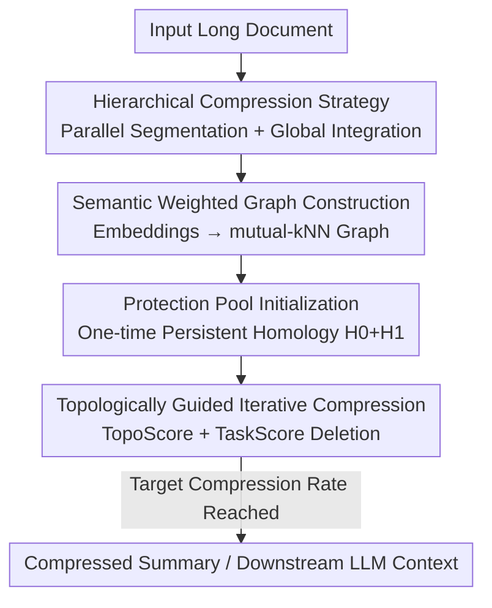

# Text Summarization via Global Structure Awareness

**Conference**: ICLR 2026  
**OpenReview**: [https://openreview.net/forum?id=uNaXiGL5uo](https://openreview.net/forum?id=uNaXiGL5uo)  
**Code**: None  
**Area**: Text Generation / Text Summarization  
**Keywords**: Text Summarization, Topological Data Analysis, Persistent Homology, Long Document Compression, Unsupervised Extraction

## TL;DR
GloSA-sum introduces Topological Data Analysis (TDA) to text summarization for the first time. It utilizes persistent homology to identify the document's semantic skeleton and logical loops, storing them in a "protection pool." A lightweight proxy metric is then used to iteratively delete sentences, achieving fast and accurate compression without losing core logic chains, while effectively shortening contexts for downstream LLM tasks.

## Background & Motivation
**Background**: Mainstream long document summarization follows three paths: unsupervised extraction based on sentence similarity graphs (TextRank, LexRank), which sorts sentences by centrality; model-based improvements (BERTSum, MatchSum, MemSum, BART, PEGASUS, BigBird) that enhance representation via stronger encoders/decoders; and direct usage of LLMs for summarization.

**Limitations of Prior Work**: Graph-based ranking methods focus only on local similarity or shallow statistical features, failing to capture global discourse structure and long-range logical dependencies across paragraphs. Model-based approaches face $O(N^2)$ attention scalability bottlenecks on ultra-long documents, and generative models incur additional autoregressive decoding costs, being 10–20× slower than TextRank. LLMs offer high quality but at prohibitively high inference costs for large-scale long-text scenarios.

**Key Challenge**: Existing methods generally **perform local judgments at the sentence level and lack explicit modeling of the document's overall topological structure**. Consequently, summarization often removes critical logical chains supporting the argument, damaging coherence and hindering downstream tasks. A trade-off between accuracy and efficiency persists.

**Goal**: To maintain summary quality without significantly increasing resource consumption. Specifically: (1) explicitly characterize and preserve semantic clusters and cross-paragraph logical dependencies; (2) avoid repeated high-cost structural computations; and (3) ensure the method scales to ultra-long documents.

**Key Insight**: TDA provides a "global perspective" by treating sentence embeddings as point clouds in high-dimensional space. Persistent homology tracks the "birth and death" of topological features across observation scales; long-lived features represent robust structures, while short-lived ones are noise. Zero-dimensional homology $H_0$ corresponds to connected components (core thematic clusters), and one-dimensional homology $H_1$ corresponds to loops (cross-paragraph logical cycles).

**Core Idea**: Perform a one-time persistent homology analysis to extract semantic and logical skeletons as a frozen "protection pool." Subsequently, use only lightweight proxy metrics for iterative sentence deletion. This guides compression with topological structure, balancing fidelity and efficiency.

## Method

### Overall Architecture
GloSA-sum is a global structure-aware summarization framework. Given a (potentially ultra-long) document, it outputs a compressed summary preserving the semantic core and logical chains. The pipeline follows a "identify the skeleton with TDA first, then greedily delete around it" approach: sentences are encoded as embeddings to construct a weighted undirected graph merging semantics and position; persistent homology is calculated **only once** on this graph to select the most persistent $H_0$ clusters and $H_1$ loops for the protection pool $P$; iterative compression then proceeds using a proxy score combining topological connectivity and task relevance to delete the least important sentences until the target rate is met. For ultra-long texts, a hierarchical strategy is applied: segment-wise parallel local summarization followed by global compression to remove cross-segment redundancy.

### Key Designs

**1. Semantic Weighted Graph Construction: Encoding Adjacency and Order**

To enable TDA, the document is transformed into a topological structure. Each sentence is encoded into an embedding $e_i$ using a pre-trained encoder (default: all-mpnet-base-v2) and normalized. A weighted undirected graph $G=(V,E)$ is built where nodes represent sentences. Edges are established using a **mutual k-nearest neighbor** strategy with an adaptive neighborhood size: $k$ grows logarithmically with document length. An edge exists only if $s_i$ and $s_j$ are in each other's neighborhood, assigned a hybrid weight:

$$w_{ij} = \alpha \cdot d^{\text{sem}}_{ij} + (1-\alpha)\cdot \exp\!\left(-\frac{|i-j|}{\tau}\right)$$

where $d^{\text{sem}}_{ij}=1-\cos(e_i,e_j)$ is the semantic distance and $|i-j|$ is the positional distance. $\alpha$ balances semantics and order, while $\tau$ controls positional decay sensitivity. This ensures the graph captures both sequential argumentation and global semantic relationships.

**2. Protection Pool Initialization: Freezing the Skeleton via One-time TDA**

This design addresses the high computational cost of structural analysis. Unlike previous graph-based methods that recalculate structures every round, GloSA-sum calculates persistent homology **only once** at the beginning. Using a Lazy Witness Complex with a fixed proportion of landmarks to approximate the simplicial complex, it computes up to one-dimensional homology, yielding persistence diagrams $D(0)$ and $D(1)$. Each feature is quantified by its persistence $\ell = d - b$. The protection pool $P=P_{H_0}\cup P_{H_1}$ consists of the top-$K$ most persistent $H_0$ components (securing core thematic clusters) and top-$M$ most persistent $H_1$ loops (securing cross-paragraph dependencies). This freezes "un-deletable" sentences, ensuring scalability.

**3. Topologically Guided Iterative Compression: Proxy Scores for Importance**

With the skeleton locked, TDA is no longer required. For each sentence $s_i\in S\setminus P$, a deletion priority score is calculated:

$$\text{Score}(s_i)=\lambda\cdot\text{TopoScore}(s_i)+(1-\lambda)\cdot\text{TaskScore}(s_i)$$

**TopoScore** measures structural importance relative to the skeleton. Using Dijkstra on the sparse graph $G$, it calculates the shortest path $\text{SPL}(s_i,s_j)$ to each protected node $s_j\in P$, where $\text{TopoScore}(s_i)=-\sum_{s_j\in P}\text{SPL}(s_i,s_j)$. Values closer to 0 indicate stronger connectivity to the skeleton. **TaskScore** incorporates downstream queries $q$ when available: $\text{TaskScore}(s_i)=\beta\cdot\cos(e_i,e_q)+(1-\beta)\cdot\text{BM25}(s_i,q)$. Each round removes the lowest-scoring sentence until the target compression rate is reached.

**4. Hierarchical Compression Strategy: Parallelization and Consistency**

For ultra-long documents, a hierarchical approach ensures both local and global consistency. Documents are split into $T$ segments $\{C_1,\dots,C_T\}$ based on natural boundaries. These are processed **independently and in parallel** to obtain local summaries $\{C'_1,\dots,C'_T\}$. These are then concatenated into an intermediate summary $D'$, which undergoes a final global compression to remove cross-segment redundancies.

## Key Experimental Results

### Main Results
Evaluated on CNN/DM, GovReport, ArXiv, and PubMed using ROUGE, compared against 10 baselines including TextRank, BART, PEGASUS, and BigBird.

| Dataset | Metric | GloSA-sum | Strong Baseline | Gain |
|--------|------|-----------|------------|------|
| ArXiv | ROUGE-L | 42.0 | BART 39.86 | +2.14 |
| ArXiv | ROUGE-1 | 47.5 | PEGASUS 43.27 | +4.23 |
| PubMed | ROUGE-L | 44.5 | MemSum 44.33 / BigBird 42.33 | +0.17 / +2.17 |
| GovReport | ROUGE-2 | 26.0 | BigBird 24.81 | +1.19 |
| PubMed | ROUGE-1 | 49.5 | BERTSum 49.10 | +0.40 |

In terms of efficiency, GloSA-sum is significantly faster than generative models (BART/PEGASUS 10–20× slower) and only 6–8× slower than TextRank. Human evaluation (scale 1–5) ranked GloSA-sum highest with an average score of 4.30.

### Ablation Study

| Configuration (GovReport) | ROUGE-1 | ROUGE-2 | ROUGE-L | Note |
|------|---------|---------|---------|------|
| GloSA-sum (Full) | 55.5 | 26.0 | 51.0 | Full model |
| w/o Protection Pool | 50.2 | 22.1 | 45.8 | Drop >5 pts, skeleton is critical |
| w/o TopoScore | 52.4 | 23.3 | 47.0 | Drop ~3 pts |
| H0 only (no H1 loops) | 54.1 | 24.8 | 49.8 | H1 primarily aids ROUGE-L |
| Louvain instead of TDA | 52.9 | 24.1 | 48.3 | Standard clustering performs worse |
| w/o Hierarchical | – | – | – | Fails on long documents |

### Key Findings
- **Protection pool is the most significant contributor**: Removing it causes a ROUGE drop of over 5 points, confirming that the TDA skeleton is fundamental to preserving global structure.
- **H1 loops provide independent value**: Using only H0 leads to lower ROUGE-L, indicating $H_1$ captures cross-paragraph dependencies beyond simple thematic clusters.
- **TDA outperforms standard graph clustering**: Replacing persistent homology with Louvain community detection results in significant performance loss.
- **Protection pool $\neq$ positional heuristic**: TDA targets high-dimensional semantic geometry rather than surface positional cues.

## Highlights & Insights
- **Decoupling structural calculation from iteration**: By calculating the expensive persistent homology only once, the scalability bottleneck is eliminated.
- **Linguistic interpretation of $H_0$/$H_1$**: Mapping connected components to thematic clusters and loops to logical cycles provides a functional semantic meaning for abstract topological quantities.
- **TopoScore as an efficient proxy**: Using the sum of shortest paths to the protection pool allows "proximity to skeleton = importance" to be quantified efficiently on sparse graphs.
- **Downstream LLM Benefit**: It serves as an effective pre-processing module for long-context compression, preserving reasoning chains for LLMs.

## Limitations & Future Work
- **Dependency on sentence encoder quality**: Performance is capped by the embedding model used for the semantic graph.
- **Extractive nature**: As a deletion-based method, it cannot rewrite or paraphrase sentences like generative models.
- **Hyperparameter sensitivity**: Multiple parameters ($\alpha, \tau, \lambda, \beta, K, M$) require tuning, which may increase the cost of domain migration.
- **TaskScore dependency**: When no query is available, it relies entirely on topology, which may favor structurally strong but information-average sentences.

## Related Work & Insights
- **vs TextRank / LexRank**: While these use centrality in similarity graphs, GloSA-sum uses multi-scale persistent homology to capture long-range dependencies that local similarity metrics miss.
- **vs MemSum**: GloSA-sum offers better efficiency (6–8×) due to its parallelizable iterative deletion compared to MemSum’s serial reinforcement learning approach.
- **vs BigBird / DANCER**: GloSA-sum shows superior preservation of fine-grained logic, as evidenced by higher ROUGE-2/L scores on GovReport and PubMed.
- **vs Existing TDA in NLP**: Previous work used TDA for explanation or classification; this is the first systematic application to large-scale text compression and summarization.

## Rating
- Novelty: ⭐⭐⭐⭐⭐ First introduction of TDA to summarization with an original decoupling design.
- Experimental Thoroughness: ⭐⭐⭐⭐ Solid results across 5 datasets and 10 baselines, though some hyperparameter analysis is relegated to the appendix.
- Writing Quality: ⭐⭐⭐⭐ Clear logical flow and effective introduction of TDA concepts.
- Value: ⭐⭐⭐⭐ Highly practical for long-text summarization and LLM context compression.

<!-- RELATED:START -->

## Related Papers

- [\[ACL 2025\] Theme-Explanation Structure for Table Summarization Using Large Language Models](../../ACL2025/nlp_generation/theme-explanation_structure_for_table_summarization_using_large_language_models_.md)
- [\[ICLR 2026\] FS-DFM: Fast and Accurate Long Text Generation with Few-Step Diffusion Language Model](fs-dfm_fast_and_accurate_long_text_generation_with_few-step_diffusion_language_m.md)
- [\[ACL 2025\] What Is That Talk About? A Video-to-Text Summarization Dataset for Scientific Presentations](../../ACL2025/nlp_generation/video_text_summarization.md)
- [\[ACL 2026\] ThreadSumm: Summarization of Nested Discourse Threads Using Tree of Thoughts](../../ACL2026/nlp_generation/threadsumm_summarization_of_nested_discourse_threads_using_tree_of_thoughts.md)
- [\[AAAI 2026\] Structured Language Generation Model: Loss Calibration and Formatted Decoding for Efficient Text](../../AAAI2026/nlp_generation/structured_language_generation_model_loss_calibration_and_formatted_decoding_for.md)

<!-- RELATED:END -->
