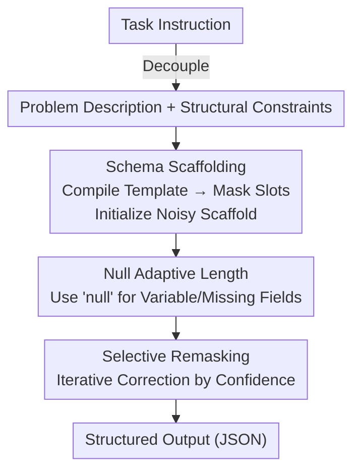

# Unveiling the Potential of Diffusion Large Language Model in Controllable Generation

**Conference**: ICLR 2026  
**OpenReview**: [https://openreview.net/forum?id=qhd0qv6L0k](https://openreview.net/forum?id=qhd0qv6L0k)  
**Project Page**: [eric2i.github.io/dLLM-CtrlGen](https://eric2i.github.io/dLLM-CtrlGen)  
**Code**: See project page  
**Area**: Text Generation / Diffusion Language Models / Structured Output  
**Keywords**: Diffusion Large Language Model, Controllable Generation, Structured Output, Schema Scaffolding, Training-free  

## TL;DR
This paper proposes **Self-adaptive Schema Scaffolding (S3)**—a training-free method that injects a structure template (schema) as a "semi-denoised initial state" directly into the output context of a Diffusion Large Language Model (dLLM). Augmented with `null` placeholders for adaptive length, S3 allows dLLMs to stably generate valid structured outputs like JSON with fewer denoising steps. It improves structure compliance from the 30%–80% baseline range to over 99%, while maintaining a lower hallucination rate.

## Background & Motivation
**Background**: Controllable generation (forcing models to output in predefined formats like JSON, XML, or tables) is fundamental in the LLM era for tool calling, Agent communication, and API interfacing. Current mainstream approaches fall into two categories: **grammar-constrained decoding**, which uses Finite State Automata (FSA) and constrained decoding to enforce grammar token-by-token during generation; and **prompt engineering**, which relies on hand-written prompts to elicit compliant formats.

**Limitations of Prior Work**: Grammar-constrained decoding can lead to the "stalling" of generation when no valid tokens satisfy the grammar, effectively pruning all beams. Prompt engineering requires manual tuning for different structural specifications and exhibits highly unstable performance across different domains and complexities. More fundamentally, these methods **rely solely on the language model's inherent capabilities** without an external mechanism to guide the generation trajectory.

**Key Challenge**: The root of the problem lies in the Auto-Regressive (AR) architecture itself: (1) Generating from left to right means early tokens are produced without awareness of the full sequence, lacking global structural coordination; (2) The "commitment" to already generated tokens prevents backtracking to correct structural violations; (3) Sequential dependence prevents the model from satisfying multiple constraints simultaneously. High-quality structured generation precisely requires **global sequence planning, iterative refinement, and parallel constraint satisfaction**—three capabilities naturally lacking in AR architectures.

**Key Insight**: Diffusion Large Language Models (dLLMs, such as LLaDA or Dream) generate text by **iteratively denoising** a masked sequence. They inherently possess global attention (global context awareness) and parallel generation capabilities, which exactly compensate for the three weaknesses of AR. However, the authors find that off-the-shelf instruction-tuned dLLMs still hallucinate or break structures when used directly for structured output, and semi-autoregressive implementations (block-wise decoding) actually strip away the global perception and parallel advantages of dLLMs.

**Core Idea**: Instead of optimizing the prompt (which belongs to the indirect guidance of "instruction space"), the structural template is **directly injected into the output context**. This allows the dLLM to start from a "partially denoised state with the skeleton already filled and only slots remaining," transforming open-ended generation into a "fill-in-the-blank" task. This leverages its backward inference and global perception to complete the slots stably.

## Method

### Overall Architecture
S3 is a **training-free** inference pipeline. it decomposes the original task instruction into two parts: the **problem description** (semantic content) and **structural constraints** (format specification $S$). Structural constraints are compiled into a schema, which is then used to initialize a "noisy scaffold": fixed structural elements (brackets, delimiters, field names) from the template are preserved, while variable content positions are replaced with mask tokens $M$. The dLLM denoises these mask positions conditioned on the problem description. Simultaneously, **selective remasking** iteratively refines the output based on confidence scores to produce the final structured output.

Formally, the goal of structured generation is to find $A^*=\arg\max_{A\in A(S)} P_{LM}(A|Q,S)$ over the space of valid outputs $A(S)$. Since searching the entire $A(S)$ is infeasible due to the massive token space, S3 approximates this by denoising the masked positions of the scaffold $A_s$ within a "constrained subspace of shared structural templates" $\mathcal{S}_C\subset A(S)$: $A^*\approx\arg\max_{A_s\in\mathcal{S}_C}\sum_{a_i\in A_s}\mathbb{1}[a_i=M]\log P_\phi(a_i|Q,A_s)$.

### Key Designs

**1. Schema Scaffolding: Injecting templates as "semi-denoised initial states" into the output context**

To address the lack of guidance mechanisms in generation trajectories, the authors stop optimizing prompts in the instruction space and instead pre-fill the **output context** with structural templates. By parsing the specification $S$, invariant structural elements are kept while variable content positions are replaced with mask tokens $M$, creating a structural scaffold $A_s$. This constrains the generation space while providing flexibility for semantic content, essentially turning "unconstrained generation" into "completion."

To explain why this is effective for diffusion models, the authors present the **Scaffold-Guided Denoising Convergence Theorem**: initializing the denoising process with a structural scaffold $S$ reduces the expected denoising error at masked positions proportionally to the coverage ratio $|S|/L$ compared to using no scaffold: $E[\|\hat{x}_0-x_0\|_M]\le E[\|\tilde{x}_0-x_0\|_M]\cdot\left(1-\frac{|S|}{L}\right)$. Intuitively, by "locking down" certain positions in advance, the dLLM only needs to denoise the remaining masks. Higher coverage reduces the uncertainty to be denoised, allowing for near-perfect structural compliance in very few steps (e.g., saturation at 8 steps). Unlike grammar-constrained decoding, which "locks" tokens sequentially, scaffolding provides a global skeleton without risk of stalling.

**2. Null Adaptive Length: Resolving over-generation and hallucinations in fixed-length scaffolds via `null` placeholders**

Scaffolding introduces a new problem: how many mask tokens should be reserved for each variable field? This is difficult to determine without knowing the target content length. A naive solution (allocating many masks and hoping the model uses only what it needs) fails because dLLMs are highly sensitive to sequence length. Excessively long scaffolds distort generation quality, leading to fields being over-filled or the fabrication of content (Sec. 6.1). Another solution, fine-tuning with a specific padding token, violates the "training-free" goal and introduces dataset bias.

S3 resolves this by introducing the semantic token **`null`** as a placeholder. An enhanced prompt $Q^+$ guides the model to naturally use `null` for missing values or variable-length fields. The objective becomes $A^*\approx\arg\max_{A_s\in\mathcal{S}_C}\sum_{a_i\in A_s}\mathbb{1}[a_i=M]\log P_\phi(a_i|Q^+,A_s)$. This transforms the "fixed-length scaffold" problem into an "adaptive generation" task. The insight is that dLLMs are trained for "faithful reconstruction"; when a rigid schema forces them to fill content where the source text provides none, they hallucinate tokens to satisfy the format. Allowing the model to explicitly use `null` to acknowledge "no information here" pulls the test-time distribution back toward the familiar training distribution, simultaneously maintaining structural constraints and reducing hallucinations.

**3. Selective Remasking: Leveraging diffusion's multi-step nature for confidence-driven iterative correction**

Unlike AR models, where a token choice is final, diffusion's multi-step denoising supports repeated editing of generated tokens. S3 incorporates **selective remasking**: during denoising iterations, positions with low-confidence predictions are re-masked and denoised again to refine the output. This step utilizes the global attention of the dLLM—the re-masked positions can make new decisions based on the already formed global structural context rather than being locked into early local errors. This implements the "iterative correction" capability missing in AR models.

### Loss & Training
S3 is **entirely training-free (zero-shot)**. It does not modify dLLM weights; all mechanisms occur during inference. Regarding complexity, the standard dLLM reverse process has a total complexity of roughly $O(L^3)$ (steps × $O(L^2)$ global attention per step). S3 uses a "warm-start" from a partially denoised state rather than a fully random one, reducing decoding complexity to approximately $O(nL^2)$, where $n$ is a small adjustable hyperparameter (reflecting saturation within ~8 inference steps).

## Key Experimental Results

Experiments use **LLaDA** as the primary dLLM and the **WikiBio** dataset (structured extraction), with 0 inference temperature. Evaluation covers three dimensions: **Structural Compliance** (SV structure validity / FC field completeness / SC schema compliance), **Content Fidelity** (PR/RE/F1), and **Faithfulness** (HR hallucination rate, lower is better).

### Main Results

Structural Compliance (SC, higher is better) across denoising steps:

| Method | 8 steps | 16 steps | 32 steps |
|------|------|-------|-------|
| Baseline (Direct Prompting) | .312 | .576 | .792 |
| Schema Scaffolding (S2) | .993 | .997 | .996 |
| Self-adaptive (S3) | .994 | .997 | .997 |

Directly prompting the dLLM is insufficient: structural metrics for the baseline remain below 65% for long periods and only reach ~87% at 32 steps. Scaffolding methods achieve near-perfection in **only 8 steps**. Since diffusion inference latency scales linearly with steps, this implies both lower latency and higher structural quality.

Hallucination Rate (HR, lower is better, Table 1):

| Method | 8 steps | 16 steps | 32 steps |
|------|------|-------|-------|
| Baseline | 0.404 | 0.403 | 0.409 |
| S2 (Vanilla Scaffolding) | 0.465 | 0.463 | 0.463 |
| S3 (Self-adaptive) | **0.340** | **0.331** | **0.331** |

A key contrast: the vanilla scaffold (S2) actually has a **higher** hallucination rate than the baseline, as the rigid schema forces the model to fabricate content to fill all slots. S3, by allowing `null` placeholders, reduces hallucinations to the lowest level among all methods.

### Ablation Study
Comparing progressively enhanced baselines across different steps (Table 2, excerpted 8-step results):

| Configuration | SV↑ | SC↑ | F1↑ | HR↓ | Description |
|------|------|------|------|------|------|
| Baseline | 0.346 | 0.312 | 0.068 | 0.404 | Direct prompting |
| w/ few-shots (3 examples) | 0.471 | 0.443 | 0.068 | 0.366 | Few-shot only slightly improves structure |
| w/ template (Full schema in instruction) | 0.475 | 0.431 | 0.084 | 0.388 | Template as guidance; structure still <50% |
| **S3 (ours)** | **0.994** | **0.994** | **0.130** | **0.340** | Structure compliance jumps to 99%+ |

### Key Findings
- **"Overthinking" Phenomenon**: Content fidelity does not always improve with more steps. Extended iteration sometimes causes performance drops, which the authors call "overthinking"—where the diffusion backward process deviates from the optimal solution. Structural compliance saturates at 8 steps, suggesting that constraints provided by the scaffold are realized early in inference.
- **Instruction vs. Output Injection**: There is a massive difference between including the schema in the instruction (w/ template) and the output context. Putting the template in the instruction yields <50% compliance, but S3's use of the **output context** (semi-denoised initial state) reaches 99%+. This supports the core thesis that output-side scaffolding is superior to prompt engineering.
- **Null placeholder is the differentiator for S3**: While vanilla scaffolding (S2) improves recall and F1, precision and faithfulness deteriorate. The introduction of `null` in S3 improves all three metrics simultaneously by resolving over-generation and distribution shift.

## Highlights & Insights
- **"Warm-starting in output context" is the correct way to use diffusion's denoising mechanism**: Unlike AR models, dLLMs naturally support starting from a masked sequence. The paper cleverly maps "structural templates" to "known denoising positions" and quantifies the error reduction through a theorem.
- **Using `null` to shift test-time scenarios back to training distribution**: Instead of fine-tuning with special padding tokens, leveraging the model’s semantic prior to admit "no information" preserves training-agnosticism while preventing hallucinations. This is a lightweight trick transferable to other constrained tasks.
- **Structured output is a perfect testbed for dLLM's global perception**: Compared to open dialogues, structured tasks have a rigid demand for global planning and parallel constraint satisfaction, which amplifies the architectural advantages of dLLMs over AR models.

## Limitations & Future Work
- **Content fidelity remains low in absolute terms**: The F1 score is only in the 0.12~0.13 range. The authors admit only "marginal improvement" here; S3 primarily solves structure compliance rather than semantic extraction accuracy.
- **Narrow evaluation scope**: Primary results are centered on one model (LLaDA) and one dataset (WikiBio). Evidence for generalization across models and more complex schemas (deep nesting, coupled constraints) is limited.
- **"Overthinking" not fully resolved**: While S3 mitigates over-generation, performance can still drop with extended denoising, and there is no adaptive stopping mechanism. The `null` placeholder also relies on $Q^+$ guidance, maintaining some dependence on prompt design.
- **Complexity gains depend on approximations**: The $O(nL^2)$ complexity assumes $n\ll L$, but a systematic trade-off curve between $n$ and quality is not provided.

## Related Work & Insights
- **vs. Grammar Constrained Decoding (FSA + constrained decoding)**: Those methods enforce grammar token-by-token during AR decoding, risking stalls when no tokens are valid. S3 provides a global skeleton and uses fill-in-the-blank, leveraging dLLM's parallel and editable nature to avoid "stalling" while remaining training-free.
- **vs. Prompt Engineering / Template as Instruction (w/ template)**: These provide indirect guidance in the instruction space, which is unstable. S3 places the template in the output context as a semi-denoised initial state, jumping from <50% to 99%+ compliance.
- **vs. Semi-Autoregressive dLLM implementations (e.g., LLaDA block-wise decoding)**: Block-wise implementations use KV-caching for speed at the cost of global perception. S3 takes the opposite approach, using warm-start initialization to keep global parallel advantages while reducing complexity from $O(L^3)$ to $O(nL^2)$.

## Rating
- Novelty: ⭐⭐⭐⭐ Utilizing "output-side scaffolding + null adaptive length" for dLLMs is a very fitting and novel perspective.
- Experimental Thoroughness: ⭐⭐⭐ Conclusions are clear, but predominantly tied to a single model and dataset; generalization evidence is thin.
- Writing Quality: ⭐⭐⭐⭐ The motivation (AR's 3 weaknesses ↔ dLLM's 3 advantages) and the S2→S3 failure-correction narrative are very well-structured.
- Value: ⭐⭐⭐⭐ Provides a practical, training-free path for deploying dLLMs for tool calling and Agent structured outputs.

<!-- RELATED:START -->

## Related Papers

- [\[ICLR 2026\] FS-DFM: Fast and Accurate Long Text Generation with Few-Step Diffusion Language Model](fs-dfm_fast_and_accurate_long_text_generation_with_few-step_diffusion_language_m.md)
- [\[ACL 2025\] Unveiling Attractor Cycles in Large Language Models: A Dynamical Systems View of Successive Paraphrasing](../../ACL2025/nlp_generation/unveiling_attractor_cycles_in_large_language_models_a_dynamical_systems_view_of_.md)
- [\[AAAI 2026\] Structured Language Generation Model: Loss Calibration and Formatted Decoding for Efficient Text](../../AAAI2026/nlp_generation/structured_language_generation_model_loss_calibration_and_formatted_decoding_for.md)
- [\[ICLR 2026\] Planner Aware Path Learning in Diffusion Language Models Training](planner_aware_path_learning_in_diffusion_language_models_training.md)
- [\[ICLR 2026\] Rainbow Padding: Mitigating Early Termination in Instruction-Tuned Diffusion LLMs](rainbow_padding_mitigating_early_termination_in_instruction-tuned_diffusion_llms.md)

<!-- RELATED:END -->
