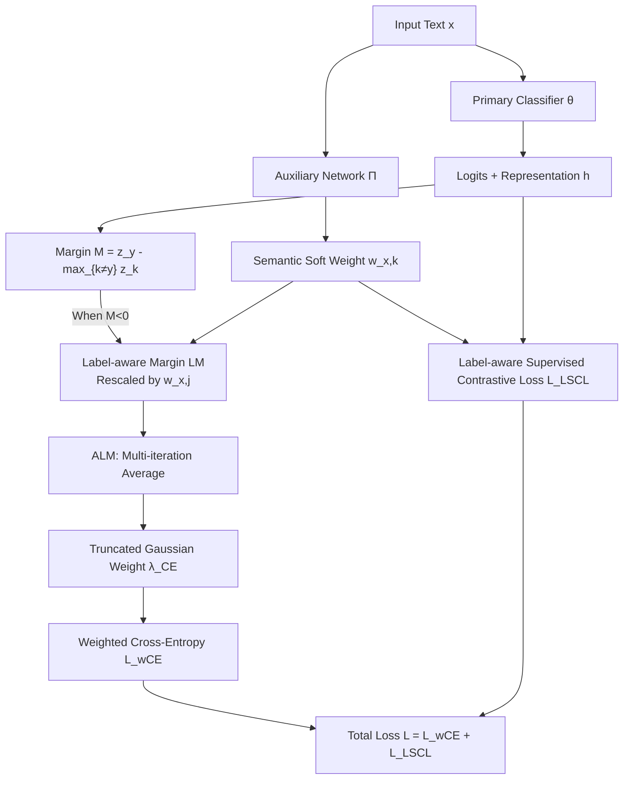

# LANE: Label-Aware Noise Elimination for Fine-Grained Text Classification

**Conference**: ICLR 2026  
**OpenReview**: [https://openreview.net/forum?id=PuayLKdrFz](https://openreview.net/forum?id=PuayLKdrFz)  
**Code**: [https://github.com/tsosea2/Label-Aware-Noise-Elimination](https://github.com/tsosea2/Label-Aware-Noise-Elimination)  
**Area**: Noisy Label Learning / Fine-Grained Text Classification  
**Keywords**: Noisy labels, label-aware margin, text classification, contrastive learning, sample weighting, AUM  

## TL;DR
LANE upgrades the classic margin indicator for identifying mislabeled samples to a **Label-aware Margin**. For negative margins, the penalty is reduced if the mislabeled category is semantically similar to the model's prediction (e.g., "Anger" labeled as "Fear") and increased if they are semantically distant (e.g., "Trust" labeled as "Fear"). Based on this, it applies dynamic weighting to each sample rather than hard deletion, consistently outperforming strong baselines like AUM and HMW across 10 text classification datasets.

## Background & Motivation
**Background**: Supervised text classification relies heavily on annotation quality. However, crowdsourced annotations and weak/distant supervision are naturally noisy, especially in fine-grained tasks with many confusing categories, such as emotion recognition (GoEmotions, 27 classes) and topic classification (RCV1). Over-parameterized neural networks can fit noisy data to zero training error, leading to a collapse in generalization.

**Limitations of Prior Work**: The two main approaches for identifying mislabeled samples have structural flaws. First, AUM (Area Under the Margin, calculated as the average difference between the assigned label logit and the largest other logit across epochs) uses a **fixed threshold to delete** low-scoring samples. However, "hard but clean" samples also yield low scores and are mistakenly removed, losing valuable diversity. Second, small-loss/Co-teaching methods (e.g., Han et al.) also face mis-deletion issues. The recent HMW (Zhang 2024) retains all samples using soft weighting based on IAM (an extension of AUM), but challenges remain.

**Key Challenge**: Both AUM and IAM **rely solely on numerical logit differences and are agnostic to semantic relationships between categories**. They treat "Anger mislabeled as Fear" and "Anger mislabeled as Joy" as equally severe errors. However, the former is a slight confusion of similar emotions, while the latter is a truly harmful mislabel. A one-size-fits-all penalty unfairly penalizes semantically reasonable boundary samples and dilutes the impact on true mislabels.

**Goal**: Retain all training samples while assigning dynamic weights that can **identify mislabels and grade them by "semantic severity,"** protecting hard-clean samples and suppressing true mislabels.

**Core Idea**: **Use an auxiliary network to learn semantic similarity between categories and inject it into margin rescaling.** When the margin is negative (suggesting a mislabel), the penalty is scaled according to the "semantic distance between the assigned label and the predicted label." This semantic distance is learned through a **Label-aware Supervised Contrastive Loss** jointly trained with cross-entropy.

## Method

### Overall Architecture
LANE jointly trains two BERT-base networks: a primary classifier $\theta$ producing logits and text representations, and an auxiliary network $\Pi$ producing **soft-assignment weights** $w_{x,k}$ for each sample across categories (via a projection layer + softmax). During training, the **Label-aware Margin (LM)** is calculated per epoch and averaged to obtain **ALM**. Samples with ALM below the mean of the negative ALM distribution are identified as suspected mislabels and assigned a cross-entropy weight $<1$ using a truncated Gaussian distribution; all other samples receive a weight of 1. Simultaneously, $\Pi$ is trained using a label-aware supervised contrastive loss to learn category semantic relationships.

### Key Designs

**1. Label-aware Margin (LM): Scaling Penalty by Semantic Distance.** The classic margin is defined as $M^{(t)}(x,y)=z_y^{(t)}(x)-\max_{k\neq y}z_k^{(t)}(x)$. A negative value typically suggests a mislabel. LANE’s key insight is to rescale only in the negative margin interval, using semantic weights from the auxiliary network to modulate the penalty:

$$LM^{(t)}(x,y)=\begin{cases}\dfrac{1}{w_{x,j}}\cdot M^{(t)}(x,y) & M^{(t)}(x,y)<0,\ j=\arg\max_{k\neq y}z_k^{(t)}(x)\\[2mm] M^{(t)}(x,y) & \text{otherwise}\end{cases}$$

Here, $j$ is the predicted category (likely the true hidden label). $w_{x,j}$ measures the semantic proximity between the assigned label $y$ and $j$. Closer semantics result in a larger $w_{x,j}$ and a smaller $1/w_{x,j}$, leading to a milder scaling (light penalty). More distant semantics result in a smaller $w_{x,j}$ and a larger $1/w_{x,j}$, magnifying the negative margin (heavy penalty).

**2. Average Label-aware Margin (ALM) + Truncated Gaussian Weighting: Protecting Hard Cases, Suppressing True Mislabels.** Since single-epoch LM is noisy, LANE uses the average $ALM^{(t)}(x,y)=\frac{1}{t}\sum_{r=1}^{t}LM^{(r)}(x,y)$ as a stable measure of label quality. Instead of discarding all samples with negative ALM, it only downweights samples where **the ALM is negative and below the mean of the negative distribution $\mu_t$**. The assumption is that negative ALM samples above the mean are "hard but clean." Weights are assigned using a truncated Gaussian:

$$\lambda_{CE}^{t}(x_i,y_i)=\begin{cases} \exp\!\left(-\dfrac{(ALM^{(t)}(x_i,y_i)-\mu_t)^2}{2\sigma_t^2}\right) & x_i\in N^t,\ ALM^{(t)}<\mu_t\\[2mm] 1 & \text{otherwise}\end{cases}$$

The final weighted cross-entropy $L_{wCE}=\sum_i\lambda_{CE}^t(x_i,y_i)\cdot H(\theta(x_i),y_i)$ reduces the contribution of suspicious mislabels.

**3. Label-aware Supervised Contrastive Loss: Learning Category Semantics.** To ensure $w$ accurately reflects category semantics, LANE extends supervised contrastive loss by incorporating soft-assignment weights:

$$L_{LSCL}=\sum_{i=1}^{|B|}H(\Pi(x_i),y_i)+\sum_{i=1}^{|B|}\frac{-1}{|P_{x_i}|}\sum_{p\in P_{x_i}}\log\frac{w_{x_i,y_{x_i}}\cdot\exp(h_{x_i}^{\theta}\cdot h_p^{\theta})}{\sum_{s\in B;\,y_s\neq y_{x_i}}w_{x_i,y_s}\cdot\exp(h_{x_i}^{\theta}\cdot h_s^{\theta})}$$

The weights $w$ make contrastive learning more sensitive to confusing categories. The total loss is $L=L_{wCE}+L_{LSCL}$, allowing the two networks to be trained end-to-end.

## Key Experimental Results

### Main Results (Original Datasets, Weighted F1 / Accuracy)

| Method | Empath | GoEmo | ISEAR | CEmo | RCV1 | SciHTC | SST-5 | Amazon R | Yelp | Yahoo |
|------|--------|-------|-------|------|------|--------|-------|----------|------|-------|
| BASE (BERT) | 58.5 | 63.6 | 71.5 | 75.8 | 56.8 | 32.5 | 56.3 | 67.5 | 65.9 | 75.4 |
| AUM | 58.4 | 63.1 | 71.8 | 76.0 | 56.3 | 31.2 | 56.4 | 66.4 | 68.1 | 72.9 |
| LCL | 59.1 | 64.8 | 72.4 | 76.5 | 57.9 | 33.1 | 57.6 | 68.2 | 66.8 | 76.8 |
| HMW | 57.6 | 62.8 | 70.4 | 77.1 | 56.7 | 31.6 | 57.2 | 67.4 | 68.1 | 77.3 |
| **LANE** | **60.8** | **66.5** | **74.3** | **78.2** | **59.3** | **34.1** | **58.9** | **69.7** | **69.2** | **78.4** |

LANE achieved the best performance across all 10 datasets, outperforming AUM by an average of **2.88% F1** and HMW by **2.32%**.

### 20% Injected Noise + Ablation Study
Under 20% label-flip noise, LANE remains the best performer, achieving an average improvement of **4.11%** over the base model. At 40% noise, it leads AUM and HMW by **4.75%** and **4.01%**, respectively.

Ablation (Table 4):

| Variant | Empath(orig) | SciHTC(orig) | RCV1(orig) | RCV1(20N) |
|------|--------------|--------------|------------|-----------|
| LANE−sim (No Semantics) | 58.7 | 32.4 | 57.3 | 45.2 |
| LANE−alm (No Weighting) | 59.1 | 32.1 | 57.9 | 46.2 |
| AUM (Hard Deletion) | 58.2 | 31.2 | 56.3 | 47.6 |
| **LANE** | **60.8** | **34.1** | **59.3** | **49.4** |

### Key Findings
- **Semantic awareness is the primary source of gain**: Removing semantics (LANE−sim) dropped performance by 4.2% on RCV1(20N), proving that category similarity is more critical than simple weighting.
- **Retention is superior to deletion**: LANE consistently outperformed AUM, validating that hard-clean samples should be preserved.
- **Computational efficiency**: The auxiliary network increases training computation by approximately 1.8x, but convergence remains efficient on consumer-grade GPUs, making it more economical than LLM-based label correction.

## Highlights & Insights
- **Explicit Injection of Semantic Priors**: Unlike older margin/loss methods that operate purely in numerical space, LANE introduces the semantic structure of "what is mislabeled as what" into noise reduction decisions.
- **Soft Weighting with Adaptive Thresholds**: Using the mean of the negative ALM distribution to distinguish "hard examples" from "true mislabels" avoids the fragility of fixed thresholds.
- **End-to-End Self-Consistency**: Contrastive loss learns semantics, semantics modulate the margin, and the margin performs weighting. This closed-loop system requires no external knowledge or LLMs.

## Limitations & Future Work
- **Dependency on Auxiliary Network Quality**: If category semantics are hard to learn (e.g., highly task-specific definitions or sparse corpora), inaccurate weights $w$ may degrade the LM scaling.
- **Training Overhead**: Joint training increases computational cost by 1.8x, which may be significant for large-scale models.
- **Domain Scope**: Evaluation was limited to BERT-base text classification. Transferability to larger models or other modalities (e.g., CV) remains to be explored.
- **Distribution Assumptions**: Fitting a single truncated Gaussian to the ALM distribution may be insufficient for complex, multi-modal noise structures.

## Related Work & Insights
- **Extension of the AUM Lineage**: LANE builds directly on AUM (Pleiss et al.) and HMW (Zhang et al.), advancing "margin-based noise identification" from the numerical level to the semantic level.
- **Complementary to Contrastive Learning**: Compared to LCL (Suresh & Ong), LANE's gains suggest that "identifying and downweighting mislabels" is complementary to "learning category relationships via contrastive learning."
- **Inspiration for the Noisy Label Community**: While methods like Co-teaching/DivideMix focus on hard splitting of clean and noisy sets, LANE suggests a "soft semantic weighting" paradigm that is likely transferable to other modalities like image and speech recognition.

## Rating
- **Novelty**: ⭐⭐⭐⭐ — Injecting category similarity into margin rescaling specifically for the negative interval is a concise and effective improvement over AUM/IAM.
- **Experimental Thoroughness**: ⭐⭐⭐⭐ — Comprehensive coverage across 10 datasets and multiple noise levels, though limited to BERT-base and text classification.
- **Writing Quality**: ⭐⭐⭐⭐ — The motivation is clearly illustrated with concrete examples (Anger/Fear/Trust), and the logic is easy to follow.
- **Value**: ⭐⭐⭐⭐ — The method is plug-and-play, runs on a single GPU, and provides a generalizable framework for fine-grained noisy label tasks.

<!-- RELATED:START -->

## Related Papers

- [\[ACL 2026\] MADE: A Living Benchmark for Multi-Label Text Classification with Uncertainty Quantification](../../ACL2026/nlp_understanding/made_a_living_benchmark_for_multi-label_text_classification_with_uncertainty_qua.md)
- [\[ACL 2026\] LLM-Guided Semantic Bootstrapping for Interpretable Text Classification with Tsetlin Machines](../../ACL2026/nlp_understanding/llm-guided_semantic_bootstrapping_for_interpretable_text_classification_with_tse.md)
- [\[ACL 2026\] Revealing Temporal Framing in News Text](../../ACL2026/nlp_understanding/uncovering_temporal_framing_in_the_news.md)
- [\[ICML 2026\] Causal Fine-Tuning under Latent Confounded Shift](../../ICML2026/nlp_understanding/causal_fine-tuning_under_latent_confounded_shift.md)
- [\[ACL 2026\] Beyond Chunking: Discourse-Aware Hierarchical Retrieval for Long Document Question Answering](../../ACL2026/nlp_understanding/beyond_chunking_discourse-aware_hierarchical_retrieval_for_long_document_questio.md)

<!-- RELATED:END -->
