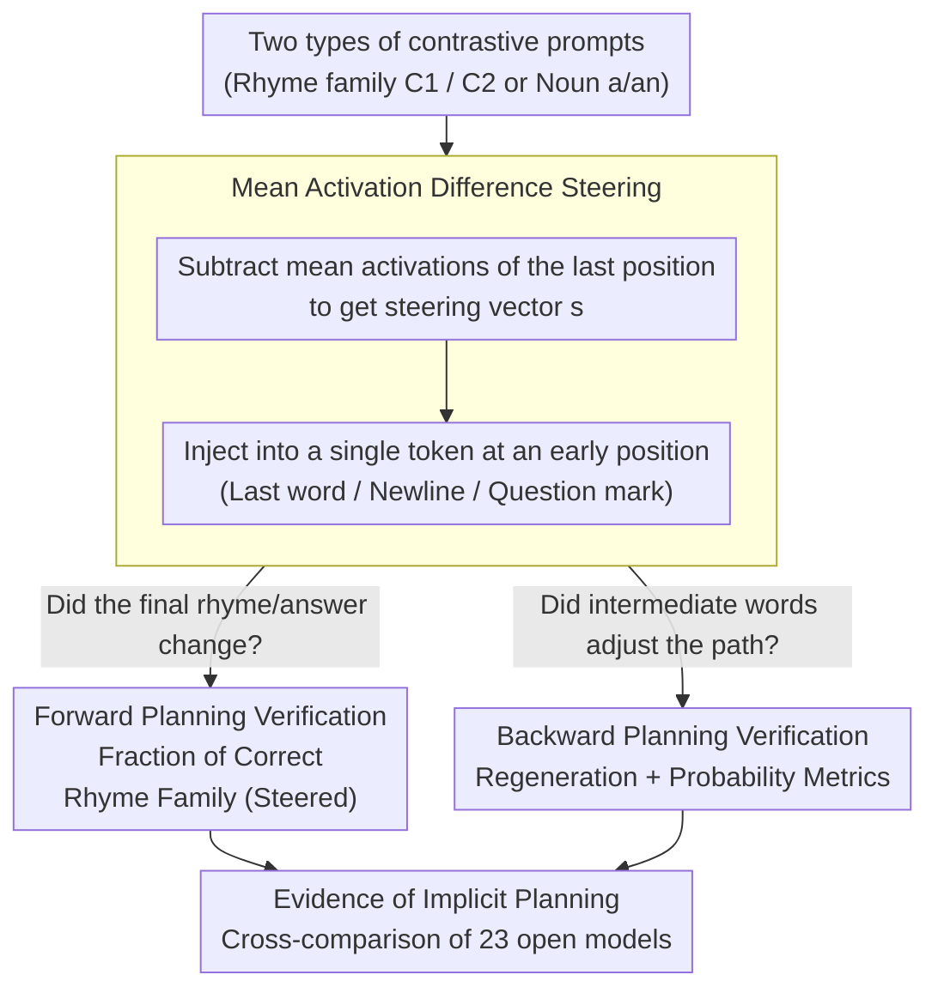

# What's the Plan? Metrics for Implicit Planning in LLMs and Their Application to Rhyme Generation and Question Answering

**Conference**: ICLR 2026  
**arXiv**: [2601.20164](https://arxiv.org/abs/2601.20164)  
**Code**: Available (included in supplementary material)  
**Area**: NLP Understanding  
**Keywords**: implicit planning, forward planning, backward planning, activation steering, rhyme generation

## TL;DR
This paper proposes the mean activation difference steering method and accompanying quantitative metrics. Through two case studies—rhyme generation and question answering—it systematically proves across 23 open models (1B-32B) that representations of target tokens (rhymes/answers) are formed at early sequence positions (forward planning) and causally influence the generation of intermediate tokens (backward planning). Implicit planning emerges in models as small as 1B, suggesting it is a universal mechanism rather than exclusive to large-scale models.

## Background & Motivation

**Background**: Although LLMs are trained via next-token prediction, they can generate coherent text. Lindsey et al. (2025) qualitatively demonstrated rhyming planning behavior in Claude 3.5 Haiku using cross-layer transcoders (CLT), showing that the model already possesses representations of future rhymes at the end of the first line, which influence the generation of intermediate words in the second line.

**Limitations of Prior Work**: 1) The CLT method is complex and expensive (requiring days of H100 time for a single model), making it unscalable for multi-model comparisons; 2) Lindsey's findings are restricted to a few qualitative examples from a single closed-source model and are not reproducible; 3) There is a lack of quantitative evaluation metrics for implicit planning—no standardized method exists to judge the "degree of planning."

**Key Challenge**: The importance of implicit planning (concerning the understanding of LLM capabilities and safety) vs. the complexity and lack of scalability of current research methods.

**Goal**: To quantitatively study implicit planning using simple, scalable methods across multiple models and tasks.

**Key Insight**: Rhyme generation and question answering serve as ideal probes for implicit planning—the properties and positions of target tokens can be predicted from general principles but are not determined by the immediate preceding context.

**Core Idea**: Mean activation difference steering at the correct position is sufficient to manipulate both forward and backward planning without the need to train CLTs or SAEs.

## Method

### Overall Architecture
The paper revolves around two complementary concepts: **forward planning**, where the model encodes the attributes of a future target into hidden representations at an early sequence position (e.g., end of the first line or end of a question); and **backward planning**, where the model utilizes this formed planning representation to generate an intermediate path leading to the target. Instead of training expensive interpreters to "see" these representations, the authors manipulate the representations directly to observe changes in output. A steering vector is calculated using two types of contrastive prompts and injected into a single token at an early position. Two sets of metrics then verify whether the "final target changed" (forward) and whether "intermediate words adjusted the path accordingly" (backward). Precise manipulation serves as evidence that the planning representation exists and is functional.

Experiments are conducted on two controllable probes: in rhyme generation, the target is the rhyme of the second line (data involves 10 rhyme families × 105 lines generated by Claude 3.5 Sonnet); in QA, the target is the answer noun (20 noun pairs where vowel-initial nouns require "an" and consonant-initial nouns require "a"). Both tasks share a key feature: the properties of the target token are predictable via general rules but not determined by the immediate context, making them ideal for investigating planning.

### Key Designs

**1. Mean Activation Difference Steering: Using Mean Activation Differences as a "Planning Switch" to Avoid Prohibitive CLT Training Costs**

Previous work by Lindsey et al. used cross-layer transcoders (CLT), which required days of H100 compute per model and was limited to a single closed-source model. This paper adopts a minimalist approach: prepare two types of contrastive prompts (targets falling into rhyme family $C_1$ vs. $C_2$, or requiring articles a vs. an), extract the mean hidden activations at specific early positions (last word / newline / question mark), and subtract them to obtain a steering vector:

$$\mathbf{s}_{C_1 \to C_2}^{(l,i)} = m \cdot \left(\overline{\mathbf{x}_i^{(l)}}_{C_1} - \overline{\mathbf{x}_i^{(l)}}_{C_2}\right)$$

where $l$ is the layer, $i$ is the token position, and the scaling factor $m=1.5$ compensates for estimation imprecision. For each model, the combination of layer and position with the strongest manipulation effect is selected. During generation, the vector is added only to the residual stream of a **single token position**. The process involves only forward passes for activation extraction and mean subtraction, making it several orders of magnitude simpler than CLT and enabling a horizontal comparison across 23 models.

**2. Forward Planning Verification—Fraction of Correct Rhyme Family (Steered): Inferring Early Planning via Target Manipulation**

To prove forward planning, the logic is straightforward: if no planning representation exists at the early intervention site, steering should not predictably alter the final rhyme. Conversely, if the vector can switch the rhyme from family 1 to family 2, it confirms that the early position encodes the future target. The metric calculates the success rate of this switch: $\mathbf{s}_{RF_1 \to RF_2}$ is applied to 1,000 couplets, and the proportion of final words falling into the target family $RF_2$ is measured against an unsteered baseline. Higher proportions relative to the baseline indicate stronger evidence for forward planning. The QA task uses a corresponding "Fraction of Correct Answer (Steered)."

**3. Backward Planning Verification—Regeneration + Probability Metrics: Proving Steering Affects the "Entire Path"**

Altering the final rhyme is insufficient; one must show that the model prepared the path via intermediate words. The Regeneration metric works by stripping the rhyming context and the final word from the second line and asking the model to complete the line. If the intermediate words were indeed "pointing to" the target rhyme family, the regeneration should hit the target family at a rate significantly higher than random chance or steering toward a different family. The accompanying probability metric compares the distribution shift of intermediate tokens under steered vs. unsteered conditions to pinpoint where the planning signal begins to intervene. In QA, this is demonstrated by steering not only the final answer but also the preceding article (Fraction of a/an Steered).

## Key Experimental Results

### Main Results—Rhyme Planning Across 23 Models

| Model | Baseline Rhyme Rate | Steered Rhyme Rate | Baseline Regen Rate | Steered Regen Rate |
|------|:---:|:---:|:---:|:---:|
| Gemma2 9B IT | ~80% | ~75% | ~55% | ~52% |
| Gemma3 27B IT | ~85% | ~82% | ~60% | ~58% |
| Llama 3.1 8B IT | ~60% | ~55% | ~40% | ~38% |
| Gemma3 1B Base | ~25% | ~15% | ~20% | ~12% |

(IT = instruction-tuned; Base = base model)

### Ablation Study—Steering Position Analysis

| Steering Position | Gemma2 9B | Gemma3 27B | Other Models |
|-------------|:---:|:---:|:---:|
| Last word (Lower layers) | ✓ Effective | ✓ Effective | ✓ All effective |
| Newline (Middle layers) | ✓ Effective | ✓ Effective | ✗ Mostly ineffective |

### Key Findings
- **Implicit planning emerges in 1B models**: Even the smallest model (Gemma3 1B) exhibits detectable forward and backward planning, suggesting it is more universal than previously thought.
- **Instruction tuning enhances planning**: IT models consistently outperform base models across all metrics, suggesting post-training may strengthen planning capabilities.
- **Cross-task commonality**: Steering similarly changes article selection (a vs. an) in QA, indicating that planning is not a rhyme-specific mechanism.
- **Planning circuit localization (Gemma2 9B)**: Two attention heads (L30H3, L31H15) read planning information from the end of the first line. Activation patching recovers 59%-93% of the steering effect, while subsequent MLP layers transform the information into predictions.
- **Task-specific circuits for Rhyme vs. QA**: Rhyme circuits concentrate in L30H3/L31H15, whereas L39H13 is more critical for QA. The planning mechanism is general, but the circuits are task-specific.
- **High correlation between all rhyme metrics**: Rhyme ability ↔ Planning ability, suggesting they develop in tandem.

## Highlights & Insights
- **Methodological contribution exceeds the findings**: Mean activation difference steering is simple enough to systematically study 23 models, reducing planning research from "H100-level compute" to "a few hours on any GPU."
- **1B models show planning → An inevitable byproduct of autoregressive training**: Why plan ahead if the goal is just next-token prediction? Because the optimal choice for the current token depends on a future intention. Even minimal LLMs learn this lookahead.
- **Rhyme as a perfect probe**: One must plan the rhyme in advance, and intermediate words must remain semantically compatible—this is the definition of forward and backward planning. Article selection in QA provides similar, albeit simpler, evidence.
- **Direct implications for AI Safety**: Implicit planning implies the model has internal states of "unexpressed intentions." Understanding and monitoring these states is vital for alignment.

## Limitations & Future Work
- Steering success rates are not perfect—steered rhyme rates are significantly lower than baselines in weaker models, suggesting noise in the extraction of planning representations.
- Only two cases (rhyme and QA) were studied; more complex scenarios (e.g., code generation, long-range reasoning) require further verification.
- Mean activation difference is a coarse method—it does not distinguish between different levels of planning (e.g., planning specific words vs. rhyme families).
- Planning at the newline position is only effective in specific models (Gemma2 9B, Gemma3 27B); how architectural differences affect planning circuit topology remains unclear.
- Circuit analysis was performed deeply only for Gemma2 9B; whether other models rely on similar minority attention heads is unknown.
- Interaction between explicit planning (e.g., CoT) and implicit planning was not addressed—are they substitutes or complementary?

## Related Work & Insights
- **vs. Lindsey et al. (2025) CLT analysis of Claude Haiku**: They qualitatively showed planning but with expensive, non-reproducible methods. Ours quantitatively replicates and extends this across 23 open models—methodological simplification is the core contribution.
- **vs. Turpin et al. (2023) Unfaithful CoT**: They found that biasing the answer causes CoT to rationalize the wrong answer, providing indirect evidence of forward planning. Ours confirms this directly and quantitatively.
- **vs. Wu et al. (2024), Men et al. (2024) Lookahead studies**: These works found lookahead representations in specific models; Ours systematically verifies this across 23 models, moving from case studies to population studies.

## Rating
- Novelty: ⭐⭐⭐⭐ Quantitative implicit planning metrics + systematic study of 23 models; simple method with rich insights.
- Experimental Thoroughness: ⭐⭐⭐⭐⭐ 23 models (4 families × multi-scale × base+IT) × 2 tasks + circuit analysis + attention ablation.
- Writing Quality: ⭐⭐⭐⭐ Definitions of forward/backward planning are clear; experiments are intuitive and reproducible.
- Value: ⭐⭐⭐⭐⭐ Fundamental contribution to understanding LLM internal mechanisms; the methodology is widely reusable.

<!-- RELATED:START -->

## Related Papers

- [\[ACL 2025\] Active LLMs for Multi-hop Question Answering](../../ACL2025/nlp_understanding/active_llms_for_multi-hop_question_answering.md)
- [\[NeurIPS 2025\] Planning without Search: Refining Frontier LLMs with Offline Goal-Conditioned RL](../../NeurIPS2025/nlp_understanding/planning_without_search_refining_frontier_llms_with_offline_goal-conditioned_rl.md)
- [\[ACL 2026\] It's High Time: A Survey of Temporal Question Answering](../../ACL2026/nlp_understanding/it39s_high_time_a_survey_of_temporal_question_answering.md)
- [\[ACL 2026\] BoundRL: Efficient Structured Text Segmentation through Reinforced Boundary Generation](../../ACL2026/nlp_understanding/boundrl_efficient_structured_text_segmentation_through_reinforced_boundary_gener.md)
- [\[ACL 2026\] Filling the Gap: Is Commonsense Knowledge Generation useful for Natural Language Inference?](../../ACL2026/nlp_understanding/filling_the_gap_is_commonsense_knowledge_generation_useful_for_natural_language_.md)

<!-- RELATED:END -->
