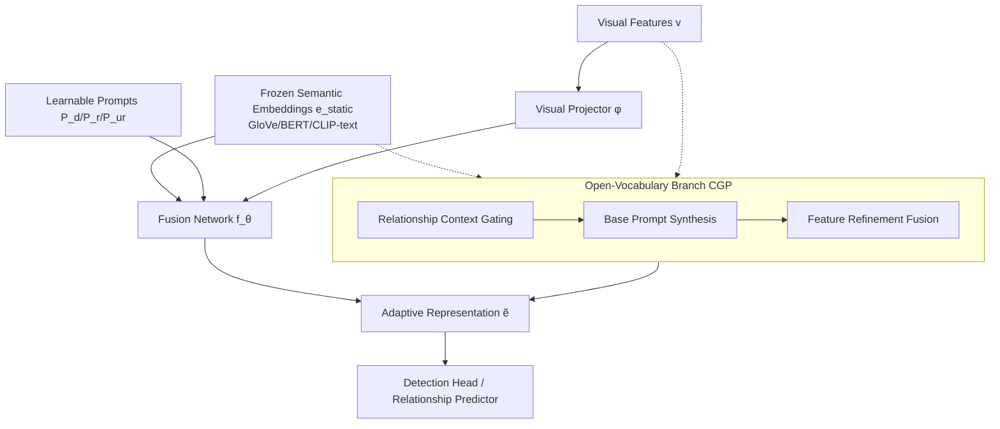

# APT: Towards Universal Scene Graph Generation via Plug-in Adaptive Prompt Tuning

**Conference**: ICLR 2026  
**OpenReview**: [https://openreview.net/forum?id=IZWJhdK2o7](https://openreview.net/forum?id=IZWJhdK2o7)  
**Code**: [https://github.com/CGCL-codes/APT](https://github.com/CGCL-codes/APT)  
**Area**: Scene Graph Generation / Visual Relationship Detection / Prompt Tuning  
**Keywords**: Scene Graph Generation, Prompt Tuning, Semantic Representation, Open-Vocabulary, Plug-in Module  

## TL;DR
APT replaces the long-standing "frozen word vector semantic prior" in Scene Graph Generation (SGG) with a set of lightweight learnable prompts. It dynamically modulates static semantic features into representations dependent on visual context. As a plug-and-play module, it can be integrated into any one-stage, two-stage, or open-vocabulary SGG framework, achieving comprehensive performance gains with <0.5M parameters and shorter training times.

## Background & Motivation
- **Background**: Scene Graph Generation (SGG) involves representing images in an "object-predicate-object" structural graph. For years, the field has been dominated by two paths: two-stage methods that detect objects before predicting relationships (relying on strong detector features but suffering from fragmented context), and one-stage methods that utilize end-to-end joint modeling (suffering from high computational costs and coarse relationship granularity). Both categories share a common habit: using **static, fixed semantic embeddings** exported from pre-trained language models like GloVe or BERT as semantic priors.
- **Limitations of Prior Work**: While these frozen word vectors are effective in NLP, they are naturally mismatched for SGG tasks that prioritize context sensitivity, fine-grained relationships, and asymmetric subject-object roles. A "person" embedding remains invariant whether the person is riding a horse or holding a phone, making it difficult to distinguish between synonymous predicates like "standing on" and "walking on". The authors use t-SNE visualization to prove that static semantic spaces collapse all "person" instances into a single point, whereas the visual feature space naturally clusters by relationship context (riding, walking, holding), indicating a severe mismatch.
- **Key Challenge**: The community has been preoccupied with the "one-stage vs. two-stage" architectural debate, overlooking the fact that the real bottleneck lies in the **representation paradigm**. Simply replacing one frozen model with a stronger one (e.g., GloVe → BERT → CLIP-text) merely richers the internal sub-structures without addressing the fundamental misalignment between semantics and visual relationship context (diagnostic tests show that while silhouette/mutual information improves with stronger models, they still remain mismatched with fine-grained SGG requirements).
- **Goal**: To move beyond architectural competition by providing a **lightweight, universal, and pluggable** mechanism that injects adaptive semantics into any SGG framework while maintaining minimal parameter and training overhead.
- **Core Idea**: **[Paradigm Shift]** Use a set of lightweight learnable prompts as "conditional adaptors." Without backpropagating to the pre-trained backbone, these prompts modulate frozen semantic features into dynamic representations that vary with visual context and relationship roles. The authors liken this process to a "modem" in communications, where a prompt $P$ carries visual context information to modulate the raw semantic signal.

## Method

### Overall Architecture
The core of APT is a set of lightweight learnable prompts that adapt frozen pre-trained semantic embeddings into context-aware task features. It is designed as a universal plugin: in two-stage methods, it acts separately on the detection and relationship stages; in one-stage methods, it merges into a single relationship prompt; and in open-vocabulary settings, an additional Compositional Generalization Prompter (CGP) is attached. The pre-trained semantic backbone remains frozen, with only the prompt parameters, visual projectors, and lightweight MLP fusion networks being learnable.

### Key Designs

**1. Unified Plug-in Prompt: "Modulating" Frozen Embeddings into Dynamic Features.** The operational principle of APT can be summarized by a general formula—for any semantic concept $c$, a lightweight learnable prompt $P(c)$ re-modulates its frozen embedding $e_{static}(c)$ under the current visual context: $\tilde{e}(c) = f_\theta\big(A(P(c), e_{static}(c), \phi(v))\big)$, where $A(\cdot)$ is an aggregation function that pools the prompt sequence into a single vector, $\phi(v)$ is a projector encoding the visual context, and $f_\theta$ is a small fusion network generating the final adaptive representation. Crucially, only $P$, $\phi$, and $f_\theta$ are learnable, while the pre-trained semantic backbone remains frozen, ensuring extreme parameter efficiency and avoiding catastrophic forgetting. The authors motivate this from an Information Bottleneck perspective: the goal is for the learned $\tilde{e}$ to retain maximal object identity information relative to visual context $v$ and target $y$, while compressing redundant semantics irrelevant to the current relationship. The objective is formulated as $\max\ I(\tilde{e}; y) - \beta I(\tilde{e}; e_{static} \mid v, y)$. In specific stages, this differentiates into three types of prompts: two-stage methods use **Detection Prompts** $P_d(c)\in\mathbb{R}^{L_d\times D}$ (generating adaptive representations for each object class fed into the detection head) and **Relationship Prompts** $P_r(r)\in\mathbb{R}^{L_r\times D}$ (capturing nuances in subject-object interactions for predicate classes). One-stage methods, lacking an independent detection stage, use a single **Unified Relationship Prompt** $P_{ur}$ to modulate semantic queries or label embeddings before they enter the transformer decoder for cross-attention with visual features.

**2. Compositional Generalization Prompter (CGP): Synthesizing Prompts for Unseen Concepts.** Open-vocabulary settings require models to generalize to object/predicate combinations not seen during training, where fixed prompts are insufficient. CGP uses a three-module pipeline—"Conditioning-Synthesis-Refinement"—to generate adaptive semantics dynamically. First, the **Relationship Context Gating (RCG)** concatenates visual evidence and initial semantic clues through an MLP to generate role-aware gating weights $w_s = \sigma(\text{MLP}_{gate}(\text{Concat}(v_s, e_{static}(s))))$, determining which prompt bases to activate for each entity. Next, **Base Prompt Synthesis (BPS)** maintains a set of learnable base prompts $B\in\mathbb{R}^{N\times L_{ov}\times D}$ as a repository of relationship concepts. It creates a weighted combination of these bases using the gating weights $P_{cgp}(s)=\sum_{i=1}^{N} w_s^i \cdot B_i$, followed by weighted token pooling with normalization to obtain a compact prompt $\bar{p}=\text{LayerNorm}(\frac{1}{L_b}\sum_t P_{cgp}(s)_t)$. This allows for the generation of near-infinite varieties of customized prompts from a finite set of bases, enabling compositional generalization. Finally, **Feature Refinement and Fusion (FRF)** concatenates the synthesized prompt, frozen semantics, and projected visual features through a fusion MLP $\tilde{e}_{ov}(s)=f_{\theta_{frf}}(\text{Concat}(P_{cgp}(s), e_{static}(s), \phi_v(v_s)))$ to produce context-sensitive representations for relationship reasoning even on unseen concepts. CGP is also a plugin that can seamlessly enhance standard relationship prompts in both two-stage and one-stage frameworks.

**3. Multi-regularization Training Objectives: Constraining Prompt Sparsity, Orthogonality, and Drift.** To keep prompts flexible yet stable, the total objective adds several regularization terms to the classification loss $L_{cls}$: Frobenius norm constraints $\lambda_p\|B\|_F^2 + \lambda_{pd}\|P_{det}\|_F^2 + \lambda_{pr}\|P_{rel}\|_F^2$ on bases and prompts to prevent overfitting; a distillation term $\lambda_d\,\mathbb{E}[\|\tilde{e}-e_{static}\|_2^2]$ to prevent adaptive representations from drifting too far from original semantics; an orthogonality term $\lambda_{orth}\sum_{i<j}\|B_i^\top B_j\|_F^2$ to force different bases to capture complementary concepts; and gating entropy $-\beta\sum_i w^i\log w^i$ with a KL term $\gamma\,\text{KL}(w\,\|\,u_{prior})$ to encourage sparsity, diversity, and alignment with prior distributions. This suite of regularizations ensures that prompts learn discriminative yet non-degenerate semantic modulations under a minimal budget of "<0.5M new parameters."

## Key Experimental Results

The datasets used are Visual Genome (VG, 150 object classes / 50 predicate classes), Open Image V6, and GQA; only VG is reported here due to space. Three sub-tasks are evaluated: PredCls, SGCls, and SGDet, using indicators R@K, mR@K (long-tail robustness), and F@K (harmonic mean of R and mR).

### Main Results (VG, PredCls excerpt, +APT denotes integration of Ours)

| Method | R@50/100 | mR@50/100 | F@50/100 |
|------|----------|-----------|----------|
| Motif (CVPR'18) | 64.6/66.0 | 15.2/16.2 | 24.6/26.0 |
| Motif+APT | 66.5/68.2 | 17.4/18.1 | 26.4/28.1 |
| PE-Net (CVPR'23) | 65.8/67.6 | 17.7/19.2 | 27.9/29.9 |
| PE-Net+APT | 67.5/69.2 | 19.3/20.5 | 29.7/31.6 |
| EGTR (CVPR'24, one-stage) | 54.1/56.6 | 35.7/38.2 | 43.0/45.6 |
| EGTR+APT | 56.4/58.3 | 37.5/40.1 | 45.2/47.7 |
| LLM4SGG (CVPR'24) | 62.2/64.1 | 36.2/39.1 | 45.7/48.6 |
| LLM4SGG+APT | 65.1/66.9 | 38.1/42.2 | 47.9/50.3 |
| ST-SGG (ICLR'24) | 53.9/57.7 | 28.1/31.5 | 36.9/40.8 |
| ST-SGG+APT | 58.7/62.3 | 31.3/34.6 | 39.9/43.7 |

Gains are concentrated in mR@K (long-tail predicates), proving that adaptive prompts alleviate the bias of static features toward high-frequency predicates. The simultaneous improvement in F@K shows that mR gains do not come at the expense of R.

### Open-Vocabulary Results (VG, Novel split excerpt)

| Method | Novel R@50/100 | Novel mR@50/100 | Novel F@50/100 |
|------|----------------|------------------|----------------|
| SDSGG (NeurIPS'24) | 25.4/29.6 | 25.2/31.2 | 25.3/30.4 |
| SDSGG+APT | 26.6/31.1 | 26.7/32.3 | 27.1/32.3 |
| OvSGTR (ECCV'24) | 20.5/23.9 | 13.5/16.2 | 16.3/19.3 |
| OvSGTR+APT | 21.2/25.0 | 14.3/17.2 | 17.1/20.4 |

On unseen classes (Novel), mR@50 increased by up to +6.0, verifying that CGP can unlock compositional knowledge in pre-trained models.

### Ablation Study

| Model (based on PE-Net / SDSGG) | Key Observation |
|------|----------|
| +D-Prompt only | Slight R@K Gain (better object representation), but limited help for relationship reasoning. |
| +R-Prompt only | Significant mR@K Gain, directly alleviating predicate bias—Relationship prompt is the core. |
| +Full APT | Best overall metrics; two prompts collaborate from detection through relationship prediction. |
| CGP: +RCG | Novel metrics Gain; visual context conditioning is the first step to generalization. |
| CGP: +RCG+BPS | Novel mR@50 increased by +3.8 over vanilla; synthesized custom prompts via bases are key. |
| +Full CGP (inc. FRF) | Highest harmonic mean; non-linear fusion in FRF brings balanced improvements. |

### Key Findings
- **Efficiency Analysis**: APT adds <0.5M parameters (even for LLM4SGG, the overhead is <1.5%), and **actually reduces** training time per epoch for almost all models (especially for one-stage, with LLM4SGG reduced by 25% and ST-SGG by 11.3%). The authors attribute this to context-aware features being easier to optimize, accelerating convergence.
- **New Pareto Frontier**: LLM4SGG+APT uses +1.49 performance, −25% training time, and −4.6% parameters (relative to comparable enhancements), proving APT is overwhelmingly superior in "performance per unit of compute."
- **IB Validation**: Compared to frozen GloVe, APT reduces PCA@90% from 26 to 23 and increases discrete mutual information proxy from 1.49 to 1.96, validating the Information Bottleneck explanation of "retaining task-sufficient information while compressing redundant complexity."

## Highlights & Insights
- **Convincing Problem Diagnosis**: Using a suite of quantitative diagnostics—t-SNE visualization, silhouette scores, participation rates, PCA@90, and mutual information proxies—the paper transforms the intuition that "frozen semantic priors are a fundamental SGG bottleneck" into quantifiable evidence. This is more insightful than merely proposing a new architecture.
- **Apt "Modem" Analogy**: Prompts are not used as simple prefixes but as carriers of visual information to modulate frozen semantic signals. This perspective clarifies the role of prompt tuning in structured visual tasks.
- **True Universal Plugin**: The same paradigm covers two-stage, one-stage, and open-vocabulary frameworks, naturally adapting to different architectural stages with D/R/Pur prompts rather than using a forced application.
- **Saving Parameters and Time**: While plugin-style works often trade overhead for performance, APT actually shortens training time. This counter-intuitive result—that adaptive features accelerate convergence—is a practical selling point.

## Limitations & Future Work
- **Limited to VG**: Although Open Image V6 and GQA are mentioned, results are primarily reported for VG due to page limits, leaving room for more evidence of cross-dataset universality.
- **Excessive Hyperparameters**: The training objective contains a long list of coefficients ($\lambda_p, \lambda_{pd}, \lambda_{pr}, \lambda_d, \lambda_{orth}, \beta, \gamma, \lambda_w$). The actual cost and sensitivity of tuning these were not fully discussed.
- **Absolute mR remains low**: Even with the gains, the global values for mR@K on long-tail predicates remain low (mostly between 10–20 for SGDet), indicating that the long-tail problem in SGG is far from resolved; APT is a mitigation, not a cure.
- **Dependence on Base Semantic Model Quality**: The ceiling of prompt modulation is limited by the internal structure of the frozen semantic backbone. Diagnostics indicate that stronger models are still mismatched, though richer; whether prompts can truly break through this ceiling remains to be explored.

## Related Work & Insights
- **vs. Architecture Debate (One-stage / Two-stage)**: APT takes a stand by not reinventing the wheel at the architectural level, but rather attacking the representation paradigm. This approach of "operating at a different level of abstraction" is instructive for sub-fields stuck in architectural stagnation.
- **vs. Open-Vocabulary SGG (OvSGTR / SDSGG / RAHP)**: These methods often rely on frozen CLIP for zero-shot alignment, but CLIP features are general rather than tailored for relationship structures. APT’s CGP fills this gap by synthesizing prompts for unseen combinations via base synthesis and context gating.
- **vs. Continuous Prompt Tuning (Lester et al.)**: Migrating continuous prompts from "language model prefixes" to "feature modulators for multimodal structure prediction" is a specific paradigm for applying prompt tuning across modalities, providing direct inspiration for other structured visual tasks like HOI detection and visual relationship understanding.

## Rating
- **Novelty**: ⭐⭐⭐⭐ — Relocates the SGG bottleneck from architecture to representation paradigm and provides a unified explanation via prompt modulation and the Information Bottleneck principle.
- **Experimental Thoroughness**: ⭐⭐⭐⭐ — Covers over ten baselines across two/one-stage and open-vocabulary settings, including efficiency and IB proxy analyses; slightly docked for primarily reporting VG.
- **Writing Quality**: ⭐⭐⭐⭐ — Logical progression of motivation, clear diagnostics, and an easy-to-understand "modem" analogy.
- **Value**: ⭐⭐⭐⭐ — Plug-and-play, <1.5% parameters, and saves training time; high practical value for the SGG community as a low-cost, high-reward universal enhancement.

<!-- RELATED:START -->

## Related Papers

- [\[ICLR 2026\] Towards Anomaly-Aware Pre-Training and Fine-Tuning for Graph Anomaly Detection](towards_anomaly-aware_pre-training_and_fine-tuning_for_graph_anomaly_detection.md)
- [\[CVPR 2026\] Prompt-Free Universal Region Proposal Network](../../CVPR2026/object_detection/prompt-free_universal_region_proposal_network.md)
- [\[CVPR 2026\] BUSSARD: Normalizing Flows for Bijective Universal Scene-Specific Anomalous Relationship Detection](../../CVPR2026/object_detection/bussard_normalizing_flows_for_bijective_universal_scene-specific_anomalous_relat.md)
- [\[CVPR 2026\] InsCal: Calibrated Multi-Source Fully Test-Time Prompt Tuning for Object Detection](../../CVPR2026/object_detection/inscal_calibrated_multi-source_fully_test-time_prompt_tuning_for_object_detectio.md)
- [\[ICLR 2026\] OwlEye: Zero-Shot Learner for Cross-Domain Graph Data Anomaly Detection](owleye_zero-shot_learner_for_cross-domain_graph_data_anomaly_detection.md)

<!-- RELATED:END -->
