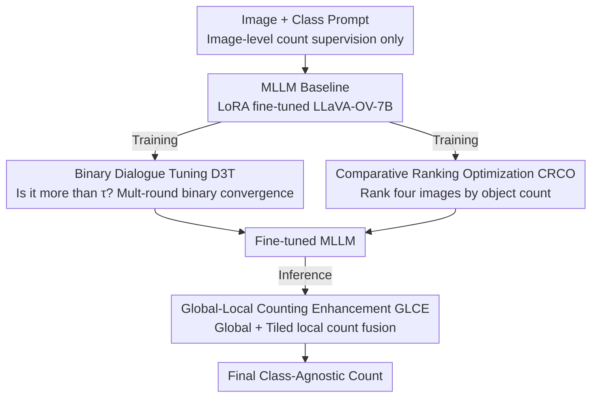

# Bootstrapping MLLM for Weakly-Supervised Class-Agnostic Object Counting

**Conference**: ICLR2026  
**OpenReview**: [https://openreview.net/forum?id=QUE0CuClXe](https://openreview.net/forum?id=QUE0CuClXe)  
**Code**: https://github.com/viscom-tongji/WS-COC  
**Area**: Object Counting / Multimodal VLM / Weakly Supervised Learning  
**Keywords**: Class-agnostic counting, Weakly-supervised, MLLM, Conversational curriculum learning, Ranking optimization

## TL;DR
WS-COC is the first framework to utilize Multimodal Large Language Models (MLLM) for weakly-supervised class-agnostic object counting. Using only image-level total counts for supervision, it activates the counting capabilities of MLLMs through three simple strategies: "Binary Dialogue Tuning + Comparative Ranking Optimization + Global-Local Fusion." It approaches or even surpasses some fully-supervised methods using point-level supervision on four datasets, including FSC-147.

## Background & Motivation

**Background**: The mainstream approach for object counting is fully-supervised density map regression—annotating every object with a point, generating a density map via a Gaussian kernel, and integrating the map to obtain the total count. These methods demonstrate strong performance on benchmarks, but point-level annotation is extremely expensive, especially in dense scenes where hundreds of overlapping objects make manual labeling nearly unfeasible.

**Limitations of Prior Work**: To reduce annotation costs, a few works have turned to weak supervision—using only the image-level total count as supervision to learn a mapping from visual features to the count. However, existing weakly-supervised methods (based on CNN/ViT) are almost exclusively limited to **single categories** (typically head counting) and fail to perform class-agnostic counting; they also do not leverage the open-vocabulary capabilities provided by large-scale vision-language pre-training.

**Key Challenge**: MLLMs are pre-trained on large-scale image-text pairs and naturally possess text-promptable open-category understanding, theoretically allowing them to count arbitrary categories. However, the authors find that zero-shot MLLM counting (denoted as MLLM-Zero) is reasonable in sparse scenes but **severely underestimates in dense scenes**. This occurs because the pre-training corpora mostly contain sparse object distributions, lacking a "sense of quantity" for hundreds of objects of the same class. Furthermore, directly fine-tuning MLLMs to regress absolute counts using image-level labels (denoted as WS-COC-Base) is ineffective: visual features are high-dimensional while count ground-truth is a discrete scalar text token. This modality gap makes it difficult for the model to establish a robust mapping, leading to continued underestimation in dense scenarios.

**Goal**: To "activate" the inherent counting potential of MLLMs for accurate class-agnostic counting under the premise of using only image-level count supervision, while maintaining low fine-tuning costs.

**Key Insight**: Rather than forcing the MLLM to regress precise numbers in one step, it is better to rewrite the "counting" task—which is difficult for the MLLM—into formats it excels at: judgment (whether it exceeds a certain threshold) and comparison (which image contains more). These tasks are visually easier to probe and can bypass the modality gap.

**Core Idea**: Use two proxy tasks—"Binary Judgment Dialogue" and "Inter-image Ranking"—to guide the MLLM during training, followed by "Global-Local Fusion" during inference to correct underestimation bias in dense scenes. These three simple strategies collaboratively bootstrap the counting capability of the MLLM.

## Method

### Overall Architecture
WS-COC is built upon a simple baseline (WS-COC-Base, fine-tuning LLaVA-OneVision-7B with LoRA to directly regress the total count). The core problem addressed is that direct absolute count regression fails due to the modality gap. The framework decomposes the difficult absolute counting task into two proxy tasks for training and introduces a correction mechanism for inference.

Specifically, in the **Training Phase**, two strategies are superimposed: ① Binary Dialogue Tuning (D3T) rewrites "count $c$" into a series of "is it more than $\tau$" range judgments, allowing the model to converge via binary search and learn counting from easy to hard; ② Comparative Ranking Optimization (CRCO) requires the model to rank a set of images with different counts, bypassing absolute regression via relative comparison. Both are active only during training and optimized via language modeling loss. In the **Inference Phase**, ③ Global-Local Counting Enhancement (GLCE) is activated: it produces a global count and, for dense scenes, performs tiled local counting. The local sums are fused with the global count to specifically correct dense underestimation.

### Key Designs

**1. MLLM Counting Baseline: Turning Counting into a Q&A**

Before introducing the three strategies, the authors establish a straightforward baseline (WS-COC-Base) to serve as a fair reference and expose the failures of direct regression. The MLLM (default LLaVA-OneVision-7B) is treated as a text generator: for an image $I$ and its count $c$, a template is used to construct the instruction $T^{inst}=$ "How many [obj] are there in the image?", with the ground-truth response $T^{gt}=$ "a photo of [num] [obj]". [num] is replaced by $c$ and [obj] by the category. The model is fine-tuned via LoRA to generate this sentence. This formulates counting as pure text. However, without supervision of object distributions, the model struggles with the modality gap, leading to significant underestimation (MAE 21.08 on FSC-147, and MAE 82.44 on the dense subset).

**2. Binary Dialogue Tuning (D3T): Decomposing Regression into Binary Judgments**

To address the inaccuracy of one-step regression, D3T rewrites counting into a series of range judgments. Given image $I$ and total count $c$, with an initial range $[L_1, U_1]$ (e.g., $[1, 2000]$ for FSC-147), the midpoint $\tau_1 = \lfloor (L_1+U_1)/2 \rfloor$ is taken. The question $Q_1=$ "Are there more than $\tau_1$ [obj] in the image?" is asked. The ground-truth $R_1^g$ is "yes" if $c > \tau_1$ and "no" otherwise. In each round, the range is halved based on the Ground Truth:

$$[L_t, U_t] = \begin{cases} [\tau_{t-1}+1,\ U_{t-1}], & \text{if } R_{t-1}^g = \text{Yes} \\ [L_{t-1},\ \tau_{t-1}], & \text{if } R_{t-1}^g = \text{No} \end{cases}$$

The dialogue terminates when $U_t - L_t < \delta = 0.2 \times c$, at which point the MLLM predicts the actual count. Judging "more or less" is significantly easier than regressing the absolute value, and the binary search exponentially shrinks the search space. Note that D3T is used only during training because it relies on ground-truth values to construct ranges; using it during testing (WS-COC w/ D3T-T) performs worse because errors in early rounds propagate.

**3. Comparative Ranking Optimization (CRCO): Bypassing Modality Gaps via Relative Ranking**

It is easier to visually determine "which image has more objects" than to predict the exact number. CRCO trains the model to rank multiple images. To handle the long-tail distribution of counts, the authors use a binning scheme: for each category, the count range $[\underline{c}, \overline{c}]$ is divided into $K$ (default 4) equal intervals. Images are grouped by these intervals, and one image is sampled from each group to form a set $\mathcal{I}=\{I_1, I_2, I_3, I_4\}$ where $c_1 < c_2 < c_3 < c_4$. The shuffled images $\tilde{\mathcal{I}}$ are provided as input with the instruction "Given four images, rank them in ascending order based on their counts of [obj]". Unlike strategies that rank sub-crops of a single image, CRCO uses different images of the same category, which forces the model to learn a more robust sense of quantity.

**4. Global-Local Counting Enhancement (GLCE): Tiling to Correct Dense Underestimation**

Even after fine-tuning, models tend to underestimate in dense scenes. GLCE applies correction during inference: first, a global count $c_g$ is generated. If $c_g$ is below a density threshold $c_h$ (default 100), it is accepted. Otherwise, the image $I$ is tiled into $L \times L$ (default $2 \times 2$) non-overlapping sub-images. These are queried for local counts $\{c_k\}_{k=1}^{L^2}$, which are summed to get $c_l$. Due to the edge effect (objects being split), $c_l$ often overestimates. Since $c_g$ underestimates and $c_l$ overestimates, a simple average $\frac{c_g+c_l}{2}$ effectively cancels out the errors.

### Loss & Training
The framework consistently uses the language modeling loss (cross-entropy) inherent to MLLMs: the baseline aligns with the count sentence, D3T aligns with "yes/no" responses, and CRCO aligns with the ranking string. LoRA fine-tuning (rank=128) is applied to LLaVA-OneVision-7B. Training on a single NVIDIA L20 takes only 3.44 hours.

## Key Experimental Results

### Main Results
Comparison on FSC-147 (6,135 images, 147 classes):

| Method | Supervision | VAL MAE↓ | VAL RMSE↓ | TEST MAE↓ | TEST RMSE↓ |
|------|------|----------|-----------|-----------|------------|
| MLLM-Zero | None | 38.92 | 119.26 | 38.19 | 145.42 |
| WS-COC-Base | Image-level | 21.70 | 87.53 | 21.08 | 122.18 |
| GCNet | Image-level | 19.50 | 63.13 | 17.83 | 102.89 |
| CountDiff (Full) | Point-level | 15.50 | 54.33 | 14.83 | 103.15 |
| VLPG (Full) | Point-level | 16.05 | 53.49 | 17.60 | 97.66 |
| **WS-COC** | Image-level | **14.77** | **54.24** | **13.91** | **97.28** |

WS-COC, as a weakly-supervised method, achieves a Test MAE of 13.91, outperforming the weakly-supervised SOTA GCNet and even surpassing recent point-supervised methods like CountDiff and VLPG. In dense scenes (>100 instances), MAE is reduced from 149.69 (MLLM-Zero) to 54.37.

### Ablation Study
Ablation on FSC-147 (values indicate change compared to the full model):

| Configuration | VAL MAE↓ | TEST MAE↓ | Description |
|------|----------|-----------|------|
| WS-COC (Full) | 14.77 | 13.91 | All three strategies active |
| w/o D3T | 18.13 | 17.12 | Without binary dialogue, TEST +3.21 |
| w/ D3T-T | 28.90 | 37.07 | D3T misapplied at test time; performance drops |
| w/o CRCO | 17.39 | 16.75 | Without ranking, TEST +2.84 |
| w/ SCRCO | 17.24 | 16.63 | Single-image sub-crop ranking; too easy |
| w/ CRCO$_{rnd}$ | 16.77 | 16.04 | Random sampling instead of binning |
| w/ GLCE (c$_g$) | 16.64 | 15.72 | Global only, TEST +1.81 |
| w/ GLCE (c$_l$) | 17.35 | 16.52 | Local only |

### Key Findings
- **All strategies contribute**: D3T provides the largest gain (TEST MAE +3.21), followed by CRCO (+2.84) and GLCE for dense scenes (+1.81).
- **D3T is for training only**: Applying it during inference (D3T-T) causes catastrophic failure due to error accumulation in binary search.
- **Binning is critical for CRCO**: Random sampling (CRCO$_{rnd}$) fails to cover dense samples adequately due to the long-tail distribution.
- **GLCE leverages complementary biases**: Global underestimation (~81.2%) and local overestimation (~79.4%) effectively cancel each other out.
- **Backbone robustness**: The method works across various backbones (LLaVA, DeepSeek-VL2, Qwen-VL), with larger models generally performing better.

## Highlights & Insights
- **Task Reformulation**: The core wisdom is translating "hard tasks" into "easy tasks." MLLMs struggle with absolute regression but excel at judgment (thresholds) and comparison (ranking). This approach of "rewriting to bypass modality gaps" is highly transferable.
- **Dialogue as Curriculum Learning**: Binary search dialogue naturally implements an easy-to-hard curriculum without extra architectural complexity.
- **Inference/Training Separation**: The failure of D3T-T highlights the importance of distinguishing between proxy training tasks and the actual inference pipeline.
- **Ensemble by Error Cancellation**: GLCE uses systematic biases to its advantage, a simple yet effective engineering trick.
- **Efficiency**: With no additional parameter heads and only 3.44 hours of training, the framework achieves SOTA performance with high cost-efficiency.

## Limitations & Future Work
- **Inference Cost**: GLCE requires multiple MLLM calls for tiled images, resulting in 2.16 FPS, which is slower than some specialized models.
- **Tiling Logic**: Grid-based tiling is non-adaptive and relies on statistical error cancellation rather than an explicit object de-duplication mechanism.
- **Annotation Sensitivity**: Although it uses weak supervision, it still depends on the accuracy of image-level total counts.
- **Extreme Density**: A performance gap remains in ultra-dense scenes (e.g., ShanghaiTech Part A) compared to specialized crowd counters.
- **Future Directions**: Exploring model pruning/distillation for faster inference and adaptive tiling or learnable fusion weights for GLCE.

## Related Work & Insights
- **vs. Traditional Weakly-Supervised Counting**: Previous methods map features directly to counts for single categories. WS-COC enables **class-agnostic** counting through MLLM text prompts and achieves better accuracy.
- **vs. VLM-based Counting (CLIP-Count, VLPG)**: These use discriminative VLMs with extra counting heads and full point supervision. WS-COC achieves competitive results using only image-level supervision with a generative MLLM.
- **vs. CrowdCLIP Ranking**: CrowdCLIP ranks sub-crops of the same image. WS-COC (CRCO) ranks different images of the same class, which the ablation shows to be more effective for learning a true "sense of quantity."

## Rating
- Novelty: ⭐⭐⭐⭐⭐ High. Innovative "counting as judgment/comparison" approach.
- Experimental Thoroughness: ⭐⭐⭐⭐⭐ Comprehensive coverage across multiple datasets and backbones.
- Writing Quality: ⭐⭐⭐⭐ Clear logic and motivated design.
- Value: ⭐⭐⭐⭐⭐ Significant reduction in annotation and training costs with SOTA performance.

<!-- RELATED:START -->

## Related Papers

- [\[ICLR 2026\] SPWOOD: Sparse Partial Weakly-Supervised Oriented Object Detection](spwood_sparse_partial_weakly-supervised_oriented_object_detection.md)
- [\[CVPR 2026\] Partial Weakly-Supervised Oriented Object Detection](../../CVPR2026/object_detection/partial_weakly-supervised_oriented_object_detection.md)
- [\[ICCV 2025\] Toward Long-Tailed Online Anomaly Detection through Class-Agnostic Concepts](../../ICCV2025/object_detection/toward_long-tailed_online_anomaly_detection_through_class-agnostic_concepts.md)
- [\[AAAI 2026\] TubeRMC: Tube-conditioned Reconstruction with Mutual Constraints for Weakly-supervised Spatio-Temporal Video Grounding](../../AAAI2026/object_detection/tubermc_tube-conditioned_reconstruction_with_mutual_constraints_for_weakly-super.md)
- [\[ICLR 2026\] CGSA: Class-Guided Slot-Aware Adaptation for Source-Free Object Detection](cgsa_class-guided_slot-aware_adaptation_for_source-free_object_detection.md)

<!-- RELATED:END -->
