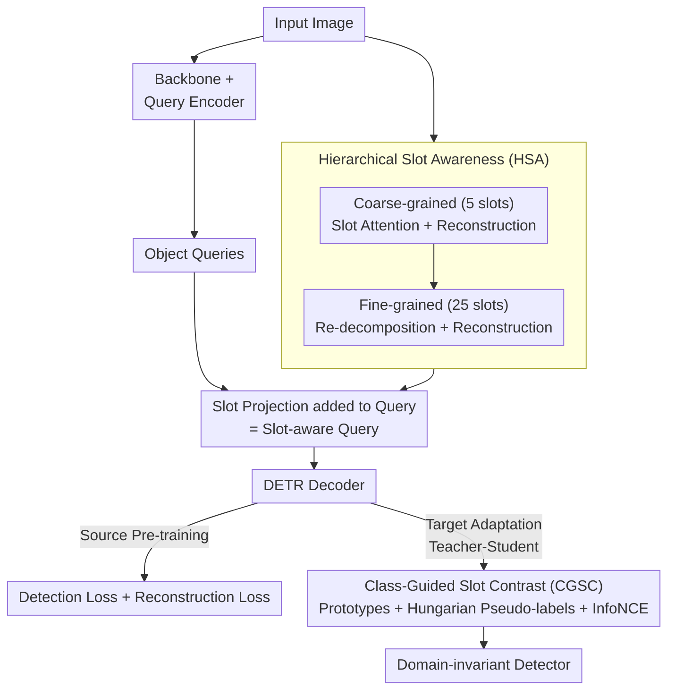

# CGSA: Class-Guided Slot-Aware Adaptation for Source-Free Object Detection

**Conference**: ICLR 2026  
**arXiv**: [2602.22621](https://arxiv.org/abs/2602.22621)  
**Code**: [GitHub](https://github.com/Michael-McQueen/CGSA)  
**Area**: Object Detection  
**Keywords**: source-free domain adaptation, object-centric learning, slot attention, DETR, contrastive learning

## TL;DR

This work introduces Object-Centric Learning (Slot Attention) to Source-Free Domain Adaptive Object Detection (SF-DAOD) for the first time. By extracting domain-invariant object-level structural priors through a Hierarchical Slot Awareness module and driving domain-invariant representations with class-guided contrastive learning, the method significantly outperforms existing approaches across multiple cross-domain benchmarks.

## Background & Motivation

**Domain Shift Problem**: Object detectors suffer substantial performance degradation when deployed across domain shifts such as weather, camera, or scene changes.

**Limitations of SF-DAOD**: SF-DAOD constraints mandate that only source-pre-trained models and unlabeled target domain data are available, with no access to source data due to privacy or copyright restrictions.

**Limitations of Prior Work**: Mainstream SF-DAOD methods (SFOD, PETS, A2SFOD) focus on pseudo-label threshold tuning or Teacher-Student framework improvements, neglecting the commonality of object-level structural information across domains.

**Potential of Slot Attention**: Object-Centric Learning (OCL) decomposes scenes into discrete "slot" representations where each slot binds to an object, naturally isolating foreground from background. While demonstrating strong transferability in segmentation, video prediction, and robotics, it has remained unexplored in SF-DAOD.

**Natural Fit**: DETR-based detectors already utilize object queries. Embedding slot priors into the query space is a natural yet unexplored direction.

## Method

### Overall Architecture

CGSA addresses SF-DAOD by utilizing "object-level structure" as a cross-domain bridge. Built upon RT-DETR, the framework operates in two stages.

In the source pre-training stage, images pass through a backbone and query encoder to produce object queries, while simultaneously entering the Hierarchical Slot Awareness (HSA) module to be decomposed into coarse-to-fine slots. These slots are projected and fused with object queries to form slot-aware queries before entering the decoder. During training, a HSA reconstruction loss is added to the standard detection loss, forcing the model to learn scene decomposition into object-level slots. In the target domain adaptation stage, a Teacher-Student self-training mechanism is used. Both are initialized with the source model. The student utilizes HSA and generates weighted slots via attention masks, which are then fed into the Class-Guided Slot Contrast (CGSC) module for comparison with dynamic class prototypes. The teacher generates pseudo-labels for the same image to supervise the student and updates itself via Exponential Moving Average (EMA). HSA handles "extracting domain-invariant object-level structures," while CGSC "aligns these structures into a unified class semantic space."

### Key Designs

**1. Hierarchical Slot Awareness (HSA): Extracting Object-level Structural Priors**

SF-DAOD is challenging due to noisy pseudo-labels and fragmented low-level features across domains. HSA utilizes OCL to extract object-level structures—where one slot binds to one object—ensuring robustness against domain shifts like weather or style. It employs two-stage coarse-to-fine decomposition: in the first stage, iterative Slot Attention is applied to backbone features $h$ to extract $n=5$ coarse slots, followed by reconstruction via a spatial broadcast MLP. In the second stage, the reconstruction results are further decomposed into $n^2=25$ fine-grained slots. Both stages are supervised by the reconstruction loss: $\mathcal{L}_{rec} = \|\hat{h}^{(1)} - h\|_2^2 + \|\hat{h}^{(2)} - h\|_2^2$. Fine-grained slots are projected and added to object queries: $Q_{aware} = Q_{obj} + f_{map}(z^{(2)})$, providing the decoder with domain-invariant structural priors. While traditional OCL often limits slots to $\leq 10$ to prevent collapse, HSA's hierarchical design (inspired by human vision) allows stable convergence for 25 slots.

**2. Class-Guided Slot Contrast (CGSC): Aligning Structural Priors to Semantic Space**

To resolve feature distribution misalignment across domains, CGSC uses contrastive learning. The module maintains global class prototypes $P_c$ updated via EMA, serving as stable semantic anchors. For a target image, weighted slots are generated using the attention mask $m_k^{(2)}$ to suppress background slots. These are then matched with decoder queries using a Hungarian algorithm over a cosine similarity matrix to assign pseudo-labels. The InfoNCE loss pulls the slot prototype $\bar{z}_c$ toward the corresponding class prototype $P_c$ while pushing away different classes, forcing cross-domain shared semantic representations.

### Loss & Training

The total loss for target adaptation combines self-training, contrastive, and reconstruction terms:

$$\mathcal{L}_{total} = \mathcal{L}_{unsup} + \lambda_{con} \mathcal{L}_{con} + \lambda_{rec} \mathcal{L}_{rec}$$

The work provides a theoretical bound proof showing that the target domain risk decreases after each adaptation step: $\mathbb{E}[\mathcal{R}_T(\theta_{t+1})] \le \mathbb{E}[\mathcal{R}_T(\theta_t)] - c_1 \Delta_t + c_2(\epsilon_{rec} + \sigma^2)$. This suggests that as long as reconstruction error $\epsilon_{rec}$ and noise $\sigma^2$ are minimized, the slot-aware design guarantees risk reduction.

## Key Experimental Results

### Main Results

| Cross-domain Setting | SF | Method | mAP |
|---------|-----|------|-----|
| Cityscapes→BDD100K | ✗ | DATR (Source-driven DAOD) | 43.3 |
| Cityscapes→BDD100K | ✓ | TITAN (SF-DAOD) | 38.3 |
| Cityscapes→BDD100K | ✓ | **CGSA** | **53.0** |
| Cityscapes→Foggy | ✓ | A2SFOD | 41.2 |
| Cityscapes→Foggy | ✓ | **CGSA** | **49.8** |

### Ablation Study

| Configuration | Cityscapes→BDD100K mAP | Description |
|------|------------------------|------|
| Teacher-Student only | 35.4 | No structural priors |
| +HSA | 45.2 | Effective slot structural prior |
| +CGSC | 41.8 | Effective class-guided contrast |
| **+HSA+CGSC (CGSA)** | **53.0** | Complementary, best performance |

### Key Findings

- CGSA outperforms several source-driven DAOD methods (which require source data) under SF settings.
- Based on RT-DETR, trained using 4×A100 GPUs.
- Leading performance across various scenarios: normal to foggy, real to artistic/watercolor.
- The hierarchical design enables stable training with 25 slots, exceeding the traditional $\leq 10$ limit in OCL.

## Highlights & Insights

- **Pioneering combination of OCL and SF-DAOD**: Establishes a new paradigm using object-level structural priors for domain adaptation.
- Hierarchical slot design successfully breaks traditional slot quantity limits (5 to 25) while maintaining stability.
- Theoretical generalization analysis provides mathematical grounding for the slot-aware design's effectiveness.
- Surpassing source-driven methods in a source-free setting provides strong empirical evidence.

## Limitations & Future Work

- Verification is limited to driving datasets; generalization in medical, aerial, or industrial domains is untested.
- The number of slots $n=5$ is manually defined; an adaptive mechanism could be superior.
- Hungarian matching depends on detector prediction quality; early-stage instability may lead to incorrect class labels.
- HSA's two-stage Slot Attention and reconstruction objective increase training time and memory overhead.

## Related Work & Insights

- **SFOD/PETS/A2SFOD**: Focus on pseudo-label filtering, ignoring object-level structure.
- **DATR/MRT** (Source-driven DAOD): Requires source data; CGSA outperforms these in source-free settings.
- **Slot Attention/SAVi**: Originally for segmentation/video prediction, now introduced to domain adaptive detection.

## Rating

- Novelty: ⭐⭐⭐⭐⭐ First to combine OCL and SF-DAOD.
- Experimental Thoroughness: ⭐⭐⭐⭐ 5 datasets/settings + full ablation + theory.
- Writing Quality: ⭐⭐⭐⭐ Clear motivation with theoretical and empirical support.
- Value: ⭐⭐⭐⭐ Provides a new methodological foundation for SF-DAOD.

<!-- RELATED:START -->

## Related Papers

- [\[ICCV 2025\] SFUOD: Source-Free Unknown Object Detection](../../ICCV2025/object_detection/sfuod_source-free_unknown_object_detection.md)
- [\[AAAI 2026\] Beyond Boundaries: Leveraging Vision Foundation Models for Source-Free Object Detection](../../AAAI2026/object_detection/beyond_boundaries_leveraging_vision_foundation_models_for_so.md)
- [\[ICLR 2026\] OD3: Optimization-Free Dataset Distillation for Object Detection](od3_optimization-free_dataset_distillation_for_object_detection.md)
- [\[CVPR 2026\] Foundation Model Priors Enhance Object Focus in Feature Space for Source-Free Object Detection](../../CVPR2026/object_detection/foundation_model_priors_enhance_object_focus_in_feature_space_for_source-free_ob.md)
- [\[ICLR 2026\] Self-Guided Low Light Object Detection Framework](self-guided_low_light_object_detection_framework.md)

<!-- RELATED:END -->
