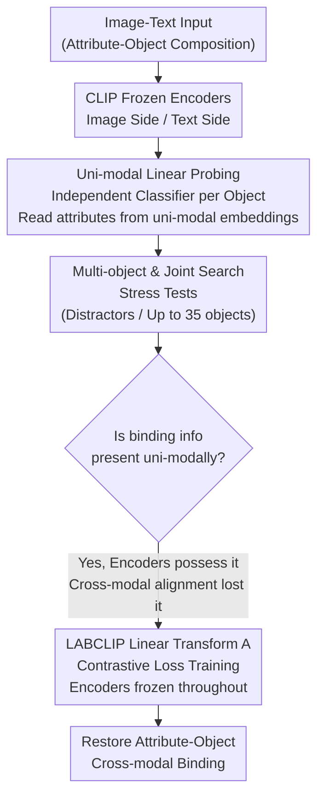

# CLIP Behaves like a Bag-of-Words Model Cross-modally but not Uni-modally

**Conference**: ICLR 2026  
**arXiv**: [2502.03566](https://arxiv.org/abs/2502.03566)  
**Code**: [GitHub](https://github.com/kdariina/CLIP-not-BoW-unimodally)  
**Area**: Object Detection  
**Keywords**: CLIP, compositionality, bag-of-words, attribute-object binding, cross-modal alignment

## TL;DR
It is demonstrated through linear probing experiments that CLIP's Bag-of-Words (BoW) behavior originates from cross-modal alignment failure rather than a lack of binding information in the encoders. LABCLIP is proposed, which significantly restores attribute-object binding capabilities by training only a lightweight linear transformation.

## Background & Motivation
**Background**: CLIP is widely used as a foundational component for vision-language models. However, existing studies (ARO, SugarCrepe, etc.) indicate that CLIP performs poorly in compositional understanding, often failing to distinguish between "a red square and a blue triangle" and "a blue square and a red triangle," much like a BoW model.

**Limitations of Prior Work**: Previous work evaluated BoW behavior only at the cross-modal level (image-text matching), failing to distinguish whether the issue stems from the encoder lacking binding information or poor cross-modal alignment.

**Key Challenge**: If the problem lies within the encoder, retraining is required; if it lies only in alignment, a lightweight adjustment could suffice. Diagnosing the root cause is decisive for determining the direction of improvement.

**Goal**: Pinpoint the root cause of CLIP's BoW behavior and propose a minimal-cost fix based on the findings.

**Key Insight**: Evaluate attribute-object binding information within the image and text modalities separately (uni-modally).

**Core Idea**: CLIP's uni-modal embeddings already encode correct attribute bindings; cross-modal alignment simply fails to preserve this information. A linear transformation can fix this.

## Method

### Overall Architecture
The paper presents a logical chain of "diagnosis followed by treatment." During the diagnosis phase, since previous evidence for CLIP's BoW behavior came from cross-modal matching, it was unclear if the issue resided in the encoder or the alignment. The authors use linear probing to disentangle the CLIP image and text encoders to check if binding information exists within uni-modal embeddings. Stress tests, including multi-object and joint search scenarios, are used to rule out the possibility that the probes succeed only due to task simplicity. Once it is confirmed that binding information exists uni-modally, BoW behavior is attributed to alignment failure. In the treatment phase, since the information exists and only alignment is lost, the encoders are kept frozen, and a lightweight linear transformation, LABCLIP, is learned on the text side to reintegrate binding information into the alignment.

### Key Designs

**1. Uni-modal Linear Probing: Distinguishing Encoder vs. Alignment Failure**

Previous BoW conclusions were based on cross-modal matching, preventing identification of the failure point. The authors instead perform probing within a single modality—training an independent linear classifier for each object $o \in \mathcal{O}$ to predict its attributes from frozen CLIP embeddings: $\text{image-probe}_o: f_{\text{image}}(\mathbf{x}^{\text{img}}) \mapsto a$ for images and $\text{text-probe}_o: f_{\text{text}}(\mathbf{x}^{\text{txt}}) \mapsto a$ for text. On CLEVR, accuracy reached 0.96 for images and 1.00 for text, compared to a random baseline of 0.12. The ability to extract attributes with a linear classifier indicates that binding information is already linearly separable in uni-modal embeddings.

**2. Multi-object and Joint Search Stress Tests: Ruling Out Luck in Simple Scenarios**

High accuracy in single-object scenarios might result from task simplicity. The authors gradually increase the number of objects; text probing remains stable above 0.8, and image probing, while dropping from 0.9 to 0.6, remains significantly higher than random. In a more stringent joint search experiment—identifying a "discordant" object (e.g., a red sphere) among distractor objects (e.g., green spheres and red squares)—the accuracy remains $>0.80$ even with 35 objects, while CLIP's zero-shot classification is near random. Image embeddings can locate specific attribute-object combinations, which a pure BoW representation cannot do, confirming binding information exists uni-modally.

**3. LABCLIP: Minimal-cost Linear Transformation for Alignment Reintegration**

Given that information exists and only alignment is lost, no encoder changes are necessary. The authors apply a linear transformation $\mathbf{A} \in \mathbb{R}^{D \times D}$ to the text embeddings, redefining image-text similarity as $\langle f_{\text{image}}(\mathbf{x}^{\text{img}}), \mathbf{A} f_{\text{text}}(\mathbf{x}^{\text{txt}}) \rangle$. $\mathbf{A}$ is initialized as the identity matrix (starting from original CLIP behavior) and trained with contrastive loss. Negative samples with swapped attribute-object pairs are added to each batch $(B \times 2B)$ to force the transformed text embeddings to prioritize correct bindings. The entire CLIP encoder remains frozen; only the $D \times D$ matrix is learned. For ViT-B/32, this involves only 262K parameters—three orders of magnitude fewer than the 151M parameters fine-tuned in NegCLIP—and training is over 100x faster. Since features are not altered, existing image features in vector databases do not require re-extraction, ensuring backward compatibility.

## Key Experimental Results

### Main Results
Cross-modal binding accuracy on synthetic datasets:

| Model | CLEVR | PUG:SPAR | PUG:SPARE |
|------|-------|----------|----------|
| CLIP (Random Level) | 0.58 | 0.53 | 0.50 |
| LABCLIP | **0.95** | **0.97** | **0.94** |
| CLIP-FT (Upper Bound) | 1.00 | 1.00 | 1.00 |

Real-world benchmarks (ARO + SugarCrepe):

| Model | VG-A | VG-R | Replace | Swap | COCO R@1 |
|------|------|------|---------|------|----------|
| CLIP | 0.63 | 0.63 | 0.80 | 0.62 | 0.30 |
| NegCLIP | 0.71 | 0.81 | 0.85 | 0.75 | 0.41 |
| **LABCLIP** | **0.69** | **0.82** | **0.82** | **0.74** | **0.41** |

### Ablation Study
Cosine similarity of linear probe weights (Before vs. After alignment):

| Dataset | Pre-alignment cos-sim | Post-alignment cos-sim |
|--------|---------------|---------------|
| CLEVR | 0.20 | 0.75 |
| PUG:SPAR | 0.18 | 0.78 |
| PUG:SPARE | 0.09 | 0.65 |

### Key Findings
- Linear probes on a specifically trained BoW CLIP yield only 0.66/0.85 accuracy, confirming that pure BoW representations indeed lack binding information.
- LABCLIP matches NegCLIP's compositional reasoning performance (151M parameters) with only 262K parameters.
- Linear transformation increases the cross-modal cosine similarity of probe weights from ~0.15 to ~0.70, confirming that alignment restores binding.
- LABCLIP slightly declines on downstream single-object classification (CIFAR, ImageNet), suggesting a trade-off between binding and coarse-grained recognition.

## Highlights & Insights
- **Diagnostic Insight**: Precisely localizing the BoW issue to "cross-modal alignment" rather than "CLIP encoders" shifts the community’s understanding of CLIP's capabilities.
- **Minimalist Repair**: The linear transformation is both effective and practical—it requires no re-extraction of vector database features and is backward compatible.
- **Methodological Contribution**: Introduction of the PUG:SPARE dataset (PUG:SPAR with positional bias removed) provides a more rigorous evaluation.
- **Theoretical Completeness**: A cohesive logical chain: Linear probing $\rightarrow$ Multi-object robustness $\rightarrow$ Joint search $\rightarrow$ Cross-modal repair.

## Limitations & Future Work
- Uni-modal binding is primarily verified on synthetic datasets; real-world uni-modal analysis is insufficient.
- Only attribute-object binding is studied; other compositional tasks like spatial relations, negation, and counting are not covered.
- LABCLIP shows slight degradation in single-object classification, indicating a trade-off with coarse-grained recognition.
- Conclusions are verified on ViT-B/32; consistency across larger CLIP models (ViT-L/14, ViT-H) remains unconfirmed.
- Negative samples are constructed via simple noun/adjective shuffling, which may be insufficient for complex linguistic structures.
- The effect of LABCLIP on generative tasks (e.g., text-to-image) has not been explored.

## Related Work & Insights
- Responds to the BoW conclusions of Yuksekgonul et al. (2023) with a more precise diagnosis.
- While NegCLIP fixes issues by fine-tuning 151M parameters, LABCLIP matches its effect using only 262K parameters via post-processing.
- Modality gap literature: LABCLIP can be viewed as a targeted method for narrowing binding-related modality gaps.
- Comparison with Lewis et al. (2024): While they tested binding and compositional generalization, this work focuses specifically on the binding problem to pinpoint the cause.
- Insight: Useful information suppressed by "alignment" may exist in pre-trained large models, warranting detailed layer-wise diagnosis.
- Inspiration for downstream VLMs: Similar linear alignment could be applied to improve compositional understanding in tasks like image generation or editing.

## Rating
- Novelty: ⭐⭐⭐⭐⭐ Precise diagnosis + counter-intuitive discovery (CLIP is not BoW), changing the perception of CLIP.
- Experimental Thoroughness: ⭐⭐⭐⭐⭐ Synthetic + real-world datasets, probing + search + repair, rigorous multi-angle verification.
- Writing Quality: ⭐⭐⭐⭐⭐ Clear logical progression from diagnosis to treatment.
- Value: ⭐⭐⭐⭐ Significant for understanding and improving VLM compositionality, highly practical.

<!-- RELATED:START -->

## Related Papers

- [\[ICLR 2026\] Fantastic Tractor-Dogs and How Not to Find Them With Open-Vocabulary Detectors](fantastic_tractor-dogs_and_how_not_to_find_them_with_open-vocabulary_detectors.md)
- [\[ICLR 2026\] OwlEye: Zero-Shot Learner for Cross-Domain Graph Data Anomaly Detection](owleye_zero-shot_learner_for_cross-domain_graph_data_anomaly_detection.md)
- [\[CVPR 2025\] AA-CLIP: Enhancing Zero-Shot Anomaly Detection via Anomaly-Aware CLIP](../../CVPR2025/object_detection/aa-clip_enhancing_zero-shot_anomaly_detection_via_anomaly-aware_clip.md)
- [\[CVPR 2025\] BACON: Improving Clarity of Image Captions via Bag-of-Concept Graphs](../../CVPR2025/object_detection/bacon_improving_clarity_of_image_captions_via_bag-of-concept_graphs.md)
- [\[CVPR 2026\] FB-CLIP: Fine-Grained Zero-Shot Anomaly Detection with Foreground-Background Disentanglement](../../CVPR2026/object_detection/fb-clip_fine-grained_zero-shot_anomaly_detection_with_foreground-background_dise.md)

<!-- RELATED:END -->
