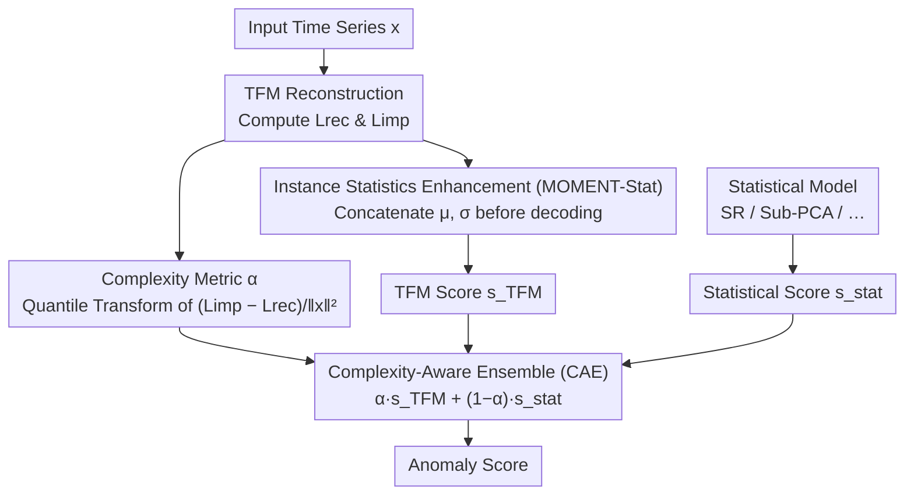

# Complexity- and Statistics-Guided Anomaly Detection in Time Series Foundation Models

**Conference**: ICLR 2026  
**OpenReview**: [https://openreview.net/forum?id=rBt9aW3Mx7](https://openreview.net/forum?id=rBt9aW3Mx7)  
**Code**: TBD  
**Area**: Time Series Anomaly Detection / Time Series Foundation Models  
**Keywords**: Time Series Foundation Models, Anomaly Detection, Reconstruction Error, Complexity Metric, Adaptive Ensemble

## TL;DR
When Time Series Foundation Models (TFMs, such as MOMENT) are applied to reconstruction-based anomaly detection, they fail due to "overgeneralization" (reconstructing anomalies too well) and "over-stationarization" (Instance Normalization removing mean and variance). This paper introduces a complexity metric $\alpha$ derived from the difference between reconstruction and imputation errors to adaptively ensemble TFMs with lightweight statistical models (CAE), and re-injects mean and variance into the decoding stage (MOMENT-Stat). It improves VUS-PR from the previous SOTA of 0.4233 to 0.4679 across 23 univariate and 17 multivariate benchmarks.

## Background & Motivation
**Background**: LLM-inspired Time Series Foundation Models (TFMs) have shown strong performance in "forecasting" tasks. A natural extension is to use them for anomaly detection—specifically reconstruction-based detection: the model reconstructs the input, and points with large reconstruction errors are classified as anomalies.

**Limitations of Prior Work**: The authors identified two pitfalls when applying TFMs directly to reconstruction-based anomaly detection. The first is **overgeneralization**—models have such high capacity that they reconstruct anomalous segments as accurately as normal data, resulting in low anomaly scores for actual anomalies. Previous work attributed this to model capacity, but ignored **data complexity**: the authors observed that overgeneralization is particularly severe on low-complexity data (e.g., sequences dominated by low-frequency structures) because such data is too "easy to guess," allowing anomalies to be completed smoothly. The second pitfall is **over-stationarization**—TFMs commonly use instance normalization layers (RevIN / RMSNorm) which improve forecasting but remove first- and second-order statistics, such as mean $\mu$ and variance $\sigma$. These statistics are critical for identifying "statistical anomalies."

**Key Challenge**: Two features optimized for "forecasting" in TFMs—high capacity and instance normalization—are detrimental to "anomaly detection." High capacity leads to overgeneralization, and instance normalization leads to over-stationarization. Directly fine-tuning or replacing the decoder provides only temporary relief (the paper notes that even reducing the decoder to a single-layer fully connected network does not eliminate overgeneralization).

**Key Insight**: Instead of modifying the TFM itself (avoiding retraining the large encoder), the authors focus on "how difficult the data is." Since overgeneralization primarily occurs on simple data, they quantify "difficulty." Complex data is handled by the TFM, while simple data is handled by statistical models. Simultaneously, normalized statistics are re-injected before decoding.

**Core Idea**: An adaptive weight $\alpha$ derived from the "imputation error $-$ reconstruction error" is used to distribute influence between the TFM and statistical models (to address overgeneralization), and instance-level $\mu, \sigma$ are concatenated back into the decoding features (to address over-stationarization)—neither of which requires retraining the TFM.

## Method

### Overall Architecture
The framework is built on the reconstruction architecture of a pretrained TFM (MOMENT is used in the paper). Given a time series $x \in \mathbb{R}^T$ (where instance normalization ensures $\|x\|_2^2 = T$), the encoder $E$ compresses the masked input into features, and the linear decoder $D$ reconstructs $\hat{x}(M) = D(E(x \odot M))$. On top of this, the paper calculates two errors—**reconstruction error** $L_{rec}(x) = \|x - \hat{x}(M_{test})\|_2^2$ (minimal masking, easy task) and **imputation error** $L_{imp}(x) = \mathbb{E}_{M \sim \mathcal{M}}[\|x - \hat{x}(M)\|_2^2]$ (approx. 30% masking per the pretraining scheme, hard task). The difference between these measures the data complexity $\alpha$. One branch re-injects mean and variance into the decoder to obtain a corrected TFM score $s_{TFM}$, while another branch uses a lightweight statistical model to provide $s_{stat}$. Finally, $\alpha$ is used for adaptive fusion to produce the final anomaly score.

### Key Designs

**1. Complexity Metric $\alpha$: Quantifying reconstruction difficulty via "Hard vs. Easy tasks"**

To address the observation that overgeneralization occurs on simple data, the authors require a signal to distinguish between "TFM is likely to overgeneralize" and "TFM is genuinely proficient." They use the difference between reconstruction (test-time minimal masking, easy) and imputation (random masking, hard) errors as the raw complexity score:

$$w(x) = \frac{L_{imp}(x) - L_{rec}(x)}{\|x\|_2^2}.$$

The intuition: if a sequence can be easily completed even when partially masked ($L_{imp} \approx L_{rec}$), it is highly "predictable," and the TFM will likely complete anomalies along with the signal—a breeding ground for overgeneralization. Conversely, a large $w$ suggests the model struggles under partial masking, indicating high complexity and less susceptibility to overgeneralization. To eliminate scale differences across datasets, a quantile transform is applied to $w(x)$ to obtain $\alpha = \text{QuantileTransform}(w(x)) \in [0, 1]$. Theorem 1 decomposes $\Delta = L_{imp} - L_{rec}$ using Haar wavelets into frequency energies $\sum_k \phi(k)b_k$, where coefficients $b_k$ are non-decreasing with frequency $k$—meaning $\alpha$ is essentially a weighted sum of high-frequency energy. Theorem 2 further argues that high-complexity data carries a larger gradient norm $\|\nabla_W L_N\|_F^2$ for normal samples, creating a steeper optimization landscape that ensures a faster-growing gap $\Delta_{gap}$ between normal and anomalous scores—providing a provable guarantee for trusting the TFM when $\alpha$ is large.

**2. Instance Statistics Enhancement (MOMENT-Stat): Re-injecting $\mu, \sigma$ before decoding**

Regarding over-stationarization, Lemma 3 defines the problem: let $N(x) = (x - \mu_x)/\sigma_x$ be the instance normalization; for any affine transformation $x' = \alpha x + \beta \ (\alpha > 0)$, $N(x') = N(x)$, thus $f(x') = D(E(N(x'))) = f(x)$. TFMs with instance normalization are naturally "blind" to shifts in mean or variance; statistical anomalies (shifted mean/variance but normal shape) are treated as normal data. The solution is simple and requires no retraining of the encoder: let $F_i = E(\text{RevIN}(x_i))$. Before passing to the linear decoder $D$, instance statistics are concatenated to the feature vector, followed by denormalization:

$$\hat{x}_i = \text{RevIN}^{-1}\big(D([F_i; \mu_i; \sigma_i]), \mu_i, \sigma_i\big).$$

This makes $L_{rec}$ sensitive to anomalous shifts in $\mu$ and $\sigma$. The cost is negligible (two additional dimensions), but yields significant gains on datasets where anomalies are statistical outliers.

**3. Complexity-Aware Ensemble (CAE): Adaptive weighting between TFM and statistical models**

With the complexity metric $\alpha$ and the corrected TFM score, the final step is to merge the TFM with a lightweight statistical model, favoring statistical models for simple data and the TFM for complex data:

$$s_{CAE} = \alpha \cdot s_{TFM} + (1 - \alpha) \cdot s_{stat}.$$

Statistical models are limited to those with time complexity no higher than $O(N \log N)$ (SR, Sub-PCA, Sub-HBOS, Sub-IForest, POLY), ensuring CAE adds minimal overhead. Unlike traditional methods requiring manual weight tuning, weights in this approach are dictated by data characteristics ($\alpha$).

### Loss & Training
The TFM encoder is not retrained. MOMENT is trained with a learning rate of $10^{-4}$ for 2 epochs, batch size 256, and the Adam optimizer. For each dataset, the training data consists of the first 25% of the time span or the portion preceding the first anomaly. The reconstruction head is a single-layer fully connected network with SiLU activation and 0.1 dropout. $\alpha$ is normalized per dataset via quantile transformation.

## Key Experimental Results

### Main Results
Benchmarks include the univariate TSB-AD-U (23 datasets) and multivariate TSB-AD-M (17 datasets). The primary metric is the threshold-independent **VUS-PR** (Volume Under the Surface of Precision-Recall), supplemented by AUC-PR, AUC-ROC, and VUS-ROC.

Effectiveness of Instance Statistics Enhancement (MOMENT-Stat):

| Method | AUC-PR | VUS-PR | VUS-ROC | VUS-PR Global Rank |
| :--- | :--- | :--- | :--- | :--- |
| Sub-PCA (Previous SOTA Stat) | 0.3700 | 0.4233 | 0.7600 | 1 |
| MOMENT-Stat (Ours) | 0.3040 | **0.3913** | 0.7771 | 3 |
| MOMENT (FT, Fine-tuned) | 0.3000 | 0.3857 | 0.7600 | 6 |
| MOMENT (ZS, Zero-shot) | 0.3000 | 0.3790 | 0.7500 | 7 |

By simply re-injecting $\mu, \sigma$ without retraining the encoder, MOMENT-Stat increases VUS-PR from the fine-tuned version's 0.3857 to 0.3913, outperforming standard fine-tuned MOMENT.

Effectiveness of Complexity-Aware Ensemble (CAE):

| Statistical Backbone | $\alpha=0$ (Stat Only) | CAE | Rank Change |
| :--- | :--- | :--- | :--- |
| SR | 0.3237 | **0.4596** | 14 → 1 |
| Sub-PCA | 0.4233 | **0.4679** | 1 → 1 |
| Sub-IForest | 0.2230 | 0.4318 | 29 → 2 |
| POLY | 0.3897 | 0.4274 | 3 → 2 |
| Sub-HBOS | 0.2283 | 0.3734 | 28 → 3 |

CAE lifts nearly all statistical backbones into the top three. Sub-PCA under CAE reaches **0.4679**, setting a new SOTA.

### Ablation Study

| Configuration | Key Metric (Sub-PCA VUS-PR) | Description |
| :--- | :--- | :--- |
| Statistical only ($\alpha=0$) | 0.4233 | Fails on complex data |
| Naive Average ($\alpha=0.5$) | 0.3132 | Blind fusion performs worse than pure statistical (0.3878) |
| Random Selection | 0.4073 | Choosing without complexity awareness |
| CAS (Hard choice by complexity) | 0.4400 | Soft choice is superior to random |
| CAE (Ours, Soft Weighting) | **0.4679** | Optimal performance |
| Using Spectral/Approx/Sample Entropy | 0.4288 / 0.4373 / 0.4409 | Inferior to the proposed $\alpha$ |

### Key Findings
- **Complexity adaptation is core**: Blindly averaging TFM and statistical scores ($\alpha=0.5$) on multivariate data drops performance due to MOMENT's channel-independent assumption. CAE significantly boosts weak backbones like HBOS (0.1751 $\rightarrow$ 0.2535) and LOF (0.1091 $\rightarrow$ 0.2122).
- **Proposed complexity metric outperforms general entropy**: Replacing $\alpha$ with spectral or sample entropy leads to a decrease in VUS-PR, suggesting the "imputation-reconstruction error difference" aligns better with TFM overgeneralization behavior.
- **Exception (Sub-HBOS)**: When the statistical backbone is extremely weak (Sub-HBOS alone is 0.2283, much lower than MOMENT-Stat's 0.3913), the pure TFM ($\alpha=1$) may perform slightly better than CAE. However, CAE still raises Sub-HBOS from 0.2283 to 0.3734.
- **Reflections on Forecasting TFMs**: When treating forecasting error as an anomaly score, Chronos $>$ TimeMoE $>$ Moirai. Forecasting accuracy (lower sMAPE) correlates with higher VUS-PR.

## Highlights & Insights
- **Reframing "overgeneralization"**: Instead of viewing it solely as a model capacity issue, the authors treat it as a data complexity issue. Using a data-side complexity metric to calibrate model trust is a clever shift in perspective.
- **Zero-cost complexity metric with theoretical backing**: $\alpha$ reuses existing $L_{rec}$ and $L_{imp}$ calculations without additional networks. The Haar wavelet proof provides a rigorous frequency-domain explanation.
- **Engineering ingenuity of MOMENT-Stat**: Concatenating just two dimensions $[F; \mu; \sigma]$ recovers statistical sensitivity stripped by instance normalization without retraining the massive encoder. This is "free" performance for any RevIN-based TFM.
- **Transferability**: The strategy of using the error difference between hard/easy self-supervised tasks to gauge sample difficulty for adaptive ensemble is transferable to other reconstruction-based scenarios (e.g., image or tabular AD).

## Limitations & Future Work
- **Dependency on statistical backbones**: The gains of CAE are most stable when the statistical model is competent; weak partners limit the fusion benefits.
- **Channel-independence drawback**: The core TFM (MOMENT) treats multivariate variables as independent channels. While CAE mitigates this, the authors acknowledge that multivariate AD requires explicit channel relationship modeling (like Moirai), which exceeds the current backbone's capability.
- **Theoretical assumptions**: Theorem 2 relies on assumptions regarding the misalignment of normal/anomalous gradients and TFM frequency bias, which may not hold strictly in all real-world data.

## Related Work & Insights
- **vs. Reducing Decoder Capacity / Memory Methods**: Traditional routes either limit decoder expressiveness or use memory modules (which require expensive retraining for large TFMs). This paper avoids structural changes and uses logic on the data side.
- **vs. Contrastive Learning with Synthetic Anomalies**: Synthetic routes struggle to define "meaningful" anomalies. This paper bypasses anomaly synthesis by using statistical models to compensate for TFM weaknesses.
- **vs. Re-injecting Statistics for Forecasting**: While prior work re-injected statistics to improve forecasting accuracy, this is the first to apply the concept to anomaly detection with a non-retraining concatenation approach (MOMENT-Stat).

## Rating
- Novelty: ⭐⭐⭐⭐ Reframing overgeneralization via data complexity and using error differences as a metric is highly original.
- Experimental Thoroughness: ⭐⭐⭐⭐ Extensive coverage across 40 datasets and multiple statistical backbones.
- Writing Quality: ⭐⭐⭐⭐ Clear structure of two challenges and two solutions.
- Value: ⭐⭐⭐⭐ Provides a plug-and-play, non-retraining paradigm for TFMs in AD with high practical utility.

<!-- RELATED:START -->

## Related Papers

- [\[AAAI 2026\] Harnessing Vision-Language Models for Time Series Anomaly Detection](../../AAAI2026/object_detection/harnessing_vision-language_models_for_time_series_anomaly_detection.md)
- [\[ICLR 2026\] Contextual and Seasonal LSTMs for Time Series Anomaly Detection](contextual_and_seasonal_lstms_for_time_series_anomaly_detection.md)
- [\[ICLR 2026\] PAANO: Patch-Based Representation Learning for Time-Series Anomaly Detection](paano_patch-based_representation_learning_for_time-series_anomaly_detection.md)
- [\[CVPR 2026\] AnomalyVFM -- Transforming Vision Foundation Models into Zero-Shot Anomaly Detectors](../../CVPR2026/object_detection/anomalyvfm_--_transforming_vision_foundation_models_into_zero-shot_anomaly_detec.md)
- [\[ICLR 2026\] FSOD-VFM: Few-Shot Object Detection with Vision Foundation Models and Graph Diffusion](fsod-vfm_few-shot_object_detection_with_vision_foundation_models_and_graph_diffu.md)

<!-- RELATED:END -->
