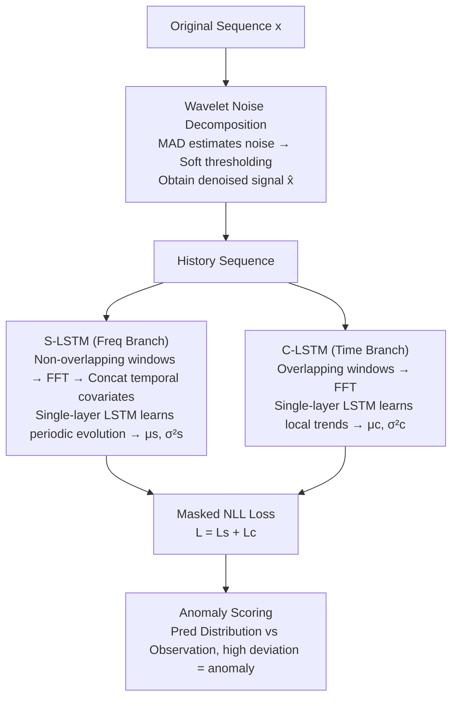

# Contextual and Seasonal LSTMs for Time Series Anomaly Detection

**Conference**: ICLR 2026  
**arXiv**: [2602.09690](https://arxiv.org/abs/2602.09690)  
**Code**: [https://github.com/NESA-Lab/Contextual-and-Seasonal-LSTMs-for-TSAD](https://github.com/NESA-Lab/Contextual-and-Seasonal-LSTMs-for-TSAD)  
**Area**: AI Safety / Time Series Anomaly Detection  
**Keywords**: time series anomaly detection, LSTM, frequency domain, noise decomposition, univariate time series

## TL;DR
Aiming at "minor point anomalies" and "slowly rising anomalies" that are difficult for existing methods to detect in univariate time series, this paper proposes the CS-LSTMs dual-branch architecture. S-LSTM models periodic evolution in the frequency domain, while C-LSTM captures local trends in the time domain. Combined with a wavelet noise decomposition strategy, it outperforms SOTA on four benchmarks with a 40% increase in inference speed.

## Background & Motivation

**Background**: Univariate time series (UTS) anomaly detection is a core task in cloud services, IoT, and system monitoring. Mainstream methods are divided into reconstruction-based (e.g., VAE) and prediction-based (e.g., Transformer/LSTM).

**Limitations of Prior Work**: Through reproduction of SOTA models such as FCVAE, KAN-AD, and TFAD, two types of anomalies were found difficult to detect: (1) minor point anomalies, where short spikes look normal over long windows; and (2) slowly rising anomalies, which are segment anomalies gradually deviating from periodic patterns.

**Key Challenge**: Anomaly determination depends on local context rather than absolute values; changes of the same magnitude may be normal or abnormal in different contexts. Existing methods either focus solely on frequency components (ignoring local dependencies) or use only temporal information (ignoring periodic evolution).

**Goal**: To address three challenges: (1) capturing local trends instead of absolute values; (2) modeling the dynamic evolution of periodicity instead of static periods; and (3) learning normal patterns from data containing anomalies and noise.

**Key Insight**: Combine time-domain and frequency-domain representations, using dual-branch LSTMs to separately process periodic evolution and local trend changes.

**Core Idea**: Jointly model periodic evolution and local trends through a dual-domain dual-branch LSTM, paired with wavelet noise decomposition, to achieve precise detection of subtle anomalies.

## Method

### Overall Architecture
CS-LSTMs aims to solve subtle anomalies in UTS that "look normal in absolute value but are revealed by context." It decomposes detection into two complementary prediction branches. Given the original sequence $x_{0:t}$, wavelet noise decomposition is first applied to obtain the denoised signal $\hat{x}$. The history is then fed into two branches: S-LSTM operates in the frequency domain, dividing the history into non-overlapping windows to perform FFT individually, learning how periodic patterns evolve over time; C-LSTM operates in the time domain, using overlapping windows to track recent local trends. Each branch outputs a mean $\mu$ and variance $\sigma^2$ for future values, trained jointly using a masked NLL loss. During inference, the predicted distribution is compared with actual observations, and points with large deviations are judged as anomalies. The core stance of the design is: anomalies are not "magnitudes exceeding an absolute threshold," but "deviations from what the current context should be."

### Key Designs

**1. Wavelet Noise Decomposition: Filtering noise and anomalies before training without decomposing trends and periods.**

Prediction-based methods have a hidden risk—if training data is mixed with noise and anomalies, the model will learn them as "normal patterns." This method uses wavelet transform to decompose the signal into an approximation coefficient $c_A$ and detail coefficients $c_D^{(i)}$ at each level. Noise mainly resides in detail coefficients. Crucially, noise levels are estimated using MAD (Median Absolute Deviation) instead of mean/standard deviation: $\sigma_i = \frac{\text{median}(|c_D^{(i)}|)}{\Phi^{-1}(0.75)}$. Since outliers bias the mean but do not affect the median, the estimated noise level is robust to anomalies. A universal threshold $\lambda_i = \sigma_i \sqrt{2\log n}$ is calculated, and detail coefficients are reconstructed back to $\hat{x}$ after soft thresholding. Compared to DLinear's pooling decomposition, it is more refined; compared to STL decomposition, it is more efficient. More importantly, it deliberately performs only denoising, leaving the complete trend and periodic signals intact for the subsequent branches rather than pre-decomposing the signal.

**2. S-LSTM (Seasonal Branch): Modeling dynamic evolution of periodic patterns in the frequency domain, rather than assuming static periods.**

Real-world periods are not static; period length and frequency themselves drift over time. Comparing adjacent periods alone is insufficient to discover gradual deviations like "slowly rising anomalies." S-LSTM divides the history before the detection point into equal-length, non-overlapping windows. Each window undergoes FFT to obtain a frequency representation, stacked as $z_s \in \mathbb{R}^{n \times w_s}$, and the corresponding time-domain original values are concatenated as covariates for a single-layer LSTM. Consequently, the LSTM sees a "sequence of frequency snapshots" changing over time, thereby learning the evolution trend across multiple periods to predict future periodic patterns. This branch contributes most to the ablation study (dropping 16.8% on Yahoo when removed), proving that dynamic periodic modeling is the primary force for detecting subtle anomalies in highly periodic data.

**3. C-LSTM (Contextual Branch): Transforming "point-level" learning into "segment-level" learning with overlapping windows to compensate for UTS information scarcity.**

UTS has only one scalar value per time step, making the information density low. It is difficult to judge local trend changes by looking at a single point. C-LSTM targets a short history before the detection point, divided into overlapping windows (with a small $w_c$). Each window also undergoes FFT and is concatenated into $z_c \in \mathbb{R}^{n \times w_c}$ for future prediction via a single-layer LSTM. The significance of overlapping windows lies in the fact that adjacent windows share a large number of samples, effectively converting isolated "point-level prediction" into "segment-level prediction" supported by context. This makes the model more sensitive to short-term spikes like "minor point anomalies," which might be submerged in long windows but appear inconsistent in local windows.

### Loss & Training
Both branches utilize a Negative Log-Likelihood (NLL) loss with noise decomposition, regressing both mean $\mu$ and variance $\sigma^2$:

$$\mathcal{D}(\mu, \sigma, x, \hat{x}) = \log \sigma^2 + \frac{(x \odot \text{mask} + \hat{x} \odot \tilde{\text{mask}} - \mu)^2}{\sigma^2}$$

The mask is key to integrating the denoising strategy into the loss: the original value $x$ is used as the regression target for normal regions, while the denoised value $\hat{x}$ is used for regions judged as anomalies to prevent the model from fitting anomalies. The predicted variance $\sigma^2$ allows the model to automatically relax constraints on uncertain segments. The total loss $L = L_s + L_c$ is optimized jointly.

## Key Experimental Results

### Main Results

| Dataset | Metric | Ours | Prev. SOTA (FCVAE) | Gain |
|--------|------|----------|------------------|------|
| Yahoo | Best F1 | 0.885 | 0.854 | +3.1% |
| KPI | Best F1 | 0.936 | 0.924 | +1.2% |
| WSD | Best F1 | 0.910 | 0.805 | +10.5% |
| NAB | Best F1 | 0.996 | 0.972 | +0.6% |
| Yahoo | Delay F1 | 0.878 | 0.839 | +3.9% |
| KPI | Delay F1 | 0.879 | 0.851 | +2.8% |
| WSD | Delay F1 | 0.857 | 0.696 | +16.1% |

### Ablation Study

| Configuration | Yahoo Best F1 | KPI Best F1 | WSD Best F1 | Description |
|------|---------------|-------------|-------------|------|
| Full CS-LSTMs | 0.885 | 0.936 | 0.910 | Complete model |
| w/o C-LSTM | 0.864 | 0.923 | 0.856 | Removing local branch drops 5.4% (WSD) |
| w/o S-LSTM | 0.717 | 0.904 | 0.762 | Removing periodic branch drops 16.8% (Yahoo) |
| w/o Covariate | 0.826 | 0.925 | 0.840 | Removing covariates drops 7.0% (WSD) |
| w/o Noise Decomp | 0.868 | 0.913 | 0.858 | Removing denoising drops 5.2% (WSD) |

### Key Findings
- **S-LSTM provides the greatest contribution**: Removing S-LSTM leads to a 16.8% drop on Yahoo, indicating that periodic evolution modeling is crucial for highly periodic datasets.
- **Most significant gain on WSD** (+10.5%/+16.1%): The WSD dataset contains many slowly changing segment anomalies, which is exactly the optimization target of CS-LSTMs.
- **Obvious efficiency advantage**: With only 600K parameters (less than half of SOTA's 1.4M), the GPU inference time of 4.62ms is approximately 40% lower.
- **Strong transferability**: In Yahoo → KPI/WSD cross-domain tests, F1 reached 0.929/0.883, significantly outperforming other methods.

## Highlights & Insights
- **Clever time-frequency dual-domain complementary design**: The frequency domain captures periodicity while the time domain captures local trends. The two LSTM branches perform their respective duties and complement each other, which is simple and effective. This dual-perspective concept can be transferred to other time-series tasks.
- **Noise decomposition using MAD instead of mean/std**: Better robustness to outliers since anomalies do not affect the median. This trick can be reused in any scenario requiring robust statistical estimation.
- **Overlapping windows mitigate UTS information scarcity**: Transforming "point-level" problems into "segment-level" problems is a general technique for processing univariate data.

## Limitations & Future Work
- **Limited to UTS**: Multivariate time series scenarios require modeling dependencies between variables, which the current architecture does not address.
- **Manual window size tuning**: The selection of $w_s$ and $w_c$ affects results; adaptive window sizes might be better.
- **LSTM instead of Transformer**: Although faster with fewer parameters, the ability to model extremely long sequences might be limited.
- **Evaluation protocol controversy**: The point adjustment strategy (where any point in a detected segment counts as correct) may overestimate detection accuracy in actual deployments.

## Related Work & Insights
- **vs. FCVAE**: FCVAE focuses on frequency domain reconstruction but ignores local dependencies; CS-LSTMs compensates for this with its dual branches.
- **vs. Anomaly-Transformer**: Anomaly-Transformer uses a minimax strategy to enhance robustness but has many parameters and slow inference; CS-LSTMs achieves better results at a lower cost.
- **vs. KAN-AD**: KAN-AD uses temporal information for prediction but ignores frequency domain details; this paper provides exact complementarity.

## Rating
- Novelty: ⭐⭐⭐ Dual-branch time-frequency joint modeling is not a completely new concept, but the specific design and noise decomposition strategy are innovative.
- Experimental Thoroughness: ⭐⭐⭐⭐ Complete with four datasets, ten baselines, and ablation/transfer/efficiency experiments.
- Writing Quality: ⭐⭐⭐⭐ Clear motivation analysis and systematic method description.
- Value: ⭐⭐⭐⭐ High practical utility, lightweight and efficient for industrial deployment.

<!-- RELATED:START -->

## Related Papers

- [\[ICLR 2026\] PAANO: Patch-Based Representation Learning for Time-Series Anomaly Detection](paano_patch-based_representation_learning_for_time-series_anomaly_detection.md)
- [\[ICLR 2026\] PGRF-Net: A Prototype-Guided Relational Fusion Network for Diagnostic Multivariate Time-Series Anomaly Detection](pgrf-net_a_prototype-guided_relational_fusion_network_for_diagnostic_multivariat.md)
- [\[ICLR 2026\] Complexity- and Statistics-Guided Anomaly Detection in Time Series Foundation Models](complexity-_and_statistics-guided_anomaly_detection_in_time_series_foundation_mo.md)
- [\[AAAI 2026\] Harnessing Vision-Language Models for Time Series Anomaly Detection](../../AAAI2026/object_detection/harnessing_vision-language_models_for_time_series_anomaly_detection.md)
- [\[ICML 2025\] KAN-AD: Time Series Anomaly Detection with Kolmogorov-Arnold Networks](../../ICML2025/object_detection/kan-ad_time_series_anomaly_detection_with_kolmogorov-arnold_networks.md)

<!-- RELATED:END -->
