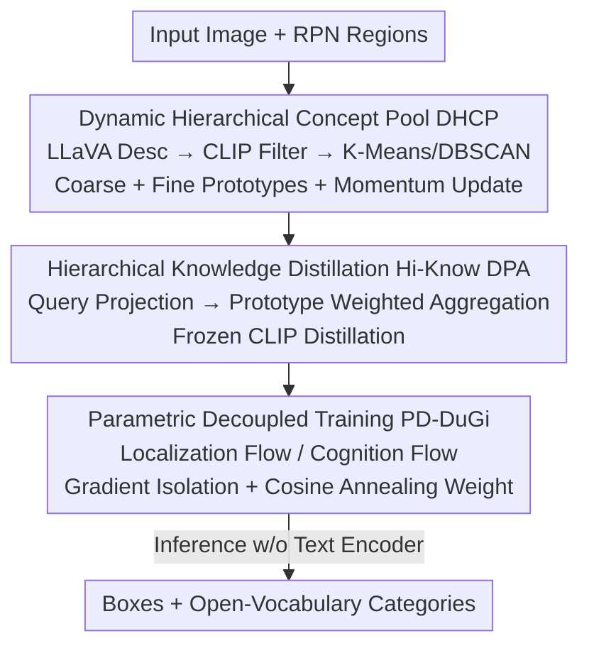

# DeCo-DETR: Decoupled Cognition DETR for efficient Open-Vocabulary Object Detection

**Conference**: ICLR2026  
**OpenReview**: [https://openreview.net/forum?id=3UDlRUf1es](https://openreview.net/forum?id=3UDlRUf1es)  
**Code**: TBD  
**Area**: Object Detection / Open-Vocabulary Detection  
**Keywords**: Open-Vocabulary Detection, DETR, Knowledge Distillation, Semantic Prototypes, Gradient Decoupling

## TL;DR
DeCo-DETR decouples "online text encoder invocation" and the "competition between localization and alignment" in open-vocabulary detection. It employs an LVLM to offline distill a reusable hierarchical semantic prototype pool as a substitute for the text encoder during inference and utilizes dual-stream gradient isolation to separate localization and semantic alignment training. This approach achieves a gain of 3.1--5.8 points on OV-COCO novel classes while compressing single-image inference latency to 135ms.

## Background & Motivation
**Background**: Open-Vocabulary Object Detection (OVOD) requires detectors to recognize categories not annotated during training. The mainstream approach leverages the cross-modal alignment capabilities of Vision-Language Models (VLMs) like CLIP: either by directly using CLIP/LLMs to provide text cues or through Knowledge Distillation (KD), distilling semantic knowledge from large models into lightweight detectors (e.g., ViLD distills category name text embeddings, while DK-DETR and DetCLIP further enhance visual-semantic alignment).

**Limitations of Prior Work**: Both paths suffer from significant drawbacks. First, **inference is computationally expensive**—prompt engineering methods require LLMs and detectors to run simultaneously during inference. Even distillation methods often remain tightly coupled with a large text encoder to generate text cues for novel classes online, leading to high latency (methods like Grounding DINO, which rely on a BERT-Base text encoder, take ~280ms per image). Second, **multimodal fusion naturally involves trade-offs**—over-tuning features on seen classes biases the model toward closed-set objects, thereby weakening the cross-modal alignment capability required to identify unseen classes.

**Key Challenge**: The root of the second issue is an **optimization conflict**: localization requires precise spatial discriminative power, while semantic alignment requires cross-modal generalization. When these targets are jointly optimized in a shared parameter space, their gradients interfere with each other, resulting in a compromise where the model must choose between closed-set accuracy and open-world generalization.

**Goal**: To decompose this into two sub-problems: (1) eliminating the reliance on text encoders during inference by converting semantic knowledge into reusable offline assets; (2) separating the conflicting objectives of "localization" and "semantic alignment" during training to prevent gradient contamination.

**Key Insight**: The authors observe that semantic cognition is inherently a process that can be completed **offline** and solidified into a set of prototypes. At inference time, these prototypes can enhance detector queries via look-up tables rather than running a text encoder live. Furthermore, objective conflicts during training can be structurally eliminated through **gradient isolation** rather than hard balancing via loss weighting.

**Core Idea**: A unified "decoupling" paradigm—constructing a Dynamic Hierarchical Concept Pool via LVLMs offline to replace online text encoding (addressing efficiency), and using dual-stream gradient isolation to separate the localization flow from the cognition flow (addressing conflict). This allows a vision-centric DETR to operate entirely without a text encoder during inference.

## Method

### Overall Architecture
DeCo-DETR takes an image and outputs detection boxes for both seen and unseen categories. The pipeline consists of three components. **Step 1** involves the offline construction of a **Dynamic Hierarchical Concept Pool (DHCP)**: region proposals are extracted for each image in the training set, LLaVA generates free-text descriptions for each region, and CLIP projects both regions and text into a shared space to filter low-confidence pairs. Finally, K-Means + DBSCAN are used to cluster these into "coarse + fine" hierarchical semantic prototypes, which are refreshed via momentum updates during training. **Step 2** utilizes **Hierarchical Knowledge Distillation (Hi-Know DPA)** to project the detector's object queries into this prototype space, aggregating multi-granularity semantics based on similarity to obtain enhanced queries, supervised by a frozen CLIP as a teacher. **Step 3** applies **Parametric Decoupled Training (PD-DuGi)** to split localization and semantic alignment into two parallel optimization flows, using gradient isolation to ensure they learn independently. During inference, the text encoder is no longer needed—the prototype pool provides semantic priors, and the dual-stream decoder simultaneously outputs boxes and category semantics in a single forward pass.

### Key Designs

**1. Dynamic Hierarchical Concept Pool (DHCP): Replacing "Online Text Encoding" with Reusable Offline Prototype Memory**

This step directly addresses the "expensive inference" pain point. Instead of invoking a large text encoder for every inference, semantic knowledge is distilled offline into a fixed set of prototypes. This is divided into two phases. **Offline Initialization**: For each region $R_i$ in the training set, LLaVA generates a text description $t_i = \text{LLaVA}(R_i)$. CLIP then projects the region and text into a shared space $v_i = f^{img}_{CLIP}(R_i)$ and $u_i = f^{txt}_{CLIP}(t_i)$, keeping only high-confidence pairs $T = \{u_i \mid \cos(v_i,u_i) > \delta\}$. Next, **two-tier clustering** produces hierarchical prototypes: first, K-Means clusters $M_1$ coarse-grained centroids $C_{coarse}=\text{K-Means}(T, k{=}M_1)$, then DBSCAN density clustering is applied within each coarse cluster to obtain fine-grained sub-clusters $C_{fine}=\text{DBSCAN}(c)$. The centroids are concatenated into a prototype matrix $A \in \mathbb{R}^{d \times M}$ ($M = M_1 + M_2$). Coarse prototypes handle inter-class separation, while fine prototypes capture intra-class nuances. **Online Update**: During training, for a batch of aligned embeddings $\{e_i\}$, their soft assignment to prototypes is calculated as $D_{i,j} = \frac{\exp(\tau^{-1}\cos(e_i,A_j))}{\sum_k \exp(\tau^{-1}\cos(e_i,A_k))}$, and the prototypes are updated via a momentum rule:

$$A_j \leftarrow \gamma A_j + (1-\gamma)\,\text{LayerNorm}\Big(\sum_i D_{i,j} e_i\Big),$$

where $\gamma$ controls the update rate and LayerNorm ensures numerical stability. This allows the prototype pool to absorb new semantic patterns without forgetting original structures, serving as a stable yet adaptive semantic memory—which acts as a fixed look-up table during inference, completely removing the text encoder from the path.

**2. Hierarchical Knowledge Distillation (Hi-Know DPA): Letting Detector Queries "Fetch" Multi-granularity Semantics**

While DHCP provides the prototype space, the detector's object queries remain in the visual feature space. Hi-Know DPA bridges this gap using a learnable projection $h_\theta: \mathbb{R}^C \to \mathbb{R}^d$ to map each query into the prototype space $\hat q_n = h_\theta(q_n)$. Similarity-based weights are calculated as $w_{n,j} = \frac{\exp(\alpha^{-1}\cos(\hat q_n, A_j))}{\sum_k \exp(\alpha^{-1}\cos(\hat q_n, A_k))}$, followed by aggregating prototype semantics to obtain the enhanced query $r_n$:

$$r_n = \sum_{j=1}^{M} w_{n,j} A_j + \text{MLP}(\hat q_n),$$

where the MLP residual term preserves original visual information. To further calibrate alignment, a frozen CLIP teacher is introduced: CLIP visual embeddings $z^{CLIP}_n$ and the text prototype matrix $P$ are used to calculate a teacher distribution $\tilde w_n = \text{Softmax}(\tau^{-1}\cos(z^{CLIP}_n, P))$. The training objective is:

$$\mathcal{L}_{DPA} = \mathcal{L}_{det} + \lambda_{KL}\sum_n \text{KL}(\tilde w_n \| w_n) + \lambda_{align}\mathcal{L}_{align},$$

In addition to standard DETR detection loss, KL divergence pulls the student's prototype distribution $w_n$ toward the teacher distribution $\tilde w_n$. The "hierarchical" aspect is crucial—queries align with a weighted aggregation of multi-granularity prototypes rather than a single embedding, allowing fine-grained semantics of novel classes to be grounded.

**3. Parametric Decoupled Training (PD-DuGi): Complete Stream Separation via Gradient Isolation**

Addressing the second core conflict, the authors argue that localization and semantic alignment are fundamentally contradictory. They use **dual streams + gradient isolation** to decouple them. A parameterized semantic predictor $g_\phi: \mathbb{R}^d \to \mathbb{R}^{|C_{base}\cup C_{novel}|}$ is attached to the enhanced query $r_n$, outputting a category distribution $t_n = \text{Softmax}(g_\phi(r_n))$. In the **semantic alignment flow**, a stop-gradient is applied to the query $q'_n = \text{StopGradient}(q_n)$ before projection and aggregation. $\mathcal{L}_{align} = \text{CrossEntropy}(t_n, T_{teacher})$ is then calculated, meaning this flow only updates the semantic modules ($g_\phi$ and $h_\theta$). **Gradient isolation** ensures that $\mathcal{L}_{det}$ gradients only flow back to the detection backbone and decoder, while $\mathcal{L}_{align}$ gradients only flow to the semantic projection and predictor. The overall objective is weighted over time:

$$\mathcal{L}_{PD} = \mathcal{L}_{det} + \lambda_{align}(t)\,\mathcal{L}_{align},$$

where $\lambda_{align}(t)$ follows a cosine annealing schedule. This curricular scheduling allows the two objectives to transition smoothly rather than competing for gradients from the start.

### Loss & Training
The total loss is $\mathcal{L}_{PD} = \mathcal{L}_{det} + \lambda_{align}(t)\mathcal{L}_{align}$. $\mathcal{L}_{det}$ is the standard DETR loss, $\mathcal{L}_{align}$ is the alignment cross-entropy, and $\lambda_{align}(t)$ uses cosine annealing. Hyperparameters: prototype momentum $\gamma=0.99$, temperature $\tau=0.07$; prototype pool $M_1=1203$ coarse + $M_2=4800$ fine (Total 6003); 6 decoder layers with 8 heads; total batch size 64 (8×A100).

## Key Experimental Results

### Main Results
OV-COCO reports $AP^{novel}_{50}/AP^{base}_{50}/AP_{50}$, and OV-LVIS reports AP for rare/common/frequent classes. DeCo-DETR generally leads across four OVOD settings (V/G/C/WS-OVD) in novel AP.

| Dataset / Setting | Metric | Ours (DeCo-DETR) | Prev. SOTA | Gain |
|--------|------|------|----------|------|
| OV-COCO (V-OVD) | $AP^{novel}_{50}$ | 41.3 | 38.2 (CAKE) | +3.1 |
| OV-COCO (G-OVD) | $AP^{novel}_{50}$ | 47.1 | 41.3 (RALF) | +5.8 |
| OV-COCO (WS-OVD) | $AP^{novel}_{50}$ | 45.5 | 41.8 (CAKE) | +3.7 |
| OV-LVIS | $AP_r$ / $AP$ | 29.4 / 35.2 | 29.3 / 35.0 (Mamba) | +0.1 / +0.2 |

Regarding efficiency, inference latency with ResNet-50 is only 135ms, GFLOPs increase by only 6.8%, and parameters are 44M (+7.3%). Compared to Grounding DINO (~280ms), it offers ~2× speedup while maintaining similar novel AP (41.3 vs 42.1).

| Method | Inference Latency (R50) | Remarks |
|------|----------------|------|
| Grounding DINO | ~280ms | w/ BERT-Base Text Encoder |
| DetPro | 140ms | — |
| DeCo-DETR | 135ms (7.4 FPS) | No Text Encoder at Inference |

### Ablation Study
Incremental component addition (OV-COCO, novel / base / overall $AP_{50}$):

| Configuration | $AP^{novel}_{50}$ | $AP^{base}_{50}$ | $AP_{50}$ | Description |
|------|------|------|------|------|
| 1. Baseline | 30.4 | 52.6 | 46.8 | DETR Baseline |
| 2. + Hierarchical DHCP | 36.6 | 54.0 | 49.4 | Add Prototype Pool |
| 3. + PD-DuGi Isolation | 37.5 | 55.1 | 50.5 | Dual-stream Isolation |
| 4. + Cosine $\lambda(t)$ (Full) | 41.3 | 55.5 | 51.0 | Annealing Weight |

### Key Findings
- **Fine-grained Prototypes are Essential for DHCP**: Removing fine-grained units ($M_2=0$) causes novel AP to drop by 10.5 points. Doubling $M_2$ to 9600 only yields a +0.2% gain while increasing memory and latency—$M_2=4800$ is the "sweet spot."
- **Gradient Isolation Improves Both Novel and Base**: PD-DuGi increases $AP^{novel}_{50}$ from 36.6 to 37.5 (+0.9) and $AP^{base}_{50}$ from 54.0 to 55.1 (+1.1). Improvements on both ends confirm that semantic gradients contaminate localization features in shared spaces.
- **VLM Scale Threshold**: Using LLaVA-1.5 7B results in a novel AP of only 30.1%. Upgrading to 13B or above (13B / LLaVA-NEXT 13B / Qwen2.5-VL 32B) stabilizes performance between 38.2 to 38.9%.
- **Query Count vs. Performance**: Increasing $N$ from 300 to 2000 adds +4.8 novel AP with only ~10ms latency increase, benefiting from Transformer decoder parallelism.

## Highlights & Insights
- **Offloading "Cognition" to Look-up Tables**: The most ingenious design is the realization that semantic alignment does not need to be performed online. By distilling LVLM knowledge into a prototype pool offline, the text encoder disappears from the inference path.
- **Gradient Isolation as a Structural Solution**: Instead of tuning loss weights to balance conflicting targets, the authors use physical isolation via stop-gradients. The simultaneous rise in novel and base AP proves this is superior to shared-space optimization.
- **Hierarchical Clustering (K-Means + DBSCAN)**: Capturing inter-class structures globally and intra-class densities locally provides a template for any task requiring multi-granularity semantic memory.

## Limitations & Future Work
- **Dependency on Offline VLM/CLIP Quality**: The prototype pool is built from LLaVA descriptions and CLIP filtering. Any noise in descriptions or CLIP alignment bias is solidified into the prototypes.
- **Prototype Pool Scale**: 6003 prototypes incur non-negligible memory and look-up overhead. The trade-off between representation and cost still has room for optimization.
- **Limited Adaptability to Distribution Shift**: While momentum updates help, the prototype skeleton is fixed during the offline phase, which might limit adaptation to entirely new semantic distributions not covered by the training set.
- **Possible Typo in Table 4**: The original text labels two columns as $AP^{novel}_{50}$; the second should likely be $AP^{base}_{50}$ based on context.

## Related Work & Insights
- **vs. ViLD / DK-DETR (Distillation Path)**: These distill VLM text embeddings into the detector, but inference remains coupled with a text encoder. DeCo-DETR solidifies semantics into offline prototypes, excelling in both latency and novel AP.
- **vs. Grounding DINO (Fusion Path)**: Grounding DINO relies on BERT-Base online (~280ms). DeCo-DETR is vision-centric and runs at 135ms (~2× faster) with competitive accuracy.
- **vs. CAKE**: CAKE also attempts to reduce text dependency but struggles with fine-grained detection. DeCo-DETR outperforms CAKE by 3--6 points in novel AP across multiple OV-COCO settings due to hierarchical prototypes.

## Rating
- Novelty: ⭐⭐⭐⭐ The dual decoupling (offline prototypes replacing online encoders + dual-stream gradient isolation) is a clear and convincing combined innovation.
- Experimental Thoroughness: ⭐⭐⭐⭐ Covers four OV-COCO settings + OV-LVIS + three backbones + multidimensional ablations.
- Writing Quality: ⭐⭐⭐⭐ Logical flow from motivation to experiment is sound, though minor typos exist in tables.
- Value: ⭐⭐⭐⭐ Provides a highly efficient "zero-text-encoder" direction for OVOD, significant for engineering deployment of DETR-based open-vocabulary detection.

<!-- RELATED:START -->

## Related Papers

- [\[ICLR 2026\] DETR-ViP: Detection Transformer with Robust Discriminative Visual Prompts](detr-vip_detection_transformer_with_robust_discriminative_visual_prompts.md)
- [\[ECCV 2024\] LaMI-DETR: Open-Vocabulary Detection with Language Model Instruction](../../ECCV2024/object_detection/lami-detr_open-vocabulary_detection_with_language_model_instruction.md)
- [\[ICLR 2026\] RF-DETR: Neural Architecture Search for Real-Time Detection Transformers](rf-detr_neural_architecture_search_for_real-time_detection_transformers.md)
- [\[CVPR 2026\] Parameter-Efficient Semantic Augmentation for Enhancing Open-Vocabulary Object Detection](../../CVPR2026/object_detection/parameter-efficient_semantic_augmentation_for_enhancing_open-vocabulary_object_d.md)
- [\[ICCV 2025\] Sim-DETR: Unlock DETR for Temporal Sentence Grounding](../../ICCV2025/object_detection/sim-detr_unlock_detr_for_temporal_sentence_grounding.md)

<!-- RELATED:END -->
