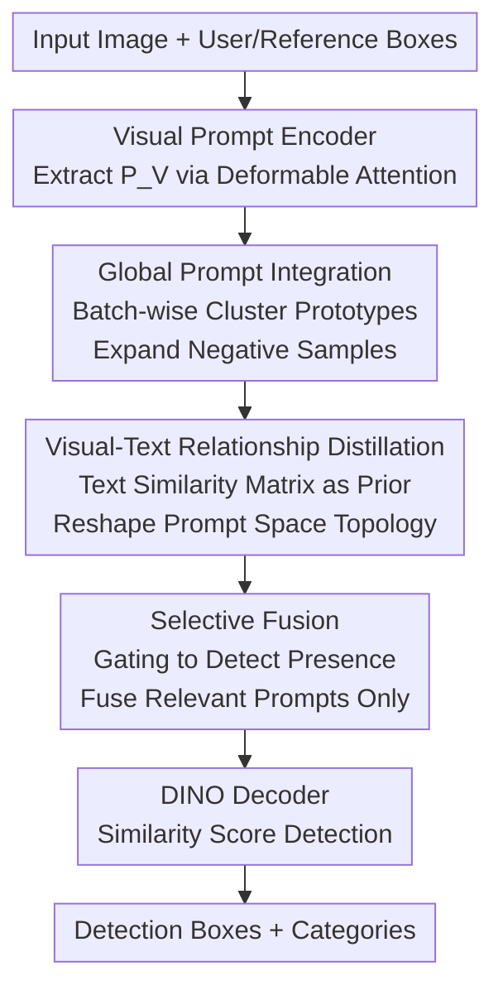

# DETR-ViP: Detection Transformer with Robust Discriminative Visual Prompts

**Conference**: ICLR2026  
**OpenReview**: [https://openreview.net/forum?id=2KKDWERRm3](https://openreview.net/forum?id=2KKDWERRm3)  
**Code**: https://github.com/MIV-XJTU/DETR-ViP  
**Area**: Object Detection / Open-Vocabulary Detection  
**Keywords**: Visual Prompt Detection, Open-Vocabulary Detection, Grounding DINO, Prompt Discriminability, Relationship Distillation

## TL;DR
DETR-ViP attributes the performance gap between "visual prompts and text prompts" to a lack of global discriminability in visual prompts. By expanding negative samples through global prompt integration, reshaping the visual prompt space topology via text-based relationship distillation, and stabilizing inference with selective fusion, it achieves a new SOTA in visual prompt detection across COCO / LVIS / ODinW / Roboflow100 (surpassing T-Rex2-T by +4.4 AP on COCO).

## Background & Motivation
**Background**: Open-set (open-vocabulary) detection relies on "prompts" to break the limits of closed-set categories. Text prompts are mainstream, leveraging models like CLIP/BERT to align visual features with text embeddings (e.g., GLIP, Grounding DINO, RegionCLIP). An alternative is visual prompting—where users provide one or several reference objects via boxes. This approach is more interactive and often more accurate for rare categories, as visual prompts are naturally homologous with image features and do not require cross-modal alignment.

**Limitations of Prior Work**: Despite their advantages in rare categories, the **overall performance of visual prompts still lags behind text prompts**. They have long been treated as a "by-product of training text-prompted detectors," with little systematic research into why they underperform. The authors built a visual-prompt-supported baseline (VIS-GDINO) on Grounding DINO, which achieved only 21.1 mAP on COCO and 17.2 mAP on LVIS—significantly lower than its text-prompted counterpart.

**Key Challenge**: Through t-SNE and pairwise cosine similarity analysis of visual prompts in VIS-GDINO, the authors identified that **visual prompts lack global discriminability**. This is manifested in two ways: (1) High variance among visual prompts of different instances of the same category (low intra-class compactness); (2) Visual prompts of different categories are highly entangled in the global embedding space with blurred boundaries (low inter-class separability). Text prompts inherently possess a "synonym clustering, antonym separation" structure due to language model pre-training, whereas visual prompt distributions are naturally chaotic because instance appearance varies significantly with individual and environmental factors.

**Goal**: To **simultaneously suppress intra-class variance and increase inter-class distance** for visual prompts without relying on the "indirect route" of cross-modal alignment, enabling visual prompts to possess a semantic discriminative structure similar to text.

**Key Insight**: The authors proposed a quantifiable diagnostic metric, IISR (Intra-Inter Similarity Ratio). A higher IISR indicates stronger semantic consistency. Experiments show a high positive correlation between IISR and mAP—thus, the optimization goal is clearly to increase IISR.

**Core Idea**: Reshape the topology of the visual prompt embedding space directly using "Global Prompt Integration + Visual-Text Relationship Distillation," and use "Selective Fusion" to merge prompts on demand during inference, elevating visual prompt detection from a by-product to a first-class citizen.

## Method

### Overall Architecture
DETR-ViP is built upon Grounding DINO. First, Grounding DINO is transformed into the **VIS-GDINO baseline**: a **visual prompt encoder** is inserted between the backbone and encoder (following T-Rex, using sinusoidal encoding for normalized user boxes → concatenating content embeddings → multi-scale deformable cross-attention to extract visual prompts $P_V$ from image features), and the original text-image fusion modules in the encoder/decoder are removed. During detection, instead of a linear classification head, the similarity score between proposal features $O$ and prompt embeddings $P$ is used: $\text{Score}=\sigma(OP^\top+b)$, where the prompts act as "classifier weights."

On top of VIS-GDINO, DETR-ViP adds three components to address "insufficient discriminability": **Global Prompt Integration** during training to aggregate visual prompts from all images in a batch into class prototypes to expand negative samples as a shared classifier; **Visual-Text Relationship Distillation** to use text prompt similarity matrices as priors to optimize the visual prompt space topology; and **Selective Fusion** during inference/training to determine if a category is present in the image and fuse only relevant prompts to suppress irrelevant categories. The pipeline is as follows:

### Key Designs

**1. Global Prompt Integration: Using Cross-Image Aggregated Class Prototypes to Scale Up "N-way Classification"**

The classification loss for visual prompt detection is essentially contrastive learning in the form of Focal Loss: positive prompts $p^+$ pull proposal features closer, while negative prompts $p^-$ push them away. The strategy in T-Rex2—"current image prompts for current image detection"—where prompts are only sampled from the GT boxes of the current training image, results in very few categories being seen in each iteration. This degrades classification into a very small N-way task, where a lack of category diversity limits global discriminative power. While text prompts can simply be padded with extra phrases, visual prompts rely on source images, and sampling extra images for negative samples would significantly slow down training.

The authors' approach: **Group visual prompts from all images in a batch by category and take the mean to obtain class prototypes**, then concatenate all prototypes as **shared classifier weights** for all images in the batch. Consequently, visual prompts for a given category come not only from the current sample but also from positive examples of other samples in the batch, significantly expanding negative samples, stabilizing training, and implicitly simulating "cross-image prompting." Ablations show this step improves COCO from 29.2 → 35.6 (+6.4) and LVIS from 23.4 → 33.0 (+9.6), where rare classes (APr) gained +13.4 and common classes (APc) gained +13.9.

**2. Visual-Text Relationship Distillation: Using Text Category Similarity as a Prior to Shape Visual Space Topology**

To make the visual prompt space "intra-class compact and inter-class separable," the most direct thought is to use Supervised Contrastive Loss (Eq. 6). However, hard contrastive loss treats all negative samples equally, failing to capture correlations between concepts. It is also hindered by false negatives in grounding data—for instance, "woman" and "person" are treated as different categories but using their visual prompts as mutual negatives is irrational. Another path, taken by T-Rex2, is to align visual prompts with corresponding text prompts, but research suggests perfect cross-modal alignment is unattainable, limiting the ceiling of this indirect route.

The authors instead use **Relationship Distillation**: rather than constraining pairwise visual-text alignment, they use the similarity matrix between text prompts $C C^\top$ as a soft label prior to supervise the similarity matrix between visual prompts $P P^\top$:

$$\mathcal{L}_{\text{distill}} = \text{CrossEntropy}\big(\text{Softmax}(CC^\top/\tau_t),\ \text{Softmax}(PP^\top/\tau_v)\big)$$

Where $c,p$ are L2-normalized text/visual prompt vectors, and $\tau_t,\tau_v$ are temperatures. This leverages the text-text relationship structure as a prior to directly optimize the visual prompt space topology, bypassing the difficulty of cross-modal alignment. It is complementary to alignment loss: alignment loss provides stable text semantic anchors for visual prompts, while relationship distillation focuses on refining the internal structural relationships. This increased COCO IISR significantly by +0.4220 and LVIS by +0.1698, adding +5.9 (→41.5) and +6.5 (→39.5) AP respectively; t-SNE shows semantically related concepts (truck↔car, bench↔chair) are mapped closer.

**3. Selective Fusion: Detecting Category Presence to Merge Relevant Prompts and Address "Prompt Quantity Sensitivity"**

Fusing prompt embeddings with image features (allowing prompts to capture image-specific info and making high-response regions semantically salient) is common in open-vocabulary detection. However, in practice, prompt usage is flexible: users might provide only 1-2 classes of interest, while batch labeling might provide 80 COCO classes despite only a few existing in the current image. The authors found that Grounding DINO's full fusion is **highly sensitive to the number of prompts**—performance is normal with 80 prompts but collapses when given only 'person', as global prompt integration causes the model to overfit the "multi-prompt" scenario, creating a training-testing gap.

The Selective Fusion approach: Introduces a gating vector $G$ in the fusion layer's attention weights, aiming for $g_c\to 0$ when category $c$ is present and $g_c\to-\infty$ when absent. Specifically, an auxiliary classification branch calculates a similarity matrix $S$ between image features $X_I$ and prompts $P_V$. Each prompt takes the maximum similarity as a confidence score, which is then passed through a threshold activation $\delta(\cdot)$ (outputs 0 if above threshold $\theta$, else $-\infty$):

$$X_I^o = \text{Softmax}\Big(\frac{QK^\top + G}{\sqrt{d}}\Big)V,\quad G=\delta(\text{MAX}(S,0),\theta)$$

Used in both training and evaluation, the model filters out prompts with insufficient response to the current image, making fusion robust. Ablations show: full encoder fusion has almost no gain or even drops performance, while selective encoder fusion adds +0.7 COCO / +1.1 LVIS. Full decoder fusion, which directly modifies object queries, severely impacts AP (LVIS dropped from 40.6 to 25.5) due to irrelevant categories, but selective decoder fusion recovers and further adds +1.0 / +0.5 AP.

### Loss & Training
The base loss $\mathcal{L}_{\text{base}}$ follows DINO's classification loss $\mathcal{L}_{cls}$, L1, GIoU, de-noising loss $\mathcal{L}_{dn}$, and T-Rex2's image-text contrastive alignment loss $\mathcal{L}_{\text{Align}}$; the total loss is $\mathcal{L}_{\text{total}}=\mathcal{L}_{\text{base}}+\lambda_{\text{distill}}\mathcal{L}_{\text{distill}}$. Weights are $\lambda_{cls},\lambda_1,\lambda_{GIoU},\lambda_{\text{Align}},\lambda_{\text{distill}}=1.0,5.0,2.0,1.0,10.0$, with temperatures $\tau_t=0.07,\tau_v=0.1$. The backbone is Swin-T/L, with a 6-layer visual encoder + 3-layer visual prompt encoder (deformable cross-attention) + 6-layer box decoder, trained with AdamW, backbone learning rate $1\times10^{-5}$, and others $1\times10^{-4}$. Training data uses Objects365(V1) + GoldG (GQA + Flickr30k), excluding COCO images for fair zero-shot evaluation.

## Key Experimental Results

### Main Results
Zero-shot evaluation covers COCO, LVIS, ODinW(35), and Roboflow100, without training on these benchmarks. Under the Visual-G protocol (general protocol: sampling N images per class, using the mean of all GT boxes as prompts):

| Dataset | Metric | DETR-ViP-T | T-Rex2-T | Gain |
|--------|------|-----------|----------|------|
| COCO | AP | 43.2 | 38.8 | +4.4 |
| LVIS | AP | 41.1 | 37.4 | +3.7 |
| LVIS | APc | 43.3 | 33.9 | +9.4 |
| LVIS | APr | 35.1 | 29.9 | +5.2 |
| ODinW | APavg | 31.2 | 23.6 | +7.6 |
| Roboflow100 | APavg | 23.6 | 17.4 | +6.2 |

Using less data, DETR-ViP-T outperforms YOLOE-v8-L on LVIS by +6.9 AP (APr/APc/APf gains of +1.9/+8.7/+6.3). On ODinW/Roboflow100 (larger domain shifts), it even surpasses T-Rex2-**L** by 3.4 / 5.1 AP. DETR-ViP-L further exceeds T-Rex2-L on COCO/LVIS by +3.7 / +1.5. Under the Visual-I protocol (interactive protocol: one random GT box per class, excluding absent classes), the gains are even larger: DETR-ViP-T reaches 65.4 on COCO vs 56.6 for T-Rex2-T, and 40.1 on Roboflow100 vs 30.6.

### Ablation Study
Incremental components from VIS-GDINO to DETR-ViP (COCO-val / LVIS-minival, AP and IISR):

| Configuration | COCO AP | COCO IISR | LVIS AP | Notes |
|------|---------|-----------|---------|------|
| VIS-GDINO-T | 21.1 | 0.8797 | 17.2 | Baseline, scattered prompts |
| + Image-Text Alignment | 29.2 | 0.9743 | 23.4 | Distilling text semantic priors (+8.1/+6.2) |
| + Global Prompt Integration | 35.6 | 1.0734 | 33.0 | Expanded negative samples (+6.4/+9.6) |
| + Relation Distillation | 41.5 | 1.4954 | 39.5 | Reshaping space topology (+5.9/+6.5) |
| + Encoder Full Fusion | 41.3 | 1.5001 | 39.1 | Negligible gain or performance drop |
| + Encoder Selective Fusion | 42.2 | 1.4963 | 40.6 | +0.7 / +1.1 |
| + Decoder Full Fusion | 40.8 | 1.4976 | 25.5 | Directly modifies query, LVIS collapse |
| + Decoder Selective Fusion | 43.2 | 1.5010 | 41.1 | Full model, another +1.0 / +0.5 |

### Key Findings
- **High Correlation between IISR and mAP**: Every improvement that increased IISR also increased AP, validating the "insufficient discriminability" diagnosis and the "increase IISR" optimization goal.
- **Relationship Distillation is the Strongest Contributor to IISR**: COCO IISR jumped from 1.07 to 1.50 in one step (+0.42), proving text relationship priors are key to "sculpting" semantic structure in the visual prompt space.
- **Full Fusion is a Trap**: Full encoder fusion offers no gain, and full decoder fusion caused LVIS AP to collapse from 40.6 to 25.5. Only selective fusion, which first judges category existence, is stable, highlighting that prompt quantity robustness is a real pain point in visual prompt detection.

## Highlights & Insights
- **Diagnosis Before Prescription**: Rather than just stacking modules, the authors used t-SNE + IISR to quantify the problem as "high intra-class variance + inter-class entanglement." IISR, a simple ratio of intra-to-inter similarity, can be reused for diagnosis in any "prompt-as-classifier" detection or retrieval task.
- **Relationship Distillation Bypassing Alignment Ceilings**: Instead of forcing visual-to-text alignment (limited by imperfect correspondence), they use the text-text similarity matrix as soft labels for the visual-visual similarity matrix. This "distilling relations rather than representations" approach is clever and transferable to scenarios where a strong modal structure is used to regularize a weak modal space.
- **Global Prompt Integration via Prototypes as Shared Classifiers**: This elegantly solves the "small N-way classification" problem by aggregating prototypes across the batch. It significantly expands negative samples with near-zero overhead, providing particularly large gains for rare classes.

## Limitations & Future Work
- **Hard Gating Threshold $\theta$**: Selective fusion relies on $\delta(\cdot)$ for a hard 0/$-\infty$ cut at $\theta$. The paper does not fully discuss the sensitivity of $\theta$, and whether it needs adaptation for cross-domain scenarios remains questionable.
- **Dependency on Text Prompts as Priors**: Relationship distillation requires a corresponding text label for each visual category. How to derive priors for purely visual concepts without linguistic descriptions remains to be seen.
- **Prototype Batch Dependence**: The effectiveness of global prompt integration depends on category coverage within a batch. Prototypes may be unstable with small batches or extremely long-tail distributions; more large-scale or memory-bank-style maintenance is worth exploring.

## Related Work & Insights
- **vs T-Rex2**: T-Rex2 uses "current image prompts" + image-text alignment to indirectly align visual prompts to text. DETR-ViP points out that this leads to small N-way degradation and alignment ceilings, opting for cross-image global integration + relationship distillation to directly reshape the prompt space, outperforming it across the board with less data.
- **vs YOLOE**: YOLOE handles text and visual prompts uniformly via RepRTA/SAVPE. DETR-ViP achieves +6.9 AP higher on LVIS with the same training data, with the gap concentrated in common and rare classes due to more efficient visual prompt distribution optimization.
- **vs Grounding DINO**: DETR-ViP uses GD as a skeleton but removes its native fusion, inserts a visual prompt encoder, and replaces full fusion with selective fusion. Directly reusing GD's full fusion actually hurts performance, showing that text prompt fusion experiences cannot be blindly applied to visual prompts.

## Rating
- Novelty: ⭐⭐⭐⭐⭐ Quantified diagnosis of visual prompt failure + relationship distillation + selective fusion; clear and innovative logic.
- Experimental Thoroughness: ⭐⭐⭐⭐⭐ Four benchmarks, two protocols, step-by-step ablation + IISR/t-SNE cross-validation.
- Writing Quality: ⭐⭐⭐⭐⭐ Successful logical loop from motivation to diagnosis to method to verification; IISR turns intuition into a metric.
- Value: ⭐⭐⭐⭐ Significantly advances visual prompt detection SOTA; the relationship distillation approach has strong transferability.

<!-- RELATED:START -->

## Related Papers

- [\[ICLR 2026\] DeCo-DETR: Decoupled Cognition DETR for efficient Open-Vocabulary Object Detection](deco-detr_decoupled_cognition_detr_for_efficient_open-vocabulary_object_detectio.md)
- [\[CVPR 2026\] EW-DETR: Evolving World Object Detection via Incremental Low-Rank DEtection TRansformer](../../CVPR2026/object_detection/ew-detr_evolving_world_object_detection_via_incremental_low-rank_detection_trans.md)
- [\[ECCV 2024\] BAM-DETR: Boundary-Aligned Moment Detection Transformer for Temporal Sentence Grounding in Videos](../../ECCV2024/object_detection/bam-detr_boundary-aligned_moment_detection_transformer_for_temporal_sentence_gro.md)
- [\[CVPR 2026\] From Detection to Association: Learning Discriminative Object Embeddings for Multi-Object Tracking](../../CVPR2026/object_detection/from_detection_to_association_learning_discriminative_object_embeddings_for_mult.md)
- [\[CVPR 2026\] ViTPrompt: Training-Free Prompt Refinement with Visual Tokens for Open-Vocabulary Detection](../../CVPR2026/object_detection/vitprompt_training-free_prompt_refinement_with_visual_tokens_for_open-vocabulary.md)

<!-- RELATED:END -->
