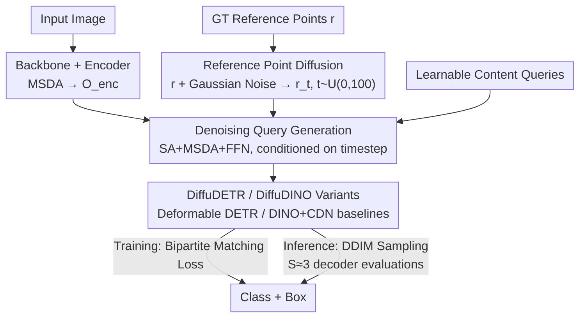

# DiffuDETR: Rethinking Detection Transformers with Denoising Diffusion Process

**Conference**: ICLR2026  
**OpenReview**: [https://openreview.net/forum?id=nkp4LdWDOr](https://openreview.net/forum?id=nkp4LdWDOr)  
**Code**: https://mbadran2000.github.io/DiffuDETR  
**Area**: Object Detection  
**Keywords**: Detection Transformer, Denoising Diffusion, Query Initialization, Reference Point, DETR

## TL;DR
DiffuDETR reformulates object detection as an "object query generation task conditioned on an image and a set of noisy reference points." By using denoising diffusion training, the DETR decoder learns to gradually denoise query reference points from Gaussian noise into precise object locations. It consistently outperforms baselines such as Deformable DETR and DINO on COCO, LVIS, and V3Det, while adding negligible computational overhead during inference as it only requires a few extra decoder passes.

## Background & Motivation
**Background**: The DETR series treats object detection as a "set prediction" problem, utilizing a set of learnable object queries combined with bipartite matching (Hungarian algorithm) to achieve end-to-end detection, eliminating handcrafted components like anchors and NMS. Improvements to DETR mainly follow two paths: refining query initialization (DAB-DETR formulates queries as updatable anchor coordinates; Deformable DETR uses a two-stage process to initialize queries from top-K encoder proposals) or designing better auxiliary training objectives (DN-DETR injects noisy ground truth boxes as an auxiliary denoising task; DINO adds Contrastive De-noising (CDN) and mixed query selection).

**Limitations of Prior Work**: Queries in the original DETR are initialized as zero vectors without any spatial prior, forcing the model to learn "query-to-object" alignment from scratch, which leads to slow convergence and training instability. While subsequent works mitigate this, query initialization remains essentially a "manually designed prior"—either via handcrafted anchors or selections from encoder proposals. The source and quality of these priors remain a separate engineering challenge.

**Key Challenge**: Detection is an **unordered set** prediction problem, requiring the generation of a set of discrete object candidates to correspond with ground truth (GT). In contrast, diffusion models excel at **pixel-wise, spatially structured** denoising reconstruction typical of images. Due to this mismatch, diffusion models have seen success in segmentation (which is naturally image-to-image) but have rarely been effectively applied to detection—DiffusionDet is a rare exception, yet it is built on Sparse R-CNN and denoises proposal **boxes** rather than DETR queries.

**Goal**: Can the task of "query initialization" itself be delegated to a generative denoising process? By sampling query reference points directly from noise and denoising them into place, can one obtain queries with inherent spatial priors and a training signal stronger than that of DN-DETR?

**Key Insight**: The authors observe that the **reference points** in the DETR decoder are low-dimensional (each query has 4D box coordinates). By applying the diffusion process only to these low-dimensional reference points, rather than high-dimensional images, the diffusion space is minimal. Consequently, $T=100$ steps (far fewer than the 1000 steps used in image diffusion) are sufficient, making inference computationally efficient.

**Core Idea**: Reformulate object detection as a denoising diffusion process for "query reference points." During training, Gaussian noise is added to GT reference points, and the decoder learns to denoise them conditioned on image features. During inference, reference points are sampled from standard Gaussian noise and iteratively denoised into boxes using DDIM.

## Method

### Overall Architecture
DiffuDETR follows the encoder-decoder backbone of Deformable DETR (multi-scale deformable attention). The primary modification lies in the **training mechanism**: the decoder's reference points $r\in\mathbb{R}^{N\times4}$ are treated as low-dimensional "diffusion latent variables," and the model learns to perform denoising on them.

The pipeline is as follows: A CNN backbone extracts multi-scale features $\to$ a Transformer encoder (multi-scale deformable attention) generates encoded features $O_{enc}$. During training, normalized reference points of GT objects are perturbed with Gaussian noise at a random timestep $t\sim U(0,100)$ to obtain noisy reference points $r_t$. The decoder then processes $O_{enc}$, the noisy reference points $r_t$, and a set of static learnable content queries, performing **iterative denoising** conditioned on timestep embeddings. Finally, an MLP head decodes each denoised query into a category and box coordinates. Content queries encode semantic "what" information, while noisy reference points provide the "where" spatial prior; the decoder, guided by encoded features, progressively corrects noisy reference points to the correct target positions.

The update for a single decoder layer is formulated as:

$$q_n = \mathrm{FFN}\big(\mathrm{MSDA}(\mathrm{SA}(q_{n-1}) + t),\, r_t,\, O_{enc}\big)$$

Where $q_n$ is the query at layer $n$, $t$ is the timestep embedding, SA is self-attention, and MSDA is multi-scale deformable attention (sampling encoded features based on noisy reference points).

### Key Designs

**1. Reference Point Diffusion Denoising: Converting Query Initialization to a Low-Dim Denoising Problem**

The bottleneck of the DETR series is the lack of spatial priors for queries. DiffuDETR moves away from "designing" a prior and instead **generates** one from noise. Specifically, the normalized reference points $r\in\mathbb{R}^{N\times4}$ of $N$ GT objects in an image are treated as the clean signal. The forward process adds Gaussian noise according to timestep $t$:

$$q(r_t\mid r) = f(r_t;\, r,\, \sigma^2 I)$$

Where $r_t$ represents the noisy reference points at step $t$, $\sigma^2$ scales the noise, and $f$ is the forward noise function (Normal distribution). The decoder learns the reverse process: conditioned on encoded image features, it restores noisy reference points to true object positions, effectively learning the "conditional distribution of object locations." The architectural cleverness lies in applying diffusion only to **low-dimensional** reference points (4D per object), allowing training with only $T=100$ steps—lowering costs significantly compared to image-based diffusion.

**2. Denoising as a Stronger Training Objective: Replacing the DN-DETR Auxiliary Task**

DN-DETR/DINO perform "denoising" by adding an **auxiliary** denoising branch (injecting noisy GT boxes for reconstruction). DiffuDETR makes denoising the **primary** training objective. The decoder must recover the correct position from $r_t$ at every sampled timestep, which amounts to repeatedly supervising query alignment across different noise intensities. This provides a denser learning signal with more gradient information than a single-point auxiliary task. Experiments show that with a ResNet-50 backbone and 50 epochs, DiffuDETR achieves 50.2 AP, surpassing the 48.6 AP of DN-Deformable DETR, proving diffusion denoising is a superior training signal. The trade-off is slower convergence, requiring more epochs.

**3. Dual-Variant Implementation: DiffuDETR / DiffuDINO (and DiffuAlignDETR)**

This denoising query generation is a "plug-and-play" mechanism compatible with various DETR architectures. The paper presents two main variants: **DiffuDETR** built on the Deformable DETR decoder, and **DiffuDINO** built on the DINO decoder (retaining its Contrastive De-noising queries). Both share the same diffusion mechanism. The authors also applied it to Align-DETR, resulting in **DiffuAlignDETR**, which showed improved performance (51.4 $\to$ 51.9 AP over 24 epochs), demonstrating the generalizability of the design.

**4. Lightweight DDIM Sampling: Inference requires only a few extra decoder passes**

Slow inference is a common drawback of diffusion models, but since DiffuDETR operates in a low-dimensional space, it can utilize a deterministic DDIM sampler with very few steps. At inference, $K=4$ reference points are sampled from standard Gaussian $r_T^{(i,k)}\sim\mathcal N(0,I)$ for each query. Then, for $t=T,\dots,1$, the decoder predicts the noise residual $\hat\epsilon=\epsilon_\theta(r_t,t)$, and $r_{t-1}$ is updated via DDIM rules:

$$r_{t-1} = \sqrt{\bar\alpha_{t-1}}\,\frac{r_t-\sqrt{1-\bar\alpha_t}\,\hat\epsilon}{\sqrt{\bar\alpha_t}} + \sqrt{1-\bar\alpha_{t-1}}\,\hat\epsilon$$

The process requires $S$ decoder evaluations ($S\ll T$), while the **backbone and encoder run only once**. Thus, GFLOPs increase minimally compared to DINO. In experiments, $S=3$ evaluations achieved optimal results (51.9 AP), and even $S=1$ (identical computation to DINO) yielded a +1.7 AP gain, making the mechanism a "free lunch" for single-step inference.

### Loss & Training
Training follows the standard DETR bipartite matching (Hungarian matching) with classification and box regression losses, with the denoising process embedded in the decoder iterations. Diffusion uses $T=100$ steps, with timesteps sampled as $t\sim U(0,100)$. Gaussian noise and a cosine scheduler (both found to be optimal in ablations) are utilized.

## Key Experimental Results

### Main Results
COCO 2017 val (ResNet-50 backbone), where each variant outperforms its baseline:

| Model | Epochs | AP | AP50 | AP75 | Description |
|------|--------|----|------|------|------|
| Deformable DETR | 50 | 48.2 | 67.0 | 52.2 | DiffuDETR Baseline |
| DiffuDETR (Ours) | 50 | 50.2 | 66.8 | 55.2 | +2.0 over Deformable DETR |
| DN-Deformable DETR | 50 | 48.6 | 67.4 | 52.7 | DN auxiliary task comparison |
| DINO | 36 | 50.9 | 69.0 | 55.3 | DiffuDINO Baseline |
| DiffuDINO (Ours) | 50 | **51.9** | 69.4 | 55.7 | +1.0 over DINO |
| Align-DETR | 24 | 51.4 | 69.1 | 55.8 | DiffuAlignDETR Baseline |
| DiffuAlignDETR (Ours) | 24 | 51.9 | 69.2 | 56.4 | +0.5 with only 24 epochs |
| DiffusionDet | - | 46.8 | 65.3 | 51.8 | Generative detection comparison |
| Pix2Seq | 300 | 43.2 | 61.0 | 46.1 | Sequence generative detection |

Cross-dataset (DiffuDINO vs DINO):

| Dataset | Backbone | DINO AP | DiffuDINO AP | Gain |
|--------|------|---------|--------------|------|
| LVIS | ResNet-50 | 26.5 | 28.9 | +2.4 |
| LVIS | ResNet-101 | 30.9 | 32.5 | +1.6 |
| V3Det | ResNet-50 | 33.5 | 35.7 | +2.2 |
| V3Det | Swin-B | 42.0 | **50.3** | +8.3 |

Gains are more significant on LVIS and V3Det, which have more categories and long-tail distributions. The +8.3 AP gain on V3Det with Swin-B indicates that denoising query generation is especially beneficial in complex, dense, and long-tail scenarios.

### Ablation Study

| Config | AP | Description |
|------|----|------|
| Noise Dist: Gaussian | **51.9** | Optimal |
| Noise Dist: Sigmoid Gaussian | 50.4 | Attempted to avoid clipping, but underperformed |
| Noise Dist: Beta | 49.5 | 2.4 AP lower than Gaussian |
| Scheduler: Cosine | **51.9** | Retains more original signal later; optimal |
| Scheduler: Linear | 51.6 | Comparable to cosine on medium objects |
| Scheduler: Square Root | 51.4 | Lowest of the three |
| Decoder Eval D.E.=1 | 51.6 | Same compute as DINO; +1.7 AP gain |
| Decoder Eval D.E.=3 | **51.9** | Optimal efficiency-performance balance |
| Decoder Eval D.E.=5 | 51.8 | Gains plateau while compute increases |
| Decoder Eval D.E.=10 | 51.4 | Performance drops; compute increases significantly |

### Key Findings
- **Gaussian noise remains optimal for detection**: Although Sigmoid Gaussian could avoid clipping reference points outside $[0,1]$, standard Gaussian outperforms it, indicating it provides the best training signal for detection tasks.
- **Three decoder evaluations is the sweet spot**: $S=1$ is a "free" +1.7 AP, while $S=3$ is optimal; further evaluations (5/10) lead to diminishing returns or performance drops due to excessive computation.
- **Robustness to initialization noise**: AP fluctuations across 5 random seeds are < ±0.2. In both sparse (≤10 objects) and dense (>10 objects) COCO subsets, DiffuDINO consistently outperforms DINO with low variance, showing particular strength in dense scenarios.

## Highlights & Insights
- **Perspective shift: "Initialization as Generation"**: Instead of manual engineering for query initialization, DiffuDETR allows the prior to be generated from noise via denoising. This bypasses handcrafted designs and provides a training signal stronger than traditional auxiliary tasks.
- **Efficiency through low-dimensional diffusion**: Diffusion is typically expensive, but by limiting it to 4D reference points, $T$ is reduced from 1000 to 100, and inference requires only 3 decoder evaluations. This makes "diffusion + detection" practically viable. This approach of "diffusion on low-dimensional structured variables" could extend to keypoints, trajectories, or poses.
- **Plug-and-play mechanism**: The reference point diffusion generalizes across Deformable DETR, DINO, and Align-DETR, indicating it is a universal enhancement orthogonal to specific decoder architectures.

## Limitations & Future Work
- **Slower training convergence**: Diffusion training is inherently slower; DiffuDINO requires 50 epochs to reliably beat DINO, compared to DINO's 36-epoch convergence.
- **Diminishing returns on strong baselines**: The improvement on COCO (DiffuDINO vs. DINO) is a modest +1.0 AP; the most significant jumps occur on long-tail/complex datasets (LVIS, V3Det).
- **Inference overhead**: While lightweight, DDIM sampling still involves repeated decoder passes (3 optimal), which adds overhead compared to single-pass discriminative detectors in extreme real-time scenarios.
- **Future Directions**: Potential research into faster distillation-based single-step samplers or task-adaptive noise scheduling to further reduce training epochs and inference steps.

## Related Work & Insights
- **vs. DiffusionDet**: Both treat detection as denoising diffusion, but DiffusionDet denoises **boxes** in Sparse R-CNN, while DiffuDETR denoises **query reference points** in DETR. DiffuDETR/DiffuDINO (50.2/51.9 AP) significantly outperforms DiffusionDet (46.8 AP), suggesting that diffusion integrated into query generation is more effective than at the proposal-box level.
- **vs. DN-DETR / DINO**: These treat denoising as an **auxiliary** task. DiffuDETR treats denoising as the **primary** objective and expands it into a full multi-timestep diffusion process, providing denser supervision.
- **vs. Pix2Seq**: Pix2Seq treats detection as autoregressive token generation. DiffuDETR uses parallel diffusion denoising, avoiding token-by-token generation and achieving significantly higher accuracy (51.9 vs 43.2 AP).

## Rating
- Novelty: ⭐⭐⭐⭐ Applies diffusion to DETR query reference points—clear perspective, though an evolution within the "Diffusion × Detection" field.
- Experimental Thoroughness: ⭐⭐⭐⭐⭐ Extensive results across three datasets, multiple backbones, and thorough ablations on noise distribution, schedulers, and decoder steps.
- Writing Quality: ⭐⭐⭐⭐ Motivation and methodology are clearly articulated; formulas and diagrams are well-integrated.
- Value: ⭐⭐⭐⭐ Provides a plug-and-play, cost-effective query initialization method that excels in long-tail and dense scenarios.

<!-- RELATED:START -->

## Related Papers

- [\[ICLR 2026\] RF-DETR: Neural Architecture Search for Real-Time Detection Transformers](rf-detr_neural_architecture_search_for_real-time_detection_transformers.md)
- [\[NeurIPS 2025\] Rethinking Evaluation of Infrared Small Target Detection](../../NeurIPS2025/object_detection/rethinking_evaluation_of_infrared_small_target_detection.md)
- [\[CVPR 2026\] Towards an Incremental Unified Multimodal Anomaly Detection: Augmenting Multimodal Denoising From an Information Bottleneck Perspective](../../CVPR2026/object_detection/towards_an_incremental_unified_multimodal_anomaly_detection_augmenting_multimoda.md)
- [\[CVPR 2025\] Mr. DETR++: Instructive Multi-Route Training for Detection Transformers with MoE](../../CVPR2025/object_detection/mr_detr_instructive_multi-route_training_for_detection_transformers.md)
- [\[ICLR 2026\] Enhancing Vision Transformers for Object Detection via Context-Aware Token Selection and Packing](enhancing_vision_transformers_for_object_detection_via_context-aware_token_selec.md)

<!-- RELATED:END -->
