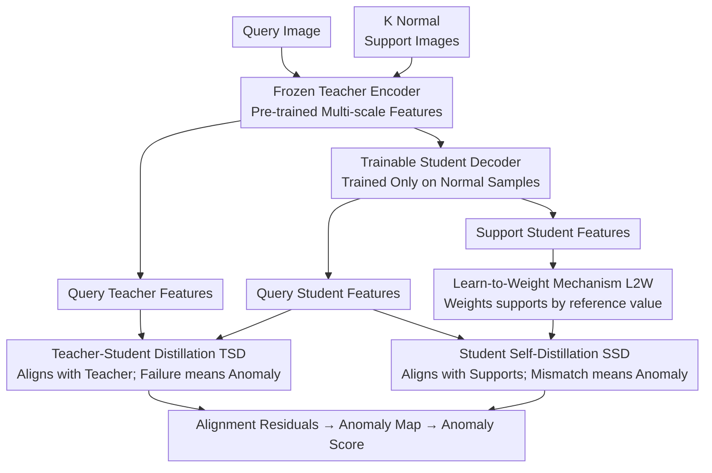

# Dual Distillation for Few-Shot Anomaly Detection

**Conference**: ICLR 2026  
**arXiv**: [2603.01713](https://arxiv.org/abs/2603.01713)  
**Code**: [https://github.com/ttttqz/D24FAD](https://github.com/ttttqz/D24FAD)  
**Area**: Medical Imaging / Anomaly Detection / Few-Shot Learning  
**Keywords**: Few-Shot Anomaly Detection, Dual Distillation, Teacher-Student, Self-Distillation, Medical Imaging

## TL;DR
Proposed D24FAD, a dual-distillation framework combining Teacher-Student Distillation (TSD) on query images and Student Self-Distillation (SSD) on support images, supplemented by a Learn-to-Weight (L2W) mechanism for adaptive support evaluation. It achieves 100% AUROC using 2-shot on the APTOS fundus dataset.

## Background & Motivation

**Background**: Anomaly detection in medical imaging faces challenges due to label scarcity. Few-shot anomaly detection defines "normality" using a minimal set of normal samples (2-8) and identifies anomalies as deviations.

**Limitations of Prior Work**: Existing methods either rely solely on teacher-student distillation (ignoring direct support references) or focus exclusively on support matching (ignoring pre-trained knowledge transfer), failing to jointly utilize both information sources.

**Key Challenge**: Teacher-student distillation provides general normal-anomaly discriminative capabilities but lacks domain-specific knowledge of "normality." Support matching provides domain-specific references but lacks general discriminative power. These sources should be complementary.

**Goal**: How to simultaneously leverage pre-trained knowledge and a few normal samples for anomaly detection?

**Key Insight**: Design a dual-path distillation—TSD to learn general discrimination from the teacher, and SSD to learn domain-specific patterns from supports.

**Core Idea**: Teacher-student distillation learns "what is an anomaly" (general knowledge), while student self-distillation learns "what is normal" (domain-specific knowledge).

## Method

### Overall Architecture
D24FAD aims to exploit two complementary "normal" signals: implicit general discriminative power in pre-trained encoders and domain-specific references from support images. The framework is minimalist, consisting of a frozen pre-trained encoder (teacher) and a trainable student decoder (trained only on normal samples). Query and $K$ normal support images first pass through the shared teacher encoder to obtain multi-scale features; they then pass through the student decoder to reconstruct their respective student features. Both distillation paths target the query's student features: TSD aligns them with the query's teacher features (general discrimination), while SSD aligns them with the supports' student features (domain normality). During inference, residuals are used—positions where the student cannot replicate the teacher or match the supports are classified as anomalies. Multi-scale similarity maps are aggregated into an anomaly map, and the mean value yields the image-level anomaly score.

### Key Designs

**1. Teacher-Student Distillation (TSD): Exposing anomalies by "failure to replicate teacher"**

This path addresses the lack of general discriminative power. Pre-trained feature spaces encode what constitutes "normality" in natural images. TSD forces the student to mimic the teacher's output position-wise on the query by minimizing the cosine distance. Normal regions represent common textures and are easily aligned, whereas anomalous regions deviate from the pre-trained distribution, making them difficult for the student to replicate. The alignment residual thus serves as a natural anomaly score.

**2. Student Self-Distillation (SSD): Injecting domain-specific "normality" from supports**

TSD understands "general anomalies" but lacks domain-specific knowledge of normality in medical imaging. SSD compensates for this by processing $K$ normal supports through the teacher-student pipeline. The query's student features are forced to approximate each support's student features, using the mean cosine distance as the loss. Normative queries remain similar to supports, while anomalies exhibit significant divergence. SSD alone achieves 90%+ AUROC, indicating that domain-specific references are often more critical than general knowledge in few-shot settings.

**3. Learn-to-Weight Mechanism (L2W): Weighting supports by query-specific relevance**

Standard SSD treats all $K$ supports equally, but different supports vary in relevance to specific query images. L2W uses scaled dot-product attention to score supports: treating query features as the query and mapped support features $\phi$ as the key, weights are calculated as:

$$w = \mathrm{softmax}\!\left(\frac{z_{\text{query}} \, \phi(z_{\text{support}})^\top}{\sqrt{C}}\right)$$

These weights $w$ are used for a weighted sum of the SSD cosine distances rather than a uniform average ($C$ denotes the channel dimension). This allows supports that better match the current query to exert higher influence. This mechanism provides an average Gain of 1.91%, peaking at 6.81%, with minimal computational cost.

### Loss & Training
The total loss is a linear combination of the two distillation paths: $L = \lambda \, L_{\text{TSD}} + L_{\text{SSD-L2W}}$, where $\lambda = 0.1$. The TSD weight is intentionally kept low to allow SSD to lead the optimization, reflecting the observation that domain-specific support signals are the primary contributors.

## Key Experimental Results

### Main Results (AUROC %)

| Dataset | K-shot | InCTRL | MVFA | **D24FAD** (Ours) |
|--------|--------|--------|------|----------|
| HIS | 2 | 71.8 | 76.4 | **94.2** |
| LAG | 4 | 71.1 | 77.2 | **96.2** |
| APTOS | 2 | 89.5 | 86.1 | **100.0** |
| RSNA | 4 | 81.4 | 87.4 | **97.9** |
| Brain Tumor | 4 | 91.8 | 93.7 | **95.3** |

### Ablation Study

| Configuration | HIS (2-shot) | APTOS (2-shot) |
|------|-------------|---------------|
| TSD only | 66.1% | 58.2% |
| SSD only | 90.0% | 92.7% |
| SSD + TSD | 94.3% | **100.0%** |
| **SSD + TSD + L2W** | **96.7%** | **100.0%** |

### Key Findings
- SSD is the core component (90%+ alone), while TSD provides enhancement (+4-13%).
- L2W provides an average improvement of 1.91%, with a peak Gain of 6.81%.
- Inference speed reaches 29.2 FPS, which is 2x faster than MVFA.
- WideResNet-50 is the optimal backbone; excessively large models (e.g., Swin-B) result in performance degradation.

## Highlights & Insights
- **Complementarity**: TSD (general knowledge) + SSD (domain-specific knowledge) creates a simple yet powerful framework. $\lambda=0.1$ indicates that domain signals are significantly more vital than general ones.
- **Superior Medical Performance**: Achieving 100% AUROC on APTOS with only 2-shot demonstrates that the framework is highly effective for medical anomaly detection where visual differences are pronounced.

## Limitations & Future Work
- Only supports image-level anomaly detection; pixel-level localization is not supported.
- Support sample quality significantly impacts results; anomalous samples in the support set lead to catastrophic failure.
- Fixed $\lambda = 0.1$; adaptive weight adjustment might improve robustness.
- Only validated on medical imaging; other domains like industrial defect detection remain untested.

## Related Work & Insights
- **vs MVFA**: While MVFA uses multi-view feature alignment, D24FAD adopts dual distillation, resulting in superior performance.
- **vs InCTRL**: Compared to meta-learning approaches, D24FAD is simpler and provides better performance.

## Rating
- Novelty: ⭐⭐⭐⭐ Simple and elegant dual-distillation framework.
- Experimental Thoroughness: ⭐⭐⭐⭐⭐ 5 medical datasets with multi-shot settings and backbone ablations.
- Writing Quality: ⭐⭐⭐⭐ Clear methodological description.
- Value: ⭐⭐⭐⭐⭐ Achieving SOTA performance on few-shot medical anomaly detection.

<!-- RELATED:START -->

## Related Papers

- [\[AAAI 2026\] Commonality in Few: Few-Shot Multimodal Anomaly Detection via Hypergraph-Enhanced Memory](../../AAAI2026/object_detection/commonality_in_few_few-shot_multimodal_anomaly_detection_via_hypergraph-enhanced.md)
- [\[CVPR 2026\] SubspaceAD: Training-Free Few-Shot Anomaly Detection via Subspace Modeling](../../CVPR2026/object_detection/subspacead_training-free_few-shot_anomaly_detection_via_subspace_modeling.md)
- [\[ICLR 2026\] OD3: Optimization-Free Dataset Distillation for Object Detection](od3_optimization-free_dataset_distillation_for_object_detection.md)
- [\[ICLR 2026\] FSOD-VFM: Few-Shot Object Detection with Vision Foundation Models and Graph Diffusion](fsod-vfm_few-shot_object_detection_with_vision_foundation_models_and_graph_diffu.md)
- [\[CVPR 2026\] FastRef: Fast Prototype Refinement for Few-shot Industrial Anomaly Detection](../../CVPR2026/object_detection/fastref_fast_prototype_refinement_for_few-shot_industrial_anomaly_detection.md)

<!-- RELATED:END -->
