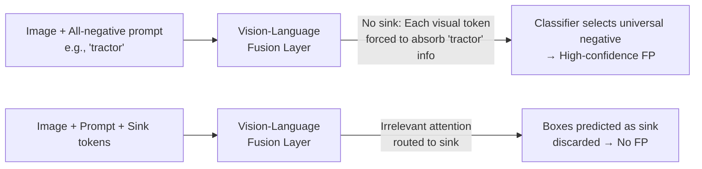

# Fantastic Tractor-Dogs and How Not to Find Them With Open-Vocabulary Detectors

**Conference**: ICLR 2026  
**OpenReview**: [https://openreview.net/forum?id=jUuXNrG7wh](https://openreview.net/forum?id=jUuXNrG7wh)  
**Code**: Appendix A.1 provides standalone code snippets (MM-Grounding DINO)  
**Area**: Open-vocabulary object detection / Vision-language fusion  
**Keywords**: open-vocabulary detection, false positives, attention sink, early fusion, hallucination, training-free  

## TL;DR
This paper reveals that early-fusion open-vocabulary detectors produce a large number of high-confidence false positives on background images that "do not contain the target object" (e.g., confidently framing a "tractor" in a photo of a Golden Retriever). The root cause is identified as the inability of cross-modal attention in the vision-language fusion layer to select "nothing." A training-free solution is proposed: appending several semantically neutral "attention sink" tokens to the prompt to absorb displaced attention, thereby nearly eliminating background false positives.

## Background & Motivation

**Background**: Open-vocabulary detectors (OVD, such as GLIP, Grounding DINO, LLMDet) have achieved increasingly impressive results on zero-shot benchmarks like COCO/LVIS and are considered "ready for use." These models can be categorized into two types based on their vision-language interaction: **early fusion** (vision and text features are fused via cross-attention before processing, e.g., GLIP/Grounding DINO) and **late interaction** (dual encoders process features independently, merging only via vector similarity at the end, e.g., CLIP/OWL-ViT).

**Limitations of Prior Work**: The authors observe a fatal flaw masked by current benchmarks—OVDs confidently predict boxes on **background images that completely lack the target class**. When given a picture of a Golden Retriever with the prompt "tractor," the model confidently identifies a "tractor." This error is invisible in COCO/LVIS because almost every image in these datasets contains at least one annotated target instance; common training frameworks (like mmdetection) even filter out images without GT boxes by default. However, in real-world scenarios like surveillance or medical imaging, background images are far more common than images containing targets.

**Key Challenge**: (1) Early-fusion models are significantly stronger than late-interaction models on complex tasks (Referring Expression Comprehension REC, VQA, combinatorial generalization) and cannot be easily abandoned; (2) The Grounding DINO 1.5 team attempted to mitigate this by heavy negative sampling during training, but the combination of negative classes exploded, making it a temporary fix—even strong closed-source models can easily find counterexamples like misidentifying a red panda as a Jenga tower; (3) Key diagnosis: **Early-fusion actually "knows" a dog is not a tractor**—if a truly present positive class (e.g., "grass") is added to the prompt, the false positive disappears. The issue is that the attention mechanism lacks a "none of the above" option; when the prompt consists entirely of non-existent negative classes, every visual token is forced to absorb a bit of negative information, and ultimately the most "universal" negative class is selected as a false positive.

**Goal**: To provide an "escape exit" for attention without retraining, allowing the model to choose "none of the above" when no matching positive class exists.

**Core Idea**: **Attention sink tokens**—append one or several semantically neutral sink tokens to the prompt, treating them as ordinary target classes. The model naturally routes redundant or irrelevant attention to the sinks; any boxes predicted as a sink class are simply discarded, eliminating background false positives while leaving positive class predictions nearly unaffected.

## Method

### Overall Architecture
The method consists of two steps: **diagnosis** and **patching**. The diagnosis stage reshapes existing benchmarks to quantify the background false positive rate $\mathrm{FPR}_{bg}$ and proves via visualization of the fusion layer attention that the root cause of early-fusion is "attention cannot select zero tokens." The patching stage applies the diagnostic mechanism in reverse—since irrelevant attention spreads to all visual tokens, a neutral absorption point is provided to collect it. The entire patching process is training-free and can be implemented with a few lines of code.

### Key Designs

**1. FPRbg Quantitative Benchmark: Forcing out hidden false positives using "negative annotations."** Standard AP evaluation fails to expose background false positives. The authors utilize **federated datasets** like LVIS—where each image has confirmed positive classes and confirmed negative classes. During evaluation, each image is prompted class-by-class: positive class predictions are used for standard AP, while negative class predictions are all treated as false positives. $\mathrm{FPR}_{bg}$ is defined as the number of false positives per background image per negative prompt. By raising the confidence threshold to compress $\mathrm{FPR}_{bg}$ to a specific value $fpr$ and recalculating AP at that threshold, they obtain $\mathrm{AP}^{\mathrm{FPR}}_{fpr}$. This modification allows the "false positives hidden under a pretty AP" to be quantitatively compared for the first time—the authors use this to plot "Standard AP vs $\mathrm{AP}^{\mathrm{FPR}}_{0.05}$," where all early-fusion models fall far below the diagonal (performance collapse), while late-interaction models stay near the diagonal.

**2. Disease Localization: Cross-attention lacks "none of the above."** The authors visualize the attention of the first fusion layer in LLMDet: with the prompt "tractor," almost every visual token attends to the tractor token—because there are no other prompt tokens to choose from, "irrelevant information cannot be discarded, only diluted." Since the model was trained with at least one positive class per image, it only learned to dilute irrelevant signals below the positive class confidence; however, without a positive class, these diluted signals become dominant and are picked by the classifier. Once a truly present class like "grass" is added to the prompt, tokens containing grass attend to the "grass" token, confidence is recalibrated, and the false positive disappears. This causal chain shows: the model does not lack knowledge, but rather a **neutral destination for attention**.

**3. Attention sink tokens: A "trash can" to absorb irrelevant attention.** By appending $N_{sinks}$ sink tokens as ordinary target classes into the prompt, the model naturally routes overflowing irrelevant attention to them; boxes judged as sink classes are discarded. Sink initialization is optimized using three strategies:

$$s_i \in \begin{cases} \mathcal{N}(0,\sigma^2 I) & \text{(Random initialization)} \\ \frac{1}{|V|}\sum_{w\in V} e_w & \text{(Mean of all vocabulary embeddings)} \\ e_{\text{"[()]"}} & \text{(Embedding of the special string "[()]")} \end{cases}$$

Each has its merits—but the authors found that performance on LVIS MiniVal can be reliably predicted using only 64 VOC images (strong linear correlation), allowing for rapid screening. They also tested placing sinks in **visual features** (vision sinks) and found that false positives are primarily driven by the "vision $\rightarrow$ language" direction; when language sinks are well-chosen, vision sinks are almost unnecessary. Sink tokens are entirely training-free and plug-and-play for all six tested models.

**4. Number of sinks and shared embeddings.** Benefits diminish after about 8 sinks; the optimal number for LLMDet-T is about 24. Using more than the optimal number never harms detection performance (a "more is safer" hyperparameter). Multiple sinks can share the same initial embedding because positional encodings introduce enough variance for them to share different irrelevant attentions.

## Key Experimental Results

Evaluation was conducted on LVIS MiniVal (primary) and the modified POPE benchmark; POPE probes objects box-by-box, naturally eliminating variance caused by early-fusion sensitivity to prompt class count/order. Five early-fusion models (GLIP, OmDet-Turbo, Grounding DINO, MM-GDINO, LLMDet) and three late-interaction models (YOLO-World, OV-DINO, OWLv2) were tested.

### Main Results (LVIS MiniVal, AP at different FPRbg)

| Model | AP@FPR0.01 | AP@FPR0.05 | AP@FPR0.25 | Standard AP |
|---|---|---|---|---|
| **Early-Fusion (No sink)** | | | | |
| GDINO Swin-T | 0.037 | 0.098 | 0.211 | 0.396 |
| MM-GDINO Swin-T | 0.076 | 0.148 | 0.257 | 0.407 |
| LLMDet Swin-T | 0.045 | 0.140 | 0.258 | 0.464 |
| LLMDet Swin-B | 0.047 | 0.125 | 0.218 | 0.466 |
| **Late-Interaction** | | | | |
| YOLO-World L | 0.189 | 0.238 | 0.245 | 0.245 |
| OV-DINO Swin-T | 0.274 | 0.316 | 0.336 | 0.349 |
| **Early-Fusion + attention sinks** | | | | |
| GDINO Swin-T | 0.073 (+0.036) | 0.152 (+0.054) | 0.256 (+0.045) | 0.359 (−0.037) |
| MM-GDINO Swin-T | 0.214 (+0.138) | 0.306 (+0.158) | 0.394 (+0.137) | 0.426 (+0.019) |
| LLMDet Swin-T | 0.223 (+0.178) | 0.326 (+0.186) | 0.400 (+0.142) | 0.448 (−0.016) |
| LLMDet Swin-B | 0.222 (+0.175) | 0.349 (+0.224) | 0.449 (+0.231) | 0.499 (+0.033) |

Key Contrast: Without sinks, early-fusion almost collapses under low $\mathrm{FPR}_{bg}$ (LLMDet-T is only 0.045 at FPR0.01, far below its standard AP of 0.464). With sinks, LLMDet-T doubles at FPR0.05 and improves 5x at FPR0.01, bringing early-fusion back into the competitive range of late-interaction.

### Ablation Study

| Dimension | Setting | Finding |
|---|---|---|
| Sink Init | random / mean-embedding / "[()]" | No universal solution, but 64 VOC images linearly predict LVIS performance |
| Sink Count | 8 / 24 / more | LLMDet-T optimal around 24; diminishing returns after 8; no drop for excess |
| Shared Embedding | Same initial for all sinks | Effective, positional encoding provides sufficient variance |
| Sink Position | Language vs Vision side | False positives are driven by vision$\rightarrow$language; language sinks suffice |
| Learnable Sinks | Learned embedding weights | No extra gain compared to training-free version |

### Key Findings
- Early-fusion and late-interaction behave very differently on background images: only the former has abnormally high $\mathrm{FPR}_{bg}$, proving the root is in the fusion layer rather than generalization ability.
- The few remaining false positives after sinks are qualitative similar to late-interaction models (e.g., fine-grained confusion: Labrador identified as Cocker Spaniel), which are "acceptable errors."
- The cost is that some low-confidence true positives are filtered by the threshold (becoming false negatives), leading to a slight drop in standard AP for some models.

## Highlights & Insights
- **The problem discovery itself is valuable**: Systematically quantifying the "background false positive" issue in OVD—a problem noted by practitioners for years but rarely studied academically—and attributing it to architecture while explaining why current benchmarks miss it.
- **Symmetry between diagnosis and solution**: Proving "irrelevant information is spread to all tokens" via attention visualization, then reversing this mechanism to provide a neutral absorption point. A clean causal loop.
- **Extreme pragmatism**: Training-free, a few lines of code, plug-and-play for six models. The deployment cost is near zero, making it extremely practical for scenarios dominated by background images like security or medical fields.
- **Small data predicting big data**: Using only 64 VOC images to predict sink performance on 1203 LVIS classes makes expensive hyperparameter searches cheap.

## Limitations & Future Work
- **No universal initialization**: Optimal sink initialization strategies vary by model (LLMDet is particularly unique due to LLM-assisted training), still requiring small-scale per-model screening.
- **Slight impact on positive classes**: Sinks cause some low-confidence true positives to drop below the threshold, resulting in a slight decrease in standard AP for some models—a trade-off between $\mathrm{FPR}_{bg}$ and recall.
- **Symptomatic treatment**: Sinks are an inference-time patch; the authors suggest that future early-fusion detectors trained from scratch should introduce **gated attention** to give models the explicit ability to "discard irrelevant class information," curing the issue at the architectural level.
- Evaluation is mainly focused on LVIS (POPE, etc., are in the appendix); more diverse real-world deployment scenarios (video, dense small objects) remain to be verified.

## Related Work & Insights
- **OVD Genealogy**: From distilling CLIP to detection (ViLD), to training detectors from scratch (GLIP), the Grounding DINO family, and current SOTA LLMDet/OV-DINO; real-time directions include YOLO-World, YOLOE, and OmDet-Turbo.
- **VLM Hallucination**: This paper transfers research on "hallucinations in large VLMs' text/vision attention" to detectors, as both stem from the mishandling of irrelevant signals by cross-modal attention.
- **Attention Sink / Register**: StreamingLLM's attention sink (maintaining long context) and ViT's register tokens (fixing feature locality in dense prediction) both provide a "scratch pad" for Transformers. **The key difference here**: while others "reroute existing information," this work uses sinks as **semantically neutral attention sources** so that the model actively "chooses the sink instead of misinterpreting target classes" when no match exists—a new use for the sink concept.

## Rating
- **Novelty**: ⭐⭐⭐⭐⭐ — Discovered and quantified a real flaw masked by benchmarks, clear attribution, and clever "none-of-the-above" usage of sinks.
- **Experimental Thoroughness**: ⭐⭐⭐⭐ — Covers 8 models, multiple $\mathrm{FPR}_{bg}$ levels, extensive ablations and visualizations; however, the main focus is LVIS, with fewer validations on other real-world scenarios.
- **Writing Quality**: ⭐⭐⭐⭐⭐ — Catchy title, compelling motivation, clean logic from diagnosis to solution, and persuasive charts (scatter plots, attention visualization).
- **Value**: ⭐⭐⭐⭐⭐ — Training-free, low-code, immediate impact for background-heavy deployment (security/medical), and points the way for training gated-attention OVDs.

<!-- RELATED:START -->

## Related Papers

- [\[ICLR 2026\] OVID: Open-Vocabulary Intrusion Detection](ovid_open-vocabulary_intrusion_detection.md)
- [\[ICLR 2026\] Retain and Adapt: Auto-Balanced Model Editing for Open-Vocabulary Object Detection under Domain Shifts](retain_and_adapt_auto-balanced_model_editing_for_open-vocabulary_object_detectio.md)
- [\[ICLR 2026\] DeCo-DETR: Decoupled Cognition DETR for efficient Open-Vocabulary Object Detection](deco-detr_decoupled_cognition_detr_for_efficient_open-vocabulary_object_detectio.md)
- [\[ICLR 2026\] CLIP Behaves like a Bag-of-Words Model Cross-modally but not Uni-modally](clip_behaves_like_a_bag-of-words_model_cross-modally_but_not_uni-modally.md)
- [\[CVPR 2026\] WeDetect: Fast Open-Vocabulary Object Detection as Retrieval](../../CVPR2026/object_detection/wedetect_fast_open-vocabulary_object_detection_as_retrieval.md)

<!-- RELATED:END -->
