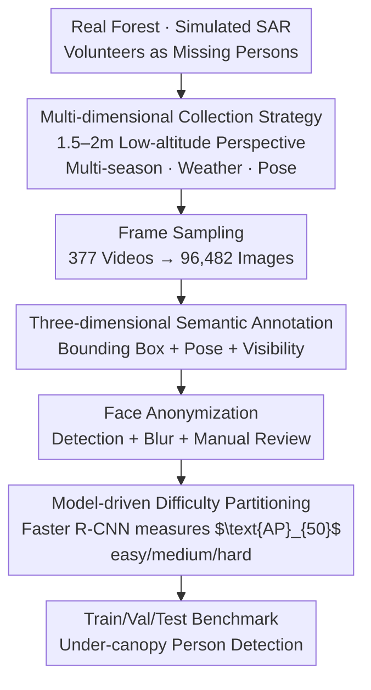

# ForestPersons: A Large-Scale Dataset for Under-Canopy Missing Person Detection

**Conference**: ICLR 2026  
**arXiv**: [2603.02541](https://arxiv.org/abs/2603.02541)  
**Code**: [https://huggingface.co/datasets/etri/ForestPersons](https://huggingface.co/datasets/etri/ForestPersons)  
**Area**: Object Detection  
**Keywords**: Person Detection, Forest Search and Rescue, UAV, Occlusion-aware, Dataset

## TL;DR

ForestPersons is the first large-scale benchmark dataset specifically designed for detecting missing persons under the forest canopy (96,482 images + 204,078 annotations). By simulating micro aerial vehicle (MAV) low-altitude flight perspectives at 1.5–2.0 meters, it covers realistic search and rescue (SAR) conditions across multiple seasons, weather conditions, poses, and occlusion levels, providing a solid foundation for the training and evaluation of under-canopy person detection models.

## Background & Motivation

**Background**: Unmanned Aerial Vehicles (UAVs) have been widely deployed in Search and Rescue (SAR) missions, enabling rapid coverage of large open areas. With advancements in hardware miniaturization and SLAM technology, Micro Aerial Vehicles (MAVs) have acquired the capability to safely navigate and explore GPS-denied forest environments.

**Limitations of Prior Work**:

1.  **Perspective Limitations**: Existing SAR datasets (HERIDAL, WiSARD, SARD, VTSaR) are collected from high-altitude top-down or oblique perspectives. Dense canopy occlusion causes persons to occupy only a few pixels, making detection extremely difficult.
2.  **Scene Bias**: Ground-based person detection datasets (COCO, CrowdHuman, CityPersons) primarily cover standing or walking individuals in urban environments. This differs significantly from forest SAR scenarios, which involve lying, sitting, and heavy vegetation occlusion.
3.  **Missing Labels**: No existing datasets provide simultaneous pose and occlusion level annotations, preventing a systematic evaluation of detection capabilities under varying difficulty levels.

**Key Challenge**: The missing persons most in need of detection in forest SAR are located in scenarios least covered by existing datasets—under the canopy, obscured by vegetation, and in non-standing poses.

**Goal**: Construct ForestPersons, the first large-scale benchmark dataset focusing on under-canopy person detection. It simulates MAV low-altitude perspectives and provides semantic annotations such as pose and visibility to support the development of detection models for realistic SAR scenarios.

## Method

### Overall Architecture

ForestPersons is not a detection algorithm but a comprehensive dataset construction pipeline. The objective is to replicate the authentic difficulties of "finding missing persons under the canopy" rather than reusing collection conventions from existing SAR or ground datasets. The process starts with simulated SAR videos in real forests, where volunteers act as fatigued or lost persons recorded from ground-level perspectives. After sampling videos into frames, bounding boxes are annotated for every individual, supplemented with semantic attributes for pose and visibility. Subsequently, face anonymization is performed. Finally, a detector evaluates the difficulty of each video to ensure an even distribution across training, validation, and test sets. The three primary design points involve the collection strategy (low-altitude diverse perspectives), annotation (multi-dimensional semantic attributes), and partitioning (model-driven difficulty levels).

### Key Designs

**1. Multi-dimensional Collection Strategy: Replicating SAR "Hardships" in Data**

Existing SAR data are captured from high altitudes where persons are minuscule, while ground data focus on individuals standing in cities. ForestPersons avoids both biases by mounting cameras (handheld or tripod) at 1.5–2.0 meters to simulate MAVs flying under the canopy. Volunteers portray missing persons in standing, sitting, or lying positions, naturally obscured by vegetation and terrain. Data collection spans four seasons (comparing dense summer canopies with winter leaves and snow), various weather conditions (sunny, cloudy, light rain), and different times of day. Ultimately, 96,482 images and 204,078 instances were sampled from 377 videos. This strategy of "intentionally creating occlusion and non-standing poses" ensures the dataset covers scenarios where missing persons are most frequently found but are absent in older datasets.

**2. Three-dimensional Semantic Annotation: Enabling Disaggregated Difficulty Analysis**

Bounding boxes alone cannot determine if a model performs well under heavy occlusion. Therefore, each instance includes two SAR-related attributes. First is **Pose**, categorized into Standing (conscious/mobile), Sitting (fatigued), and Lying (injured/unconscious), representing different triage priorities in SAR. Second is **Visibility**, divided into four levels based on vegetation or terrain occlusion: 100 (fully visible), 70 (minor occlusion), 40 (partial occlusion), and 20 (severe occlusion). When occlusion is too severe to determine pose, annotators refer to adjacent frames. These dimensions allow for quantitative analysis of how "pose diversity" and "occlusion intensity" affect detection accuracy.

**3. Model-driven Difficulty Partitioning: Defining Difficulty by Detector Failure**

Random partitioning can lead to an uneven distribution of easy and hard scenes, causing evaluation bias. Conversely, manual judgment introduces annotation bias. This work uses detector-measured difficulty for partitioning: a COCO-pretrained Faster R-CNN (Detectron2) calculates $\text{AP}_{50}$ for each video. The difficulty score is defined as $1 - \text{AP}_{50}$. Sequences are then categorized into easy ($\text{score} < 0.45$), medium ($0.45 \le \text{score} < 0.75$), and hard ($\text{score} \ge 0.75$), and distributed proportionally across sets. Partitioning is performed by video sequence to prevent data leakage between adjacent frames. The resulting training set contains 67,686 images, the validation set 18,243, and the test set 10,553, with consistent distributions of seasons, locations, and attributes.

## Key Experimental Results

### Main Results: Transfer Performance of Existing Datasets in Under-Canopy Scenarios

Faster R-CNN was trained on various datasets and evaluated on the ForestPersons test set to demonstrate the inadequacy of existing data:

| Training Data | Type | Original Test set AP | ForestPersons AP | ForestPersons $\text{AP}_{50}$ |
| :--- | :--- | :---: | :---: | :---: |
| SARD | SAR/Top-down | 58.6 | 3.0 | 7.8 |
| HERIDAL | SAR/Top-down | 35.0 | 0.2 | 0.3 |
| WiSARD | SAR/Oblique | 18.5 | 11.3 | 29.0 |
| COCO-Person | Ground/Urban | 54.0 | 40.8 | 66.9 |
| CrowdHuman | Ground/Urban | 39.4 | 31.9 | 58.8 |
| CityPersons | Ground/Urban | 38.7 | 5.9 | 15.1 |

SAR datasets achieved an AP below 12% on ForestPersons, confirming that high-altitude perspectives do not adapt to under-canopy scenes. Among ground datasets, COCO performed best (AP=40.8) but still showed significant decay, highlighting the gap between urban and forest environments.

### Benchmark Results: Performance of Multiple Detectors on ForestPersons

| Detection Model | Backbone Type | AP | $\text{AP}_{50}$ | $\text{AP}_{75}$ | AR |
| :--- | :--- | :---: | :---: | :---: | :---: |
| SSD | MobileNetV2 | 45.0 | 83.6 | 43.1 | 53.7 |
| YOLOv3 | YOLO | 50.2 | 86.5 | 53.9 | 58.6 |
| YOLOX | YOLO | 51.0 | 89.0 | 54.4 | 58.2 |
| DETR | Transformer | 53.9 | 88.7 | 59.4 | 67.9 |
| RetinaNet | ResNet-50 | 64.2 | 93.9 | 74.4 | 70.9 |
| Faster R-CNN | ResNet-50 | 64.4 | 92.7 | 75.4 | 70.0 |
| DINO | Transformer | 65.3 | 94.0 | 76.2 | **77.7** |
| YOLOv11 | YOLO | 65.6 | 93.4 | 75.6 | 71.7 |
| CZ Det | Cascaded | 65.6 | **96.1** | **77.9** | 71.6 |
| Deformable R-CNN | ResNet-50 | **66.3** | 93.4 | 77.5 | 71.3 |

Deformable R-CNN achieved the highest AP (66.3). However, different models excelled in different metrics: DINO had the highest AR (77.7, crucial for SAR recall), while CZ Det performed best in $\text{AP}_{50}$ and $\text{AP}_{75}$.

### Ablation Study: Impact of Attributes on Detection Performance

| Training Attr → Test Attr | Standing AP | Sitting AP | Lying AP |
| :--- | :---: | :---: | :---: |
| Standing Only Training | 45.3-60.1 | 30.0-44.5 | 31.7-46.0 |
| All Poses Training | 49.3-65.5 | 50.6-65.7 | 47.5-65.1 |

When training only on Standing data, performance for Sitting/Lying dropped significantly (~ -20 AP). Training on all poses led to substantial gains across all categories, proving the necessity of multi-pose data. 

**Correlation between Visibility and Performance**: Detection accuracy improved steadily as visibility levels increased (from 20 to 100), validating that the difficulty gradient in ForestPersons aligns with real-world SAR conditions.

## Highlights & Insights

1.  **Filling the Gap**: This is the first large-scale person detection dataset focusing on under-canopy perspectives. Its scale (96K+ images) is more than double that of the previous largest SAR dataset (WiSARD, 44K).
2.  **Comprehensive Annotation**: The three-dimensional annotation system (Bounding box + Pose + Visibility) provides a unique foundation for systematically studying occlusion robustness.
3.  **Rigorous Evaluation**: The study not only benchmarks various detectors but also quantitatively justifies the dataset's necessity through cross-dataset transfer experiments.

## Limitations & Future Work

1.  Data collection relies on simulated SAR scenarios, which may exhibit biases compared to the actual appearance or pose distribution of real missing persons.
2.  The dataset primarily provides RGB data (the thermal ForestPersonsIR is only briefly mentioned in the appendix), leaving multi-modal fusion potential under-explored.
3.  The best performer's AP is only 66.3%, indicating significant room for improvement, though the paper does not propose a specialized detection method for this scenario.

## Rating

⭐⭐⭐⭐ — As a dataset paper, ForestPersons performs excellently in problem definition, data scale, and annotation quality, opening a critical direction for computer vision research in forest Search and Rescue.

<!-- RELATED:START -->

## Related Papers

- [\[ICCV 2025\] Kaputt: A Large-Scale Dataset for Visual Defect Detection](../../ICCV2025/object_detection/kaputt_a_large-scale_dataset_for_visual_defect_detection.md)
- [\[ICLR 2026\] InfoDet: A Dataset for Infographic Element Detection](infodet_a_dataset_for_infographic_element_detection.md)
- [\[CVPR 2026\] MMR-AD: A Large-Scale Multimodal Dataset for Benchmarking General Anomaly Detection with MLLMs](../../CVPR2026/object_detection/mmrad_multimodal_anomaly_detection.md)
- [\[ICLR 2026\] OD3: Optimization-Free Dataset Distillation for Object Detection](od3_optimization-free_dataset_distillation_for_object_detection.md)
- [\[CVPR 2026\] Omni-AD: A Large-scale and Versatile Benchmark for Industrial Anomaly Detection](../../CVPR2026/object_detection/omni-ad_a_large-scale_and_versatile_benchmark_for_industrial_anomaly_detection.md)

<!-- RELATED:END -->
