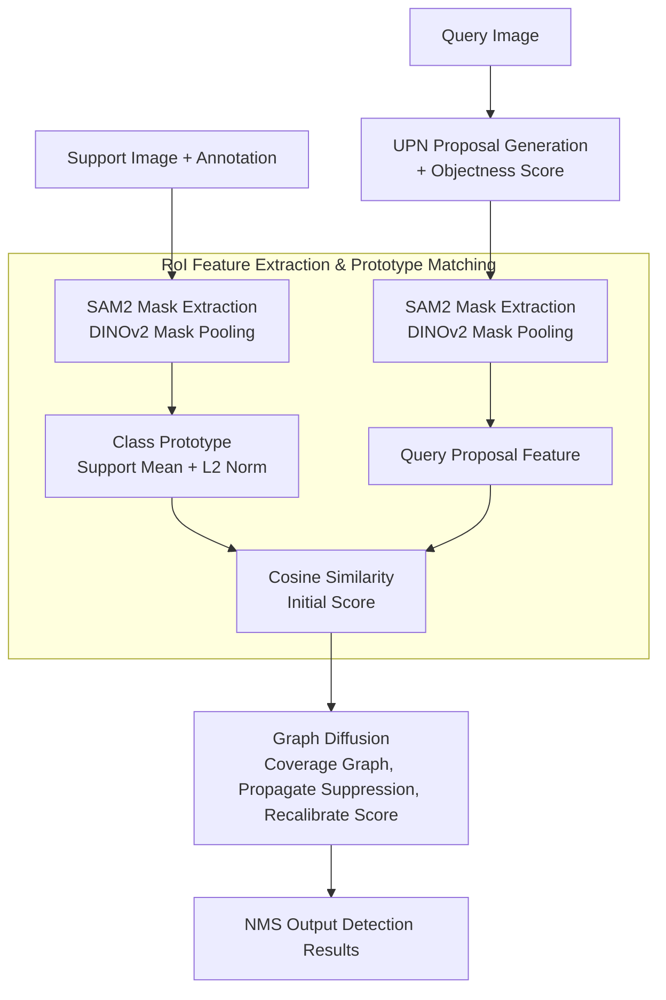

# FSOD-VFM: Few-Shot Object Detection with Vision Foundation Models and Graph Diffusion

**Conference**: ICLR 2026  
**arXiv**: [2602.03137](https://arxiv.org/abs/2602.03137)  
**Code**: [https://intellindust-ai-lab.github.io/projects/FSOD-VFM](https://intellindust-ai-lab.github.io/projects/FSOD-VFM)  
**Area**: Object Detection / Few-Shot Learning  
**Keywords**: Few-Shot Object Detection, Vision Foundation Models, Graph Diffusion, Training-free, SAM2

## TL;DR
This paper proposes a training-free few-shot object detection framework that combines three foundation models—UPN, SAM2, and DINOv2—to generate proposals and matching features. A graph diffusion algorithm is introduced to refine confidence scores and suppress fragmented proposals, significantly outperforming SOTA on Pascal-5i and COCO-20i.

## Background & Motivation

**Background**: Few-shot object detection (FSOD) aims to detect novel categories using only a few annotated samples. While traditional methods require fine-tuning, recent training-free approaches leverage foundation models for direct detection.

**Limitations of Prior Work**: Proposals generated by foundation models (such as UPN) are often overly fragmented—the same object is partitioned into multiple overlapping small boxes— and such redundancy is difficult to handle effectively through simple NMS.

**Key Challenge**: Post-processing methods like SoftNMS only consider spatial relationships between boxes, failing to utilize semantic and mask overlap information between proposals to determine which proposal is superior.

**Goal**: How to effectively suppress fragmented proposals within a training-free framework to produce high-quality detection results?

**Key Insight**: Model proposal relationships as a directed graph and propagate confidence calibration via PageRank-style graph diffusion.

**Core Idea**: Utilize a graph diffusion algorithm to propagate suppression signals across a proposal graph, allowing fragmented proposals "covered" by larger boxes to automatically reduce their confidence scores.

## Method

### Overall Architecture
This paper addresses the "proposal fragmentation" issue in training-free few-shot object detection: foundation models can generate a large number of category-agnostic boxes, but a single object is often represented by several overlapping small boxes, which standard NMS (relying only on IoU) fails to suppress effectively. FSOD-VFM assembles three off-the-shelf foundation models into a training-free pipeline and employs graph diffusion post-processing to filter fragmented boxes. Specifically, UPN first generates category-agnostic proposals; SAM2 refines each proposal into a precise mask; and DINOv2 extracts dense features from the full image, followed by mask pooling to obtain proposal-level features. These features are matched with class prototypes calculated from support samples using cosine similarity to obtain initial scores. Finally, graph diffusion propagates suppression signals on the proposal graph to recalibrate confidence scores before outputting final detections via NMS.

### Key Designs

**1. RoI Feature Extraction & Prototype Matching: "Cleaning" Foreground Features with SAM2 Masks**

To determine which novel category a query proposal belongs to, clean category representations are required. The method feeds each support image into SAM2 according to its annotated box to obtain a binary mask of the target. Then, DINOv2 extracts dense features from the full image, and mask pooling is applied—aggregating only the features falling within the target mask—to exclude background noise. Features from multiple support samples of the same novel category are averaged and L2-normalized to form the prototype. On the query side, SAM2 mask pooling is similarly used to obtain features for each proposal, and cosine similarity with each prototype serves as the initial category score. Compared to using all pixels within a box, mask pooling ensures the extraction of true foreground semantics, which is critical when only 1–5 samples are available per category.

**2. Graph Diffusion: Constructing a "Who Covers Whom" Directed Graph to Suppress Fragments**

This is the core mechanism for suppressing fragmented proposals. The method treats all proposals under the same category as nodes in a graph and encodes "coverage relationships" using directed edges: when the UPN objectness score of proposal $i$ is not higher than that of proposal $j$, a directed edge is drawn from $i$ to $j$ with a weight representing the proportion of $i$ covered by $j$: $\mathcal{E}_{i,j}=\mathrm{Area}(M_i \cap M_j)/\mathrm{Area}(M_i)$ (nodes with higher scores do not propagate energy outward and retain their own energy). Intuitively, a fragment $i$ nearly covered by a high-scoring large box $j$ will "diffuse" its energy along this edge, accumulating a high suppression level. Each node takes its strongest external coverage relationship as a prior weight $w_i=\max_j \mathcal{E}_{i,j}$ (where $w_i$ is close to 1 for fragments tightly covered by large boxes), and a PageRank-style iteration propagates the "suppression degree" $\pi$:

$$\pi^{t+1} = \alpha \, P \, \pi^{t} + (1-\alpha)\, w$$

where $P$ is the transition matrix normalized by row weights, $w$ is the prior suppression distribution, and $\alpha$ is the probability balancing propagation and restart. The initial $\pi^0$ is a uniform distribution, and the process stops early if $\lVert\pi^{t+1}-\pi^t\rVert<\tau$. Upon convergence, fragmented proposals covered by multiple high-scoring boxes accumulate higher $\pi$ values. The final confidence is calibrated by multiplying the suppression degree back into the matching score:

$$\text{conf} = (1-\pi)^{\lambda}\cdot \cos\_sim$$

A higher $\pi$ results in lower calibrated confidence, with $\lambda$ adjusting the suppression intensity. Unlike NMS/SoftNMS which only look at IoU, graph diffusion utilizes precise mask overlaps from SAM2 and objectness scores from UPN to better distinguish redundant fragments from independent objects. Furthermore, suppression is propagated globally through the graph rather than via greedy pairwise deletion. In practice, $\alpha=0.3, \lambda=0.5$, and convergence is achieved within 5–30 steps.

### Loss & Training
Fully training-free. The UPN, SAM2, and DINOv2 components use pre-trained weights for inference. Graph diffusion is a pure post-processing step with no learnable parameters.

## Key Experimental Results

### Main Results

| Dataset | Shot | FSOD-VFM | Prev. SOTA (NtTT) | Gain |
|--------|------|----------|-----------------|------|
| Pascal-5i | 1-shot | 77.5 | 70.8 | +6.7 |
| Pascal-5i | 5-shot | 85.8 | 77.2 | +8.6 |
| COCO-20i | 10-shot | 59.4 (nAP50) | 54.1 | +5.3 |
| CD-FSOD (ArTaxOr) | 1-shot | 51.4 | 28.2 | +23.2 |

### Ablation Study

| Post-processing Method | Pascal-5i | COCO-20i |
|-----------|----------|----------|
| No Refinement | 7.4 | 9.9 |
| NMS | 23.4 | 26.1 |
| Soft NMS | 28.1 | 26.6 |
| Soft Merging | 66.0 | 50.4 |
| **Graph Diffusion** | **77.5** | **59.4** |

### Key Findings
- Graph diffusion improves by 11.5/9.0 points over the closest Soft Merging method.
- The most significant improvement (+23.2) occurs in cross-domain FSOD (CD-FSOD), demonstrating the generalizability of graph diffusion.
- Performance is optimal with $\alpha=0.3, \lambda=0.5$, converging in 5-30 steps.

## Highlights & Insights
- **Graph Diffusion replacing NMS**: Elevates proposal suppression from heuristic rules to graph-based information propagation, which is both elegant and effective. It can be migrated to any task requiring proposal de-redundancy.
- **Purely Modular Framework**: The combination of three foundation models plus graph diffusion post-processing requires zero training, showcasing the potential of foundation model assembly.

## Limitations & Future Work
- Inference speed is relatively slow (2.4s/image on A40) due to the high overhead of three separate forward passes (UPN+SAM2+DINOv2).
- Graph diffusion requires mask overlap calculations, increasing computational complexity as the number of proposals grows.
- Performance is dependent on the initial proposal quality generated by UPN.

## Related Work & Insights
- **vs No-Time-To-Train**: Both are training-free FSOD; however, NtTT uses SoftNMS while Ours employs graph diffusion.
- **vs DINOv2/DINOv3**: Used as feature extractors. DINOv3 provides consistent minor improvements over DINOv2.

## Rating
- Novelty: ⭐⭐⭐⭐ Applying graph diffusion to proposal redundancy is novel, though the overall structure is a modular assembly.
- Experimental Thoroughness: ⭐⭐⭐⭐⭐ Comprehensive coverage of Pascal/COCO/CD-FSOD with detailed ablations.
- Writing Quality: ⭐⭐⭐⭐ Clear algorithmic descriptions.
- Value: ⭐⭐⭐⭐ Provides a strong baseline for training-free FSOD.

<!-- RELATED:START -->

## Related Papers

- [\[CVPR 2026\] AnomalyVFM -- Transforming Vision Foundation Models into Zero-Shot Anomaly Detectors](../../CVPR2026/object_detection/anomalyvfm_--_transforming_vision_foundation_models_into_zero-shot_anomaly_detec.md)
- [\[AAAI 2026\] Beyond Boundaries: Leveraging Vision Foundation Models for Source-Free Object Detection](../../AAAI2026/object_detection/beyond_boundaries_leveraging_vision_foundation_models_for_so.md)
- [\[ICLR 2026\] Dual Distillation for Few-Shot Anomaly Detection](dual_distillation_for_few-shot_anomaly_detection.md)
- [\[ICLR 2026\] Complexity- and Statistics-Guided Anomaly Detection in Time Series Foundation Models](complexity-_and_statistics-guided_anomaly_detection_in_time_series_foundation_mo.md)
- [\[AAAI 2026\] Temporal Object-Aware Vision Transformer for Few-Shot Video Object Detection](../../AAAI2026/object_detection/temporal_object-aware_vision_transformer_for_few-shot_video_object_detection.md)

<!-- RELATED:END -->
