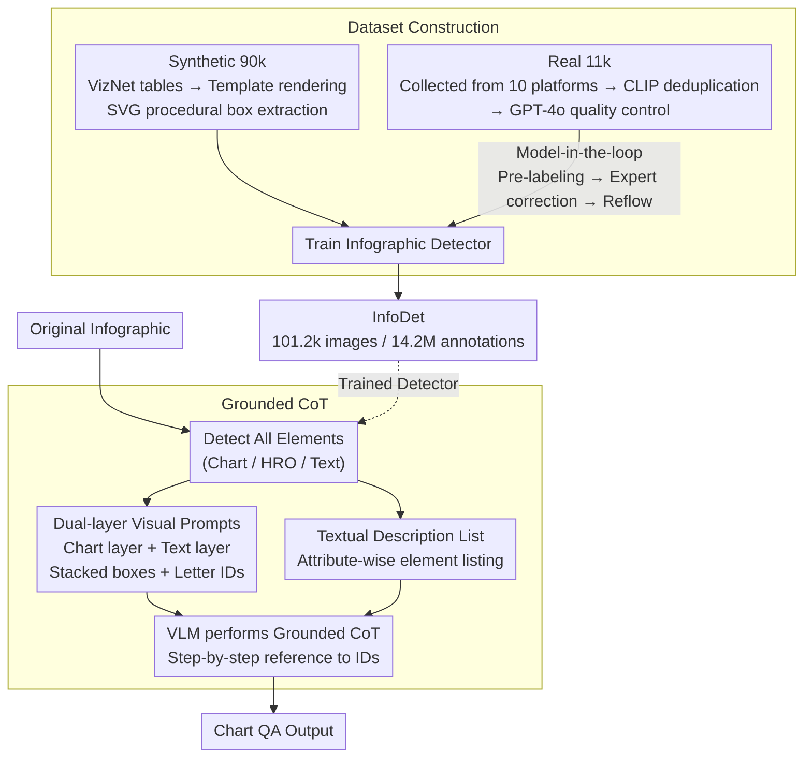

# InfoDet: A Dataset for Infographic Element Detection

**Conference**: ICLR 2026  
**arXiv**: [2505.17473](https://arxiv.org/abs/2505.17473)  
**Code**: [https://github.com/InfoDet2025/InfoDet](https://github.com/InfoDet2025/InfoDet)  
**Area**: Object Detection / Document Understanding  
**Keywords**: Infographic Detection, Chart Understanding, Dataset, Grounded CoT, VLM

## TL;DR
A large-scale infographic element detection dataset (101,264 infographics, 14.2M annotations) is constructed, covering two major categories: charts and human-recognizable objects. A Grounded CoT method is proposed to leverage detection results to enhance VLM chart understanding capabilities.

## Background & Motivation

**Background**: Chart understanding is a critical application scenario for VLMs (e.g., ChartQA), but existing methods require VLMs to reason directly from raw images, ignoring structured visual element information.

**Limitations of Prior Work**: (a) Lack of large-scale infographic detection datasets—existing foundation models (DINO-X, Grounding DINO) achieve AP < 15% on infographic element detection, nearly failing entirely; (b) Infographics contain many non-natural scene elements (icons, chart components) with a significant domain gap from detectors trained on COCO/Objects365.

**Key Challenge**: Infographic element detection is foundational for chart understanding, but current detectors are virtually unusable in this domain.

**Goal**: (a) Construct a large-scale infographic detection dataset, and (b) verify how detection results can improve VLM chart reasoning.

**Key Insight**: Combine synthetic data (90,000 images via template-based generation) and real data (11,000 images via model-in-the-loop annotation) to cover 75 chart types.

**Core Idea**: Utilize element detection as "visual prompts" for chart understanding—detect before reasoning (Thinking-with-Boxes).

## Method

### Overall Architecture
This work addresses the issues of detectors failing collectively on infographics and VLMs relying on raw pixel guesswork. It provides both a dataset and a framework. The first part constructs InfoDet—comprising 101.2k infographics and 14.2M annotations, categorizing elements into Chart components and Human-Recognizable Objects (HRO, e.g., icons); this dataset is used to train a detector capable of working on infographics. The second part proposes Grounded CoT, which feeds the detector's bounding boxes back into the VLM as "visual prompts + textual descriptions," enabling the model to "see" elements clearly before reasoning (Thinking-with-Boxes). In summary, synthetic and real data paths are used to build the library and train the detector, which is then integrated into the inference phase: raw infographics are marked by the detector, and the resulting boxes and attributes are concatenated into prompts for the VLM to generate step-by-step answers citing these identified elements.

### Key Designs

**1. Dataset Construction: Synthetic Data for Scale, Real Data for Authenticity**

Many infographic elements are non-natural objects never seen in COCO/Objects365. Purely manual annotation is expensive and slow; hence, InfoDet uses a dual approach of "synthetic foundation + real-world refinement." For the synthetic part, 90,000 images were created by sampling data from 31M VizNet tables and rendering them via 1,072 design templates. Since these are SVG-generated, annotations for Charts and HROs are extracted procedurally without human labor. For the real-world part, 11,264 images were collected from 10 platforms, deduplicated via CLIP, and quality-filtered by GPT-4o. Annotation followed a model-in-the-loop iterative process: a detector trained on synthetic data pre-labeled real images, experts provided corrections, and corrected samples were fed back to improve the detector over several rounds. This avoids pure manual costs while ensuring annotation quality comparable to natural image benchmarks, achieving 93.9% precision and 96.7% recall.

**2. Grounded Chain-of-Thought: Converting Detection Boxes into VLM "Visual Anchors"**

VLMs often overlook or confuse elements in dense, multi-chart infographics when relying on pixels alone. Grounded CoT explicitly injects detection results into two prompt paths: The visual path overlays detection boxes on the original image with letter identifiers, using **dual-layer separation** (rendering chart and text layers separately) to prevent occlusion. The textual path lists attributes for each element. Once concatenated, the VLM performs CoT reasoning, citing letter-identified elements at each step. This acts as a "magnifying glass," transforming vague "what is where" perception into deterministic textual anchors, significantly reducing omissions and confusion.

### Loss & Training
Detectors (Co-DETR, RTMDet) undergo standard training on InfoDet with no special tricks. For the VLM, Grounded CoT is a training-free enhancement during the inference phase.

## Key Experimental Results

### Main Results (Detection)

| Model | Pre-training | Chart AP | HRO AP | Chart AR | HRO AR |
|------|--------|----------|--------|----------|--------|
| Co-DETR | Zero-shot | 0.4% | 1.1% | 5.6% | 4.8% |
| Co-DETR | InfoDet | **81.8%** | **64.5%** | **88.2%** | **76.8%** |

### Main Results (Grounded CoT on ChartQAPro, Relaxed Accuracy+)

| Model | Method | Single Infographic | Multi-Infographic | Overall |
|------|------|----------|----------|------|
| o1 | Direct | 66.4% | 66.0% | 61.4% |
| o1 | CoT | 64.3% | 67.6% | 61.9% |
| o1 | **Grounded CoT** | **67.8%** | **71.9%** | **64.1%** |

### Ablation Study

| Grounded CoT Component | Accuracy |
|------------------|--------|
| Visual Prompt Only | 62.8% |
| Textual Description Only | 61.6% |
| Combined (Single layer) | 62.3% |
| **Combined (Dual layer)** | **64.1%** |

### Key Findings
- Zero-shot detectors almost fail on infographics (AP < 1.1%), highlighting the domain gap InfoDet fills.
- Pre-training on InfoDet boosts AP to 81.8% and generalizes to other document tasks (Rico +8.5 AP, DocGenome +5.4 AP).
- Grounded CoT improves accuracy by 3-6% in infographic scenarios, though gains are marginal on simple charts.
- The dual-layer visual prompt strategy outperforms the single-layer version by 1.8% by avoiding overlap.

## Highlights & Insights
- **Filling Data Scarcity**: A large-scale infographic detection dataset with 14.2M annotations is a major resource contribution.
- **Thinking-with-Boxes Paradigm**: The detect-then-reason approach is simple yet effective, functioning like "magnifying glasses" for VLMs and transferable to other visual reasoning tasks.
- **Synthetic + Real Data Construction**: Template-based synthesis (auto-labeling) + model-in-the-loop (efficient real labeling) balances scale and quality.

## Limitations & Future Work
- A domain gap still exists between synthetic and real data (synthetic is simpler); more real data is needed.
- HRO detection AP (64.5%) is significantly lower than Chart AP (81.8%), indicating icon detection is more challenging.
- Improvements from Grounded CoT are less pronounced on simple charts and may introduce information overload.
- The dual-layer strategy is manually designed; more adaptive layout strategies warrant exploration.

## Related Work & Insights
- **vs ChartQA/ChartQAPro**: Provides benchmarks where this work validates Grounded CoT.
- **vs Grounding DINO**: Zero-shot failure proves the necessity of domain-specific data.
- **vs DocGenome**: A document layout dataset; InfoDet pre-training can transfer to and enhance its performance.

## Rating
- Novelty: ⭐⭐⭐⭐ The dataset and Grounded CoT task definition are novel, though the method is straightforward.
- Experimental Thoroughness: ⭐⭐⭐⭐⭐ Covers detection, chart understanding, and transfer learning.
- Writing Quality: ⭐⭐⭐⭐⭐ Detailed description of dataset construction.
- Value: ⭐⭐⭐⭐⭐ Large-scale dataset and open-sourcing provide high community value.

<!-- RELATED:START -->

## Related Papers

- [\[ICLR 2026\] ForestPersons: A Large-Scale Dataset for Under-Canopy Missing Person Detection](forestpersons_a_large-scale_dataset_for_under-canopy_missing_person_detection.md)
- [\[ICLR 2026\] OD3: Optimization-Free Dataset Distillation for Object Detection](od3_optimization-free_dataset_distillation_for_object_detection.md)
- [\[NeurIPS 2025\] BurstDeflicker: A Benchmark Dataset for Flicker Removal in Dynamic Scenes](../../NeurIPS2025/object_detection/burstdeflicker_a_benchmark_dataset_for_flicker_removal_in_dynamic_scenes.md)
- [\[ICCV 2025\] Kaputt: A Large-Scale Dataset for Visual Defect Detection](../../ICCV2025/object_detection/kaputt_a_large-scale_dataset_for_visual_defect_detection.md)
- [\[CVPR 2026\] Online Data Curation for Object Detection via Marginal Contributions to Dataset-level Average Precision](../../CVPR2026/object_detection/online_data_curation_for_object_detection_via_marginal_contributions_to_dataset-.md)

<!-- RELATED:END -->
